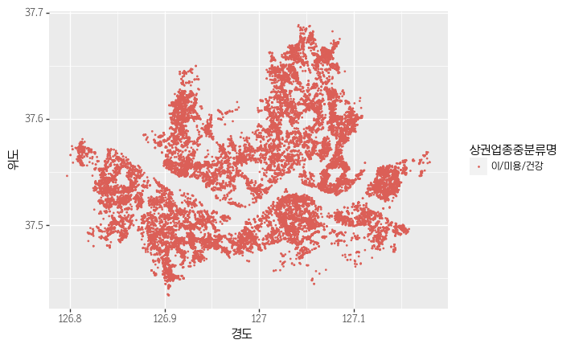

# 공공데이터 상권정보 분석해 보기
* https://www.data.go.kr/dataset/15012005/fileData.do
* 국가중점데이터인 상권정보를 살펴봅니다.
* 처음으로 파일데이터에서 상권별 업종밀집통계정보를 다운로드 받아봅니다.


```python
import warnings
warnings.filterwarnings('ignore')
```


```python
import pandas as pd
from plotnine import *
```

# 상가업소정보 2017년 9월


```python
# 상가업소정보 2017년 9월 데이터
shop_201709_01 = pd.read_csv('data/shop_201709_01.csv', encoding='cp949')
shop_201709_01.shape
```


    (460822, 39)


```python
shop_201709_01.head(3)
```


<div>
<style scoped>
    .dataframe tbody tr th:only-of-type {
        vertical-align: middle;
    }

    .dataframe tbody tr th {
        vertical-align: top;
    }
    
    .dataframe thead th {
        text-align: right;
    }
</style>
<table border="1" class="dataframe">
  <thead>
    <tr style="text-align: right;">
      <th></th>
      <th>상가업소번호</th>
      <th>상호명</th>
      <th>지점명</th>
      <th>상권업종대분류코드</th>
      <th>상권업종대분류명</th>
      <th>상권업종중분류코드</th>
      <th>상권업종중분류명</th>
      <th>상권업종소분류코드</th>
      <th>상권업종소분류명</th>
      <th>표준산업분류코드</th>
      <th>...</th>
      <th>건물관리번호</th>
      <th>건물명</th>
      <th>도로명주소</th>
      <th>구우편번호</th>
      <th>신우편번호</th>
      <th>동정보</th>
      <th>층정보</th>
      <th>호정보</th>
      <th>경도</th>
      <th>위도</th>
    </tr>
  </thead>
  <tbody>
    <tr>
      <th>0</th>
      <td>19911397</td>
      <td>커피빈코리아선릉로93길점</td>
      <td>코리아선릉로93길점</td>
      <td>Q</td>
      <td>음식</td>
      <td>Q12</td>
      <td>커피점/카페</td>
      <td>Q12A01</td>
      <td>커피전문점/카페/다방</td>
      <td>I56220</td>
      <td>...</td>
      <td>1168010100106960042022041</td>
      <td>NaN</td>
      <td>서울특별시 강남구 선릉로93길 6</td>
      <td>135080</td>
      <td>6149.0</td>
      <td>NaN</td>
      <td>1</td>
      <td>NaN</td>
      <td>127.047883</td>
      <td>37.505675</td>
    </tr>
    <tr>
      <th>1</th>
      <td>19911801</td>
      <td>프로포즈</td>
      <td>NaN</td>
      <td>Q</td>
      <td>음식</td>
      <td>Q09</td>
      <td>유흥주점</td>
      <td>Q09A01</td>
      <td>호프/맥주</td>
      <td>I56219</td>
      <td>...</td>
      <td>1154510200101620001017748</td>
      <td>NaN</td>
      <td>서울특별시 금천구 가산로 34-6</td>
      <td>153010</td>
      <td>8545.0</td>
      <td>NaN</td>
      <td>1</td>
      <td>NaN</td>
      <td>126.899220</td>
      <td>37.471711</td>
    </tr>
    <tr>
      <th>2</th>
      <td>19912201</td>
      <td>싱싱커피&amp;토스트</td>
      <td>NaN</td>
      <td>Q</td>
      <td>음식</td>
      <td>Q07</td>
      <td>패스트푸드</td>
      <td>Q07A10</td>
      <td>토스트전문</td>
      <td>I56192</td>
      <td>...</td>
      <td>2653010400105780000002037</td>
      <td>산업용품유통상가</td>
      <td>부산광역시 사상구 괘감로 37</td>
      <td>617726</td>
      <td>46977.0</td>
      <td>NaN</td>
      <td>1</td>
      <td>26</td>
      <td>128.980455</td>
      <td>35.159774</td>
    </tr>
  </tbody>
</table>
<p>3 rows × 39 columns</p>
</div>


```python
shop_201709_01.tail(3)
```


<div>
<style scoped>
    .dataframe tbody tr th:only-of-type {
        vertical-align: middle;
    }

    .dataframe tbody tr th {
        vertical-align: top;
    }
    
    .dataframe thead th {
        text-align: right;
    }
</style>
<table border="1" class="dataframe">
  <thead>
    <tr style="text-align: right;">
      <th></th>
      <th>상가업소번호</th>
      <th>상호명</th>
      <th>지점명</th>
      <th>상권업종대분류코드</th>
      <th>상권업종대분류명</th>
      <th>상권업종중분류코드</th>
      <th>상권업종중분류명</th>
      <th>상권업종소분류코드</th>
      <th>상권업종소분류명</th>
      <th>표준산업분류코드</th>
      <th>...</th>
      <th>건물관리번호</th>
      <th>건물명</th>
      <th>도로명주소</th>
      <th>구우편번호</th>
      <th>신우편번호</th>
      <th>동정보</th>
      <th>층정보</th>
      <th>호정보</th>
      <th>경도</th>
      <th>위도</th>
    </tr>
  </thead>
  <tbody>
    <tr>
      <th>460819</th>
      <td>15898705</td>
      <td>팝콘피씨</td>
      <td>NaN</td>
      <td>N</td>
      <td>관광/여가/오락</td>
      <td>N01</td>
      <td>PC/오락/당구/볼링등</td>
      <td>N01A01</td>
      <td>인터넷PC방</td>
      <td>R91222</td>
      <td>...</td>
      <td>1121510700101710000026151</td>
      <td>NaN</td>
      <td>서울특별시 광진구 광나루로26길 40</td>
      <td>143926</td>
      <td>5022.0</td>
      <td>NaN</td>
      <td>1</td>
      <td>NaN</td>
      <td>127.078059</td>
      <td>37.545272</td>
    </tr>
    <tr>
      <th>460820</th>
      <td>15883107</td>
      <td>키즈코코</td>
      <td>NaN</td>
      <td>D</td>
      <td>소매</td>
      <td>D05</td>
      <td>의복의류</td>
      <td>D05A05</td>
      <td>아동복판매</td>
      <td>G47416</td>
      <td>...</td>
      <td>2614010600101660006000001</td>
      <td>대신롯데캐슬</td>
      <td>부산광역시 서구 대티로 161</td>
      <td>602093</td>
      <td>49208.0</td>
      <td>NaN</td>
      <td>NaN</td>
      <td>NaN</td>
      <td>129.010414</td>
      <td>35.116648</td>
    </tr>
    <tr>
      <th>460821</th>
      <td>15915239</td>
      <td>하서족발</td>
      <td>NaN</td>
      <td>Q</td>
      <td>음식</td>
      <td>Q01</td>
      <td>한식</td>
      <td>Q01A08</td>
      <td>족발/보쌈전문</td>
      <td>I56111</td>
      <td>...</td>
      <td>2671025622107170008000001</td>
      <td>서진프라자</td>
      <td>부산광역시 기장군 정관읍 정관7로 34</td>
      <td>619963</td>
      <td>46015.0</td>
      <td>NaN</td>
      <td>NaN</td>
      <td>107</td>
      <td>129.178633</td>
      <td>35.321823</td>
    </tr>
  </tbody>
</table>
<p>3 rows × 39 columns</p>
</div>


```python
# 생각보다 결측치가 많다.
shop_201709_01.isnull().sum()
```


    상가업소번호            0
    상호명               1
    지점명          405614
    상권업종대분류코드         0
    상권업종대분류명          0
    상권업종중분류코드         0
    상권업종중분류명          0
    상권업종소분류코드         0
    상권업종소분류명          0
    표준산업분류코드      25931
    표준산업분류명       27032
    시도코드              0
    시도명               0
    시군구코드             0
    시군구명              0
    행정동코드             0
    행정동명              0
    법정동코드             0
    법정동명              0
    지번코드              0
    대지구분코드            0
    대지구분명             0
    지번본번지             0
    지번부번지         77841
    지번주소              0
    도로명코드             0
    도로명               0
    건물본번지             0
    건물부번지        399010
    건물관리번호            0
    건물명          258433
    도로명주소             0
    구우편번호             0
    신우편번호            11
    동정보          416558
    층정보          199326
    호정보          388686
    경도                2
    위도                2
    dtype: int64


```python
shop_201709_01.loc[shop_201709_01['위도'].isnull()]
```


<div>
<style scoped>
    .dataframe tbody tr th:only-of-type {
        vertical-align: middle;
    }

    .dataframe tbody tr th {
        vertical-align: top;
    }
    
    .dataframe thead th {
        text-align: right;
    }
</style>
<table border="1" class="dataframe">
  <thead>
    <tr style="text-align: right;">
      <th></th>
      <th>상가업소번호</th>
      <th>상호명</th>
      <th>지점명</th>
      <th>상권업종대분류코드</th>
      <th>상권업종대분류명</th>
      <th>상권업종중분류코드</th>
      <th>상권업종중분류명</th>
      <th>상권업종소분류코드</th>
      <th>상권업종소분류명</th>
      <th>표준산업분류코드</th>
      <th>...</th>
      <th>건물관리번호</th>
      <th>건물명</th>
      <th>도로명주소</th>
      <th>구우편번호</th>
      <th>신우편번호</th>
      <th>동정보</th>
      <th>층정보</th>
      <th>호정보</th>
      <th>경도</th>
      <th>위도</th>
    </tr>
  </thead>
  <tbody>
    <tr>
      <th>275711</th>
      <td>6019251</td>
      <td>파워라인휘트니스클럽</td>
      <td>NaN</td>
      <td>P</td>
      <td>스포츠</td>
      <td>P02</td>
      <td>실내운동시설</td>
      <td>P02A13</td>
      <td>헬스클럽</td>
      <td>R91132</td>
      <td>...</td>
      <td>V0000000000000259889</td>
      <td>NaN</td>
      <td>서울특별시 성북구 서경로11길 0</td>
      <td>136840</td>
      <td>NaN</td>
      <td>NaN</td>
      <td>NaN</td>
      <td>NaN</td>
      <td>NaN</td>
      <td>NaN</td>
    </tr>
    <tr>
      <th>291170</th>
      <td>24111979</td>
      <td>파워라인휘트니스클럽</td>
      <td>NaN</td>
      <td>P</td>
      <td>스포츠</td>
      <td>P02</td>
      <td>실내운동시설</td>
      <td>P02A13</td>
      <td>헬스클럽</td>
      <td>R91132</td>
      <td>...</td>
      <td>V0000000000000197124</td>
      <td>NaN</td>
      <td>서울특별시 성북구 서경로11길 0</td>
      <td>136103</td>
      <td>2708.0</td>
      <td>NaN</td>
      <td>NaN</td>
      <td>6</td>
      <td>NaN</td>
      <td>NaN</td>
    </tr>
  </tbody>
</table>
<p>2 rows × 39 columns</p>
</div>


```python
# 모든 데이터를 한번에 찍으면 너무 오래 걸려서 1000개만 찍어봅니다.
# 양쪽에 데이터가 몰려있는데 왜 그런지 주소 정보를 다시보겠습니다.
(ggplot(shop_201709_01[:1000])
 + aes(x='경도', y='위도')
 + geom_point()
 + theme(text=element_text(family='KoreanTITGD1R'))
)

```


    <ggplot: (7553497436)>


```python
# 데이터를 보니 서울과 부산만 있는거 같습니다. 
# 그래서 서울과 그 외 데이터로 나눠봤습니다.
shop_seoul = shop_201709_01.loc[shop_201709_01['도로명주소'].str.startswith('서울')]
shop_except_seoul = shop_201709_01.loc[~shop_201709_01['도로명주소'].str.startswith('서울')]
print(shop_seoul.shape)
print(shop_except_seoul.shape)
```

    (324817, 39)
    (136005, 39)


```python
# 서울만 찍어봤더니 서울지도 비슷하게 나옵니다.
(ggplot(shop_seoul)
 + aes(x='경도', y='위도')
 + geom_point()
 + theme(text=element_text(family='KoreanTITGD1R'))
)

```

    /Users/jyeeee95/anaconda3/lib/python3.6/site-packages/plotnine/layer.py:450: UserWarning: geom_point : Removed 2 rows containing missing values.
      self.data = self.geom.handle_na(self.data)


    <ggplot: (-9223372029301276195)>


```python
print(shop_201709_01.shape)
shop_201709_01['시도'] = shop_201709_01['도로명주소'].str.split(' ', expand=True)[0]
shop_201709_01['구군'] = shop_201709_01['도로명주소'].str.split(' ', expand=True)[1]
print(shop_201709_01.shape)
shop_201709_01.columns
```

    (460822, 39)
    (460822, 41)


    Index(['상가업소번호', '상호명', '지점명', '상권업종대분류코드', '상권업종대분류명', '상권업종중분류코드',
           '상권업종중분류명', '상권업종소분류코드', '상권업종소분류명', '표준산업분류코드', '표준산업분류명', '시도코드',
           '시도명', '시군구코드', '시군구명', '행정동코드', '행정동명', '법정동코드', '법정동명', '지번코드',
           '대지구분코드', '대지구분명', '지번본번지', '지번부번지', '지번주소', '도로명코드', '도로명', '건물본번지',
           '건물부번지', '건물관리번호', '건물명', '도로명주소', '구우편번호', '신우편번호', '동정보', '층정보',
           '호정보', '경도', '위도', '시도', '구군'],
          dtype='object')


```python
# 서울만 찍어봤더니 서울지도 비슷하게 나옵니다.
# 서울 DF을 다시 만들어 줍니다.
shop_seoul = shop_201709_01.loc[shop_201709_01['도로명주소'].str.startswith('서울')]
shop_seoul.shape
```


    (324817, 41)


```python
(ggplot(shop_seoul)
 + aes(x='경도', y='위도', color='구군')
 + geom_point()
 + theme(text=element_text(family='KoreanTITGD1R'))
 + scale_fill_gradient(low = 'blue', high = 'green') 
)
```

    /Users/jyeeee95/anaconda3/lib/python3.6/site-packages/plotnine/layer.py:450: UserWarning: geom_point : Removed 2 rows containing missing values.
      self.data = self.geom.handle_na(self.data)
    /Users/jyeeee95/anaconda3/lib/python3.6/site-packages/plotnine/guides/guides.py:199: UserWarning: Cannot generate legend for the 'fill' aesthetic. Make sure you have mapped a variable to it
      "variable to it".format(output))


    <ggplot: (-9223372029301305512)>


```python
shop_seoul['상권업종대분류명'].value_counts()
```


    소매          110843
    음식          106023
    생활서비스        52821
    학문/교육        26712
    부동산          13285
    관광/여가/오락      9383
    스포츠           3124
    숙박            2626
    Name: 상권업종대분류명, dtype: int64


```python
(ggplot(shop_seoul)
 + aes(x='경도', y='위도', color='상권업종대분류명')
 + geom_point(size = 0.1)
 + theme(text=element_text(family='KoreanTITGD1R'))
 + scale_fill_gradient(low = 'blue', high = 'green') 
)
```

    /Users/jyeeee95/anaconda3/lib/python3.6/site-packages/plotnine/layer.py:450: UserWarning: geom_point : Removed 2 rows containing missing values.
      self.data = self.geom.handle_na(self.data)
    /Users/jyeeee95/anaconda3/lib/python3.6/site-packages/plotnine/guides/guides.py:199: UserWarning: Cannot generate legend for the 'fill' aesthetic. Make sure you have mapped a variable to it
      "variable to it".format(output))


    <ggplot: (7567349119)>


## 학문/교육과 관련된 지도 보기


```python
shop_seoul_edu = shop_seoul.loc[shop_seoul['상권업종대분류명'] == '학문/교육']

(ggplot(shop_seoul_edu)
 + aes(x='경도', y='위도', color='상권업종중분류명')
 + geom_point(size = 0.1)
 + theme(text=element_text(family='KoreanTITGD1R'))
 + scale_fill_gradient(low = 'blue', high = 'green') 
)
```

    /Users/jyeeee95/anaconda3/lib/python3.6/site-packages/plotnine/guides/guides.py:199: UserWarning: Cannot generate legend for the 'fill' aesthetic. Make sure you have mapped a variable to it
      "variable to it".format(output))


    <ggplot: (-9223372029293979434)>


```python
shop_seoul_edu = shop_seoul.loc[shop_seoul['상권업종중분류명'] == '학원-컴퓨터']

(ggplot(shop_seoul_edu)
 + aes(x='경도', y='위도', color='상권업종중분류명')
 + geom_point(size = 0.1)
 + theme(text=element_text(family='KoreanTITGD1R'))
 + scale_fill_gradient(low = 'blue', high = 'green') 
)
```

    /Users/jyeeee95/anaconda3/lib/python3.6/site-packages/plotnine/guides/guides.py:199: UserWarning: Cannot generate legend for the 'fill' aesthetic. Make sure you have mapped a variable to it
      "variable to it".format(output))


    <ggplot: (-9223372029284139576)>


```python
shop_seoul_edu.columns
```


    Index(['상가업소번호', '상호명', '지점명', '상권업종대분류코드', '상권업종대분류명', '상권업종중분류코드',
           '상권업종중분류명', '상권업종소분류코드', '상권업종소분류명', '표준산업분류코드', '표준산업분류명', '시도코드',
           '시도명', '시군구코드', '시군구명', '행정동코드', '행정동명', '법정동코드', '법정동명', '지번코드',
           '대지구분코드', '대지구분명', '지번본번지', '지번부번지', '지번주소', '도로명코드', '도로명', '건물본번지',
           '건물부번지', '건물관리번호', '건물명', '도로명주소', '구우편번호', '신우편번호', '동정보', '층정보',
           '호정보', '경도', '위도', '시도', '구군'],
          dtype='object')


```python
shop_seoul_edu = shop_seoul.loc[shop_seoul['상권업종중분류명'] == '이/미용/건강']

(ggplot(shop_seoul_edu)
 + aes(x='경도', y='위도', color='상권업종중분류명')
 + geom_point(size = 0.1)
 + theme(text=element_text(family='KoreanTITGD1R'))
 + scale_fill_gradient(low = 'blue', high = 'green') 
)
```

    /Users/jyeeee95/anaconda3/lib/python3.6/site-packages/plotnine/guides/guides.py:199: UserWarning: Cannot generate legend for the 'fill' aesthetic. Make sure you have mapped a variable to it
      "variable to it".format(output))





    <ggplot: (-9223372029292398844)>


```python
import folium
geo_df = shop_seoul_edu
map = folium.Map(location=[geo_df['위도'].mean(), geo_df['경도'].mean()], zoom_start=12)

for n in geo_df.index:
    park_name = geo_df['상호명'][n] + ' - ' + geo_df['도로명주소'][n]
    folium.Marker([geo_df['위도'][n], geo_df['경도'][n]], popup=park_name).add_to(map)
    
map
```


<div style="width:100%;"><div style="position:relative;width:100%;height:0;padding-bottom:60%;"><iframe src="data:text/html;charset=utf-8;base64,PCFET0NUWVBFIGh0bWw+CjxoZWFkPiAgICAKICAgIDxtZXRhIGh0dHAtZXF1aXY9ImNvbnRlbnQtdHlwZSIgY29udGVudD0idGV4dC9odG1sOyBjaGFyc2V0PVVURi04IiAvPgogICAgPHNjcmlwdD5MX1BSRUZFUl9DQU5WQVMgPSBmYWxzZTsgTF9OT19UT1VDSCA9IGZhbHNlOyBMX0RJU0FCTEVfM0QgPSBmYWxzZTs8L3NjcmlwdD4KICAgIDxzY3JpcHQgc3JjPSJodHRwczovL2Nkbi5qc2RlbGl2ci5uZXQvbnBtL2xlYWZsZXRAMS4yLjAvZGlzdC9sZWFmbGV0LmpzIj48L3NjcmlwdD4KICAgIDxzY3JpcHQgc3JjPSJodHRwczovL2FqYXguZ29vZ2xlYXBpcy5jb20vYWpheC9saWJzL2pxdWVyeS8xLjExLjEvanF1ZXJ5Lm1pbi5qcyI+PC9zY3JpcHQ+CiAgICA8c2NyaXB0IHNyYz0iaHR0cHM6Ly9tYXhjZG4uYm9vdHN0cmFwY2RuLmNvbS9ib290c3RyYXAvMy4yLjAvanMvYm9vdHN0cmFwLm1pbi5qcyI+PC9zY3JpcHQ+CiAgICA8c2NyaXB0IHNyYz0iaHR0cHM6Ly9jZG5qcy5jbG91ZGZsYXJlLmNvbS9hamF4L2xpYnMvTGVhZmxldC5hd2Vzb21lLW1hcmtlcnMvMi4wLjIvbGVhZmxldC5hd2Vzb21lLW1hcmtlcnMuanMiPjwvc2NyaXB0PgogICAgPGxpbmsgcmVsPSJzdHlsZXNoZWV0IiBocmVmPSJodHRwczovL2Nkbi5qc2RlbGl2ci5uZXQvbnBtL2xlYWZsZXRAMS4yLjAvZGlzdC9sZWFmbGV0LmNzcyIvPgogICAgPGxpbmsgcmVsPSJzdHlsZXNoZWV0IiBocmVmPSJodHRwczovL21heGNkbi5ib290c3RyYXBjZG4uY29tL2Jvb3RzdHJhcC8zLjIuMC9jc3MvYm9vdHN0cmFwLm1pbi5jc3MiLz4KICAgIDxsaW5rIHJlbD0ic3R5bGVzaGVldCIgaHJlZj0iaHR0cHM6Ly9tYXhjZG4uYm9vdHN0cmFwY2RuLmNvbS9ib290c3RyYXAvMy4yLjAvY3NzL2Jvb3RzdHJhcC10aGVtZS5taW4uY3NzIi8+CiAgICA8bGluayByZWw9InN0eWxlc2hlZXQiIGhyZWY9Imh0dHBzOi8vbWF4Y2RuLmJvb3RzdHJhcGNkbi5jb20vZm9udC1hd2Vzb21lLzQuNi4zL2Nzcy9mb250LWF3ZXNvbWUubWluLmNzcyIvPgogICAgPGxpbmsgcmVsPSJzdHlsZXNoZWV0IiBocmVmPSJodHRwczovL2NkbmpzLmNsb3VkZmxhcmUuY29tL2FqYXgvbGlicy9MZWFmbGV0LmF3ZXNvbWUtbWFya2Vycy8yLjAuMi9sZWFmbGV0LmF3ZXNvbWUtbWFya2Vycy5jc3MiLz4KICAgIDxsaW5rIHJlbD0ic3R5bGVzaGVldCIgaHJlZj0iaHR0cHM6Ly9yYXdnaXQuY29tL3B5dGhvbi12aXN1YWxpemF0aW9uL2ZvbGl1bS9tYXN0ZXIvZm9saXVtL3RlbXBsYXRlcy9sZWFmbGV0LmF3ZXNvbWUucm90YXRlLmNzcyIvPgogICAgPHN0eWxlPmh0bWwsIGJvZHkge3dpZHRoOiAxMDAlO2hlaWdodDogMTAwJTttYXJnaW46IDA7cGFkZGluZzogMDt9PC9zdHlsZT4KICAgIDxzdHlsZT4jbWFwIHtwb3NpdGlvbjphYnNvbHV0ZTt0b3A6MDtib3R0b206MDtyaWdodDowO2xlZnQ6MDt9PC9zdHlsZT4KICAgIAogICAgICAgICAgICA8c3R5bGU+ICNtYXBfMGJlZjhlZmY5NjZmNGFkNWE0YTliMzFjN2Q4OGY1MDQgewogICAgICAgICAgICAgICAgcG9zaXRpb24gOiByZWxhdGl2ZTsKICAgICAgICAgICAgICAgIHdpZHRoIDogMTAwLjAlOwogICAgICAgICAgICAgICAgaGVpZ2h0OiAxMDAuMCU7CiAgICAgICAgICAgICAgICBsZWZ0OiAwLjAlOwogICAgICAgICAgICAgICAgdG9wOiAwLjAlOwogICAgICAgICAgICAgICAgfQogICAgICAgICAgICA8L3N0eWxlPgogICAgICAgIAo8L2hlYWQ+Cjxib2R5PiAgICAKICAgIAogICAgICAgICAgICA8ZGl2IGNsYXNzPSJmb2xpdW0tbWFwIiBpZD0ibWFwXzBiZWY4ZWZmOTY2ZjRhZDVhNGE5YjMxYzdkODhmNTA0IiA+PC9kaXY+CiAgICAgICAgCjwvYm9keT4KPHNjcmlwdD4gICAgCiAgICAKCiAgICAgICAgICAgIAogICAgICAgICAgICAgICAgdmFyIGJvdW5kcyA9IG51bGw7CiAgICAgICAgICAgIAoKICAgICAgICAgICAgdmFyIG1hcF8wYmVmOGVmZjk2NmY0YWQ1YTRhOWIzMWM3ZDg4ZjUwNCA9IEwubWFwKAogICAgICAgICAgICAgICAgICAgICAgICAgICAgICAgICAgJ21hcF8wYmVmOGVmZjk2NmY0YWQ1YTRhOWIzMWM3ZDg4ZjUwNCcsCiAgICAgICAgICAgICAgICAgICAgICAgICAgICAgICAgICB7Y2VudGVyOiBbMzcuNTQ4Nzg2Mjk2NjQzMTY1LDEyNi45OTU1OTA1NDYzODMyOF0sCiAgICAgICAgICAgICAgICAgICAgICAgICAgICAgICAgICB6b29tOiAxMiwKICAgICAgICAgICAgICAgICAgICAgICAgICAgICAgICAgIG1heEJvdW5kczogYm91bmRzLAogICAgICAgICAgICAgICAgICAgICAgICAgICAgICAgICAgbGF5ZXJzOiBbXSwKICAgICAgICAgICAgICAgICAgICAgICAgICAgICAgICAgIHdvcmxkQ29weUp1bXA6IGZhbHNlLAogICAgICAgICAgICAgICAgICAgICAgICAgICAgICAgICAgY3JzOiBMLkNSUy5FUFNHMzg1NwogICAgICAgICAgICAgICAgICAgICAgICAgICAgICAgICB9KTsKICAgICAgICAgICAgCiAgICAgICAgCiAgICAKICAgICAgICAgICAgdmFyIHRpbGVfbGF5ZXJfYTUxMzk2ZDc3ZjU4NDNiZDlmMzM0ZWUzMzkzM2JhNjAgPSBMLnRpbGVMYXllcigKICAgICAgICAgICAgICAgICdodHRwczovL3tzfS50aWxlLm9wZW5zdHJlZXRtYXAub3JnL3t6fS97eH0ve3l9LnBuZycsCiAgICAgICAgICAgICAgICB7CiAgImF0dHJpYnV0aW9uIjogbnVsbCwKICAiZGV0ZWN0UmV0aW5hIjogZmFsc2UsCiAgIm1heFpvb20iOiAxOCwKICAibWluWm9vbSI6IDEsCiAgIm5vV3JhcCI6IGZhbHNlLAogICJzdWJkb21haW5zIjogImFiYyIKfQogICAgICAgICAgICAgICAgKS5hZGRUbyhtYXBfMGJlZjhlZmY5NjZmNGFkNWE0YTliMzFjN2Q4OGY1MDQpOwogICAgICAgIAogICAgCgogICAgICAgICAgICB2YXIgbWFya2VyX2VmN2ZiMzUyNGMyOTQzNjVhN2NjMzhjNDkzNjE3OTY0ID0gTC5tYXJrZXIoCiAgICAgICAgICAgICAgICBbMzcuNjEzNDE4NzI3MzIzOCwxMjYuOTMwNjk1NjI1Nzc4MDFdLAogICAgICAgICAgICAgICAgewogICAgICAgICAgICAgICAgICAgIGljb246IG5ldyBMLkljb24uRGVmYXVsdCgpCiAgICAgICAgICAgICAgICAgICAgfQogICAgICAgICAgICAgICAgKQogICAgICAgICAgICAgICAgLmFkZFRvKG1hcF8wYmVmOGVmZjk2NmY0YWQ1YTRhOWIzMWM3ZDg4ZjUwNCk7CiAgICAgICAgICAgIAogICAgCiAgICAgICAgICAgIHZhciBwb3B1cF8wZTVlNWI4NGQ3NTE0ZDU2OGFmNGRjZjg2OGNhOGUwMyA9IEwucG9wdXAoe21heFdpZHRoOiAnMzAwJ30pOwoKICAgICAgICAgICAgCiAgICAgICAgICAgICAgICB2YXIgaHRtbF83ZmU2NjBlZGJkMjM0NmE0ODJjMDM5YTVhYWRjYzgzZSA9ICQoJzxkaXYgaWQ9Imh0bWxfN2ZlNjYwZWRiZDIzNDZhNDgyYzAzOWE1YWFkY2M4M2UiIHN0eWxlPSJ3aWR0aDogMTAwLjAlOyBoZWlnaHQ6IDEwMC4wJTsiPuyVhOydtOu5hOyUqOyXkOuTgOy8gOydtOyFmCAtIOyEnOyauO2KueuzhOyLnCDsnYDtj4nqtawg67aI6rSR66GcIDUxPC9kaXY+JylbMF07CiAgICAgICAgICAgICAgICBwb3B1cF8wZTVlNWI4NGQ3NTE0ZDU2OGFmNGRjZjg2OGNhOGUwMy5zZXRDb250ZW50KGh0bWxfN2ZlNjYwZWRiZDIzNDZhNDgyYzAzOWE1YWFkY2M4M2UpOwogICAgICAgICAgICAKCiAgICAgICAgICAgIG1hcmtlcl9lZjdmYjM1MjRjMjk0MzY1YTdjYzM4YzQ5MzYxNzk2NC5iaW5kUG9wdXAocG9wdXBfMGU1ZTViODRkNzUxNGQ1NjhhZjRkY2Y4NjhjYThlMDMpOwoKICAgICAgICAgICAgCiAgICAgICAgCiAgICAKCiAgICAgICAgICAgIHZhciBtYXJrZXJfMTViYTFhNWM5NGYyNGRmN2I1NmY1MTA2NDI3ODEwNWIgPSBMLm1hcmtlcigKICAgICAgICAgICAgICAgIFszNy41MDI0Mjg2NDM3NSwxMjcuMDE0NjA1Mjg4NTg2MDFdLAogICAgICAgICAgICAgICAgewogICAgICAgICAgICAgICAgICAgIGljb246IG5ldyBMLkljb24uRGVmYXVsdCgpCiAgICAgICAgICAgICAgICAgICAgfQogICAgICAgICAgICAgICAgKQogICAgICAgICAgICAgICAgLmFkZFRvKG1hcF8wYmVmOGVmZjk2NmY0YWQ1YTRhOWIzMWM3ZDg4ZjUwNCk7CiAgICAgICAgICAgIAogICAgCiAgICAgICAgICAgIHZhciBwb3B1cF85NzA3NGE4NTU1Yzk0YzFiYmM1NTE5ZDkwMmUzOWNlYyA9IEwucG9wdXAoe21heFdpZHRoOiAnMzAwJ30pOwoKICAgICAgICAgICAgCiAgICAgICAgICAgICAgICB2YXIgaHRtbF8yYzNhMGY2YmZiNzM0NjA4OTUyZTc4YTBiZmNlN2YwOCA9ICQoJzxkaXYgaWQ9Imh0bWxfMmMzYTBmNmJmYjczNDYwODk1MmU3OGEwYmZjZTdmMDgiIHN0eWxlPSJ3aWR0aDogMTAwLjAlOyBoZWlnaHQ6IDEwMC4wJTsiPuyEnOybkOy0iOuTse2Vmeq1kOy7tO2TqO2EsOq1kOyLpCAtIOyEnOyauO2KueuzhOyLnCDshJzstIjqtawg6rOg66y0656Y66GcIDYzPC9kaXY+JylbMF07CiAgICAgICAgICAgICAgICBwb3B1cF85NzA3NGE4NTU1Yzk0YzFiYmM1NTE5ZDkwMmUzOWNlYy5zZXRDb250ZW50KGh0bWxfMmMzYTBmNmJmYjczNDYwODk1MmU3OGEwYmZjZTdmMDgpOwogICAgICAgICAgICAKCiAgICAgICAgICAgIG1hcmtlcl8xNWJhMWE1Yzk0ZjI0ZGY3YjU2ZjUxMDY0Mjc4MTA1Yi5iaW5kUG9wdXAocG9wdXBfOTcwNzRhODU1NWM5NGMxYmJjNTUxOWQ5MDJlMzljZWMpOwoKICAgICAgICAgICAgCiAgICAgICAgCiAgICAKCiAgICAgICAgICAgIHZhciBtYXJrZXJfYzU5NzMxY2I0OTFmNDI0ZWIwYTYyNmJmMjU4OTg0N2MgPSBMLm1hcmtlcigKICAgICAgICAgICAgICAgIFszNy42MDE1NjM5MDY3MDYxLDEyNy4wMTcwMjUwNzg4Njk5OV0sCiAgICAgICAgICAgICAgICB7CiAgICAgICAgICAgICAgICAgICAgaWNvbjogbmV3IEwuSWNvbi5EZWZhdWx0KCkKICAgICAgICAgICAgICAgICAgICB9CiAgICAgICAgICAgICAgICApCiAgICAgICAgICAgICAgICAuYWRkVG8obWFwXzBiZWY4ZWZmOTY2ZjRhZDVhNGE5YjMxYzdkODhmNTA0KTsKICAgICAgICAgICAgCiAgICAKICAgICAgICAgICAgdmFyIHBvcHVwXzQ1YTQ3MzgxODZmNTQ3NDg4OTcxMDUyN2FlYjg2NTFlID0gTC5wb3B1cCh7bWF4V2lkdGg6ICczMDAnfSk7CgogICAgICAgICAgICAKICAgICAgICAgICAgICAgIHZhciBodG1sX2U4YmMyYzFiMDE3MjRjMTZhMTM4ZmIwODExODJjZDQzID0gJCgnPGRpdiBpZD0iaHRtbF9lOGJjMmMxYjAxNzI0YzE2YTEzOGZiMDgxMTgyY2Q0MyIgc3R5bGU9IndpZHRoOiAxMDAuMCU7IGhlaWdodDogMTAwLjAlOyI+7J207LCs7KeE7Lu07ZOo7YSw6rWQ7IukIC0g7ISc7Jq47Yq567OE7IucIOyEseu2geq1rCDsoJXrponroZwzOOuLpOq4uCAyOTwvZGl2PicpWzBdOwogICAgICAgICAgICAgICAgcG9wdXBfNDVhNDczODE4NmY1NDc0ODg5NzEwNTI3YWViODY1MWUuc2V0Q29udGVudChodG1sX2U4YmMyYzFiMDE3MjRjMTZhMTM4ZmIwODExODJjZDQzKTsKICAgICAgICAgICAgCgogICAgICAgICAgICBtYXJrZXJfYzU5NzMxY2I0OTFmNDI0ZWIwYTYyNmJmMjU4OTg0N2MuYmluZFBvcHVwKHBvcHVwXzQ1YTQ3MzgxODZmNTQ3NDg4OTcxMDUyN2FlYjg2NTFlKTsKCiAgICAgICAgICAgIAogICAgICAgIAogICAgCgogICAgICAgICAgICB2YXIgbWFya2VyXzdiMTliMzJmZGQxMTQ1NWViNzk1OWFjYjY0YWUxYjQ4ID0gTC5tYXJrZXIoCiAgICAgICAgICAgICAgICBbMzcuNDkxMzI3MDQ1MTkyNSwxMjYuODg5NTkyMDI3NzUxMDFdLAogICAgICAgICAgICAgICAgewogICAgICAgICAgICAgICAgICAgIGljb246IG5ldyBMLkljb24uRGVmYXVsdCgpCiAgICAgICAgICAgICAgICAgICAgfQogICAgICAgICAgICAgICAgKQogICAgICAgICAgICAgICAgLmFkZFRvKG1hcF8wYmVmOGVmZjk2NmY0YWQ1YTRhOWIzMWM3ZDg4ZjUwNCk7CiAgICAgICAgICAgIAogICAgCiAgICAgICAgICAgIHZhciBwb3B1cF8yZTg0MWExMjgxZjU0NTExYjNhMWQyMDY1OGYwNzRmMSA9IEwucG9wdXAoe21heFdpZHRoOiAnMzAwJ30pOwoKICAgICAgICAgICAgCiAgICAgICAgICAgICAgICB2YXIgaHRtbF9kY2ZlNmRhNDRkZjM0ZDFlOTMzN2ExODQ0NGQzYmM5OCA9ICQoJzxkaXYgaWQ9Imh0bWxfZGNmZTZkYTQ0ZGYzNGQxZTkzMzdhMTg0NDRkM2JjOTgiIHN0eWxlPSJ3aWR0aDogMTAwLjAlOyBoZWlnaHQ6IDEwMC4wJTsiPuuwseyDgey7tO2TqO2EsO2VmeybkCAtIOyEnOyauO2KueuzhOyLnCDqtazroZzqtawg6rWs66Gc7KSR7JWZ66GcN+q4uCAyODwvZGl2PicpWzBdOwogICAgICAgICAgICAgICAgcG9wdXBfMmU4NDFhMTI4MWY1NDUxMWIzYTFkMjA2NThmMDc0ZjEuc2V0Q29udGVudChodG1sX2RjZmU2ZGE0NGRmMzRkMWU5MzM3YTE4NDQ0ZDNiYzk4KTsKICAgICAgICAgICAgCgogICAgICAgICAgICBtYXJrZXJfN2IxOWIzMmZkZDExNDU1ZWI3OTU5YWNiNjRhZTFiNDguYmluZFBvcHVwKHBvcHVwXzJlODQxYTEyODFmNTQ1MTFiM2ExZDIwNjU4ZjA3NGYxKTsKCiAgICAgICAgICAgIAogICAgICAgIAogICAgCgogICAgICAgICAgICB2YXIgbWFya2VyX2I5MWVjNzY0ODBhZTRmNDk4MDkyYjZkMWRlYzQ0YjNiID0gTC5tYXJrZXIoCiAgICAgICAgICAgICAgICBbMzcuNjE0OTA1Mjk2NzUyNiwxMjcuMDQxODU5NDEwNTM1XSwKICAgICAgICAgICAgICAgIHsKICAgICAgICAgICAgICAgICAgICBpY29uOiBuZXcgTC5JY29uLkRlZmF1bHQoKQogICAgICAgICAgICAgICAgICAgIH0KICAgICAgICAgICAgICAgICkKICAgICAgICAgICAgICAgIC5hZGRUbyhtYXBfMGJlZjhlZmY5NjZmNGFkNWE0YTliMzFjN2Q4OGY1MDQpOwogICAgICAgICAgICAKICAgIAogICAgICAgICAgICB2YXIgcG9wdXBfMGQ1MjRjZWZjY2YxNGZjZGFmMTczNWQ4ZjI1OTViZWQgPSBMLnBvcHVwKHttYXhXaWR0aDogJzMwMCd9KTsKCiAgICAgICAgICAgIAogICAgICAgICAgICAgICAgdmFyIGh0bWxfNGQ3YmQ1ZGFjMmIwNGI3ZDkwZWUyMGY3ZjkzZmYzNWUgPSAkKCc8ZGl2IGlkPSJodG1sXzRkN2JkNWRhYzJiMDRiN2Q5MGVlMjBmN2Y5M2ZmMzVlIiBzdHlsZT0id2lkdGg6IDEwMC4wJTsgaGVpZ2h0OiAxMDAuMCU7Ij7rs7TshLHsu7Ttk6jthLDtlZnsm5AgLSDshJzsmrjtirnrs4Tsi5wg7ISx67aB6rWsIOyepeychOuhnDE16ri4IDE2PC9kaXY+JylbMF07CiAgICAgICAgICAgICAgICBwb3B1cF8wZDUyNGNlZmNjZjE0ZmNkYWYxNzM1ZDhmMjU5NWJlZC5zZXRDb250ZW50KGh0bWxfNGQ3YmQ1ZGFjMmIwNGI3ZDkwZWUyMGY3ZjkzZmYzNWUpOwogICAgICAgICAgICAKCiAgICAgICAgICAgIG1hcmtlcl9iOTFlYzc2NDgwYWU0ZjQ5ODA5MmI2ZDFkZWM0NGIzYi5iaW5kUG9wdXAocG9wdXBfMGQ1MjRjZWZjY2YxNGZjZGFmMTczNWQ4ZjI1OTViZWQpOwoKICAgICAgICAgICAgCiAgICAgICAgCiAgICAKCiAgICAgICAgICAgIHZhciBtYXJrZXJfOGE2ZjA4MTBhNjQxNGRhOTgzMzllMjc4YTExM2VjY2IgPSBMLm1hcmtlcigKICAgICAgICAgICAgICAgIFszNy41NDE4MDI2MjkyODU2MDYsMTI3LjA5ODk2Nzk2MjQ3NjAxXSwKICAgICAgICAgICAgICAgIHsKICAgICAgICAgICAgICAgICAgICBpY29uOiBuZXcgTC5JY29uLkRlZmF1bHQoKQogICAgICAgICAgICAgICAgICAgIH0KICAgICAgICAgICAgICAgICkKICAgICAgICAgICAgICAgIC5hZGRUbyhtYXBfMGJlZjhlZmY5NjZmNGFkNWE0YTliMzFjN2Q4OGY1MDQpOwogICAgICAgICAgICAKICAgIAogICAgICAgICAgICB2YXIgcG9wdXBfNDUyYWJmZTUyZGYzNGU2OTg3NjJjOWEzN2ZlNmQ1MGYgPSBMLnBvcHVwKHttYXhXaWR0aDogJzMwMCd9KTsKCiAgICAgICAgICAgIAogICAgICAgICAgICAgICAgdmFyIGh0bWxfMGFiNjBiYTUxYzMwNDdiZTgwMDM5YjY3MGYwNjQwODUgPSAkKCc8ZGl2IGlkPSJodG1sXzBhYjYwYmE1MWMzMDQ3YmU4MDAzOWI2NzBmMDY0MDg1IiBzdHlsZT0id2lkdGg6IDEwMC4wJTsgaGVpZ2h0OiAxMDAuMCU7Ij7rlJTsp4DthLjsu7Ttk6jthLDtlZnsm5AgLSDshJzsmrjtirnrs4Tsi5wg6rSR7KeE6rWsIOyVhOywqOyCsOuhnCA1MjI8L2Rpdj4nKVswXTsKICAgICAgICAgICAgICAgIHBvcHVwXzQ1MmFiZmU1MmRmMzRlNjk4NzYyYzlhMzdmZTZkNTBmLnNldENvbnRlbnQoaHRtbF8wYWI2MGJhNTFjMzA0N2JlODAwMzliNjcwZjA2NDA4NSk7CiAgICAgICAgICAgIAoKICAgICAgICAgICAgbWFya2VyXzhhNmYwODEwYTY0MTRkYTk4MzM5ZTI3OGExMTNlY2NiLmJpbmRQb3B1cChwb3B1cF80NTJhYmZlNTJkZjM0ZTY5ODc2MmM5YTM3ZmU2ZDUwZik7CgogICAgICAgICAgICAKICAgICAgICAKICAgIAoKICAgICAgICAgICAgdmFyIG1hcmtlcl81YTc0YjkxZDEzM2E0ZTFlYjhjYzU0ZjkzNzhlZjQ2ZiA9IEwubWFya2VyKAogICAgICAgICAgICAgICAgWzM3LjUyNjI3NjcyOTA3NzYsMTI2Ljg4OTQwMjI1Njc1N10sCiAgICAgICAgICAgICAgICB7CiAgICAgICAgICAgICAgICAgICAgaWNvbjogbmV3IEwuSWNvbi5EZWZhdWx0KCkKICAgICAgICAgICAgICAgICAgICB9CiAgICAgICAgICAgICAgICApCiAgICAgICAgICAgICAgICAuYWRkVG8obWFwXzBiZWY4ZWZmOTY2ZjRhZDVhNGE5YjMxYzdkODhmNTA0KTsKICAgICAgICAgICAgCiAgICAKICAgICAgICAgICAgdmFyIHBvcHVwXzhjN2JkMWI5MzVjYzQ4ZjQ5NmQzYzBjZWU4NDUyZGI2ID0gTC5wb3B1cCh7bWF4V2lkdGg6ICczMDAnfSk7CgogICAgICAgICAgICAKICAgICAgICAgICAgICAgIHZhciBodG1sX2VhMGU1YjQzOGZlZjQ2NDc5Y2FmMzNhYzVhZDIwMTlkID0gJCgnPGRpdiBpZD0iaHRtbF9lYTBlNWI0MzhmZWY0NjQ3OWNhZjMzYWM1YWQyMDE5ZCIgc3R5bGU9IndpZHRoOiAxMDAuMCU7IGhlaWdodDogMTAwLjAlOyI+7J2067O07JiB7J2Y7Yag7YK57YG065+9IC0g7ISc7Jq47Yq567OE7IucIOyYgeuTse2PrOq1rCDshKDsnKDroZwgMTMxPC9kaXY+JylbMF07CiAgICAgICAgICAgICAgICBwb3B1cF84YzdiZDFiOTM1Y2M0OGY0OTZkM2MwY2VlODQ1MmRiNi5zZXRDb250ZW50KGh0bWxfZWEwZTViNDM4ZmVmNDY0NzljYWYzM2FjNWFkMjAxOWQpOwogICAgICAgICAgICAKCiAgICAgICAgICAgIG1hcmtlcl81YTc0YjkxZDEzM2E0ZTFlYjhjYzU0ZjkzNzhlZjQ2Zi5iaW5kUG9wdXAocG9wdXBfOGM3YmQxYjkzNWNjNDhmNDk2ZDNjMGNlZTg0NTJkYjYpOwoKICAgICAgICAgICAgCiAgICAgICAgCiAgICAKCiAgICAgICAgICAgIHZhciBtYXJrZXJfNzEyMDkwZTgzZjQwNGZlOTliNjZjNmQ2MTJjZmZmNTEgPSBMLm1hcmtlcigKICAgICAgICAgICAgICAgIFszNy41MDExNjg0OTkwODIyMDUsMTI2LjkyNjg1ODU4MzA4XSwKICAgICAgICAgICAgICAgIHsKICAgICAgICAgICAgICAgICAgICBpY29uOiBuZXcgTC5JY29uLkRlZmF1bHQoKQogICAgICAgICAgICAgICAgICAgIH0KICAgICAgICAgICAgICAgICkKICAgICAgICAgICAgICAgIC5hZGRUbyhtYXBfMGJlZjhlZmY5NjZmNGFkNWE0YTliMzFjN2Q4OGY1MDQpOwogICAgICAgICAgICAKICAgIAogICAgICAgICAgICB2YXIgcG9wdXBfNzk2YzgyNGMzMDNmNGU5M2E0YjE5ZTMxYzkyOGMwNGUgPSBMLnBvcHVwKHttYXhXaWR0aDogJzMwMCd9KTsKCiAgICAgICAgICAgIAogICAgICAgICAgICAgICAgdmFyIGh0bWxfMTY2NGZkMDgzM2YzNDJiZThhZDhhODA3NjRjZTJhY2QgPSAkKCc8ZGl2IGlkPSJodG1sXzE2NjRmZDA4MzNmMzQyYmU4YWQ4YTgwNzY0Y2UyYWNkIiBzdHlsZT0id2lkdGg6IDEwMC4wJTsgaGVpZ2h0OiAxMDAuMCU7Ij7snbTssKzsp4Tsu7Ttk6jthLDqtZDsi6QgLSDshJzsmrjtirnrs4Tsi5wg64+Z7J6R6rWsIOuMgOuwqeuPmTPquLggMTI8L2Rpdj4nKVswXTsKICAgICAgICAgICAgICAgIHBvcHVwXzc5NmM4MjRjMzAzZjRlOTNhNGIxOWUzMWM5MjhjMDRlLnNldENvbnRlbnQoaHRtbF8xNjY0ZmQwODMzZjM0MmJlOGFkOGE4MDc2NGNlMmFjZCk7CiAgICAgICAgICAgIAoKICAgICAgICAgICAgbWFya2VyXzcxMjA5MGU4M2Y0MDRmZTk5YjY2YzZkNjEyY2ZmZjUxLmJpbmRQb3B1cChwb3B1cF83OTZjODI0YzMwM2Y0ZTkzYTRiMTllMzFjOTI4YzA0ZSk7CgogICAgICAgICAgICAKICAgICAgICAKICAgIAoKICAgICAgICAgICAgdmFyIG1hcmtlcl85MzExYjVkMWE1MjI0M2QyOTllZGVlNGRmMTUxMGQ1ZCA9IEwubWFya2VyKAogICAgICAgICAgICAgICAgWzM3LjYxNTYwOTYxOTUzMDksMTI3LjA2MzM3MTgzOTc1OV0sCiAgICAgICAgICAgICAgICB7CiAgICAgICAgICAgICAgICAgICAgaWNvbjogbmV3IEwuSWNvbi5EZWZhdWx0KCkKICAgICAgICAgICAgICAgICAgICB9CiAgICAgICAgICAgICAgICApCiAgICAgICAgICAgICAgICAuYWRkVG8obWFwXzBiZWY4ZWZmOTY2ZjRhZDVhNGE5YjMxYzdkODhmNTA0KTsKICAgICAgICAgICAgCiAgICAKICAgICAgICAgICAgdmFyIHBvcHVwX2NkNGY3MjQ3NjUyNjQzNDJhYWY1Y2E0MTAyYjFiN2I4ID0gTC5wb3B1cCh7bWF4V2lkdGg6ICczMDAnfSk7CgogICAgICAgICAgICAKICAgICAgICAgICAgICAgIHZhciBodG1sXzgxYTU4MWJlYTQwYjQwMzhiNzVmYWExNTNlNGRhZjkzID0gJCgnPGRpdiBpZD0iaHRtbF84MWE1ODFiZWE0MGI0MDM4Yjc1ZmFhMTUzZTRkYWY5MyIgc3R5bGU9IndpZHRoOiAxMDAuMCU7IGhlaWdodDogMTAwLjAlOyI+7ZWc7Lu07KCV67O07LKY66as7ZWZ7JuQIC0g7ISc7Jq47Yq567OE7IucIOuFuOybkOq1rCDshJ3qs4TroZwx6ri4IDIyPC9kaXY+JylbMF07CiAgICAgICAgICAgICAgICBwb3B1cF9jZDRmNzI0NzY1MjY0MzQyYWFmNWNhNDEwMmIxYjdiOC5zZXRDb250ZW50KGh0bWxfODFhNTgxYmVhNDBiNDAzOGI3NWZhYTE1M2U0ZGFmOTMpOwogICAgICAgICAgICAKCiAgICAgICAgICAgIG1hcmtlcl85MzExYjVkMWE1MjI0M2QyOTllZGVlNGRmMTUxMGQ1ZC5iaW5kUG9wdXAocG9wdXBfY2Q0ZjcyNDc2NTI2NDM0MmFhZjVjYTQxMDJiMWI3YjgpOwoKICAgICAgICAgICAgCiAgICAgICAgCiAgICAKCiAgICAgICAgICAgIHZhciBtYXJrZXJfMDA3NWIzMmRmYTU2NDMzZjkyNTYzM2I5MTY0ZTE1N2EgPSBMLm1hcmtlcigKICAgICAgICAgICAgICAgIFszNy40ODU2OTY4MTE1OTMyLDEyNi44OTU0OTg2MjM0MjM5OV0sCiAgICAgICAgICAgICAgICB7CiAgICAgICAgICAgICAgICAgICAgaWNvbjogbmV3IEwuSWNvbi5EZWZhdWx0KCkKICAgICAgICAgICAgICAgICAgICB9CiAgICAgICAgICAgICAgICApCiAgICAgICAgICAgICAgICAuYWRkVG8obWFwXzBiZWY4ZWZmOTY2ZjRhZDVhNGE5YjMxYzdkODhmNTA0KTsKICAgICAgICAgICAgCiAgICAKICAgICAgICAgICAgdmFyIHBvcHVwX2E5YWZjNDU3YjA5OTQ4MTlhYTc0MTEyZDI5YWM5ZDYzID0gTC5wb3B1cCh7bWF4V2lkdGg6ICczMDAnfSk7CgogICAgICAgICAgICAKICAgICAgICAgICAgICAgIHZhciBodG1sXzRiYzU5ODAwOGRlMTQxNGNiZTZjZjJmZGYwYjcwNWU5ID0gJCgnPGRpdiBpZD0iaHRtbF80YmM1OTgwMDhkZTE0MTRjYmU2Y2YyZmRmMGI3MDVlOSIgc3R5bGU9IndpZHRoOiAxMDAuMCU7IGhlaWdodDogMTAwLjAlOyI+7Jik65287YG07J6Q67CU6rWQ7Jyh7ZWZ7JuQIC0g7ISc7Jq47Yq567OE7IucIOq1rOuhnOq1rCDrlJTsp4DthLjroZwzM+q4uCAxMTwvZGl2PicpWzBdOwogICAgICAgICAgICAgICAgcG9wdXBfYTlhZmM0NTdiMDk5NDgxOWFhNzQxMTJkMjlhYzlkNjMuc2V0Q29udGVudChodG1sXzRiYzU5ODAwOGRlMTQxNGNiZTZjZjJmZGYwYjcwNWU5KTsKICAgICAgICAgICAgCgogICAgICAgICAgICBtYXJrZXJfMDA3NWIzMmRmYTU2NDMzZjkyNTYzM2I5MTY0ZTE1N2EuYmluZFBvcHVwKHBvcHVwX2E5YWZjNDU3YjA5OTQ4MTlhYTc0MTEyZDI5YWM5ZDYzKTsKCiAgICAgICAgICAgIAogICAgICAgIAogICAgCgogICAgICAgICAgICB2YXIgbWFya2VyX2MyZGFjZmZmY2MzZDQ2MjJiYzcwNThlYzM5ZDMxMzA4ID0gTC5tYXJrZXIoCiAgICAgICAgICAgICAgICBbMzcuNTA3NTA5NTU3MjIxNiwxMjcuMDgzODg0NTY2MTAwMDFdLAogICAgICAgICAgICAgICAgewogICAgICAgICAgICAgICAgICAgIGljb246IG5ldyBMLkljb24uRGVmYXVsdCgpCiAgICAgICAgICAgICAgICAgICAgfQogICAgICAgICAgICAgICAgKQogICAgICAgICAgICAgICAgLmFkZFRvKG1hcF8wYmVmOGVmZjk2NmY0YWQ1YTRhOWIzMWM3ZDg4ZjUwNCk7CiAgICAgICAgICAgIAogICAgCiAgICAgICAgICAgIHZhciBwb3B1cF8xNmRmYTVkMjcyNTY0MzA4YmNjNjI5NWQ1NDZkYjZiZCA9IEwucG9wdXAoe21heFdpZHRoOiAnMzAwJ30pOwoKICAgICAgICAgICAgCiAgICAgICAgICAgICAgICB2YXIgaHRtbF9mYWNmNDFiNjY3Y2E0ZmY5YWFlZmRhOWZjZmRiMzM0NyA9ICQoJzxkaXYgaWQ9Imh0bWxfZmFjZjQxYjY2N2NhNGZmOWFhZWZkYTlmY2ZkYjMzNDciIHN0eWxlPSJ3aWR0aDogMTAwLjAlOyBoZWlnaHQ6IDEwMC4wJTsiPuyyreynhOyImO2VmSAtIOyEnOyauO2KueuzhOyLnCDshqHtjIzqtawg7Jis66a87ZS966GcMTLquLggNDU8L2Rpdj4nKVswXTsKICAgICAgICAgICAgICAgIHBvcHVwXzE2ZGZhNWQyNzI1NjQzMDhiY2M2Mjk1ZDU0NmRiNmJkLnNldENvbnRlbnQoaHRtbF9mYWNmNDFiNjY3Y2E0ZmY5YWFlZmRhOWZjZmRiMzM0Nyk7CiAgICAgICAgICAgIAoKICAgICAgICAgICAgbWFya2VyX2MyZGFjZmZmY2MzZDQ2MjJiYzcwNThlYzM5ZDMxMzA4LmJpbmRQb3B1cChwb3B1cF8xNmRmYTVkMjcyNTY0MzA4YmNjNjI5NWQ1NDZkYjZiZCk7CgogICAgICAgICAgICAKICAgICAgICAKICAgIAoKICAgICAgICAgICAgdmFyIG1hcmtlcl9iNGM0Y2U1NzcyNjA0MGY5OWZjNDAxZDNjNmZhMjBiMyA9IEwubWFya2VyKAogICAgICAgICAgICAgICAgWzM3LjY3NTg4NDgwODg0Njc5NiwxMjcuMDUyNzA2NzY0ODU0XSwKICAgICAgICAgICAgICAgIHsKICAgICAgICAgICAgICAgICAgICBpY29uOiBuZXcgTC5JY29uLkRlZmF1bHQoKQogICAgICAgICAgICAgICAgICAgIH0KICAgICAgICAgICAgICAgICkKICAgICAgICAgICAgICAgIC5hZGRUbyhtYXBfMGJlZjhlZmY5NjZmNGFkNWE0YTliMzFjN2Q4OGY1MDQpOwogICAgICAgICAgICAKICAgIAogICAgICAgICAgICB2YXIgcG9wdXBfN2VjMGExYjI5Y2MyNDNlNmI4ZjA1MmJjZWZkZTEyYjUgPSBMLnBvcHVwKHttYXhXaWR0aDogJzMwMCd9KTsKCiAgICAgICAgICAgIAogICAgICAgICAgICAgICAgdmFyIGh0bWxfMzk0ZThmZWU4NGYwNGI5MDllNGMyZWZjY2U5NTU4YTEgPSAkKCc8ZGl2IGlkPSJodG1sXzM5NGU4ZmVlODRmMDRiOTA5ZTRjMmVmY2NlOTU1OGExIiBzdHlsZT0id2lkdGg6IDEwMC4wJTsgaGVpZ2h0OiAxMDAuMCU7Ij7qsr3tnazsu7Ttk6jthLDtlZnsm5AgLSDshJzsmrjtirnrs4Tsi5wg64W47JuQ6rWsIOuPmeydvOuhnDIzN+uLpOq4uCA1MjwvZGl2PicpWzBdOwogICAgICAgICAgICAgICAgcG9wdXBfN2VjMGExYjI5Y2MyNDNlNmI4ZjA1MmJjZWZkZTEyYjUuc2V0Q29udGVudChodG1sXzM5NGU4ZmVlODRmMDRiOTA5ZTRjMmVmY2NlOTU1OGExKTsKICAgICAgICAgICAgCgogICAgICAgICAgICBtYXJrZXJfYjRjNGNlNTc3MjYwNDBmOTlmYzQwMWQzYzZmYTIwYjMuYmluZFBvcHVwKHBvcHVwXzdlYzBhMWIyOWNjMjQzZTZiOGYwNTJiY2VmZGUxMmI1KTsKCiAgICAgICAgICAgIAogICAgICAgIAogICAgCgogICAgICAgICAgICB2YXIgbWFya2VyXzYwOGQ5ZGJjYzllYTRiZmQ5YTdmMmVkNTk3NTc1NDZhID0gTC5tYXJrZXIoCiAgICAgICAgICAgICAgICBbMzcuNjQ3Njg0NDY0NjI3MywxMjcuMDgxNDQwMzA4NjU5XSwKICAgICAgICAgICAgICAgIHsKICAgICAgICAgICAgICAgICAgICBpY29uOiBuZXcgTC5JY29uLkRlZmF1bHQoKQogICAgICAgICAgICAgICAgICAgIH0KICAgICAgICAgICAgICAgICkKICAgICAgICAgICAgICAgIC5hZGRUbyhtYXBfMGJlZjhlZmY5NjZmNGFkNWE0YTliMzFjN2Q4OGY1MDQpOwogICAgICAgICAgICAKICAgIAogICAgICAgICAgICB2YXIgcG9wdXBfNTU4YzE2OWNkNWRiNDcwNjhiMGNlZWUzMTI0ZGUzYzEgPSBMLnBvcHVwKHttYXhXaWR0aDogJzMwMCd9KTsKCiAgICAgICAgICAgIAogICAgICAgICAgICAgICAgdmFyIGh0bWxfMGY1NjNkODAyZWQxNDQ4M2EyMDlhYWM1NTkwZTY3ZmIgPSAkKCc8ZGl2IGlkPSJodG1sXzBmNTYzZDgwMmVkMTQ0ODNhMjA5YWFjNTU5MGU2N2ZiIiBzdHlsZT0id2lkdGg6IDEwMC4wJTsgaGVpZ2h0OiAxMDAuMCU7Ij7slKjsl5jsl5DsnbTsl5DsiqQgLSDshJzsmrjtirnrs4Tsi5wg64W47JuQ6rWsIOykkeqzhOuhnDEy6ri4IDk8L2Rpdj4nKVswXTsKICAgICAgICAgICAgICAgIHBvcHVwXzU1OGMxNjljZDVkYjQ3MDY4YjBjZWVlMzEyNGRlM2MxLnNldENvbnRlbnQoaHRtbF8wZjU2M2Q4MDJlZDE0NDgzYTIwOWFhYzU1OTBlNjdmYik7CiAgICAgICAgICAgIAoKICAgICAgICAgICAgbWFya2VyXzYwOGQ5ZGJjYzllYTRiZmQ5YTdmMmVkNTk3NTc1NDZhLmJpbmRQb3B1cChwb3B1cF81NThjMTY5Y2Q1ZGI0NzA2OGIwY2VlZTMxMjRkZTNjMSk7CgogICAgICAgICAgICAKICAgICAgICAKICAgIAoKICAgICAgICAgICAgdmFyIG1hcmtlcl83MTI4Y2NmYTFjN2I0NWQ3OWFhNDI1OGQ1ZThjNWU3ZCA9IEwubWFya2VyKAogICAgICAgICAgICAgICAgWzM3LjUyMjc4ODAyMTAxNywxMjYuODcyMTExMzM1MzM5OThdLAogICAgICAgICAgICAgICAgewogICAgICAgICAgICAgICAgICAgIGljb246IG5ldyBMLkljb24uRGVmYXVsdCgpCiAgICAgICAgICAgICAgICAgICAgfQogICAgICAgICAgICAgICAgKQogICAgICAgICAgICAgICAgLmFkZFRvKG1hcF8wYmVmOGVmZjk2NmY0YWQ1YTRhOWIzMWM3ZDg4ZjUwNCk7CiAgICAgICAgICAgIAogICAgCiAgICAgICAgICAgIHZhciBwb3B1cF9lNmY5YTJhYTgzNGQ0YTRlOThiOTM0MmZkMGNmZjFhNSA9IEwucG9wdXAoe21heFdpZHRoOiAnMzAwJ30pOwoKICAgICAgICAgICAgCiAgICAgICAgICAgICAgICB2YXIgaHRtbF9mOTNmODBkYmQyZjM0Yjk1YWFiNjY4NjA4OTU2NzE0ZCA9ICQoJzxkaXYgaWQ9Imh0bWxfZjkzZjgwZGJkMmYzNGI5NWFhYjY2ODYwODk1NjcxNGQiIHN0eWxlPSJ3aWR0aDogMTAwLjAlOyBoZWlnaHQ6IDEwMC4wJTsiPuyVhOydtOyVvOydtOyVpOyUqCAtIOyEnOyauO2KueuzhOyLnCDslpHsspzqtawg66qp64+Z64+Z66GcMTLquLggMTI8L2Rpdj4nKVswXTsKICAgICAgICAgICAgICAgIHBvcHVwX2U2ZjlhMmFhODM0ZDRhNGU5OGI5MzQyZmQwY2ZmMWE1LnNldENvbnRlbnQoaHRtbF9mOTNmODBkYmQyZjM0Yjk1YWFiNjY4NjA4OTU2NzE0ZCk7CiAgICAgICAgICAgIAoKICAgICAgICAgICAgbWFya2VyXzcxMjhjY2ZhMWM3YjQ1ZDc5YWE0MjU4ZDVlOGM1ZTdkLmJpbmRQb3B1cChwb3B1cF9lNmY5YTJhYTgzNGQ0YTRlOThiOTM0MmZkMGNmZjFhNSk7CgogICAgICAgICAgICAKICAgICAgICAKICAgIAoKICAgICAgICAgICAgdmFyIG1hcmtlcl9hNGJmNmM2OGEyZWU0M2E2OWNmYWRmYjkyYmUzOTcwMyA9IEwubWFya2VyKAogICAgICAgICAgICAgICAgWzM3LjYxMzU1MDEwODM2OTgsMTI3LjA1MTQ0NzkxOTYzODAxXSwKICAgICAgICAgICAgICAgIHsKICAgICAgICAgICAgICAgICAgICBpY29uOiBuZXcgTC5JY29uLkRlZmF1bHQoKQogICAgICAgICAgICAgICAgICAgIH0KICAgICAgICAgICAgICAgICkKICAgICAgICAgICAgICAgIC5hZGRUbyhtYXBfMGJlZjhlZmY5NjZmNGFkNWE0YTliMzFjN2Q4OGY1MDQpOwogICAgICAgICAgICAKICAgIAogICAgICAgICAgICB2YXIgcG9wdXBfYzJiOGVjMzY1MzYwNDUyMjhlY2QyY2FhODk5MzJjMjQgPSBMLnBvcHVwKHttYXhXaWR0aDogJzMwMCd9KTsKCiAgICAgICAgICAgIAogICAgICAgICAgICAgICAgdmFyIGh0bWxfZjgzNGNmNzhiMWY5NDI4ZmE5YTFlMDEyZTMzNTM2Y2UgPSAkKCc8ZGl2IGlkPSJodG1sX2Y4MzRjZjc4YjFmOTQyOGZhOWExZTAxMmUzMzUzNmNlIiBzdHlsZT0id2lkdGg6IDEwMC4wJTsgaGVpZ2h0OiAxMDAuMCU7Ij7tlZzsg5jsu7Ttk6jthLDtlZnsm5AgLSDshJzsmrjtirnrs4Tsi5wg7ISx67aB6rWsIOyepeychOuhnCAxMzI8L2Rpdj4nKVswXTsKICAgICAgICAgICAgICAgIHBvcHVwX2MyYjhlYzM2NTM2MDQ1MjI4ZWNkMmNhYTg5OTMyYzI0LnNldENvbnRlbnQoaHRtbF9mODM0Y2Y3OGIxZjk0MjhmYTlhMWUwMTJlMzM1MzZjZSk7CiAgICAgICAgICAgIAoKICAgICAgICAgICAgbWFya2VyX2E0YmY2YzY4YTJlZTQzYTY5Y2ZhZGZiOTJiZTM5NzAzLmJpbmRQb3B1cChwb3B1cF9jMmI4ZWMzNjUzNjA0NTIyOGVjZDJjYWE4OTkzMmMyNCk7CgogICAgICAgICAgICAKICAgICAgICAKICAgIAoKICAgICAgICAgICAgdmFyIG1hcmtlcl9jMGNmZWI1MjA3NTM0MGI3YjA4NWE5ODc2ZGI3MmFiZCA9IEwubWFya2VyKAogICAgICAgICAgICAgICAgWzM3LjY1NTcxOTAwNzg0MDksMTI3LjAzNzAzOTkxNjc0Ml0sCiAgICAgICAgICAgICAgICB7CiAgICAgICAgICAgICAgICAgICAgaWNvbjogbmV3IEwuSWNvbi5EZWZhdWx0KCkKICAgICAgICAgICAgICAgICAgICB9CiAgICAgICAgICAgICAgICApCiAgICAgICAgICAgICAgICAuYWRkVG8obWFwXzBiZWY4ZWZmOTY2ZjRhZDVhNGE5YjMxYzdkODhmNTA0KTsKICAgICAgICAgICAgCiAgICAKICAgICAgICAgICAgdmFyIHBvcHVwX2YzMzBkNjE0MTM2YTRhYTVhZWUzZDJhNWE2NDUzNGRiID0gTC5wb3B1cCh7bWF4V2lkdGg6ICczMDAnfSk7CgogICAgICAgICAgICAKICAgICAgICAgICAgICAgIHZhciBodG1sXzQwNjA0ODFjZjViYTQ4ZmQ5NTMxYWYyODAxZDY1NWUwID0gJCgnPGRpdiBpZD0iaHRtbF80MDYwNDgxY2Y1YmE0OGZkOTUzMWFmMjgwMWQ2NTVlMCIgc3R5bGU9IndpZHRoOiAxMDAuMCU7IGhlaWdodDogMTAwLjAlOyI+64yA7ISx7Lu07ZOo7YSw7ZWZ7JuQIC0g7ISc7Jq47Yq567OE7IucIOuPhOu0ieq1rCDrj4TrtInroZwxMjXquLggNzI8L2Rpdj4nKVswXTsKICAgICAgICAgICAgICAgIHBvcHVwX2YzMzBkNjE0MTM2YTRhYTVhZWUzZDJhNWE2NDUzNGRiLnNldENvbnRlbnQoaHRtbF80MDYwNDgxY2Y1YmE0OGZkOTUzMWFmMjgwMWQ2NTVlMCk7CiAgICAgICAgICAgIAoKICAgICAgICAgICAgbWFya2VyX2MwY2ZlYjUyMDc1MzQwYjdiMDg1YTk4NzZkYjcyYWJkLmJpbmRQb3B1cChwb3B1cF9mMzMwZDYxNDEzNmE0YWE1YWVlM2QyYTVhNjQ1MzRkYik7CgogICAgICAgICAgICAKICAgICAgICAKICAgIAoKICAgICAgICAgICAgdmFyIG1hcmtlcl8zYWVlNjJiODQ3MzQ0ZTQ4YjFhNjI2OGJmNzUwYjM1OSA9IEwubWFya2VyKAogICAgICAgICAgICAgICAgWzM3LjY2MjE1NzIzMzA0MjIsMTI3LjAzMzIyNzgyMDk4OV0sCiAgICAgICAgICAgICAgICB7CiAgICAgICAgICAgICAgICAgICAgaWNvbjogbmV3IEwuSWNvbi5EZWZhdWx0KCkKICAgICAgICAgICAgICAgICAgICB9CiAgICAgICAgICAgICAgICApCiAgICAgICAgICAgICAgICAuYWRkVG8obWFwXzBiZWY4ZWZmOTY2ZjRhZDVhNGE5YjMxYzdkODhmNTA0KTsKICAgICAgICAgICAgCiAgICAKICAgICAgICAgICAgdmFyIHBvcHVwX2U2YjNmMzRhOGVhMjRkZmFhYWY4MTU2YzgzZDQ4ZTMyID0gTC5wb3B1cCh7bWF4V2lkdGg6ICczMDAnfSk7CgogICAgICAgICAgICAKICAgICAgICAgICAgICAgIHZhciBodG1sX2Q5NWIxYTlkM2Y4ZjQyNmM4NGRiNjA2M2JjYWZkMDg5ID0gJCgnPGRpdiBpZD0iaHRtbF9kOTViMWE5ZDNmOGY0MjZjODRkYjYwNjNiY2FmZDA4OSIgc3R5bGU9IndpZHRoOiAxMDAuMCU7IGhlaWdodDogMTAwLjAlOyI+67Cp7ZWZ7Lu07ZOo7YSw7ZWZ7JuQIC0g7ISc7Jq47Yq567OE7IucIOuPhOu0ieq1rCDrsKntlZnroZwgMTcxPC9kaXY+JylbMF07CiAgICAgICAgICAgICAgICBwb3B1cF9lNmIzZjM0YThlYTI0ZGZhYWFmODE1NmM4M2Q0OGUzMi5zZXRDb250ZW50KGh0bWxfZDk1YjFhOWQzZjhmNDI2Yzg0ZGI2MDYzYmNhZmQwODkpOwogICAgICAgICAgICAKCiAgICAgICAgICAgIG1hcmtlcl8zYWVlNjJiODQ3MzQ0ZTQ4YjFhNjI2OGJmNzUwYjM1OS5iaW5kUG9wdXAocG9wdXBfZTZiM2YzNGE4ZWEyNGRmYWFhZjgxNTZjODNkNDhlMzIpOwoKICAgICAgICAgICAgCiAgICAgICAgCiAgICAKCiAgICAgICAgICAgIHZhciBtYXJrZXJfZWQ0ZGFmNTJhYWRlNDc2ZmFhMTU3NjRlYzhiNjFhZmQgPSBMLm1hcmtlcigKICAgICAgICAgICAgICAgIFszNy41MDAwODE0NTA0NTMyOTQsMTI3LjAyODIwNzYzMjg2OF0sCiAgICAgICAgICAgICAgICB7CiAgICAgICAgICAgICAgICAgICAgaWNvbjogbmV3IEwuSWNvbi5EZWZhdWx0KCkKICAgICAgICAgICAgICAgICAgICB9CiAgICAgICAgICAgICAgICApCiAgICAgICAgICAgICAgICAuYWRkVG8obWFwXzBiZWY4ZWZmOTY2ZjRhZDVhNGE5YjMxYzdkODhmNTA0KTsKICAgICAgICAgICAgCiAgICAKICAgICAgICAgICAgdmFyIHBvcHVwX2QyNTllYjBiNzYxMzRiMjY5NWM2YTZlN2NjNmFlM2JiID0gTC5wb3B1cCh7bWF4V2lkdGg6ICczMDAnfSk7CgogICAgICAgICAgICAKICAgICAgICAgICAgICAgIHZhciBodG1sXzk3MmI0N2Y4ZGYwNzQ3NjNiYzY3ZTUzMWI5Y2Y4Mzk1ID0gJCgnPGRpdiBpZD0iaHRtbF85NzJiNDdmOGRmMDc0NzYzYmM2N2U1MzFiOWNmODM5NSIgc3R5bGU9IndpZHRoOiAxMDAuMCU7IGhlaWdodDogMTAwLjAlOyI+6re466aw7Lu07ZOo7YSw7JWE7Yq47ZWZ7JuQIC0g7ISc7Jq47Yq567OE7IucIOqwleuCqOq1rCDqsJXrgqjrjIDroZw5Nuq4uCAxNTwvZGl2PicpWzBdOwogICAgICAgICAgICAgICAgcG9wdXBfZDI1OWViMGI3NjEzNGIyNjk1YzZhNmU3Y2M2YWUzYmIuc2V0Q29udGVudChodG1sXzk3MmI0N2Y4ZGYwNzQ3NjNiYzY3ZTUzMWI5Y2Y4Mzk1KTsKICAgICAgICAgICAgCgogICAgICAgICAgICBtYXJrZXJfZWQ0ZGFmNTJhYWRlNDc2ZmFhMTU3NjRlYzhiNjFhZmQuYmluZFBvcHVwKHBvcHVwX2QyNTllYjBiNzYxMzRiMjY5NWM2YTZlN2NjNmFlM2JiKTsKCiAgICAgICAgICAgIAogICAgICAgIAogICAgCgogICAgICAgICAgICB2YXIgbWFya2VyX2Q5MGFlNTc0ZWM2NTQ4NTI4ZDAzYmRhYzQ3ZjQyYjQ4ID0gTC5tYXJrZXIoCiAgICAgICAgICAgICAgICBbMzcuNTI0NDEwNTQ2NTU3Nzk2LDEyNi44NTE2MTAxOTIyNjldLAogICAgICAgICAgICAgICAgewogICAgICAgICAgICAgICAgICAgIGljb246IG5ldyBMLkljb24uRGVmYXVsdCgpCiAgICAgICAgICAgICAgICAgICAgfQogICAgICAgICAgICAgICAgKQogICAgICAgICAgICAgICAgLmFkZFRvKG1hcF8wYmVmOGVmZjk2NmY0YWQ1YTRhOWIzMWM3ZDg4ZjUwNCk7CiAgICAgICAgICAgIAogICAgCiAgICAgICAgICAgIHZhciBwb3B1cF9mYmM0M2ZmNTIzOTQ0Y2QwOGM0NDA5OWMxOWMyYjMyOSA9IEwucG9wdXAoe21heFdpZHRoOiAnMzAwJ30pOwoKICAgICAgICAgICAgCiAgICAgICAgICAgICAgICB2YXIgaHRtbF9kZGUxN2FkYWVlMjY0NWQ3OWI1NGQ3YmQxMmZkNjk4MiA9ICQoJzxkaXYgaWQ9Imh0bWxfZGRlMTdhZGFlZTI2NDVkNzliNTRkN2JkMTJmZDY5ODIiIHN0eWxlPSJ3aWR0aDogMTAwLjAlOyBoZWlnaHQ6IDEwMC4wJTsiPu2YhOuMgOygleuztOy7tO2TqO2EsCAtIOyEnOyauO2KueuzhOyLnCDslpHsspzqtawg7Jik66qp66GcIDEyOTwvZGl2PicpWzBdOwogICAgICAgICAgICAgICAgcG9wdXBfZmJjNDNmZjUyMzk0NGNkMDhjNDQwOTljMTljMmIzMjkuc2V0Q29udGVudChodG1sX2RkZTE3YWRhZWUyNjQ1ZDc5YjU0ZDdiZDEyZmQ2OTgyKTsKICAgICAgICAgICAgCgogICAgICAgICAgICBtYXJrZXJfZDkwYWU1NzRlYzY1NDg1MjhkMDNiZGFjNDdmNDJiNDguYmluZFBvcHVwKHBvcHVwX2ZiYzQzZmY1MjM5NDRjZDA4YzQ0MDk5YzE5YzJiMzI5KTsKCiAgICAgICAgICAgIAogICAgICAgIAogICAgCgogICAgICAgICAgICB2YXIgbWFya2VyXzU1NWZkNzUwYTYyMjQ3YTViYWMxZDYwZGE2MjBkNWRkID0gTC5tYXJrZXIoCiAgICAgICAgICAgICAgICBbMzcuNTAwODE3Nzk1MjA0Nzk2LDEyNy4wMjY4MDY5OTY3NTFdLAogICAgICAgICAgICAgICAgewogICAgICAgICAgICAgICAgICAgIGljb246IG5ldyBMLkljb24uRGVmYXVsdCgpCiAgICAgICAgICAgICAgICAgICAgfQogICAgICAgICAgICAgICAgKQogICAgICAgICAgICAgICAgLmFkZFRvKG1hcF8wYmVmOGVmZjk2NmY0YWQ1YTRhOWIzMWM3ZDg4ZjUwNCk7CiAgICAgICAgICAgIAogICAgCiAgICAgICAgICAgIHZhciBwb3B1cF8wYWZiY2I3ZjhiN2Y0YjcwYjRlMGRhZjRhNTA0YzhkZSA9IEwucG9wdXAoe21heFdpZHRoOiAnMzAwJ30pOwoKICAgICAgICAgICAgCiAgICAgICAgICAgICAgICB2YXIgaHRtbF9lMmFhZjExM2U2OTI0MDlkOGRjNDJjYTNjNjMzN2RiZCA9ICQoJzxkaXYgaWQ9Imh0bWxfZTJhYWYxMTNlNjkyNDA5ZDhkYzQyY2EzYzYzMzdkYmQiIHN0eWxlPSJ3aWR0aDogMTAwLjAlOyBoZWlnaHQ6IDEwMC4wJTsiPuq3uOumsOy7tO2TqO2EsO2VmeybkOqwleuCqOygkCAtIOyEnOyauO2KueuzhOyLnCDqsJXrgqjqtawg6rCV64Ko64yA66GcIDQyODwvZGl2PicpWzBdOwogICAgICAgICAgICAgICAgcG9wdXBfMGFmYmNiN2Y4YjdmNGI3MGI0ZTBkYWY0YTUwNGM4ZGUuc2V0Q29udGVudChodG1sX2UyYWFmMTEzZTY5MjQwOWQ4ZGM0MmNhM2M2MzM3ZGJkKTsKICAgICAgICAgICAgCgogICAgICAgICAgICBtYXJrZXJfNTU1ZmQ3NTBhNjIyNDdhNWJhYzFkNjBkYTYyMGQ1ZGQuYmluZFBvcHVwKHBvcHVwXzBhZmJjYjdmOGI3ZjRiNzBiNGUwZGFmNGE1MDRjOGRlKTsKCiAgICAgICAgICAgIAogICAgICAgIAogICAgCgogICAgICAgICAgICB2YXIgbWFya2VyX2QyNzZmNDU4ZmI1ODQ1ZGZhOGE0ZWE5ZjE2YjM1NjBmID0gTC5tYXJrZXIoCiAgICAgICAgICAgICAgICBbMzcuNDY3MTg0MTgzMDY4MjA2LDEyNi45MjcyMjAyMjcyNDNdLAogICAgICAgICAgICAgICAgewogICAgICAgICAgICAgICAgICAgIGljb246IG5ldyBMLkljb24uRGVmYXVsdCgpCiAgICAgICAgICAgICAgICAgICAgfQogICAgICAgICAgICAgICAgKQogICAgICAgICAgICAgICAgLmFkZFRvKG1hcF8wYmVmOGVmZjk2NmY0YWQ1YTRhOWIzMWM3ZDg4ZjUwNCk7CiAgICAgICAgICAgIAogICAgCiAgICAgICAgICAgIHZhciBwb3B1cF8wYmQ4MDE0NTRhYWU0Yzk3OGFlODdmYzUwYmM1MTRiYSA9IEwucG9wdXAoe21heFdpZHRoOiAnMzAwJ30pOwoKICAgICAgICAgICAgCiAgICAgICAgICAgICAgICB2YXIgaHRtbF8wMTAzOTBiODMwMDY0OTA1ODBiYjc5ZTdhNzU4YmQ5NyA9ICQoJzxkaXYgaWQ9Imh0bWxfMDEwMzkwYjgzMDA2NDkwNTgwYmI3OWU3YTc1OGJkOTciIHN0eWxlPSJ3aWR0aDogMTAwLjAlOyBoZWlnaHQ6IDEwMC4wJTsiPuyVhOydtOyVvOydtOyVpOyUqCAtIOyEnOyauO2KueuzhOyLnCDqtIDslYXqtawg6rSR7Iug6ri4IDE3NzwvZGl2PicpWzBdOwogICAgICAgICAgICAgICAgcG9wdXBfMGJkODAxNDU0YWFlNGM5NzhhZTg3ZmM1MGJjNTE0YmEuc2V0Q29udGVudChodG1sXzAxMDM5MGI4MzAwNjQ5MDU4MGJiNzllN2E3NThiZDk3KTsKICAgICAgICAgICAgCgogICAgICAgICAgICBtYXJrZXJfZDI3NmY0NThmYjU4NDVkZmE4YTRlYTlmMTZiMzU2MGYuYmluZFBvcHVwKHBvcHVwXzBiZDgwMTQ1NGFhZTRjOTc4YWU4N2ZjNTBiYzUxNGJhKTsKCiAgICAgICAgICAgIAogICAgICAgIAogICAgCgogICAgICAgICAgICB2YXIgbWFya2VyX2I5YTVmYjljOGY0MzQwM2RhY2FiYTgxOTVkMjVjMjJmID0gTC5tYXJrZXIoCiAgICAgICAgICAgICAgICBbMzcuNDc5NTg2NzMxOTU5OSwxMjYuOTA0MTAyMjY4MzYyMDFdLAogICAgICAgICAgICAgICAgewogICAgICAgICAgICAgICAgICAgIGljb246IG5ldyBMLkljb24uRGVmYXVsdCgpCiAgICAgICAgICAgICAgICAgICAgfQogICAgICAgICAgICAgICAgKQogICAgICAgICAgICAgICAgLmFkZFRvKG1hcF8wYmVmOGVmZjk2NmY0YWQ1YTRhOWIzMWM3ZDg4ZjUwNCk7CiAgICAgICAgICAgIAogICAgCiAgICAgICAgICAgIHZhciBwb3B1cF9hYjhjNjNkNGE1NzQ0ZjQ1YTBmMzk4MTY2YzUyNjhlOSA9IEwucG9wdXAoe21heFdpZHRoOiAnMzAwJ30pOwoKICAgICAgICAgICAgCiAgICAgICAgICAgICAgICB2YXIgaHRtbF8yYWNjY2I1NzBhZDE0MWIwOGM1MDIwYTg2YTM2NmQ3YiA9ICQoJzxkaXYgaWQ9Imh0bWxfMmFjY2NiNTcwYWQxNDFiMDhjNTAyMGE4NmEzNjZkN2IiIHN0eWxlPSJ3aWR0aDogMTAwLjAlOyBoZWlnaHQ6IDEwMC4wJTsiPuyXkOuTgO2Dkey7tO2TqO2EsO2VmeybkCAtIOyEnOyauO2KueuzhOyLnCDquIjsspzqtawg64+F7IKw66GcIDM2NjwvZGl2PicpWzBdOwogICAgICAgICAgICAgICAgcG9wdXBfYWI4YzYzZDRhNTc0NGY0NWEwZjM5ODE2NmM1MjY4ZTkuc2V0Q29udGVudChodG1sXzJhY2NjYjU3MGFkMTQxYjA4YzUwMjBhODZhMzY2ZDdiKTsKICAgICAgICAgICAgCgogICAgICAgICAgICBtYXJrZXJfYjlhNWZiOWM4ZjQzNDAzZGFjYWJhODE5NWQyNWMyMmYuYmluZFBvcHVwKHBvcHVwX2FiOGM2M2Q0YTU3NDRmNDVhMGYzOTgxNjZjNTI2OGU5KTsKCiAgICAgICAgICAgIAogICAgICAgIAogICAgCgogICAgICAgICAgICB2YXIgbWFya2VyXzkzM2UyODkxZjljYzQ3MWM4NTZlNzc1MTVjYzJkNTM5ID0gTC5tYXJrZXIoCiAgICAgICAgICAgICAgICBbMzcuNTUzNDgzNjczODI5Nzk1LDEyNi45NzM1NDA4Mzg0MTk5OV0sCiAgICAgICAgICAgICAgICB7CiAgICAgICAgICAgICAgICAgICAgaWNvbjogbmV3IEwuSWNvbi5EZWZhdWx0KCkKICAgICAgICAgICAgICAgICAgICB9CiAgICAgICAgICAgICAgICApCiAgICAgICAgICAgICAgICAuYWRkVG8obWFwXzBiZWY4ZWZmOTY2ZjRhZDVhNGE5YjMxYzdkODhmNTA0KTsKICAgICAgICAgICAgCiAgICAKICAgICAgICAgICAgdmFyIHBvcHVwXzY2NzE2ZjNhYWYwNDQ3ZGQ5MWY1ZjZiMTIyNmVmNGU4ID0gTC5wb3B1cCh7bWF4V2lkdGg6ICczMDAnfSk7CgogICAgICAgICAgICAKICAgICAgICAgICAgICAgIHZhciBodG1sXzllYjExYjlmYWMyMjQxNTY4NTU1M2I0MWM1ZGQzYzRmID0gJCgnPGRpdiBpZD0iaHRtbF85ZWIxMWI5ZmFjMjI0MTU2ODU1NTNiNDFjNWRkM2M0ZiIgc3R5bGU9IndpZHRoOiAxMDAuMCU7IGhlaWdodDogMTAwLjAlOyI+7JeQ65OA7ISc67mE7Iqk7L2U66as7JWEIC0g7ISc7Jq47Yq567OE7IucIOyaqeyCsOq1rCDtm4TslZTroZwgMTA3PC9kaXY+JylbMF07CiAgICAgICAgICAgICAgICBwb3B1cF82NjcxNmYzYWFmMDQ0N2RkOTFmNWY2YjEyMjZlZjRlOC5zZXRDb250ZW50KGh0bWxfOWViMTFiOWZhYzIyNDE1Njg1NTUzYjQxYzVkZDNjNGYpOwogICAgICAgICAgICAKCiAgICAgICAgICAgIG1hcmtlcl85MzNlMjg5MWY5Y2M0NzFjODU2ZTc3NTE1Y2MyZDUzOS5iaW5kUG9wdXAocG9wdXBfNjY3MTZmM2FhZjA0NDdkZDkxZjVmNmIxMjI2ZWY0ZTgpOwoKICAgICAgICAgICAgCiAgICAgICAgCiAgICAKCiAgICAgICAgICAgIHZhciBtYXJrZXJfZWZlM2JjNDIzMTZlNDhiYjkwZGViYzkwOTQ0OWZmMDAgPSBMLm1hcmtlcigKICAgICAgICAgICAgICAgIFszNy41MTMyNTQzMDQ2MTI5LDEyNi45NDIxNDgzNTgwODFdLAogICAgICAgICAgICAgICAgewogICAgICAgICAgICAgICAgICAgIGljb246IG5ldyBMLkljb24uRGVmYXVsdCgpCiAgICAgICAgICAgICAgICAgICAgfQogICAgICAgICAgICAgICAgKQogICAgICAgICAgICAgICAgLmFkZFRvKG1hcF8wYmVmOGVmZjk2NmY0YWQ1YTRhOWIzMWM3ZDg4ZjUwNCk7CiAgICAgICAgICAgIAogICAgCiAgICAgICAgICAgIHZhciBwb3B1cF82NTA4OTdjOTEwNjc0MDJlYjM3YTVkOGJiYmE1Y2FkNSA9IEwucG9wdXAoe21heFdpZHRoOiAnMzAwJ30pOwoKICAgICAgICAgICAgCiAgICAgICAgICAgICAgICB2YXIgaHRtbF8yZTI5NDI3NDI4OWU0NmJlYWJjMDQ2NWVkZDU4ZDdhYSA9ICQoJzxkaXYgaWQ9Imh0bWxfMmUyOTQyNzQyODllNDZiZWFiYzA0NjVlZGQ1OGQ3YWEiIHN0eWxlPSJ3aWR0aDogMTAwLjAlOyBoZWlnaHQ6IDEwMC4wJTsiPuyImOuPhOygleuztOyymOumrO2VmeybkCAtIOyEnOyauO2KueuzhOyLnCDrj5nsnpHqtawg64W465+J7KeE66GcIDE0NjwvZGl2PicpWzBdOwogICAgICAgICAgICAgICAgcG9wdXBfNjUwODk3YzkxMDY3NDAyZWIzN2E1ZDhiYmJhNWNhZDUuc2V0Q29udGVudChodG1sXzJlMjk0Mjc0Mjg5ZTQ2YmVhYmMwNDY1ZWRkNThkN2FhKTsKICAgICAgICAgICAgCgogICAgICAgICAgICBtYXJrZXJfZWZlM2JjNDIzMTZlNDhiYjkwZGViYzkwOTQ0OWZmMDAuYmluZFBvcHVwKHBvcHVwXzY1MDg5N2M5MTA2NzQwMmViMzdhNWQ4YmJiYTVjYWQ1KTsKCiAgICAgICAgICAgIAogICAgICAgIAogICAgCgogICAgICAgICAgICB2YXIgbWFya2VyXzJkOTc4NmU3Mzc5NTQ3ZTQ4ZjM3YThkOTY4MjA1NTE2ID0gTC5tYXJrZXIoCiAgICAgICAgICAgICAgICBbMzcuNTEzNDQ3NDUwMjY2MjA2LDEyNi45NDI1ODY3ODEzNzZdLAogICAgICAgICAgICAgICAgewogICAgICAgICAgICAgICAgICAgIGljb246IG5ldyBMLkljb24uRGVmYXVsdCgpCiAgICAgICAgICAgICAgICAgICAgfQogICAgICAgICAgICAgICAgKQogICAgICAgICAgICAgICAgLmFkZFRvKG1hcF8wYmVmOGVmZjk2NmY0YWQ1YTRhOWIzMWM3ZDg4ZjUwNCk7CiAgICAgICAgICAgIAogICAgCiAgICAgICAgICAgIHZhciBwb3B1cF82MjE4OTQxMjNlY2Q0MzdmOTFhMWQzZTNjZTY3YmEyYyA9IEwucG9wdXAoe21heFdpZHRoOiAnMzAwJ30pOwoKICAgICAgICAgICAgCiAgICAgICAgICAgICAgICB2YXIgaHRtbF8wYzY2YTQzYmQ3NDU0MjVjYjM2NjZmYmU3ZWIyN2I3ZiA9ICQoJzxkaXYgaWQ9Imh0bWxfMGM2NmE0M2JkNzQ1NDI1Y2IzNjY2ZmJlN2ViMjdiN2YiIHN0eWxlPSJ3aWR0aDogMTAwLjAlOyBoZWlnaHQ6IDEwMC4wJTsiPu2VnOyEseygleuztOyghOyCsO2VmeybkCAtIOyEnOyauO2KueuzhOyLnCDrj5nsnpHqtawg64W465+J7KeE66GcIDE1MDwvZGl2PicpWzBdOwogICAgICAgICAgICAgICAgcG9wdXBfNjIxODk0MTIzZWNkNDM3ZjkxYTFkM2UzY2U2N2JhMmMuc2V0Q29udGVudChodG1sXzBjNjZhNDNiZDc0NTQyNWNiMzY2NmZiZTdlYjI3YjdmKTsKICAgICAgICAgICAgCgogICAgICAgICAgICBtYXJrZXJfMmQ5Nzg2ZTczNzk1NDdlNDhmMzdhOGQ5NjgyMDU1MTYuYmluZFBvcHVwKHBvcHVwXzYyMTg5NDEyM2VjZDQzN2Y5MWExZDNlM2NlNjdiYTJjKTsKCiAgICAgICAgICAgIAogICAgICAgIAogICAgCgogICAgICAgICAgICB2YXIgbWFya2VyXzA3YTBjZWQ5OWYwMzQ3NDBiZjUwZDM4ZjA1M2RiNmY5ID0gTC5tYXJrZXIoCiAgICAgICAgICAgICAgICBbMzcuNTQzMzM3MTA4MjA4MywxMjYuODM4MjgzOTU0NzUzXSwKICAgICAgICAgICAgICAgIHsKICAgICAgICAgICAgICAgICAgICBpY29uOiBuZXcgTC5JY29uLkRlZmF1bHQoKQogICAgICAgICAgICAgICAgICAgIH0KICAgICAgICAgICAgICAgICkKICAgICAgICAgICAgICAgIC5hZGRUbyhtYXBfMGJlZjhlZmY5NjZmNGFkNWE0YTliMzFjN2Q4OGY1MDQpOwogICAgICAgICAgICAKICAgIAogICAgICAgICAgICB2YXIgcG9wdXBfZWU1N2U0ZmZkY2QyNDFlNTljNmY0NDJhODMyMWZiYTAgPSBMLnBvcHVwKHttYXhXaWR0aDogJzMwMCd9KTsKCiAgICAgICAgICAgIAogICAgICAgICAgICAgICAgdmFyIGh0bWxfYmY3Y2Q2ODMyY2Y1NGZhMWFlMTdlMGM3NTY3MWIxMzYgPSAkKCc8ZGl2IGlkPSJodG1sX2JmN2NkNjgzMmNmNTRmYTFhZTE3ZTBjNzU2NzFiMTM2IiBzdHlsZT0id2lkdGg6IDEwMC4wJTsgaGVpZ2h0OiAxMDAuMCU7Ij7rgpjrnpjsu7Ttk6jthLDtmozqs4TtlZnsm5AgLSDshJzsmrjtirnrs4Tsi5wg6rCV7ISc6rWsIOqwleyEnOuhnCAxOTM8L2Rpdj4nKVswXTsKICAgICAgICAgICAgICAgIHBvcHVwX2VlNTdlNGZmZGNkMjQxZTU5YzZmNDQyYTgzMjFmYmEwLnNldENvbnRlbnQoaHRtbF9iZjdjZDY4MzJjZjU0ZmExYWUxN2UwYzc1NjcxYjEzNik7CiAgICAgICAgICAgIAoKICAgICAgICAgICAgbWFya2VyXzA3YTBjZWQ5OWYwMzQ3NDBiZjUwZDM4ZjA1M2RiNmY5LmJpbmRQb3B1cChwb3B1cF9lZTU3ZTRmZmRjZDI0MWU1OWM2ZjQ0MmE4MzIxZmJhMCk7CgogICAgICAgICAgICAKICAgICAgICAKICAgIAoKICAgICAgICAgICAgdmFyIG1hcmtlcl80NTJkMWYwNjdiODQ0MGEwODMzYzZmNzNlN2VjYmQxZSA9IEwubWFya2VyKAogICAgICAgICAgICAgICAgWzM3LjU3MDYxMjMzNzk3OTEsMTI2Ljk4OTE4ODA1MjQ1M10sCiAgICAgICAgICAgICAgICB7CiAgICAgICAgICAgICAgICAgICAgaWNvbjogbmV3IEwuSWNvbi5EZWZhdWx0KCkKICAgICAgICAgICAgICAgICAgICB9CiAgICAgICAgICAgICAgICApCiAgICAgICAgICAgICAgICAuYWRkVG8obWFwXzBiZWY4ZWZmOTY2ZjRhZDVhNGE5YjMxYzdkODhmNTA0KTsKICAgICAgICAgICAgCiAgICAKICAgICAgICAgICAgdmFyIHBvcHVwX2FjZGE0OTdhZjNjOTQ4ZjRhNWVjNTU0ZGQ0NDJjYjMxID0gTC5wb3B1cCh7bWF4V2lkdGg6ICczMDAnfSk7CgogICAgICAgICAgICAKICAgICAgICAgICAgICAgIHZhciBodG1sXzlmNGFjMTk1YjkzNzRiMmI4Mjk1ZTlhZTdjNWQ5MDU1ID0gJCgnPGRpdiBpZD0iaHRtbF85ZjRhYzE5NWI5Mzc0YjJiODI5NWU5YWU3YzVkOTA1NSIgc3R5bGU9IndpZHRoOiAxMDAuMCU7IGhlaWdodDogMTAwLjAlOyI+7ZWY7J2066+465SU7Ja0IC0g7ISc7Jq47Yq567OE7IucIOyiheuhnOq1rCDsiJjtkZzroZwgMTA1PC9kaXY+JylbMF07CiAgICAgICAgICAgICAgICBwb3B1cF9hY2RhNDk3YWYzYzk0OGY0YTVlYzU1NGRkNDQyY2IzMS5zZXRDb250ZW50KGh0bWxfOWY0YWMxOTViOTM3NGIyYjgyOTVlOWFlN2M1ZDkwNTUpOwogICAgICAgICAgICAKCiAgICAgICAgICAgIG1hcmtlcl80NTJkMWYwNjdiODQ0MGEwODMzYzZmNzNlN2VjYmQxZS5iaW5kUG9wdXAocG9wdXBfYWNkYTQ5N2FmM2M5NDhmNGE1ZWM1NTRkZDQ0MmNiMzEpOwoKICAgICAgICAgICAgCiAgICAgICAgCiAgICAKCiAgICAgICAgICAgIHZhciBtYXJrZXJfZTUwMjliNDAzMTBkNGQwOGJkMzE1OWQwY2IxYjBhY2IgPSBMLm1hcmtlcigKICAgICAgICAgICAgICAgIFszNy41MzU4NDkzNzM1MzgzLDEyNi44ODAyNDIzNjI1NDQ5OV0sCiAgICAgICAgICAgICAgICB7CiAgICAgICAgICAgICAgICAgICAgaWNvbjogbmV3IEwuSWNvbi5EZWZhdWx0KCkKICAgICAgICAgICAgICAgICAgICB9CiAgICAgICAgICAgICAgICApCiAgICAgICAgICAgICAgICAuYWRkVG8obWFwXzBiZWY4ZWZmOTY2ZjRhZDVhNGE5YjMxYzdkODhmNTA0KTsKICAgICAgICAgICAgCiAgICAKICAgICAgICAgICAgdmFyIHBvcHVwXzhhNjY1MWQxYmMxYjRjZTQ5NmU4NDJkZDM4YWJmNTA3ID0gTC5wb3B1cCh7bWF4V2lkdGg6ICczMDAnfSk7CgogICAgICAgICAgICAKICAgICAgICAgICAgICAgIHZhciBodG1sX2FlZmM3Yzc1ZWVjYzQ5NjlhOGUwOGU3YzJiZjRlODQ4ID0gJCgnPGRpdiBpZD0iaHRtbF9hZWZjN2M3NWVlY2M0OTY5YThlMDhlN2MyYmY0ZTg0OCIgc3R5bGU9IndpZHRoOiAxMDAuMCU7IGhlaWdodDogMTAwLjAlOyI+7J207LCs7KeE7Lu07ZOo7YSw6rWQ7IukIC0g7ISc7Jq47Yq567OE7IucIOyWkeyynOq1rCDrqqnrj5nrj5nroZwgMzkxPC9kaXY+JylbMF07CiAgICAgICAgICAgICAgICBwb3B1cF84YTY2NTFkMWJjMWI0Y2U0OTZlODQyZGQzOGFiZjUwNy5zZXRDb250ZW50KGh0bWxfYWVmYzdjNzVlZWNjNDk2OWE4ZTA4ZTdjMmJmNGU4NDgpOwogICAgICAgICAgICAKCiAgICAgICAgICAgIG1hcmtlcl9lNTAyOWI0MDMxMGQ0ZDA4YmQzMTU5ZDBjYjFiMGFjYi5iaW5kUG9wdXAocG9wdXBfOGE2NjUxZDFiYzFiNGNlNDk2ZTg0MmRkMzhhYmY1MDcpOwoKICAgICAgICAgICAgCiAgICAgICAgCiAgICAKCiAgICAgICAgICAgIHZhciBtYXJrZXJfYjE4NGIyY2QwMjEyNGM2M2FhYzFiNTZhZjc1N2UyMDAgPSBMLm1hcmtlcigKICAgICAgICAgICAgICAgIFszNy40ODU5MTIwMTgwNDM3OSwxMjYuODk3MzE1OTM0NjM2OTldLAogICAgICAgICAgICAgICAgewogICAgICAgICAgICAgICAgICAgIGljb246IG5ldyBMLkljb24uRGVmYXVsdCgpCiAgICAgICAgICAgICAgICAgICAgfQogICAgICAgICAgICAgICAgKQogICAgICAgICAgICAgICAgLmFkZFRvKG1hcF8wYmVmOGVmZjk2NmY0YWQ1YTRhOWIzMWM3ZDg4ZjUwNCk7CiAgICAgICAgICAgIAogICAgCiAgICAgICAgICAgIHZhciBwb3B1cF9jZWFjZTE5Y2Y4NjY0MWI4YTE2YjFjYzA4OGZlMjg5NiA9IEwucG9wdXAoe21heFdpZHRoOiAnMzAwJ30pOwoKICAgICAgICAgICAgCiAgICAgICAgICAgICAgICB2YXIgaHRtbF81ZGMyN2UyMzEzYzU0YmJmYTkxM2VhMTU3ZWViMWZiNyA9ICQoJzxkaXYgaWQ9Imh0bWxfNWRjMjdlMjMxM2M1NGJiZmE5MTNlYTE1N2VlYjFmYjciIHN0eWxlPSJ3aWR0aDogMTAwLjAlOyBoZWlnaHQ6IDEwMC4wJTsiPuuNlOyhsOydgOy7tO2TqO2EsO2VmeybkCAtIOyEnOyauO2KueuzhOyLnCDqtazroZzqtawg65SU7KeA7YS466GcIDMwNjwvZGl2PicpWzBdOwogICAgICAgICAgICAgICAgcG9wdXBfY2VhY2UxOWNmODY2NDFiOGExNmIxY2MwODhmZTI4OTYuc2V0Q29udGVudChodG1sXzVkYzI3ZTIzMTNjNTRiYmZhOTEzZWExNTdlZWIxZmI3KTsKICAgICAgICAgICAgCgogICAgICAgICAgICBtYXJrZXJfYjE4NGIyY2QwMjEyNGM2M2FhYzFiNTZhZjc1N2UyMDAuYmluZFBvcHVwKHBvcHVwX2NlYWNlMTljZjg2NjQxYjhhMTZiMWNjMDg4ZmUyODk2KTsKCiAgICAgICAgICAgIAogICAgICAgIAogICAgCgogICAgICAgICAgICB2YXIgbWFya2VyXzJlNDgxOWFhNmY0NjQwZTc5Y2MwMWJjYzIwZDM0YmJhID0gTC5tYXJrZXIoCiAgICAgICAgICAgICAgICBbMzcuNTExNTIwODIzMjk1NCwxMjYuODkxNjU2OTU3Nl0sCiAgICAgICAgICAgICAgICB7CiAgICAgICAgICAgICAgICAgICAgaWNvbjogbmV3IEwuSWNvbi5EZWZhdWx0KCkKICAgICAgICAgICAgICAgICAgICB9CiAgICAgICAgICAgICAgICApCiAgICAgICAgICAgICAgICAuYWRkVG8obWFwXzBiZWY4ZWZmOTY2ZjRhZDVhNGE5YjMxYzdkODhmNTA0KTsKICAgICAgICAgICAgCiAgICAKICAgICAgICAgICAgdmFyIHBvcHVwXzQ4Y2U4NDI0MDNkYzRjYTk4Nzk4MDU3NzgxM2ZhMzE5ID0gTC5wb3B1cCh7bWF4V2lkdGg6ICczMDAnfSk7CgogICAgICAgICAgICAKICAgICAgICAgICAgICAgIHZhciBodG1sXzc5N2IxN2RjMjc3ZTQ5OWNhMTQ1NWU0MDlhZjEyMmY1ID0gJCgnPGRpdiBpZD0iaHRtbF83OTdiMTdkYzI3N2U0OTljYTE0NTVlNDA5YWYxMjJmNSIgc3R5bGU9IndpZHRoOiAxMDAuMCU7IGhlaWdodDogMTAwLjAlOyI+7ZWc67Cx7ZWZ7JuQIC0g7ISc7Jq47Yq567OE7IucIOyYgeuTse2PrOq1rCDqsr3snbjroZw3Meq4uCA2PC9kaXY+JylbMF07CiAgICAgICAgICAgICAgICBwb3B1cF80OGNlODQyNDAzZGM0Y2E5ODc5ODA1Nzc4MTNmYTMxOS5zZXRDb250ZW50KGh0bWxfNzk3YjE3ZGMyNzdlNDk5Y2ExNDU1ZTQwOWFmMTIyZjUpOwogICAgICAgICAgICAKCiAgICAgICAgICAgIG1hcmtlcl8yZTQ4MTlhYTZmNDY0MGU3OWNjMDFiY2MyMGQzNGJiYS5iaW5kUG9wdXAocG9wdXBfNDhjZTg0MjQwM2RjNGNhOTg3OTgwNTc3ODEzZmEzMTkpOwoKICAgICAgICAgICAgCiAgICAgICAgCiAgICAKCiAgICAgICAgICAgIHZhciBtYXJrZXJfMzBlYzFlYTZiNjQ0NDQxZDk2ZDEwYzc1MGM0M2Q0ZjAgPSBMLm1hcmtlcigKICAgICAgICAgICAgICAgIFszNy41MjA4ODAzNjc0NjgsMTI2Ljg2MTExMDI5MzUxNF0sCiAgICAgICAgICAgICAgICB7CiAgICAgICAgICAgICAgICAgICAgaWNvbjogbmV3IEwuSWNvbi5EZWZhdWx0KCkKICAgICAgICAgICAgICAgICAgICB9CiAgICAgICAgICAgICAgICApCiAgICAgICAgICAgICAgICAuYWRkVG8obWFwXzBiZWY4ZWZmOTY2ZjRhZDVhNGE5YjMxYzdkODhmNTA0KTsKICAgICAgICAgICAgCiAgICAKICAgICAgICAgICAgdmFyIHBvcHVwXzgwM2FjY2Y1NWEzMjRhYjU5Yjg2YjQzMmM2ZjQ0NjZmID0gTC5wb3B1cCh7bWF4V2lkdGg6ICczMDAnfSk7CgogICAgICAgICAgICAKICAgICAgICAgICAgICAgIHZhciBodG1sX2RjZGQxNGE0YTY2NTRlMTdiNTNhZjA1ZDRmMDg5YTIyID0gJCgnPGRpdiBpZD0iaHRtbF9kY2RkMTRhNGE2NjU0ZTE3YjUzYWYwNWQ0ZjA4OWEyMiIgc3R5bGU9IndpZHRoOiAxMDAuMCU7IGhlaWdodDogMTAwLjAlOyI+7Zic7Jyw7Lu07ZOo7YSw6rWQ7Iq17IaMIC0g7ISc7Jq47Yq567OE7IucIOyWkeyynOq1rCDsi6Dsm5TroZwzOOq4uCAxMjwvZGl2PicpWzBdOwogICAgICAgICAgICAgICAgcG9wdXBfODAzYWNjZjU1YTMyNGFiNTliODZiNDMyYzZmNDQ2NmYuc2V0Q29udGVudChodG1sX2RjZGQxNGE0YTY2NTRlMTdiNTNhZjA1ZDRmMDg5YTIyKTsKICAgICAgICAgICAgCgogICAgICAgICAgICBtYXJrZXJfMzBlYzFlYTZiNjQ0NDQxZDk2ZDEwYzc1MGM0M2Q0ZjAuYmluZFBvcHVwKHBvcHVwXzgwM2FjY2Y1NWEzMjRhYjU5Yjg2YjQzMmM2ZjQ0NjZmKTsKCiAgICAgICAgICAgIAogICAgICAgIAogICAgCgogICAgICAgICAgICB2YXIgbWFya2VyXzliZWRlOWI2YTY1NDQ1OWQ4ZTY2Njk1ZTVjNTEyMWExID0gTC5tYXJrZXIoCiAgICAgICAgICAgICAgICBbMzcuNTQyMzcxMDUwNjM2NywxMjcuMDgzODQyOTA4OTkyMDFdLAogICAgICAgICAgICAgICAgewogICAgICAgICAgICAgICAgICAgIGljb246IG5ldyBMLkljb24uRGVmYXVsdCgpCiAgICAgICAgICAgICAgICAgICAgfQogICAgICAgICAgICAgICAgKQogICAgICAgICAgICAgICAgLmFkZFRvKG1hcF8wYmVmOGVmZjk2NmY0YWQ1YTRhOWIzMWM3ZDg4ZjUwNCk7CiAgICAgICAgICAgIAogICAgCiAgICAgICAgICAgIHZhciBwb3B1cF9kODg5N2NjZWRjY2I0NWNkYmQxOTI3MTBiNmRjZDBjNSA9IEwucG9wdXAoe21heFdpZHRoOiAnMzAwJ30pOwoKICAgICAgICAgICAgCiAgICAgICAgICAgICAgICB2YXIgaHRtbF8wOWNjYzQxY2I2ZjI0YmU0YTFhZDM2NmE3MWY5ZTRmOSA9ICQoJzxkaXYgaWQ9Imh0bWxfMDljY2M0MWNiNmYyNGJlNGExYWQzNjZhNzFmOWU0ZjkiIHN0eWxlPSJ3aWR0aDogMTAwLjAlOyBoZWlnaHQ6IDEwMC4wJTsiPu2drOunney7tO2TqO2EsO2VmeybkCAtIOyEnOyauO2KueuzhOyLnCDqtJHsp4Tqtawg7J6Q7JaR66GcIDE2NTwvZGl2PicpWzBdOwogICAgICAgICAgICAgICAgcG9wdXBfZDg4OTdjY2VkY2NiNDVjZGJkMTkyNzEwYjZkY2QwYzUuc2V0Q29udGVudChodG1sXzA5Y2NjNDFjYjZmMjRiZTRhMWFkMzY2YTcxZjllNGY5KTsKICAgICAgICAgICAgCgogICAgICAgICAgICBtYXJrZXJfOWJlZGU5YjZhNjU0NDU5ZDhlNjY2OTVlNWM1MTIxYTEuYmluZFBvcHVwKHBvcHVwX2Q4ODk3Y2NlZGNjYjQ1Y2RiZDE5MjcxMGI2ZGNkMGM1KTsKCiAgICAgICAgICAgIAogICAgICAgIAogICAgCgogICAgICAgICAgICB2YXIgbWFya2VyXzgzOThjYzlmOTJmMjRkNmQ5MDE1ZjY5ZmZiNGM5NDJkID0gTC5tYXJrZXIoCiAgICAgICAgICAgICAgICBbMzcuNjA5NDE4ODMwMzg2LDEyNy4wMjk4MzM0ODc4ODYwMV0sCiAgICAgICAgICAgICAgICB7CiAgICAgICAgICAgICAgICAgICAgaWNvbjogbmV3IEwuSWNvbi5EZWZhdWx0KCkKICAgICAgICAgICAgICAgICAgICB9CiAgICAgICAgICAgICAgICApCiAgICAgICAgICAgICAgICAuYWRkVG8obWFwXzBiZWY4ZWZmOTY2ZjRhZDVhNGE5YjMxYzdkODhmNTA0KTsKICAgICAgICAgICAgCiAgICAKICAgICAgICAgICAgdmFyIHBvcHVwX2M2N2JhZmEzMzUxNTQwMmFhMzU3MzI0Njg0NDVlNjY2ID0gTC5wb3B1cCh7bWF4V2lkdGg6ICczMDAnfSk7CgogICAgICAgICAgICAKICAgICAgICAgICAgICAgIHZhciBodG1sX2VmNjhiOTFmZDU2NjRlNDk4NDE1NDUzOTBmNDUzMWNhID0gJCgnPGRpdiBpZD0iaHRtbF9lZjY4YjkxZmQ1NjY0ZTQ5ODQxNTQ1MzkwZjQ1MzFjYSIgc3R5bGU9IndpZHRoOiAxMDAuMCU7IGhlaWdodDogMTAwLjAlOyI+6rCV67aB64yA7JaR7KCE7IKw7ZWZ7JuQIC0g7ISc7Jq47Yq567OE7IucIOyEseu2geq1rCDrj4TrtInroZwgMzwvZGl2PicpWzBdOwogICAgICAgICAgICAgICAgcG9wdXBfYzY3YmFmYTMzNTE1NDAyYWEzNTczMjQ2ODQ0NWU2NjYuc2V0Q29udGVudChodG1sX2VmNjhiOTFmZDU2NjRlNDk4NDE1NDUzOTBmNDUzMWNhKTsKICAgICAgICAgICAgCgogICAgICAgICAgICBtYXJrZXJfODM5OGNjOWY5MmYyNGQ2ZDkwMTVmNjlmZmI0Yzk0MmQuYmluZFBvcHVwKHBvcHVwX2M2N2JhZmEzMzUxNTQwMmFhMzU3MzI0Njg0NDVlNjY2KTsKCiAgICAgICAgICAgIAogICAgICAgIAogICAgCgogICAgICAgICAgICB2YXIgbWFya2VyX2ZkYzk2Y2U3YTI0ZjQ0MDRhMmJlZTU2YzI2NGY1NDFkID0gTC5tYXJrZXIoCiAgICAgICAgICAgICAgICBbMzcuNjQ0MDY3OTQ0OTgxNSwxMjcuMDE4MzY4OTEwNjM0OTldLAogICAgICAgICAgICAgICAgewogICAgICAgICAgICAgICAgICAgIGljb246IG5ldyBMLkljb24uRGVmYXVsdCgpCiAgICAgICAgICAgICAgICAgICAgfQogICAgICAgICAgICAgICAgKQogICAgICAgICAgICAgICAgLmFkZFRvKG1hcF8wYmVmOGVmZjk2NmY0YWQ1YTRhOWIzMWM3ZDg4ZjUwNCk7CiAgICAgICAgICAgIAogICAgCiAgICAgICAgICAgIHZhciBwb3B1cF83OTU0NWM0ZDVjMjE0ZTgzYTg3M2I3MzZlNGEzN2VkYiA9IEwucG9wdXAoe21heFdpZHRoOiAnMzAwJ30pOwoKICAgICAgICAgICAgCiAgICAgICAgICAgICAgICB2YXIgaHRtbF8zOGE0ZmFkMDJhOTc0Y2JlYWI1ZmVmMzQ3MTdjMmQxNiA9ICQoJzxkaXYgaWQ9Imh0bWxfMzhhNGZhZDAyYTk3NGNiZWFiNWZlZjM0NzE3YzJkMTYiIHN0eWxlPSJ3aWR0aDogMTAwLjAlOyBoZWlnaHQ6IDEwMC4wJTsiPuuwlOuhnOy7tO2TqO2EsO2VmeybkCAtIOyEnOyauO2KueuzhOyLnCDqsJXrtoHqtawg7IK87JaR66GcMTE46ri4IDQyPC9kaXY+JylbMF07CiAgICAgICAgICAgICAgICBwb3B1cF83OTU0NWM0ZDVjMjE0ZTgzYTg3M2I3MzZlNGEzN2VkYi5zZXRDb250ZW50KGh0bWxfMzhhNGZhZDAyYTk3NGNiZWFiNWZlZjM0NzE3YzJkMTYpOwogICAgICAgICAgICAKCiAgICAgICAgICAgIG1hcmtlcl9mZGM5NmNlN2EyNGY0NDA0YTJiZWU1NmMyNjRmNTQxZC5iaW5kUG9wdXAocG9wdXBfNzk1NDVjNGQ1YzIxNGU4M2E4NzNiNzM2ZTRhMzdlZGIpOwoKICAgICAgICAgICAgCiAgICAgICAgCiAgICAKCiAgICAgICAgICAgIHZhciBtYXJrZXJfZWMwNTJhNWNmNzU4NDBiYmIzNDM3MzEyMTY0ZWM2ZWYgPSBMLm1hcmtlcigKICAgICAgICAgICAgICAgIFszNy41MjM0NjU5MDg1MjYzLDEyNi45MDQ4ODYxNjQ5Njc5OV0sCiAgICAgICAgICAgICAgICB7CiAgICAgICAgICAgICAgICAgICAgaWNvbjogbmV3IEwuSWNvbi5EZWZhdWx0KCkKICAgICAgICAgICAgICAgICAgICB9CiAgICAgICAgICAgICAgICApCiAgICAgICAgICAgICAgICAuYWRkVG8obWFwXzBiZWY4ZWZmOTY2ZjRhZDVhNGE5YjMxYzdkODhmNTA0KTsKICAgICAgICAgICAgCiAgICAKICAgICAgICAgICAgdmFyIHBvcHVwXzE4NWU0MjlkNjQ1ZDQ0MGFhMjI1MjIyMjk2YjQwZjBiID0gTC5wb3B1cCh7bWF4V2lkdGg6ICczMDAnfSk7CgogICAgICAgICAgICAKICAgICAgICAgICAgICAgIHZhciBodG1sXzQzMzk3MTFiNmIzZTQ2MDY4MjUzYTliMzExNGNkZDNkID0gJCgnPGRpdiBpZD0iaHRtbF80MzM5NzExYjZiM2U0NjA2ODI1M2E5YjMxMTRjZGQzZCIgc3R5bGU9IndpZHRoOiAxMDAuMCU7IGhlaWdodDogMTAwLjAlOyI+7IiY64+E7KCE7J6Q7Ya17Iug7KCV67O07LKY66as7ZWZ7JuQIC0g7ISc7Jq47Yq567OE7IucIOyYgeuTse2PrOq1rCDsmIHspJHroZwgNzk8L2Rpdj4nKVswXTsKICAgICAgICAgICAgICAgIHBvcHVwXzE4NWU0MjlkNjQ1ZDQ0MGFhMjI1MjIyMjk2YjQwZjBiLnNldENvbnRlbnQoaHRtbF80MzM5NzExYjZiM2U0NjA2ODI1M2E5YjMxMTRjZGQzZCk7CiAgICAgICAgICAgIAoKICAgICAgICAgICAgbWFya2VyX2VjMDUyYTVjZjc1ODQwYmJiMzQzNzMxMjE2NGVjNmVmLmJpbmRQb3B1cChwb3B1cF8xODVlNDI5ZDY0NWQ0NDBhYTIyNTIyMjI5NmI0MGYwYik7CgogICAgICAgICAgICAKICAgICAgICAKICAgIAoKICAgICAgICAgICAgdmFyIG1hcmtlcl9kMmEyYmVjYTE2ODQ0NTcxYmI2MDNjMDg1MDU4NDFjOCA9IEwubWFya2VyKAogICAgICAgICAgICAgICAgWzM3LjU1NzA2NDE3MDA0MDEsMTI2Ljk0NjMwNTU2NDQ5OF0sCiAgICAgICAgICAgICAgICB7CiAgICAgICAgICAgICAgICAgICAgaWNvbjogbmV3IEwuSWNvbi5EZWZhdWx0KCkKICAgICAgICAgICAgICAgICAgICB9CiAgICAgICAgICAgICAgICApCiAgICAgICAgICAgICAgICAuYWRkVG8obWFwXzBiZWY4ZWZmOTY2ZjRhZDVhNGE5YjMxYzdkODhmNTA0KTsKICAgICAgICAgICAgCiAgICAKICAgICAgICAgICAgdmFyIHBvcHVwX2E2MGZmYjJhODY5MzQ4MDQ5ZDc4N2ZmYjliYWZlNTNiID0gTC5wb3B1cCh7bWF4V2lkdGg6ICczMDAnfSk7CgogICAgICAgICAgICAKICAgICAgICAgICAgICAgIHZhciBodG1sXzQ5Y2Y1OWNjNTY3NTQ3ZmY5NGNjNGRhZjJlZTI2NzhhID0gJCgnPGRpdiBpZD0iaHRtbF80OWNmNTljYzU2NzU0N2ZmOTRjYzRkYWYyZWUyNjc4YSIgc3R5bGU9IndpZHRoOiAxMDAuMCU7IGhlaWdodDogMTAwLjAlOyI+7JeQ7Iqk67mE7JeQ7Iqk7JWE7Lm0642w66+47Lu07ZOo7YSw7ZWZ7JuQIC0g7ISc7Jq47Yq567OE7IucIOyEnOuMgOusuOq1rCDsi6DstIzroZwgMTgzPC9kaXY+JylbMF07CiAgICAgICAgICAgICAgICBwb3B1cF9hNjBmZmIyYTg2OTM0ODA0OWQ3ODdmZmI5YmFmZTUzYi5zZXRDb250ZW50KGh0bWxfNDljZjU5Y2M1Njc1NDdmZjk0Y2M0ZGFmMmVlMjY3OGEpOwogICAgICAgICAgICAKCiAgICAgICAgICAgIG1hcmtlcl9kMmEyYmVjYTE2ODQ0NTcxYmI2MDNjMDg1MDU4NDFjOC5iaW5kUG9wdXAocG9wdXBfYTYwZmZiMmE4NjkzNDgwNDlkNzg3ZmZiOWJhZmU1M2IpOwoKICAgICAgICAgICAgCiAgICAgICAgCiAgICAKCiAgICAgICAgICAgIHZhciBtYXJrZXJfYmQwY2JkMDQ1MTQxNDZiNDgwNDJhMjg0MjE4ODQyMTEgPSBMLm1hcmtlcigKICAgICAgICAgICAgICAgIFszNy40NjY1OTU4MzAzNzI3OTYsMTI2LjkwMTQzMTkxNzEwNV0sCiAgICAgICAgICAgICAgICB7CiAgICAgICAgICAgICAgICAgICAgaWNvbjogbmV3IEwuSWNvbi5EZWZhdWx0KCkKICAgICAgICAgICAgICAgICAgICB9CiAgICAgICAgICAgICAgICApCiAgICAgICAgICAgICAgICAuYWRkVG8obWFwXzBiZWY4ZWZmOTY2ZjRhZDVhNGE5YjMxYzdkODhmNTA0KTsKICAgICAgICAgICAgCiAgICAKICAgICAgICAgICAgdmFyIHBvcHVwX2VjZmVjOWU3MDFhODRlZTdhNzFmOTcyNDE3NWUzZmFiID0gTC5wb3B1cCh7bWF4V2lkdGg6ICczMDAnfSk7CgogICAgICAgICAgICAKICAgICAgICAgICAgICAgIHZhciBodG1sXzQxOTUzMGJkNTYxMzQ0OWY4ZDU1YzRlNTA5ZDNlZDBlID0gJCgnPGRpdiBpZD0iaHRtbF80MTk1MzBiZDU2MTM0NDlmOGQ1NWM0ZTUwOWQzZWQwZSIgc3R5bGU9IndpZHRoOiAxMDAuMCU7IGhlaWdodDogMTAwLjAlOyI+6rK97KeE7Lu07ZOo7YSw7ZWZ7JuQIC0g7ISc7Jq47Yq567OE7IucIOq4iOyynOq1rCDrspTslYjroZwgMTI1NTwvZGl2PicpWzBdOwogICAgICAgICAgICAgICAgcG9wdXBfZWNmZWM5ZTcwMWE4NGVlN2E3MWY5NzI0MTc1ZTNmYWIuc2V0Q29udGVudChodG1sXzQxOTUzMGJkNTYxMzQ0OWY4ZDU1YzRlNTA5ZDNlZDBlKTsKICAgICAgICAgICAgCgogICAgICAgICAgICBtYXJrZXJfYmQwY2JkMDQ1MTQxNDZiNDgwNDJhMjg0MjE4ODQyMTEuYmluZFBvcHVwKHBvcHVwX2VjZmVjOWU3MDFhODRlZTdhNzFmOTcyNDE3NWUzZmFiKTsKCiAgICAgICAgICAgIAogICAgICAgIAogICAgCgogICAgICAgICAgICB2YXIgbWFya2VyXzkzNzU4NzQ3MzJmMjQzZWQ5NWQ2OWY3ZjE1ZjE4MmEyID0gTC5tYXJrZXIoCiAgICAgICAgICAgICAgICBbMzcuNTM0NTQ4ODE4ODAxMywxMjYuOTAxOTg1OTY0MTI2XSwKICAgICAgICAgICAgICAgIHsKICAgICAgICAgICAgICAgICAgICBpY29uOiBuZXcgTC5JY29uLkRlZmF1bHQoKQogICAgICAgICAgICAgICAgICAgIH0KICAgICAgICAgICAgICAgICkKICAgICAgICAgICAgICAgIC5hZGRUbyhtYXBfMGJlZjhlZmY5NjZmNGFkNWE0YTliMzFjN2Q4OGY1MDQpOwogICAgICAgICAgICAKICAgIAogICAgICAgICAgICB2YXIgcG9wdXBfZTMzODgwNTViYWI1NDk5MWJkMWNlZTg1ZmI4MmIwNmIgPSBMLnBvcHVwKHttYXhXaWR0aDogJzMwMCd9KTsKCiAgICAgICAgICAgIAogICAgICAgICAgICAgICAgdmFyIGh0bWxfODVkYzc5YmQzZjIyNDYyYzg3YTNkZjZlMjhkNDJhNzYgPSAkKCc8ZGl2IGlkPSJodG1sXzg1ZGM3OWJkM2YyMjQ2MmM4N2EzZGY2ZTI4ZDQyYTc2IiBzdHlsZT0id2lkdGg6IDEwMC4wJTsgaGVpZ2h0OiAxMDAuMCU7Ij7siqTrp4jtirjsu7Ttk6jthLDrlJTsnpDsnbjtlZnsm5AgLSDshJzsmrjtirnrs4Tsi5wg7JiB65Ox7Y+s6rWsIOuLueyCsOuhnCAyMzM8L2Rpdj4nKVswXTsKICAgICAgICAgICAgICAgIHBvcHVwX2UzMzg4MDU1YmFiNTQ5OTFiZDFjZWU4NWZiODJiMDZiLnNldENvbnRlbnQoaHRtbF84NWRjNzliZDNmMjI0NjJjODdhM2RmNmUyOGQ0MmE3Nik7CiAgICAgICAgICAgIAoKICAgICAgICAgICAgbWFya2VyXzkzNzU4NzQ3MzJmMjQzZWQ5NWQ2OWY3ZjE1ZjE4MmEyLmJpbmRQb3B1cChwb3B1cF9lMzM4ODA1NWJhYjU0OTkxYmQxY2VlODVmYjgyYjA2Yik7CgogICAgICAgICAgICAKICAgICAgICAKICAgIAoKICAgICAgICAgICAgdmFyIG1hcmtlcl9iZjg5YzlmZWI3MTU0ODhlOGIyZTM5YzZkY2IxNTM2YSA9IEwubWFya2VyKAogICAgICAgICAgICAgICAgWzM3LjUwMzEwMjY3NjYzNzQsMTI2Ljg3ODk4OTkwOTkwNF0sCiAgICAgICAgICAgICAgICB7CiAgICAgICAgICAgICAgICAgICAgaWNvbjogbmV3IEwuSWNvbi5EZWZhdWx0KCkKICAgICAgICAgICAgICAgICAgICB9CiAgICAgICAgICAgICAgICApCiAgICAgICAgICAgICAgICAuYWRkVG8obWFwXzBiZWY4ZWZmOTY2ZjRhZDVhNGE5YjMxYzdkODhmNTA0KTsKICAgICAgICAgICAgCiAgICAKICAgICAgICAgICAgdmFyIHBvcHVwXzE4M2FmNWQ2Yjg0ODQzNjM4NDA4ODI2MWQ0YzFiZjI5ID0gTC5wb3B1cCh7bWF4V2lkdGg6ICczMDAnfSk7CgogICAgICAgICAgICAKICAgICAgICAgICAgICAgIHZhciBodG1sX2ZmZTcwN2E5ZmRjZDQ4OGE4NmYxM2M3ZTAwMzIyYTk3ID0gJCgnPGRpdiBpZD0iaHRtbF9mZmU3MDdhOWZkY2Q0ODhhODZmMTNjN2UwMDMyMmE5NyIgc3R5bGU9IndpZHRoOiAxMDAuMCU7IGhlaWdodDogMTAwLjAlOyI+7ZWY7J2066+465SU7Ja07Lu07ZOo7YSw7ZWZ7JuQIC0g7ISc7Jq47Yq567OE7IucIOq1rOuhnOq1rCDqsr3snbjroZwgNTU3PC9kaXY+JylbMF07CiAgICAgICAgICAgICAgICBwb3B1cF8xODNhZjVkNmI4NDg0MzYzODQwODgyNjFkNGMxYmYyOS5zZXRDb250ZW50KGh0bWxfZmZlNzA3YTlmZGNkNDg4YTg2ZjEzYzdlMDAzMjJhOTcpOwogICAgICAgICAgICAKCiAgICAgICAgICAgIG1hcmtlcl9iZjg5YzlmZWI3MTU0ODhlOGIyZTM5YzZkY2IxNTM2YS5iaW5kUG9wdXAocG9wdXBfMTgzYWY1ZDZiODQ4NDM2Mzg0MDg4MjYxZDRjMWJmMjkpOwoKICAgICAgICAgICAgCiAgICAgICAgCiAgICAKCiAgICAgICAgICAgIHZhciBtYXJrZXJfNDIxM2FjNzA5ZGFjNDZhMDk3MWI0ZWI1NjY2Njg1N2UgPSBMLm1hcmtlcigKICAgICAgICAgICAgICAgIFszNy41MDExNTczMTc3MDI3MDYsMTI3LjExMjIzNjcwNDYwNl0sCiAgICAgICAgICAgICAgICB7CiAgICAgICAgICAgICAgICAgICAgaWNvbjogbmV3IEwuSWNvbi5EZWZhdWx0KCkKICAgICAgICAgICAgICAgICAgICB9CiAgICAgICAgICAgICAgICApCiAgICAgICAgICAgICAgICAuYWRkVG8obWFwXzBiZWY4ZWZmOTY2ZjRhZDVhNGE5YjMxYzdkODhmNTA0KTsKICAgICAgICAgICAgCiAgICAKICAgICAgICAgICAgdmFyIHBvcHVwX2U3ZDM4NGI5OTkzYTQxYjNiMWE3ZTQxZjRkNDliMDk2ID0gTC5wb3B1cCh7bWF4V2lkdGg6ICczMDAnfSk7CgogICAgICAgICAgICAKICAgICAgICAgICAgICAgIHZhciBodG1sXzA4ZjdlZjUyNzkzMDRmNTY4ZDE1MTU5ZTE0N2RlMTg1ID0gJCgnPGRpdiBpZD0iaHRtbF8wOGY3ZWY1Mjc5MzA0ZjU2OGQxNTE1OWUxNDdkZTE4NSIgc3R5bGU9IndpZHRoOiAxMDAuMCU7IGhlaWdodDogMTAwLjAlOyI+64+Z7JaR7Lu07ZOo7YSw7ZWZ7JuQIC0g7ISc7Jq47Yq567OE7IucIOyGoe2MjOq1rCDshqHtjIzrjIDroZwzOOq4uCA5PC9kaXY+JylbMF07CiAgICAgICAgICAgICAgICBwb3B1cF9lN2QzODRiOTk5M2E0MWIzYjFhN2U0MWY0ZDQ5YjA5Ni5zZXRDb250ZW50KGh0bWxfMDhmN2VmNTI3OTMwNGY1NjhkMTUxNTllMTQ3ZGUxODUpOwogICAgICAgICAgICAKCiAgICAgICAgICAgIG1hcmtlcl80MjEzYWM3MDlkYWM0NmEwOTcxYjRlYjU2NjY2ODU3ZS5iaW5kUG9wdXAocG9wdXBfZTdkMzg0Yjk5OTNhNDFiM2IxYTdlNDFmNGQ0OWIwOTYpOwoKICAgICAgICAgICAgCiAgICAgICAgCiAgICAKCiAgICAgICAgICAgIHZhciBtYXJrZXJfMTBiYTgzODAyZWE3NDQ2OWJjMTAzOTZiMThkYWU5ZGUgPSBMLm1hcmtlcigKICAgICAgICAgICAgICAgIFszNy40ODIwNTQ1ODc2MDQ0LDEyNi45NDc1OTczMDQ4MjU5OV0sCiAgICAgICAgICAgICAgICB7CiAgICAgICAgICAgICAgICAgICAgaWNvbjogbmV3IEwuSWNvbi5EZWZhdWx0KCkKICAgICAgICAgICAgICAgICAgICB9CiAgICAgICAgICAgICAgICApCiAgICAgICAgICAgICAgICAuYWRkVG8obWFwXzBiZWY4ZWZmOTY2ZjRhZDVhNGE5YjMxYzdkODhmNTA0KTsKICAgICAgICAgICAgCiAgICAKICAgICAgICAgICAgdmFyIHBvcHVwX2EzZmY3YjVkYTY4MTQ0N2NhOWQzZWYwMDhmN2MyMTczID0gTC5wb3B1cCh7bWF4V2lkdGg6ICczMDAnfSk7CgogICAgICAgICAgICAKICAgICAgICAgICAgICAgIHZhciBodG1sX2RlM2U3ZDFmNWVkZjQ2MDZiNTJjMDhiZTU5ZjlhZjIyID0gJCgnPGRpdiBpZD0iaHRtbF9kZTNlN2QxZjVlZGY0NjA2YjUyYzA4YmU1OWY5YWYyMiIgc3R5bGU9IndpZHRoOiAxMDAuMCU7IGhlaWdodDogMTAwLjAlOyI+7Iug7IS46rOE7Lu07ZOo7YSw7ZWZ7JuQIC0g7ISc7Jq47Yq567OE7IucIOq0gOyVheq1rCDrgqjrtoDsiJztmZjroZwgMTc3NzwvZGl2PicpWzBdOwogICAgICAgICAgICAgICAgcG9wdXBfYTNmZjdiNWRhNjgxNDQ3Y2E5ZDNlZjAwOGY3YzIxNzMuc2V0Q29udGVudChodG1sX2RlM2U3ZDFmNWVkZjQ2MDZiNTJjMDhiZTU5ZjlhZjIyKTsKICAgICAgICAgICAgCgogICAgICAgICAgICBtYXJrZXJfMTBiYTgzODAyZWE3NDQ2OWJjMTAzOTZiMThkYWU5ZGUuYmluZFBvcHVwKHBvcHVwX2EzZmY3YjVkYTY4MTQ0N2NhOWQzZWYwMDhmN2MyMTczKTsKCiAgICAgICAgICAgIAogICAgICAgIAogICAgCgogICAgICAgICAgICB2YXIgbWFya2VyXzA2YWQwYzA5NzU2NjRhNjVhNmU2NjM5OTBjMGM0YWFmID0gTC5tYXJrZXIoCiAgICAgICAgICAgICAgICBbMzcuNDk1Mjc2NjE3NzY5NjA1LDEyNi44OTc2MDc5ODg1NjddLAogICAgICAgICAgICAgICAgewogICAgICAgICAgICAgICAgICAgIGljb246IG5ldyBMLkljb24uRGVmYXVsdCgpCiAgICAgICAgICAgICAgICAgICAgfQogICAgICAgICAgICAgICAgKQogICAgICAgICAgICAgICAgLmFkZFRvKG1hcF8wYmVmOGVmZjk2NmY0YWQ1YTRhOWIzMWM3ZDg4ZjUwNCk7CiAgICAgICAgICAgIAogICAgCiAgICAgICAgICAgIHZhciBwb3B1cF9kOWU2NzJlYTM0Y2I0YWFkOTBhNTE3NzM1NDA4YzBkYSA9IEwucG9wdXAoe21heFdpZHRoOiAnMzAwJ30pOwoKICAgICAgICAgICAgCiAgICAgICAgICAgICAgICB2YXIgaHRtbF85M2RjMjk2MWRiZTE0N2I1ODY1YWVkMDE0MDJkNTM4YiA9ICQoJzxkaXYgaWQ9Imh0bWxfOTNkYzI5NjFkYmUxNDdiNTg2NWFlZDAxNDAyZDUzOGIiIHN0eWxlPSJ3aWR0aDogMTAwLjAlOyBoZWlnaHQ6IDEwMC4wJTsiPuynhOyEsey7tO2TqO2EsO2VmeybkCAtIOyEnOyauO2KueuzhOyLnCDsmIHrk7Htj6zqtawg64+E66a866GcNDHquLggMTU8L2Rpdj4nKVswXTsKICAgICAgICAgICAgICAgIHBvcHVwX2Q5ZTY3MmVhMzRjYjRhYWQ5MGE1MTc3MzU0MDhjMGRhLnNldENvbnRlbnQoaHRtbF85M2RjMjk2MWRiZTE0N2I1ODY1YWVkMDE0MDJkNTM4Yik7CiAgICAgICAgICAgIAoKICAgICAgICAgICAgbWFya2VyXzA2YWQwYzA5NzU2NjRhNjVhNmU2NjM5OTBjMGM0YWFmLmJpbmRQb3B1cChwb3B1cF9kOWU2NzJlYTM0Y2I0YWFkOTBhNTE3NzM1NDA4YzBkYSk7CgogICAgICAgICAgICAKICAgICAgICAKICAgIAoKICAgICAgICAgICAgdmFyIG1hcmtlcl9jNTdmOTQwYWZlYjM0NTM1OTI4Y2YwMDY0MWNlN2Q0OCA9IEwubWFya2VyKAogICAgICAgICAgICAgICAgWzM3LjUxMjM0NTgxNzg0OTksMTI3LjAyMTc4MjEwMTgyXSwKICAgICAgICAgICAgICAgIHsKICAgICAgICAgICAgICAgICAgICBpY29uOiBuZXcgTC5JY29uLkRlZmF1bHQoKQogICAgICAgICAgICAgICAgICAgIH0KICAgICAgICAgICAgICAgICkKICAgICAgICAgICAgICAgIC5hZGRUbyhtYXBfMGJlZjhlZmY5NjZmNGFkNWE0YTliMzFjN2Q4OGY1MDQpOwogICAgICAgICAgICAKICAgIAogICAgICAgICAgICB2YXIgcG9wdXBfNzhiOWIwMWJiNmI1NDQ5ZjhhMTUzNWRkMWUzZjAwMWIgPSBMLnBvcHVwKHttYXhXaWR0aDogJzMwMCd9KTsKCiAgICAgICAgICAgIAogICAgICAgICAgICAgICAgdmFyIGh0bWxfY2NlNDBjYTRiMjI1NGMxN2FiNTU1MWYxNDRiYTJmOTAgPSAkKCc8ZGl2IGlkPSJodG1sX2NjZTQwY2E0YjIyNTRjMTdhYjU1NTFmMTQ0YmEyZjkwIiBzdHlsZT0id2lkdGg6IDEwMC4wJTsgaGVpZ2h0OiAxMDAuMCU7Ij7ri6jqtbDshoztlITtirjqs6DqsJ3qtZDsnKHshLzthLAgLSDshJzsmrjtirnrs4Tsi5wg6rCV64Ko6rWsIO2VmeuPmeuhnDHquLggMTQ8L2Rpdj4nKVswXTsKICAgICAgICAgICAgICAgIHBvcHVwXzc4YjliMDFiYjZiNTQ0OWY4YTE1MzVkZDFlM2YwMDFiLnNldENvbnRlbnQoaHRtbF9jY2U0MGNhNGIyMjU0YzE3YWI1NTUxZjE0NGJhMmY5MCk7CiAgICAgICAgICAgIAoKICAgICAgICAgICAgbWFya2VyX2M1N2Y5NDBhZmViMzQ1MzU5MjhjZjAwNjQxY2U3ZDQ4LmJpbmRQb3B1cChwb3B1cF83OGI5YjAxYmI2YjU0NDlmOGExNTM1ZGQxZTNmMDAxYik7CgogICAgICAgICAgICAKICAgICAgICAKICAgIAoKICAgICAgICAgICAgdmFyIG1hcmtlcl8zZTQxZDI4NDg3Yzk0MjM0OTBmYjE5MDUwM2JjMTBhMyA9IEwubWFya2VyKAogICAgICAgICAgICAgICAgWzM3LjU0MDYyNzAzNzM0NjYsMTI3LjEyMzU0ODY2NzcyN10sCiAgICAgICAgICAgICAgICB7CiAgICAgICAgICAgICAgICAgICAgaWNvbjogbmV3IEwuSWNvbi5EZWZhdWx0KCkKICAgICAgICAgICAgICAgICAgICB9CiAgICAgICAgICAgICAgICApCiAgICAgICAgICAgICAgICAuYWRkVG8obWFwXzBiZWY4ZWZmOTY2ZjRhZDVhNGE5YjMxYzdkODhmNTA0KTsKICAgICAgICAgICAgCiAgICAKICAgICAgICAgICAgdmFyIHBvcHVwXzk2NGI5OGQwNWU1NzRhMGI5OTg3ZWJkNjA1OGFmZTJmID0gTC5wb3B1cCh7bWF4V2lkdGg6ICczMDAnfSk7CgogICAgICAgICAgICAKICAgICAgICAgICAgICAgIHZhciBodG1sXzViNjJiZjdkNzUxNzQ1MzNiY2NhZmQ4YjcwOWJiNmUwID0gJCgnPGRpdiBpZD0iaHRtbF81YjYyYmY3ZDc1MTc0NTMzYmNjYWZkOGI3MDliYjZlMCIgc3R5bGU9IndpZHRoOiAxMDAuMCU7IGhlaWdodDogMTAwLjAlOyI+64+Z7ISc7Jq47Lu07ZOo7YSw7JWE7Yq47Iqk7L+oIC0g7ISc7Jq47Yq567OE7IucIOqwleuPmeq1rCDsspztmLjrjIDroZwxNTHquLggMzY8L2Rpdj4nKVswXTsKICAgICAgICAgICAgICAgIHBvcHVwXzk2NGI5OGQwNWU1NzRhMGI5OTg3ZWJkNjA1OGFmZTJmLnNldENvbnRlbnQoaHRtbF81YjYyYmY3ZDc1MTc0NTMzYmNjYWZkOGI3MDliYjZlMCk7CiAgICAgICAgICAgIAoKICAgICAgICAgICAgbWFya2VyXzNlNDFkMjg0ODdjOTQyMzQ5MGZiMTkwNTAzYmMxMGEzLmJpbmRQb3B1cChwb3B1cF85NjRiOThkMDVlNTc0YTBiOTk4N2ViZDYwNThhZmUyZik7CgogICAgICAgICAgICAKICAgICAgICAKICAgIAoKICAgICAgICAgICAgdmFyIG1hcmtlcl9lYzU3YjNhZDdkNzM0NDA0OWQyODU5MTY2ZTU1N2Q2NiA9IEwubWFya2VyKAogICAgICAgICAgICAgICAgWzM3LjY1NzEwMzA4MjkwMSwxMjcuMDM3NzEzMzc2OTM2XSwKICAgICAgICAgICAgICAgIHsKICAgICAgICAgICAgICAgICAgICBpY29uOiBuZXcgTC5JY29uLkRlZmF1bHQoKQogICAgICAgICAgICAgICAgICAgIH0KICAgICAgICAgICAgICAgICkKICAgICAgICAgICAgICAgIC5hZGRUbyhtYXBfMGJlZjhlZmY5NjZmNGFkNWE0YTliMzFjN2Q4OGY1MDQpOwogICAgICAgICAgICAKICAgIAogICAgICAgICAgICB2YXIgcG9wdXBfZTY5MGJkYjM4MjY5NDNiYWI2OGZiMmRhMjdkZjE2N2QgPSBMLnBvcHVwKHttYXhXaWR0aDogJzMwMCd9KTsKCiAgICAgICAgICAgIAogICAgICAgICAgICAgICAgdmFyIGh0bWxfNTA4MWQwYTQzZmE5NDMzNmJhMWQ0YjU0ZjBjMmMxYmYgPSAkKCc8ZGl2IGlkPSJodG1sXzUwODFkMGE0M2ZhOTQzMzZiYTFkNGI1NGYwYzJjMWJmIiBzdHlsZT0id2lkdGg6IDEwMC4wJTsgaGVpZ2h0OiAxMDAuMCU7Ij7rqoXrrLjsmKzrprztlLzslYTrk5zsu7Ttk6jthLDtlZnsm5AgLSDshJzsmrjtirnrs4Tsi5wg64+E67SJ6rWsIO2VtOuTseuhnCAxNjk8L2Rpdj4nKVswXTsKICAgICAgICAgICAgICAgIHBvcHVwX2U2OTBiZGIzODI2OTQzYmFiNjhmYjJkYTI3ZGYxNjdkLnNldENvbnRlbnQoaHRtbF81MDgxZDBhNDNmYTk0MzM2YmExZDRiNTRmMGMyYzFiZik7CiAgICAgICAgICAgIAoKICAgICAgICAgICAgbWFya2VyX2VjNTdiM2FkN2Q3MzQ0MDQ5ZDI4NTkxNjZlNTU3ZDY2LmJpbmRQb3B1cChwb3B1cF9lNjkwYmRiMzgyNjk0M2JhYjY4ZmIyZGEyN2RmMTY3ZCk7CgogICAgICAgICAgICAKICAgICAgICAKICAgIAoKICAgICAgICAgICAgdmFyIG1hcmtlcl82NGU0ZDI3ZDM1ODM0MDI5OGFlMjJlMzE3YjkzMDZiNCA9IEwubWFya2VyKAogICAgICAgICAgICAgICAgWzM3LjYwNjI1MzY4OTU5NjYsMTI3LjA5NDEzNjQ4NjEwOF0sCiAgICAgICAgICAgICAgICB7CiAgICAgICAgICAgICAgICAgICAgaWNvbjogbmV3IEwuSWNvbi5EZWZhdWx0KCkKICAgICAgICAgICAgICAgICAgICB9CiAgICAgICAgICAgICAgICApCiAgICAgICAgICAgICAgICAuYWRkVG8obWFwXzBiZWY4ZWZmOTY2ZjRhZDVhNGE5YjMxYzdkODhmNTA0KTsKICAgICAgICAgICAgCiAgICAKICAgICAgICAgICAgdmFyIHBvcHVwX2EzMGFmNGNmYmJkMTQyZDM5ZTc4NjdiNTZiYjJkZDAzID0gTC5wb3B1cCh7bWF4V2lkdGg6ICczMDAnfSk7CgogICAgICAgICAgICAKICAgICAgICAgICAgICAgIHZhciBodG1sXzk3ODM5ZTQxMGE4NjQwMjI5MGUxZmQyMzZhNDViODI1ID0gJCgnPGRpdiBpZD0iaHRtbF85NzgzOWU0MTBhODY0MDIyOTBlMWZkMjM2YTQ1YjgyNSIgc3R5bGU9IndpZHRoOiAxMDAuMCU7IGhlaWdodDogMTAwLjAlOyI+6rK97J286re4656Y7ZS97Lu07ZOo7YSw7ZWZ7JuQIC0g7ISc7Jq47Yq567OE7IucIOykkeuekeq1rCDrtIntmZTsgrDroZwgMTkwPC9kaXY+JylbMF07CiAgICAgICAgICAgICAgICBwb3B1cF9hMzBhZjRjZmJiZDE0MmQzOWU3ODY3YjU2YmIyZGQwMy5zZXRDb250ZW50KGh0bWxfOTc4MzllNDEwYTg2NDAyMjkwZTFmZDIzNmE0NWI4MjUpOwogICAgICAgICAgICAKCiAgICAgICAgICAgIG1hcmtlcl82NGU0ZDI3ZDM1ODM0MDI5OGFlMjJlMzE3YjkzMDZiNC5iaW5kUG9wdXAocG9wdXBfYTMwYWY0Y2ZiYmQxNDJkMzllNzg2N2I1NmJiMmRkMDMpOwoKICAgICAgICAgICAgCiAgICAgICAgCiAgICAKCiAgICAgICAgICAgIHZhciBtYXJrZXJfYzYwODM2MjhiMTdkNGFmYmFmOWVlYTgxM2U2MjE3MzcgPSBMLm1hcmtlcigKICAgICAgICAgICAgICAgIFszNy40NDcyNzkxODcwMTQsMTI2LjkwMjYwNzI3MDIyMTAxXSwKICAgICAgICAgICAgICAgIHsKICAgICAgICAgICAgICAgICAgICBpY29uOiBuZXcgTC5JY29uLkRlZmF1bHQoKQogICAgICAgICAgICAgICAgICAgIH0KICAgICAgICAgICAgICAgICkKICAgICAgICAgICAgICAgIC5hZGRUbyhtYXBfMGJlZjhlZmY5NjZmNGFkNWE0YTliMzFjN2Q4OGY1MDQpOwogICAgICAgICAgICAKICAgIAogICAgICAgICAgICB2YXIgcG9wdXBfZjUzMzhlZTE5YmY2NDI1NDgxMTJlZThlY2MzZmE1YjMgPSBMLnBvcHVwKHttYXhXaWR0aDogJzMwMCd9KTsKCiAgICAgICAgICAgIAogICAgICAgICAgICAgICAgdmFyIGh0bWxfMGE2OTMxMGI0NjJhNDc5MmFkMWZjZTAyZmM2ZjRlN2EgPSAkKCc8ZGl2IGlkPSJodG1sXzBhNjkzMTBiNDYyYTQ3OTJhZDFmY2UwMmZjNmY0ZTdhIiBzdHlsZT0id2lkdGg6IDEwMC4wJTsgaGVpZ2h0OiAxMDAuMCU7Ij7ribTspJHslZnsu7Ttk6jthLDtlZnsm5AgLSDshJzsmrjtirnrs4Tsi5wg6riI7LKc6rWsIOyLnO2dpeuMgOuhnDM56ri4IDg8L2Rpdj4nKVswXTsKICAgICAgICAgICAgICAgIHBvcHVwX2Y1MzM4ZWUxOWJmNjQyNTQ4MTEyZWU4ZWNjM2ZhNWIzLnNldENvbnRlbnQoaHRtbF8wYTY5MzEwYjQ2MmE0NzkyYWQxZmNlMDJmYzZmNGU3YSk7CiAgICAgICAgICAgIAoKICAgICAgICAgICAgbWFya2VyX2M2MDgzNjI4YjE3ZDRhZmJhZjllZWE4MTNlNjIxNzM3LmJpbmRQb3B1cChwb3B1cF9mNTMzOGVlMTliZjY0MjU0ODExMmVlOGVjYzNmYTViMyk7CgogICAgICAgICAgICAKICAgICAgICAKICAgIAoKICAgICAgICAgICAgdmFyIG1hcmtlcl9mOGUyNjRkMmFlZjQ0NGJmODEzMjc3MzdhMTRiNGM3OCA9IEwubWFya2VyKAogICAgICAgICAgICAgICAgWzM3LjUzOTU0NDIxMDE2Mzk5NiwxMjYuODI2NDg0MzEwODQ5XSwKICAgICAgICAgICAgICAgIHsKICAgICAgICAgICAgICAgICAgICBpY29uOiBuZXcgTC5JY29uLkRlZmF1bHQoKQogICAgICAgICAgICAgICAgICAgIH0KICAgICAgICAgICAgICAgICkKICAgICAgICAgICAgICAgIC5hZGRUbyhtYXBfMGJlZjhlZmY5NjZmNGFkNWE0YTliMzFjN2Q4OGY1MDQpOwogICAgICAgICAgICAKICAgIAogICAgICAgICAgICB2YXIgcG9wdXBfMjQwNTY3MjViYTIxNDkxNTg5MDlhZmNhYTI4NzMyZmEgPSBMLnBvcHVwKHttYXhXaWR0aDogJzMwMCd9KTsKCiAgICAgICAgICAgIAogICAgICAgICAgICAgICAgdmFyIGh0bWxfZWUzMmI3ZDExMGYzNDVmYzlmZmNjMzE5NTY0ZjE1ZjggPSAkKCc8ZGl2IGlkPSJodG1sX2VlMzJiN2QxMTBmMzQ1ZmM5ZmZjYzMxOTU2NGYxNWY4IiBzdHlsZT0id2lkdGg6IDEwMC4wJTsgaGVpZ2h0OiAxMDAuMCU7Ij7sp4Tsm5Dsu7Ttk6jthLDtlZnsm5AgLSDshJzsmrjtirnrs4Tsi5wg7JaR7LKc6rWsIO2ZlOqzoeuhnCA0MTwvZGl2PicpWzBdOwogICAgICAgICAgICAgICAgcG9wdXBfMjQwNTY3MjViYTIxNDkxNTg5MDlhZmNhYTI4NzMyZmEuc2V0Q29udGVudChodG1sX2VlMzJiN2QxMTBmMzQ1ZmM5ZmZjYzMxOTU2NGYxNWY4KTsKICAgICAgICAgICAgCgogICAgICAgICAgICBtYXJrZXJfZjhlMjY0ZDJhZWY0NDRiZjgxMzI3NzM3YTE0YjRjNzguYmluZFBvcHVwKHBvcHVwXzI0MDU2NzI1YmEyMTQ5MTU4OTA5YWZjYWEyODczMmZhKTsKCiAgICAgICAgICAgIAogICAgICAgIAogICAgCgogICAgICAgICAgICB2YXIgbWFya2VyXzY4YTgwNDZkMDhhNDQ2MTk5YmNmNjJlMTkwM2ZmNGJlID0gTC5tYXJrZXIoCiAgICAgICAgICAgICAgICBbMzcuNTE5NjY2ODQzODA2MSwxMjYuOTA0Mjc0MjU5MzU3XSwKICAgICAgICAgICAgICAgIHsKICAgICAgICAgICAgICAgICAgICBpY29uOiBuZXcgTC5JY29uLkRlZmF1bHQoKQogICAgICAgICAgICAgICAgICAgIH0KICAgICAgICAgICAgICAgICkKICAgICAgICAgICAgICAgIC5hZGRUbyhtYXBfMGJlZjhlZmY5NjZmNGFkNWE0YTliMzFjN2Q4OGY1MDQpOwogICAgICAgICAgICAKICAgIAogICAgICAgICAgICB2YXIgcG9wdXBfOGI3MDEyNWI2ZjdiNDgzYzgwZGY3ZGVkYzJkYjFjZWUgPSBMLnBvcHVwKHttYXhXaWR0aDogJzMwMCd9KTsKCiAgICAgICAgICAgIAogICAgICAgICAgICAgICAgdmFyIGh0bWxfNGUxMjVlMGY1YWI2NDVhOThlMDYzZjkzMzkyZDZhNmQgPSAkKCc8ZGl2IGlkPSJodG1sXzRlMTI1ZTBmNWFiNjQ1YTk4ZTA2M2Y5MzM5MmQ2YTZkIiBzdHlsZT0id2lkdGg6IDEwMC4wJTsgaGVpZ2h0OiAxMDAuMCU7Ij7rqqjrk5zsu7Ttk6jthLDsgrDsl4XrlJTsnpDsnbjtlZnsm5AgLSDshJzsmrjtirnrs4Tsi5wg7JiB65Ox7Y+s6rWsIOyYgeuTse2PrOuhnCAyMDg8L2Rpdj4nKVswXTsKICAgICAgICAgICAgICAgIHBvcHVwXzhiNzAxMjViNmY3YjQ4M2M4MGRmN2RlZGMyZGIxY2VlLnNldENvbnRlbnQoaHRtbF80ZTEyNWUwZjVhYjY0NWE5OGUwNjNmOTMzOTJkNmE2ZCk7CiAgICAgICAgICAgIAoKICAgICAgICAgICAgbWFya2VyXzY4YTgwNDZkMDhhNDQ2MTk5YmNmNjJlMTkwM2ZmNGJlLmJpbmRQb3B1cChwb3B1cF84YjcwMTI1YjZmN2I0ODNjODBkZjdkZWRjMmRiMWNlZSk7CgogICAgICAgICAgICAKICAgICAgICAKICAgIAoKICAgICAgICAgICAgdmFyIG1hcmtlcl9kODcxOWRiODg4MzI0ZWI5ODEyMTZlNzkwODA0ZDQ1MyA9IEwubWFya2VyKAogICAgICAgICAgICAgICAgWzM3LjUwMjM3ODUzNzU3MDksMTI3LjA1MzY1OTE2Njc1XSwKICAgICAgICAgICAgICAgIHsKICAgICAgICAgICAgICAgICAgICBpY29uOiBuZXcgTC5JY29uLkRlZmF1bHQoKQogICAgICAgICAgICAgICAgICAgIH0KICAgICAgICAgICAgICAgICkKICAgICAgICAgICAgICAgIC5hZGRUbyhtYXBfMGJlZjhlZmY5NjZmNGFkNWE0YTliMzFjN2Q4OGY1MDQpOwogICAgICAgICAgICAKICAgIAogICAgICAgICAgICB2YXIgcG9wdXBfOWMxZjZkMWU4ZWVjNDBkN2JjNmE0MGVlNzE1M2NhODUgPSBMLnBvcHVwKHttYXhXaWR0aDogJzMwMCd9KTsKCiAgICAgICAgICAgIAogICAgICAgICAgICAgICAgdmFyIGh0bWxfYzdhYjNlOGM3ZTk2NDYyNTg1NDU2ZjAyNDAwMzU3MjAgPSAkKCc8ZGl2IGlkPSJodG1sX2M3YWIzZThjN2U5NjQ2MjU4NTQ1NmYwMjQwMDM1NzIwIiBzdHlsZT0id2lkdGg6IDEwMC4wJTsgaGVpZ2h0OiAxMDAuMCU7Ij7sl5DsiqTsm5Dsu7Ttk6jthLDtlZnsm5AgLSDshJzsmrjtirnrs4Tsi5wg6rCV64Ko6rWsIOyEoOumieuhnDc26ri4IDM5PC9kaXY+JylbMF07CiAgICAgICAgICAgICAgICBwb3B1cF85YzFmNmQxZThlZWM0MGQ3YmM2YTQwZWU3MTUzY2E4NS5zZXRDb250ZW50KGh0bWxfYzdhYjNlOGM3ZTk2NDYyNTg1NDU2ZjAyNDAwMzU3MjApOwogICAgICAgICAgICAKCiAgICAgICAgICAgIG1hcmtlcl9kODcxOWRiODg4MzI0ZWI5ODEyMTZlNzkwODA0ZDQ1My5iaW5kUG9wdXAocG9wdXBfOWMxZjZkMWU4ZWVjNDBkN2JjNmE0MGVlNzE1M2NhODUpOwoKICAgICAgICAgICAgCiAgICAgICAgCiAgICAKCiAgICAgICAgICAgIHZhciBtYXJrZXJfNmJlZDYxYWQ4ODJiNDI5ZmJmNTQ5Yjc0NzI0MGUxZTggPSBMLm1hcmtlcigKICAgICAgICAgICAgICAgIFszNy41NTc3NDExNzAwMDE0LDEyNy4xNjg4MzY4ODE1MjM5OV0sCiAgICAgICAgICAgICAgICB7CiAgICAgICAgICAgICAgICAgICAgaWNvbjogbmV3IEwuSWNvbi5EZWZhdWx0KCkKICAgICAgICAgICAgICAgICAgICB9CiAgICAgICAgICAgICAgICApCiAgICAgICAgICAgICAgICAuYWRkVG8obWFwXzBiZWY4ZWZmOTY2ZjRhZDVhNGE5YjMxYzdkODhmNTA0KTsKICAgICAgICAgICAgCiAgICAKICAgICAgICAgICAgdmFyIHBvcHVwXzRkNjdkOTExNGFmZDQzZGZiMjNiZGRmZTU3OTg3NGQ5ID0gTC5wb3B1cCh7bWF4V2lkdGg6ICczMDAnfSk7CgogICAgICAgICAgICAKICAgICAgICAgICAgICAgIHZhciBodG1sXzlhZTdiYjFhNjBjMDQ4NzdiMmQ2Y2I2YWVmNTQ3NjZkID0gJCgnPGRpdiBpZD0iaHRtbF85YWU3YmIxYTYwYzA0ODc3YjJkNmNiNmFlZjU0NzY2ZCIgc3R5bGU9IndpZHRoOiAxMDAuMCU7IGhlaWdodDogMTAwLjAlOyI+7JuU65Oc7Lu07ZOo7YSw7ZWZ7JuQIC0g7ISc7Jq47Yq567OE7IucIOqwleuPmeq1rCDqs6DrjZXroZw4M+q4uCAxNDwvZGl2PicpWzBdOwogICAgICAgICAgICAgICAgcG9wdXBfNGQ2N2Q5MTE0YWZkNDNkZmIyM2JkZGZlNTc5ODc0ZDkuc2V0Q29udGVudChodG1sXzlhZTdiYjFhNjBjMDQ4NzdiMmQ2Y2I2YWVmNTQ3NjZkKTsKICAgICAgICAgICAgCgogICAgICAgICAgICBtYXJrZXJfNmJlZDYxYWQ4ODJiNDI5ZmJmNTQ5Yjc0NzI0MGUxZTguYmluZFBvcHVwKHBvcHVwXzRkNjdkOTExNGFmZDQzZGZiMjNiZGRmZTU3OTg3NGQ5KTsKCiAgICAgICAgICAgIAogICAgICAgIAogICAgCgogICAgICAgICAgICB2YXIgbWFya2VyX2ExYmI5Mzk5Y2EzYTQ2ODJhOGRjYzU4YjZiNDRkYWZmID0gTC5tYXJrZXIoCiAgICAgICAgICAgICAgICBbMzcuNTc1MTA3MjM5NzY1NywxMjYuOTkwMDg5NTcyNTkyXSwKICAgICAgICAgICAgICAgIHsKICAgICAgICAgICAgICAgICAgICBpY29uOiBuZXcgTC5JY29uLkRlZmF1bHQoKQogICAgICAgICAgICAgICAgICAgIH0KICAgICAgICAgICAgICAgICkKICAgICAgICAgICAgICAgIC5hZGRUbyhtYXBfMGJlZjhlZmY5NjZmNGFkNWE0YTliMzFjN2Q4OGY1MDQpOwogICAgICAgICAgICAKICAgIAogICAgICAgICAgICB2YXIgcG9wdXBfMTZkNTVkN2I2YTg1NDQzNjhmZjhmMWUyMDc5MDY0YzUgPSBMLnBvcHVwKHttYXhXaWR0aDogJzMwMCd9KTsKCiAgICAgICAgICAgIAogICAgICAgICAgICAgICAgdmFyIGh0bWxfODc4OTAwZTMxZTk5NDdjYzkyNjA4MDI1MDM3NjI0ZjQgPSAkKCc8ZGl2IGlkPSJodG1sXzg3ODkwMGUzMWU5OTQ3Y2M5MjYwODAyNTAzNzYyNGY0IiBzdHlsZT0id2lkdGg6IDEwMC4wJTsgaGVpZ2h0OiAxMDAuMCU7Ij7snbTssKzsp4Tsu7Ttk6jthLDqtZDsi6QgLSDshJzsmrjtirnrs4Tsi5wg7KKF66Gc6rWsIOuPiO2ZlOusuOuhnDEx6rCA6ri4IDU5PC9kaXY+JylbMF07CiAgICAgICAgICAgICAgICBwb3B1cF8xNmQ1NWQ3YjZhODU0NDM2OGZmOGYxZTIwNzkwNjRjNS5zZXRDb250ZW50KGh0bWxfODc4OTAwZTMxZTk5NDdjYzkyNjA4MDI1MDM3NjI0ZjQpOwogICAgICAgICAgICAKCiAgICAgICAgICAgIG1hcmtlcl9hMWJiOTM5OWNhM2E0NjgyYThkY2M1OGI2YjQ0ZGFmZi5iaW5kUG9wdXAocG9wdXBfMTZkNTVkN2I2YTg1NDQzNjhmZjhmMWUyMDc5MDY0YzUpOwoKICAgICAgICAgICAgCiAgICAgICAgCiAgICAKCiAgICAgICAgICAgIHZhciBtYXJrZXJfMTI3Y2Q2ZDA1ZDM0NDE5N2E5OTFkMTk5NTEyZjNkZTAgPSBMLm1hcmtlcigKICAgICAgICAgICAgICAgIFszNy42MjAzNzk2MjIzODEsMTI3LjAyODE1MDQ5MTIwNTk5XSwKICAgICAgICAgICAgICAgIHsKICAgICAgICAgICAgICAgICAgICBpY29uOiBuZXcgTC5JY29uLkRlZmF1bHQoKQogICAgICAgICAgICAgICAgICAgIH0KICAgICAgICAgICAgICAgICkKICAgICAgICAgICAgICAgIC5hZGRUbyhtYXBfMGJlZjhlZmY5NjZmNGFkNWE0YTliMzFjN2Q4OGY1MDQpOwogICAgICAgICAgICAKICAgIAogICAgICAgICAgICB2YXIgcG9wdXBfOGY3YzllNjYwZDVlNGFkNmIxYjhiMzE2MDc0ZjBiODAgPSBMLnBvcHVwKHttYXhXaWR0aDogJzMwMCd9KTsKCiAgICAgICAgICAgIAogICAgICAgICAgICAgICAgdmFyIGh0bWxfZDcwNDQ5OThiMTQ5NDJmZjlkNGFhMzc2Mjc5NmNlYmMgPSAkKCc8ZGl2IGlkPSJodG1sX2Q3MDQ0OTk4YjE0OTQyZmY5ZDRhYTM3NjI3OTZjZWJjIiBzdHlsZT0id2lkdGg6IDEwMC4wJTsgaGVpZ2h0OiAxMDAuMCU7Ij7smIjsmrDsu7Ttk6jthLDtlZnsm5AgLSDshJzsmrjtirnrs4Tsi5wg6rCV67aB6rWsIOuPhOu0ieuhnCAxMjk8L2Rpdj4nKVswXTsKICAgICAgICAgICAgICAgIHBvcHVwXzhmN2M5ZTY2MGQ1ZTRhZDZiMWI4YjMxNjA3NGYwYjgwLnNldENvbnRlbnQoaHRtbF9kNzA0NDk5OGIxNDk0MmZmOWQ0YWEzNzYyNzk2Y2ViYyk7CiAgICAgICAgICAgIAoKICAgICAgICAgICAgbWFya2VyXzEyN2NkNmQwNWQzNDQxOTdhOTkxZDE5OTUxMmYzZGUwLmJpbmRQb3B1cChwb3B1cF84ZjdjOWU2NjBkNWU0YWQ2YjFiOGIzMTYwNzRmMGI4MCk7CgogICAgICAgICAgICAKICAgICAgICAKICAgIAoKICAgICAgICAgICAgdmFyIG1hcmtlcl84ZWYyZTdlM2RhMzA0MWZmOWJjMjkzYTUwZTI2YzAxYyA9IEwubWFya2VyKAogICAgICAgICAgICAgICAgWzM3LjU4MDc4MDY4MzU2MDUsMTI2LjkxMTY3Nzk4MjM3N10sCiAgICAgICAgICAgICAgICB7CiAgICAgICAgICAgICAgICAgICAgaWNvbjogbmV3IEwuSWNvbi5EZWZhdWx0KCkKICAgICAgICAgICAgICAgICAgICB9CiAgICAgICAgICAgICAgICApCiAgICAgICAgICAgICAgICAuYWRkVG8obWFwXzBiZWY4ZWZmOTY2ZjRhZDVhNGE5YjMxYzdkODhmNTA0KTsKICAgICAgICAgICAgCiAgICAKICAgICAgICAgICAgdmFyIHBvcHVwX2VlZmJjZjgxNTFlNDQ0ZTI5NWM2NmYyNjU2ZTBmNGYwID0gTC5wb3B1cCh7bWF4V2lkdGg6ICczMDAnfSk7CgogICAgICAgICAgICAKICAgICAgICAgICAgICAgIHZhciBodG1sX2ExOTQ2MzcyZWEzZTQ4MTk4NzMxYWU0MzMwYmUxZGVkID0gJCgnPGRpdiBpZD0iaHRtbF9hMTk0NjM3MmVhM2U0ODE5ODczMWFlNDMzMGJlMWRlZCIgc3R5bGU9IndpZHRoOiAxMDAuMCU7IGhlaWdodDogMTAwLjAlOyI+7Jyg7ZWc7Lu07ZOo7YSw7ZWZ7JuQIC0g7ISc7Jq47Yq567OE7IucIOyEnOuMgOusuOq1rCDsnZHslZTroZwgODc8L2Rpdj4nKVswXTsKICAgICAgICAgICAgICAgIHBvcHVwX2VlZmJjZjgxNTFlNDQ0ZTI5NWM2NmYyNjU2ZTBmNGYwLnNldENvbnRlbnQoaHRtbF9hMTk0NjM3MmVhM2U0ODE5ODczMWFlNDMzMGJlMWRlZCk7CiAgICAgICAgICAgIAoKICAgICAgICAgICAgbWFya2VyXzhlZjJlN2UzZGEzMDQxZmY5YmMyOTNhNTBlMjZjMDFjLmJpbmRQb3B1cChwb3B1cF9lZWZiY2Y4MTUxZTQ0NGUyOTVjNjZmMjY1NmUwZjRmMCk7CgogICAgICAgICAgICAKICAgICAgICAKICAgIAoKICAgICAgICAgICAgdmFyIG1hcmtlcl82OGJlYWJlMjdhYjk0NDk4ODk2YTJhNmFhM2U4ZmY5NSA9IEwubWFya2VyKAogICAgICAgICAgICAgICAgWzM3LjU0OTg5ODE5NzIwODYsMTI2Ljg3NTY3NTE3OTU3MzAxXSwKICAgICAgICAgICAgICAgIHsKICAgICAgICAgICAgICAgICAgICBpY29uOiBuZXcgTC5JY29uLkRlZmF1bHQoKQogICAgICAgICAgICAgICAgICAgIH0KICAgICAgICAgICAgICAgICkKICAgICAgICAgICAgICAgIC5hZGRUbyhtYXBfMGJlZjhlZmY5NjZmNGFkNWE0YTliMzFjN2Q4OGY1MDQpOwogICAgICAgICAgICAKICAgIAogICAgICAgICAgICB2YXIgcG9wdXBfN2VkMzAwMTRjOWUwNDRmYWI5N2QxYjdhMmQ0YzBlOTMgPSBMLnBvcHVwKHttYXhXaWR0aDogJzMwMCd9KTsKCiAgICAgICAgICAgIAogICAgICAgICAgICAgICAgdmFyIGh0bWxfNDdhODhiNjhkZjFmNGUzMWJmYzJlYThiZDIxMTcyNTggPSAkKCc8ZGl2IGlkPSJodG1sXzQ3YTg4YjY4ZGYxZjRlMzFiZmMyZWE4YmQyMTE3MjU4IiBzdHlsZT0id2lkdGg6IDEwMC4wJTsgaGVpZ2h0OiAxMDAuMCU7Ij7ri6TsnYzsoJXrs7Tsu7Ttk6jthLAgLSDshJzsmrjtirnrs4Tsi5wg6rCV7ISc6rWsIOyWkeyynOuhnDc16ri4IDg8L2Rpdj4nKVswXTsKICAgICAgICAgICAgICAgIHBvcHVwXzdlZDMwMDE0YzllMDQ0ZmFiOTdkMWI3YTJkNGMwZTkzLnNldENvbnRlbnQoaHRtbF80N2E4OGI2OGRmMWY0ZTMxYmZjMmVhOGJkMjExNzI1OCk7CiAgICAgICAgICAgIAoKICAgICAgICAgICAgbWFya2VyXzY4YmVhYmUyN2FiOTQ0OTg4OTZhMmE2YWEzZThmZjk1LmJpbmRQb3B1cChwb3B1cF83ZWQzMDAxNGM5ZTA0NGZhYjk3ZDFiN2EyZDRjMGU5Myk7CgogICAgICAgICAgICAKICAgICAgICAKICAgIAoKICAgICAgICAgICAgdmFyIG1hcmtlcl8wNjE4MjU4OGE3ZTY0MDcyOTViODQxMDcyYWFkNWUyMiA9IEwubWFya2VyKAogICAgICAgICAgICAgICAgWzM3LjU5NDQxMzYxNzM3Nzc5NiwxMjcuMTAzNTMxNjY3NDQzMDFdLAogICAgICAgICAgICAgICAgewogICAgICAgICAgICAgICAgICAgIGljb246IG5ldyBMLkljb24uRGVmYXVsdCgpCiAgICAgICAgICAgICAgICAgICAgfQogICAgICAgICAgICAgICAgKQogICAgICAgICAgICAgICAgLmFkZFRvKG1hcF8wYmVmOGVmZjk2NmY0YWQ1YTRhOWIzMWM3ZDg4ZjUwNCk7CiAgICAgICAgICAgIAogICAgCiAgICAgICAgICAgIHZhciBwb3B1cF81M2M1NTdlZTcwYTQ0MTUzYmMxYzE0YWMxOGEwMzc5NyA9IEwucG9wdXAoe21heFdpZHRoOiAnMzAwJ30pOwoKICAgICAgICAgICAgCiAgICAgICAgICAgICAgICB2YXIgaHRtbF8xZTJiOTZiZTgyMTM0ZmIzOGNkODA0OTEwNjQzZGQ1ZiA9ICQoJzxkaXYgaWQ9Imh0bWxfMWUyYjk2YmU4MjEzNGZiMzhjZDgwNDkxMDY0M2RkNWYiIHN0eWxlPSJ3aWR0aDogMTAwLjAlOyBoZWlnaHQ6IDEwMC4wJTsiPu2BtOumrey7tO2TqO2EsO2VmeybkCAtIOyEnOyauO2KueuzhOyLnCDspJHrnpHqtawg7Jqp66eI6rO17JuQ66GcNeq4uCAzMjwvZGl2PicpWzBdOwogICAgICAgICAgICAgICAgcG9wdXBfNTNjNTU3ZWU3MGE0NDE1M2JjMWMxNGFjMThhMDM3OTcuc2V0Q29udGVudChodG1sXzFlMmI5NmJlODIxMzRmYjM4Y2Q4MDQ5MTA2NDNkZDVmKTsKICAgICAgICAgICAgCgogICAgICAgICAgICBtYXJrZXJfMDYxODI1ODhhN2U2NDA3Mjk1Yjg0MTA3MmFhZDVlMjIuYmluZFBvcHVwKHBvcHVwXzUzYzU1N2VlNzBhNDQxNTNiYzFjMTRhYzE4YTAzNzk3KTsKCiAgICAgICAgICAgIAogICAgICAgIAogICAgCgogICAgICAgICAgICB2YXIgbWFya2VyXzNjOWY2YmYyNjBhMTQ2MWE4MzkwN2ZjMDVkN2Q5ZDllID0gTC5tYXJrZXIoCiAgICAgICAgICAgICAgICBbMzcuNTY5ODgyMDAxOTIyOSwxMjYuOTg0OTMwMjQ1MTkxOTldLAogICAgICAgICAgICAgICAgewogICAgICAgICAgICAgICAgICAgIGljb246IG5ldyBMLkljb24uRGVmYXVsdCgpCiAgICAgICAgICAgICAgICAgICAgfQogICAgICAgICAgICAgICAgKQogICAgICAgICAgICAgICAgLmFkZFRvKG1hcF8wYmVmOGVmZjk2NmY0YWQ1YTRhOWIzMWM3ZDg4ZjUwNCk7CiAgICAgICAgICAgIAogICAgCiAgICAgICAgICAgIHZhciBwb3B1cF8wM2FjN2I0ZDNmMzE0NjhlYjcxZjk4NzBhYmUwMWFjNCA9IEwucG9wdXAoe21heFdpZHRoOiAnMzAwJ30pOwoKICAgICAgICAgICAgCiAgICAgICAgICAgICAgICB2YXIgaHRtbF81ZDlhZmY0YTQ0ZGY0NzI4YTcyNGFkMzM3NmRmOWI1ZiA9ICQoJzxkaXYgaWQ9Imh0bWxfNWQ5YWZmNGE0NGRmNDcyOGE3MjRhZDMzNzZkZjliNWYiIHN0eWxlPSJ3aWR0aDogMTAwLjAlOyBoZWlnaHQ6IDEwMC4wJTsiPuuwsOybgOy7tO2RuO2EsCAtIOyEnOyauO2KueuzhOyLnCDsooXroZzqtawg7KKF66GcIDY4PC9kaXY+JylbMF07CiAgICAgICAgICAgICAgICBwb3B1cF8wM2FjN2I0ZDNmMzE0NjhlYjcxZjk4NzBhYmUwMWFjNC5zZXRDb250ZW50KGh0bWxfNWQ5YWZmNGE0NGRmNDcyOGE3MjRhZDMzNzZkZjliNWYpOwogICAgICAgICAgICAKCiAgICAgICAgICAgIG1hcmtlcl8zYzlmNmJmMjYwYTE0NjFhODM5MDdmYzA1ZDdkOWQ5ZS5iaW5kUG9wdXAocG9wdXBfMDNhYzdiNGQzZjMxNDY4ZWI3MWY5ODcwYWJlMDFhYzQpOwoKICAgICAgICAgICAgCiAgICAgICAgCiAgICAKCiAgICAgICAgICAgIHZhciBtYXJrZXJfM2QwOWRkMDQ5YzMyNDA4MTk3ODAyYTlmZmM2MTE4NTMgPSBMLm1hcmtlcigKICAgICAgICAgICAgICAgIFszNy41NTMzNzc2MjYzOTEyLDEyNi45MjUxNzEwMTA0OTEwMV0sCiAgICAgICAgICAgICAgICB7CiAgICAgICAgICAgICAgICAgICAgaWNvbjogbmV3IEwuSWNvbi5EZWZhdWx0KCkKICAgICAgICAgICAgICAgICAgICB9CiAgICAgICAgICAgICAgICApCiAgICAgICAgICAgICAgICAuYWRkVG8obWFwXzBiZWY4ZWZmOTY2ZjRhZDVhNGE5YjMxYzdkODhmNTA0KTsKICAgICAgICAgICAgCiAgICAKICAgICAgICAgICAgdmFyIHBvcHVwX2U2ZTA1NjI2ZDAzMjRjZjM4YWYxZDVhMDkxMTdkYWQ5ID0gTC5wb3B1cCh7bWF4V2lkdGg6ICczMDAnfSk7CgogICAgICAgICAgICAKICAgICAgICAgICAgICAgIHZhciBodG1sX2Q1YjU3OTQxM2E2NDQ3OGFhN2M5MzMwN2U2ZTc4MDQyID0gJCgnPGRpdiBpZD0iaHRtbF9kNWI1Nzk0MTNhNjQ0NzhhYTdjOTMzMDdlNmU3ODA0MiIgc3R5bGU9IndpZHRoOiAxMDAuMCU7IGhlaWdodDogMTAwLjAlOyI+7KeA646B7IqkIC0g7ISc7Jq47Yq567OE7IucIOuniO2PrOq1rCDsmYDsmrDsgrDroZwgMTA1PC9kaXY+JylbMF07CiAgICAgICAgICAgICAgICBwb3B1cF9lNmUwNTYyNmQwMzI0Y2YzOGFmMWQ1YTA5MTE3ZGFkOS5zZXRDb250ZW50KGh0bWxfZDViNTc5NDEzYTY0NDc4YWE3YzkzMzA3ZTZlNzgwNDIpOwogICAgICAgICAgICAKCiAgICAgICAgICAgIG1hcmtlcl8zZDA5ZGQwNDljMzI0MDgxOTc4MDJhOWZmYzYxMTg1My5iaW5kUG9wdXAocG9wdXBfZTZlMDU2MjZkMDMyNGNmMzhhZjFkNWEwOTExN2RhZDkpOwoKICAgICAgICAgICAgCiAgICAgICAgCiAgICAKCiAgICAgICAgICAgIHZhciBtYXJrZXJfY2EzMThjNzAwNWJkNDNjY2E1NmYyZjM1NjM0ZDgzMTggPSBMLm1hcmtlcigKICAgICAgICAgICAgICAgIFszNy41ODMzNTUxNTQxMTUyLDEyNi45MDY1MzQyNTEwMTQwMV0sCiAgICAgICAgICAgICAgICB7CiAgICAgICAgICAgICAgICAgICAgaWNvbjogbmV3IEwuSWNvbi5EZWZhdWx0KCkKICAgICAgICAgICAgICAgICAgICB9CiAgICAgICAgICAgICAgICApCiAgICAgICAgICAgICAgICAuYWRkVG8obWFwXzBiZWY4ZWZmOTY2ZjRhZDVhNGE5YjMxYzdkODhmNTA0KTsKICAgICAgICAgICAgCiAgICAKICAgICAgICAgICAgdmFyIHBvcHVwX2IxN2UyNzA5OWZhMzRlNTY4NjllNTA0NDRiMmEwMjMwID0gTC5wb3B1cCh7bWF4V2lkdGg6ICczMDAnfSk7CgogICAgICAgICAgICAKICAgICAgICAgICAgICAgIHZhciBodG1sXzFiMGE4ZTEyNGEyODQ4YTBiNmYwMTFhMDhkMzQ3MTFhID0gJCgnPGRpdiBpZD0iaHRtbF8xYjBhOGUxMjRhMjg0OGEwYjZmMDExYTA4ZDM0NzExYSIgc3R5bGU9IndpZHRoOiAxMDAuMCU7IGhlaWdodDogMTAwLjAlOyI+64+Z7JuQ7Lu07ZOo7YSw7ZWZ7JuQIC0g7ISc7Jq47Yq567OE7IucIOydgO2Pieq1rCDspp3sgrDshJzquLggNzg8L2Rpdj4nKVswXTsKICAgICAgICAgICAgICAgIHBvcHVwX2IxN2UyNzA5OWZhMzRlNTY4NjllNTA0NDRiMmEwMjMwLnNldENvbnRlbnQoaHRtbF8xYjBhOGUxMjRhMjg0OGEwYjZmMDExYTA4ZDM0NzExYSk7CiAgICAgICAgICAgIAoKICAgICAgICAgICAgbWFya2VyX2NhMzE4YzcwMDViZDQzY2NhNTZmMmYzNTYzNGQ4MzE4LmJpbmRQb3B1cChwb3B1cF9iMTdlMjcwOTlmYTM0ZTU2ODY5ZTUwNDQ0YjJhMDIzMCk7CgogICAgICAgICAgICAKICAgICAgICAKICAgIAoKICAgICAgICAgICAgdmFyIG1hcmtlcl83NmU0MWIzZWI3NGE0Y2NkYTZlNzdkZmVlNWJhNzkxOSA9IEwubWFya2VyKAogICAgICAgICAgICAgICAgWzM3LjY1NDMxNzQ3MTAwMDYsMTI3LjA2MjE0OTE5OTQxNjAxXSwKICAgICAgICAgICAgICAgIHsKICAgICAgICAgICAgICAgICAgICBpY29uOiBuZXcgTC5JY29uLkRlZmF1bHQoKQogICAgICAgICAgICAgICAgICAgIH0KICAgICAgICAgICAgICAgICkKICAgICAgICAgICAgICAgIC5hZGRUbyhtYXBfMGJlZjhlZmY5NjZmNGFkNWE0YTliMzFjN2Q4OGY1MDQpOwogICAgICAgICAgICAKICAgIAogICAgICAgICAgICB2YXIgcG9wdXBfZGU5OWIzMjlkZjk0NDE3MDk1ZTRiYmUxOGVlODE0OTggPSBMLnBvcHVwKHttYXhXaWR0aDogJzMwMCd9KTsKCiAgICAgICAgICAgIAogICAgICAgICAgICAgICAgdmFyIGh0bWxfNWU1NDM1ZGZlMTljNDYwMjljOTA0ZDJiYmZkZmFmYjQgPSAkKCc8ZGl2IGlkPSJodG1sXzVlNTQzNWRmZTE5YzQ2MDI5YzkwNGQyYmJmZGZhZmI0IiBzdHlsZT0id2lkdGg6IDEwMC4wJTsgaGVpZ2h0OiAxMDAuMCU7Ij7rqqjrk5zsu7Ttk6jthLDslYTtirjsiqTsv6ggLSDshJzsmrjtirnrs4Tsi5wg64W47JuQ6rWsIOuFuO2VtOuhnCA0ODg8L2Rpdj4nKVswXTsKICAgICAgICAgICAgICAgIHBvcHVwX2RlOTliMzI5ZGY5NDQxNzA5NWU0YmJlMThlZTgxNDk4LnNldENvbnRlbnQoaHRtbF81ZTU0MzVkZmUxOWM0NjAyOWM5MDRkMmJiZmRmYWZiNCk7CiAgICAgICAgICAgIAoKICAgICAgICAgICAgbWFya2VyXzc2ZTQxYjNlYjc0YTRjY2RhNmU3N2RmZWU1YmE3OTE5LmJpbmRQb3B1cChwb3B1cF9kZTk5YjMyOWRmOTQ0MTcwOTVlNGJiZTE4ZWU4MTQ5OCk7CgogICAgICAgICAgICAKICAgICAgICAKICAgIAoKICAgICAgICAgICAgdmFyIG1hcmtlcl9lMDNhOWZlZTNkN2I0ZjM4ODJlMzhlZTk1NDA5ZGVlNCA9IEwubWFya2VyKAogICAgICAgICAgICAgICAgWzM3LjUzMDU4MTYyNDIzMDEsMTI2Ljk5NjkwMTcxMjg1NF0sCiAgICAgICAgICAgICAgICB7CiAgICAgICAgICAgICAgICAgICAgaWNvbjogbmV3IEwuSWNvbi5EZWZhdWx0KCkKICAgICAgICAgICAgICAgICAgICB9CiAgICAgICAgICAgICAgICApCiAgICAgICAgICAgICAgICAuYWRkVG8obWFwXzBiZWY4ZWZmOTY2ZjRhZDVhNGE5YjMxYzdkODhmNTA0KTsKICAgICAgICAgICAgCiAgICAKICAgICAgICAgICAgdmFyIHBvcHVwX2ZkZGQwOGE4NjU3MTQ0OTk4NjZjOTZmMDA3ODUzNWRiID0gTC5wb3B1cCh7bWF4V2lkdGg6ICczMDAnfSk7CgogICAgICAgICAgICAKICAgICAgICAgICAgICAgIHZhciBodG1sX2NmMzU4Nzk2ZDQ0YzQyNWY4NjU1MWJkM2ZiMzMxZGE1ID0gJCgnPGRpdiBpZD0iaHRtbF9jZjM1ODc5NmQ0NGM0MjVmODY1NTFiZDNmYjMzMWRhNSIgc3R5bGU9IndpZHRoOiAxMDAuMCU7IGhlaWdodDogMTAwLjAlOyI+7ZmU7J247Lu07ZOo7YSw7ZWZ7JuQIC0g7ISc7Jq47Yq567OE7IucIOyaqeyCsOq1rCDsmrDsgqzri6jroZwgMi0xPC9kaXY+JylbMF07CiAgICAgICAgICAgICAgICBwb3B1cF9mZGRkMDhhODY1NzE0NDk5ODY2Yzk2ZjAwNzg1MzVkYi5zZXRDb250ZW50KGh0bWxfY2YzNTg3OTZkNDRjNDI1Zjg2NTUxYmQzZmIzMzFkYTUpOwogICAgICAgICAgICAKCiAgICAgICAgICAgIG1hcmtlcl9lMDNhOWZlZTNkN2I0ZjM4ODJlMzhlZTk1NDA5ZGVlNC5iaW5kUG9wdXAocG9wdXBfZmRkZDA4YTg2NTcxNDQ5OTg2NmM5NmYwMDc4NTM1ZGIpOwoKICAgICAgICAgICAgCiAgICAgICAgCiAgICAKCiAgICAgICAgICAgIHZhciBtYXJrZXJfZDhiZTlmZWI3NWRmNDJhODhlMjU2ZGQ2NzIwOTU4YzQgPSBMLm1hcmtlcigKICAgICAgICAgICAgICAgIFszNy42MjkwODY1ODU5MjE1LDEyNy4wNzY3NjM3MjUzNjY5OV0sCiAgICAgICAgICAgICAgICB7CiAgICAgICAgICAgICAgICAgICAgaWNvbjogbmV3IEwuSWNvbi5EZWZhdWx0KCkKICAgICAgICAgICAgICAgICAgICB9CiAgICAgICAgICAgICAgICApCiAgICAgICAgICAgICAgICAuYWRkVG8obWFwXzBiZWY4ZWZmOTY2ZjRhZDVhNGE5YjMxYzdkODhmNTA0KTsKICAgICAgICAgICAgCiAgICAKICAgICAgICAgICAgdmFyIHBvcHVwXzNhZjkwMTQ4NWNkYzQ0YjI4MTRjZGNkNmMyY2UzMWU5ID0gTC5wb3B1cCh7bWF4V2lkdGg6ICczMDAnfSk7CgogICAgICAgICAgICAKICAgICAgICAgICAgICAgIHZhciBodG1sX2JkYmU5ODU4MzRlYjQ3NGQ5ZTc1NjUyZmQwMGFkZTljID0gJCgnPGRpdiBpZD0iaHRtbF9iZGJlOTg1ODM0ZWI0NzRkOWU3NTY1MmZkMDBhZGU5YyIgc3R5bGU9IndpZHRoOiAxMDAuMCU7IGhlaWdodDogMTAwLjAlOyI+7IK87ISx7Lu07ZOo7YSw7ZWZ7JuQIC0g7ISc7Jq47Yq567OE7IucIOuFuOybkOq1rCDqs7XrponroZwgMjIzPC9kaXY+JylbMF07CiAgICAgICAgICAgICAgICBwb3B1cF8zYWY5MDE0ODVjZGM0NGIyODE0Y2RjZDZjMmNlMzFlOS5zZXRDb250ZW50KGh0bWxfYmRiZTk4NTgzNGViNDc0ZDllNzU2NTJmZDAwYWRlOWMpOwogICAgICAgICAgICAKCiAgICAgICAgICAgIG1hcmtlcl9kOGJlOWZlYjc1ZGY0MmE4OGUyNTZkZDY3MjA5NThjNC5iaW5kUG9wdXAocG9wdXBfM2FmOTAxNDg1Y2RjNDRiMjgxNGNkY2Q2YzJjZTMxZTkpOwoKICAgICAgICAgICAgCiAgICAgICAgCiAgICAKCiAgICAgICAgICAgIHZhciBtYXJrZXJfZTNiMDU1M2RjYTNiNDhjYmE4Njk0MzBlZWM1ODZlNzkgPSBMLm1hcmtlcigKICAgICAgICAgICAgICAgIFszNy41NDA0NTM0NTk5NjYyLDEyNy4xNDc4NDU2NjM3OV0sCiAgICAgICAgICAgICAgICB7CiAgICAgICAgICAgICAgICAgICAgaWNvbjogbmV3IEwuSWNvbi5EZWZhdWx0KCkKICAgICAgICAgICAgICAgICAgICB9CiAgICAgICAgICAgICAgICApCiAgICAgICAgICAgICAgICAuYWRkVG8obWFwXzBiZWY4ZWZmOTY2ZjRhZDVhNGE5YjMxYzdkODhmNTA0KTsKICAgICAgICAgICAgCiAgICAKICAgICAgICAgICAgdmFyIHBvcHVwX2E0NjI3YTJmZTFjYzQ5MDg5MjFlZjQ4NWQxZDdmZjMwID0gTC5wb3B1cCh7bWF4V2lkdGg6ICczMDAnfSk7CgogICAgICAgICAgICAKICAgICAgICAgICAgICAgIHZhciBodG1sXzIyNDEwYzdkODU3NTQ2ZmE5NDZkN2MzM2MxOGMzNGMzID0gJCgnPGRpdiBpZD0iaHRtbF8yMjQxMGM3ZDg1NzU0NmZhOTQ2ZDdjMzNjMThjMzRjMyIgc3R5bGU9IndpZHRoOiAxMDAuMCU7IGhlaWdodDogMTAwLjAlOyI+7KSR7JWZ7Lu07ZOo7YSwIC0g7ISc7Jq47Yq567OE7IucIOqwleuPmeq1rCDsspzspJHroZwgMjUwPC9kaXY+JylbMF07CiAgICAgICAgICAgICAgICBwb3B1cF9hNDYyN2EyZmUxY2M0OTA4OTIxZWY0ODVkMWQ3ZmYzMC5zZXRDb250ZW50KGh0bWxfMjI0MTBjN2Q4NTc1NDZmYTk0NmQ3YzMzYzE4YzM0YzMpOwogICAgICAgICAgICAKCiAgICAgICAgICAgIG1hcmtlcl9lM2IwNTUzZGNhM2I0OGNiYTg2OTQzMGVlYzU4NmU3OS5iaW5kUG9wdXAocG9wdXBfYTQ2MjdhMmZlMWNjNDkwODkyMWVmNDg1ZDFkN2ZmMzApOwoKICAgICAgICAgICAgCiAgICAgICAgCiAgICAKCiAgICAgICAgICAgIHZhciBtYXJrZXJfNDViNzJmYWU2MmY2NDlkMmFhMzI3MjZmMGJhNTYzMTYgPSBMLm1hcmtlcigKICAgICAgICAgICAgICAgIFszNy42MDQxNDQ2NDIyNTQ0LDEyNy4wMTUzMTQ5NzM1MjZdLAogICAgICAgICAgICAgICAgewogICAgICAgICAgICAgICAgICAgIGljb246IG5ldyBMLkljb24uRGVmYXVsdCgpCiAgICAgICAgICAgICAgICAgICAgfQogICAgICAgICAgICAgICAgKQogICAgICAgICAgICAgICAgLmFkZFRvKG1hcF8wYmVmOGVmZjk2NmY0YWQ1YTRhOWIzMWM3ZDg4ZjUwNCk7CiAgICAgICAgICAgIAogICAgCiAgICAgICAgICAgIHZhciBwb3B1cF9jNjJmMjgyNjhjNGI0NTkxYWM4MjdhN2NlYTRkMGMxMiA9IEwucG9wdXAoe21heFdpZHRoOiAnMzAwJ30pOwoKICAgICAgICAgICAgCiAgICAgICAgICAgICAgICB2YXIgaHRtbF9iNGFiZjdlNjg2NDM0OGM5OTYwNGIyMDljNTM0NjYwMyA9ICQoJzxkaXYgaWQ9Imh0bWxfYjRhYmY3ZTY4NjQzNDhjOTk2MDRiMjA5YzUzNDY2MDMiIHN0eWxlPSJ3aWR0aDogMTAwLjAlOyBoZWlnaHQ6IDEwMC4wJTsiPuygnOydvOy7tO2TqO2EsO2VmeybkCAtIOyEnOyauO2KueuzhOyLnCDshLHrtoHqtawg7KCV66aJ66GcMzHrgpjquLggODwvZGl2PicpWzBdOwogICAgICAgICAgICAgICAgcG9wdXBfYzYyZjI4MjY4YzRiNDU5MWFjODI3YTdjZWE0ZDBjMTIuc2V0Q29udGVudChodG1sX2I0YWJmN2U2ODY0MzQ4Yzk5NjA0YjIwOWM1MzQ2NjAzKTsKICAgICAgICAgICAgCgogICAgICAgICAgICBtYXJrZXJfNDViNzJmYWU2MmY2NDlkMmFhMzI3MjZmMGJhNTYzMTYuYmluZFBvcHVwKHBvcHVwX2M2MmYyODI2OGM0YjQ1OTFhYzgyN2E3Y2VhNGQwYzEyKTsKCiAgICAgICAgICAgIAogICAgICAgIAogICAgCgogICAgICAgICAgICB2YXIgbWFya2VyXzlmNmRiOTA2ODRhOTQ5ODk5YzlmYTdlY2YyMjFiYTQyID0gTC5tYXJrZXIoCiAgICAgICAgICAgICAgICBbMzcuNTY1OTM2MDczMzUyOSwxMjcuMDQyMTU4NzE5MDM1XSwKICAgICAgICAgICAgICAgIHsKICAgICAgICAgICAgICAgICAgICBpY29uOiBuZXcgTC5JY29uLkRlZmF1bHQoKQogICAgICAgICAgICAgICAgICAgIH0KICAgICAgICAgICAgICAgICkKICAgICAgICAgICAgICAgIC5hZGRUbyhtYXBfMGJlZjhlZmY5NjZmNGFkNWE0YTliMzFjN2Q4OGY1MDQpOwogICAgICAgICAgICAKICAgIAogICAgICAgICAgICB2YXIgcG9wdXBfMWY0MzllZTI0OTNkNDk4NmFjMThmOGY2NDU4MDcyZTggPSBMLnBvcHVwKHttYXhXaWR0aDogJzMwMCd9KTsKCiAgICAgICAgICAgIAogICAgICAgICAgICAgICAgdmFyIGh0bWxfYTgyNTMyNzA0OTQwNDBmODk1YmVkOTU5Y2ZjMWUzOWYgPSAkKCc8ZGl2IGlkPSJodG1sX2E4MjUzMjcwNDk0MDQwZjg5NWJlZDk1OWNmYzFlMzlmIiBzdHlsZT0id2lkdGg6IDEwMC4wJTsgaGVpZ2h0OiAxMDAuMCU7Ij7rsqDsiqTtirjsu7Ttk6jthLDtlZnsm5AgLSDshJzsmrjtirnrs4Tsi5wg7ISx64+Z6rWsIOuniOyepeuhnCAyOTMtMTwvZGl2PicpWzBdOwogICAgICAgICAgICAgICAgcG9wdXBfMWY0MzllZTI0OTNkNDk4NmFjMThmOGY2NDU4MDcyZTguc2V0Q29udGVudChodG1sX2E4MjUzMjcwNDk0MDQwZjg5NWJlZDk1OWNmYzFlMzlmKTsKICAgICAgICAgICAgCgogICAgICAgICAgICBtYXJrZXJfOWY2ZGI5MDY4NGE5NDk4OTljOWZhN2VjZjIyMWJhNDIuYmluZFBvcHVwKHBvcHVwXzFmNDM5ZWUyNDkzZDQ5ODZhYzE4ZjhmNjQ1ODA3MmU4KTsKCiAgICAgICAgICAgIAogICAgICAgIAogICAgCgogICAgICAgICAgICB2YXIgbWFya2VyXzNhZDU5NTE2ODA1NzQxOTU5YWFlMWEzOWVkODg5OGRhID0gTC5tYXJrZXIoCiAgICAgICAgICAgICAgICBbMzcuNTE0Mzk1NTc2MjI5LDEyNy4wMTE0ODQyOTAxMzhdLAogICAgICAgICAgICAgICAgewogICAgICAgICAgICAgICAgICAgIGljb246IG5ldyBMLkljb24uRGVmYXVsdCgpCiAgICAgICAgICAgICAgICAgICAgfQogICAgICAgICAgICAgICAgKQogICAgICAgICAgICAgICAgLmFkZFRvKG1hcF8wYmVmOGVmZjk2NmY0YWQ1YTRhOWIzMWM3ZDg4ZjUwNCk7CiAgICAgICAgICAgIAogICAgCiAgICAgICAgICAgIHZhciBwb3B1cF80N2IyZGE5NzVmZjU0NGRhOWUxNWNkODk4ZDQwYzdiMyA9IEwucG9wdXAoe21heFdpZHRoOiAnMzAwJ30pOwoKICAgICAgICAgICAgCiAgICAgICAgICAgICAgICB2YXIgaHRtbF81MjZkNmIxZWZmZDM0NjEzOTE4N2UwMjY5NTllNTM0ZCA9ICQoJzxkaXYgaWQ9Imh0bWxfNTI2ZDZiMWVmZmQzNDYxMzkxODdlMDI2OTU5ZTUzNGQiIHN0eWxlPSJ3aWR0aDogMTAwLjAlOyBoZWlnaHQ6IDEwMC4wJTsiPuyeoOybkOyImOuPhOy7tO2TqO2EsO2VmeybkCAtIOyEnOyauO2KueuzhOyLnCDshJzstIjqtawg7J6g7JuQ66GcOOq4uCAyNTwvZGl2PicpWzBdOwogICAgICAgICAgICAgICAgcG9wdXBfNDdiMmRhOTc1ZmY1NDRkYTllMTVjZDg5OGQ0MGM3YjMuc2V0Q29udGVudChodG1sXzUyNmQ2YjFlZmZkMzQ2MTM5MTg3ZTAyNjk1OWU1MzRkKTsKICAgICAgICAgICAgCgogICAgICAgICAgICBtYXJrZXJfM2FkNTk1MTY4MDU3NDE5NTlhYWUxYTM5ZWQ4ODk4ZGEuYmluZFBvcHVwKHBvcHVwXzQ3YjJkYTk3NWZmNTQ0ZGE5ZTE1Y2Q4OThkNDBjN2IzKTsKCiAgICAgICAgICAgIAogICAgICAgIAogICAgCgogICAgICAgICAgICB2YXIgbWFya2VyX2Q5NGU3ZDY3YTg3MzRlMTg5ZjZhZjg4OTA1YTkwNjZkID0gTC5tYXJrZXIoCiAgICAgICAgICAgICAgICBbMzcuNjEwNDczNjYyMTYyNzA0LDEyNy4wMjY2MjU3NzIzMzgwMV0sCiAgICAgICAgICAgICAgICB7CiAgICAgICAgICAgICAgICAgICAgaWNvbjogbmV3IEwuSWNvbi5EZWZhdWx0KCkKICAgICAgICAgICAgICAgICAgICB9CiAgICAgICAgICAgICAgICApCiAgICAgICAgICAgICAgICAuYWRkVG8obWFwXzBiZWY4ZWZmOTY2ZjRhZDVhNGE5YjMxYzdkODhmNTA0KTsKICAgICAgICAgICAgCiAgICAKICAgICAgICAgICAgdmFyIHBvcHVwXzg3NThlMTMzZDY2YjRkMTA5N2VlNGRhZDYxNDg0NTFlID0gTC5wb3B1cCh7bWF4V2lkdGg6ICczMDAnfSk7CgogICAgICAgICAgICAKICAgICAgICAgICAgICAgIHZhciBodG1sXzNiM2NiNmY2N2RkZTQ3N2M5OTUwYjk2YmYxODNhMWNhID0gJCgnPGRpdiBpZD0iaHRtbF8zYjNjYjZmNjdkZGU0NzdjOTk1MGI5NmJmMTgzYTFjYSIgc3R5bGU9IndpZHRoOiAxMDAuMCU7IGhlaWdodDogMTAwLjAlOyI+7J6Q7J247Lu07ZOo7YSw7ZWZ7JuQIC0g7ISc7Jq47Yq567OE7IucIOyEseu2geq1rCDsiK3snbjroZw46ri4IDY0PC9kaXY+JylbMF07CiAgICAgICAgICAgICAgICBwb3B1cF84NzU4ZTEzM2Q2NmI0ZDEwOTdlZTRkYWQ2MTQ4NDUxZS5zZXRDb250ZW50KGh0bWxfM2IzY2I2ZjY3ZGRlNDc3Yzk5NTBiOTZiZjE4M2ExY2EpOwogICAgICAgICAgICAKCiAgICAgICAgICAgIG1hcmtlcl9kOTRlN2Q2N2E4NzM0ZTE4OWY2YWY4ODkwNWE5MDY2ZC5iaW5kUG9wdXAocG9wdXBfODc1OGUxMzNkNjZiNGQxMDk3ZWU0ZGFkNjE0ODQ1MWUpOwoKICAgICAgICAgICAgCiAgICAgICAgCiAgICAKCiAgICAgICAgICAgIHZhciBtYXJrZXJfMGIyNDIyYjQ1NTczNGE3Yzg0ZTY5YTVhMTdmOWQ1MTYgPSBMLm1hcmtlcigKICAgICAgICAgICAgICAgIFszNy40OTgwNDg5NjQwMDQsMTI3LjAyNjQ5MjM0MzY1N10sCiAgICAgICAgICAgICAgICB7CiAgICAgICAgICAgICAgICAgICAgaWNvbjogbmV3IEwuSWNvbi5EZWZhdWx0KCkKICAgICAgICAgICAgICAgICAgICB9CiAgICAgICAgICAgICAgICApCiAgICAgICAgICAgICAgICAuYWRkVG8obWFwXzBiZWY4ZWZmOTY2ZjRhZDVhNGE5YjMxYzdkODhmNTA0KTsKICAgICAgICAgICAgCiAgICAKICAgICAgICAgICAgdmFyIHBvcHVwXzc0YjZiNzMzMzQ1NDRlMTM4ZGM4ZDkyMTRjZDkzM2UwID0gTC5wb3B1cCh7bWF4V2lkdGg6ICczMDAnfSk7CgogICAgICAgICAgICAKICAgICAgICAgICAgICAgIHZhciBodG1sXzA4N2JmMmQ1ZWEwNTRhYjlhMmRlODgzNjY3ZmVlNWE4ID0gJCgnPGRpdiBpZD0iaHRtbF8wODdiZjJkNWVhMDU0YWI5YTJkZTg4MzY2N2ZlZTVhOCIgc3R5bGU9IndpZHRoOiAxMDAuMCU7IGhlaWdodDogMTAwLjAlOyI+U0JT7Lu07ZOo7YSw7JWE7Lm0642w66+4IC0g7ISc7Jq47Yq567OE7IucIOyEnOy0iOq1rCDshJzstIjrjIDroZw3N+q4uCAzPC9kaXY+JylbMF07CiAgICAgICAgICAgICAgICBwb3B1cF83NGI2YjczMzM0NTQ0ZTEzOGRjOGQ5MjE0Y2Q5MzNlMC5zZXRDb250ZW50KGh0bWxfMDg3YmYyZDVlYTA1NGFiOWEyZGU4ODM2NjdmZWU1YTgpOwogICAgICAgICAgICAKCiAgICAgICAgICAgIG1hcmtlcl8wYjI0MjJiNDU1NzM0YTdjODRlNjlhNWExN2Y5ZDUxNi5iaW5kUG9wdXAocG9wdXBfNzRiNmI3MzMzNDU0NGUxMzhkYzhkOTIxNGNkOTMzZTApOwoKICAgICAgICAgICAgCiAgICAgICAgCiAgICAKCiAgICAgICAgICAgIHZhciBtYXJrZXJfMGUwNzZmMGFiMDMxNDYwMmE3NmUzMGQ5MzNkOWMzMWQgPSBMLm1hcmtlcigKICAgICAgICAgICAgICAgIFszNy40NDY1MTMxNDExMDA3LDEyNi45MDA2NTIwMTY4NzVdLAogICAgICAgICAgICAgICAgewogICAgICAgICAgICAgICAgICAgIGljb246IG5ldyBMLkljb24uRGVmYXVsdCgpCiAgICAgICAgICAgICAgICAgICAgfQogICAgICAgICAgICAgICAgKQogICAgICAgICAgICAgICAgLmFkZFRvKG1hcF8wYmVmOGVmZjk2NmY0YWQ1YTRhOWIzMWM3ZDg4ZjUwNCk7CiAgICAgICAgICAgIAogICAgCiAgICAgICAgICAgIHZhciBwb3B1cF84MWFhZDU1ZmUyOGQ0ODdmYTI1MzY0MDcxMjgzN2MzOCA9IEwucG9wdXAoe21heFdpZHRoOiAnMzAwJ30pOwoKICAgICAgICAgICAgCiAgICAgICAgICAgICAgICB2YXIgaHRtbF84N2Q2NTRkZDJiNjE0ZTY2YWQ4NWJmYzE4ZWE5MTllNiA9ICQoJzxkaXYgaWQ9Imh0bWxfODdkNjU0ZGQyYjYxNGU2NmFkODViZmMxOGVhOTE5ZTYiIHN0eWxlPSJ3aWR0aDogMTAwLjAlOyBoZWlnaHQ6IDEwMC4wJTsiPuykkeyVmey7tO2TqO2EsO2VmeybkCAtIOyEnOyauO2KueuzhOyLnCDquIjsspzqtawg7Iuc7Z2l64yA66GcMznquLggNDU8L2Rpdj4nKVswXTsKICAgICAgICAgICAgICAgIHBvcHVwXzgxYWFkNTVmZTI4ZDQ4N2ZhMjUzNjQwNzEyODM3YzM4LnNldENvbnRlbnQoaHRtbF84N2Q2NTRkZDJiNjE0ZTY2YWQ4NWJmYzE4ZWE5MTllNik7CiAgICAgICAgICAgIAoKICAgICAgICAgICAgbWFya2VyXzBlMDc2ZjBhYjAzMTQ2MDJhNzZlMzBkOTMzZDljMzFkLmJpbmRQb3B1cChwb3B1cF84MWFhZDU1ZmUyOGQ0ODdmYTI1MzY0MDcxMjgzN2MzOCk7CgogICAgICAgICAgICAKICAgICAgICAKICAgIAoKICAgICAgICAgICAgdmFyIG1hcmtlcl85YTRiOTdhZTc3MDE0MzY1YjQ2NTdiMjE2ZmJlZTIzMyA9IEwubWFya2VyKAogICAgICAgICAgICAgICAgWzM3LjU3NzM0NTE2NTQxNzUsMTI3LjAxNTAxMTM2ODU1N10sCiAgICAgICAgICAgICAgICB7CiAgICAgICAgICAgICAgICAgICAgaWNvbjogbmV3IEwuSWNvbi5EZWZhdWx0KCkKICAgICAgICAgICAgICAgICAgICB9CiAgICAgICAgICAgICAgICApCiAgICAgICAgICAgICAgICAuYWRkVG8obWFwXzBiZWY4ZWZmOTY2ZjRhZDVhNGE5YjMxYzdkODhmNTA0KTsKICAgICAgICAgICAgCiAgICAKICAgICAgICAgICAgdmFyIHBvcHVwX2YzY2RiZmY1OTE0ZjQwNGE5Nzc2M2M0ZTliYWQyMmViID0gTC5wb3B1cCh7bWF4V2lkdGg6ICczMDAnfSk7CgogICAgICAgICAgICAKICAgICAgICAgICAgICAgIHZhciBodG1sXzMwMDBhZmQ0OGQ4OTQzMjk5ZTQ5MWI3MTY2ZGNkZGI4ID0gJCgnPGRpdiBpZD0iaHRtbF8zMDAwYWZkNDhkODk0MzI5OWU0OTFiNzE2NmRjZGRiOCIgc3R5bGU9IndpZHRoOiAxMDAuMCU7IGhlaWdodDogMTAwLjAlOyI+6rOg66Ck7Lu07ZOo7YSw7ZWZ7JuQIC0g7ISc7Jq47Yq567OE7IucIOyiheuhnOq1rCDsp4DrtInroZwgODE8L2Rpdj4nKVswXTsKICAgICAgICAgICAgICAgIHBvcHVwX2YzY2RiZmY1OTE0ZjQwNGE5Nzc2M2M0ZTliYWQyMmViLnNldENvbnRlbnQoaHRtbF8zMDAwYWZkNDhkODk0MzI5OWU0OTFiNzE2NmRjZGRiOCk7CiAgICAgICAgICAgIAoKICAgICAgICAgICAgbWFya2VyXzlhNGI5N2FlNzcwMTQzNjViNDY1N2IyMTZmYmVlMjMzLmJpbmRQb3B1cChwb3B1cF9mM2NkYmZmNTkxNGY0MDRhOTc3NjNjNGU5YmFkMjJlYik7CgogICAgICAgICAgICAKICAgICAgICAKICAgIAoKICAgICAgICAgICAgdmFyIG1hcmtlcl8wY2Y4YjlkMGQ3NWM0ZTY2ODMyOGU4ZDA2MTYyZjAyMiA9IEwubWFya2VyKAogICAgICAgICAgICAgICAgWzM3LjUyMjQ0MDUyMDg0MjA5NiwxMjcuMDU3NjAyOTQyOTJdLAogICAgICAgICAgICAgICAgewogICAgICAgICAgICAgICAgICAgIGljb246IG5ldyBMLkljb24uRGVmYXVsdCgpCiAgICAgICAgICAgICAgICAgICAgfQogICAgICAgICAgICAgICAgKQogICAgICAgICAgICAgICAgLmFkZFRvKG1hcF8wYmVmOGVmZjk2NmY0YWQ1YTRhOWIzMWM3ZDg4ZjUwNCk7CiAgICAgICAgICAgIAogICAgCiAgICAgICAgICAgIHZhciBwb3B1cF9hOGE0NjllOTNmMjc0NDFmYTNiNDMzM2Q0ZTRmNTkyNiA9IEwucG9wdXAoe21heFdpZHRoOiAnMzAwJ30pOwoKICAgICAgICAgICAgCiAgICAgICAgICAgICAgICB2YXIgaHRtbF9hMGJjYTNhYWU4NGI0MmI3OGJjZGI2ZGIwNjJiOTMyMCA9ICQoJzxkaXYgaWQ9Imh0bWxfYTBiY2EzYWFlODRiNDJiNzhiY2RiNmRiMDYyYjkzMjAiIHN0eWxlPSJ3aWR0aDogMTAwLjAlOyBoZWlnaHQ6IDEwMC4wJTsiPuydtOyngOy7tO2TqO2EsCAtIOyEnOyauO2KueuzhOyLnCDqsJXrgqjqtawg7ZWZ64+Z66GcMTAx6ri4IDI2PC9kaXY+JylbMF07CiAgICAgICAgICAgICAgICBwb3B1cF9hOGE0NjllOTNmMjc0NDFmYTNiNDMzM2Q0ZTRmNTkyNi5zZXRDb250ZW50KGh0bWxfYTBiY2EzYWFlODRiNDJiNzhiY2RiNmRiMDYyYjkzMjApOwogICAgICAgICAgICAKCiAgICAgICAgICAgIG1hcmtlcl8wY2Y4YjlkMGQ3NWM0ZTY2ODMyOGU4ZDA2MTYyZjAyMi5iaW5kUG9wdXAocG9wdXBfYThhNDY5ZTkzZjI3NDQxZmEzYjQzMzNkNGU0ZjU5MjYpOwoKICAgICAgICAgICAgCiAgICAgICAgCiAgICAKCiAgICAgICAgICAgIHZhciBtYXJrZXJfNDY4YjU5ZDQ3NTgyNGY1YjkxM2QyZGU2NWI3MzNlYjAgPSBMLm1hcmtlcigKICAgICAgICAgICAgICAgIFszNy42NDkwOTY2Nzc2MjUzLDEyNy4wNjE2NzA5MTA1MjVdLAogICAgICAgICAgICAgICAgewogICAgICAgICAgICAgICAgICAgIGljb246IG5ldyBMLkljb24uRGVmYXVsdCgpCiAgICAgICAgICAgICAgICAgICAgfQogICAgICAgICAgICAgICAgKQogICAgICAgICAgICAgICAgLmFkZFRvKG1hcF8wYmVmOGVmZjk2NmY0YWQ1YTRhOWIzMWM3ZDg4ZjUwNCk7CiAgICAgICAgICAgIAogICAgCiAgICAgICAgICAgIHZhciBwb3B1cF8yMWRlM2ExOGFiNDA0MWE0ODc2ZGRiZGQyZmVmY2M0MyA9IEwucG9wdXAoe21heFdpZHRoOiAnMzAwJ30pOwoKICAgICAgICAgICAgCiAgICAgICAgICAgICAgICB2YXIgaHRtbF81YmRkZjEyMmQ1NDE0MGQ4OTY2NDM3MDNhMzQzOTM2ZCA9ICQoJzxkaXYgaWQ9Imh0bWxfNWJkZGYxMjJkNTQxNDBkODk2NjQzNzAzYTM0MzkzNmQiIHN0eWxlPSJ3aWR0aDogMTAwLjAlOyBoZWlnaHQ6IDEwMC4wJTsiPuydgOqzoeygleuztOyymOumrO2VmeybkCAtIOyEnOyauO2KueuzhOyLnCDrhbjsm5Dqtawg64+Z7J2866GcIDEzNTE8L2Rpdj4nKVswXTsKICAgICAgICAgICAgICAgIHBvcHVwXzIxZGUzYTE4YWI0MDQxYTQ4NzZkZGJkZDJmZWZjYzQzLnNldENvbnRlbnQoaHRtbF81YmRkZjEyMmQ1NDE0MGQ4OTY2NDM3MDNhMzQzOTM2ZCk7CiAgICAgICAgICAgIAoKICAgICAgICAgICAgbWFya2VyXzQ2OGI1OWQ0NzU4MjRmNWI5MTNkMmRlNjViNzMzZWIwLmJpbmRQb3B1cChwb3B1cF8yMWRlM2ExOGFiNDA0MWE0ODc2ZGRiZGQyZmVmY2M0Myk7CgogICAgICAgICAgICAKICAgICAgICAKICAgIAoKICAgICAgICAgICAgdmFyIG1hcmtlcl83MzY5Y2UyYTJmOGQ0ODdhYjllMjE0MWI0MWFiZjNjOSA9IEwubWFya2VyKAogICAgICAgICAgICAgICAgWzM3LjU1NTI1NjQwMTMzMDc5NCwxMjcuMDg4NTQwNTkzNjgwOTldLAogICAgICAgICAgICAgICAgewogICAgICAgICAgICAgICAgICAgIGljb246IG5ldyBMLkljb24uRGVmYXVsdCgpCiAgICAgICAgICAgICAgICAgICAgfQogICAgICAgICAgICAgICAgKQogICAgICAgICAgICAgICAgLmFkZFRvKG1hcF8wYmVmOGVmZjk2NmY0YWQ1YTRhOWIzMWM3ZDg4ZjUwNCk7CiAgICAgICAgICAgIAogICAgCiAgICAgICAgICAgIHZhciBwb3B1cF8yNzJjYzQxZTJkODA0OTZmOGFhZjg4MjQ1MzJjNjU2YiA9IEwucG9wdXAoe21heFdpZHRoOiAnMzAwJ30pOwoKICAgICAgICAgICAgCiAgICAgICAgICAgICAgICB2YXIgaHRtbF84MTYwZjNmNDk2OTM0ODkxYTE1MWMzNWZmYzUyYmVmOSA9ICQoJzxkaXYgaWQ9Imh0bWxfODE2MGYzZjQ5NjkzNDg5MWExNTFjMzVmZmM1MmJlZjkiIHN0eWxlPSJ3aWR0aDogMTAwLjAlOyBoZWlnaHQ6IDEwMC4wJTsiPu2VnOydvOy7tO2TqO2EsO2VmeybkCAtIOyEnOyauO2KueuzhOyLnCDqtJHsp4Tqtawg7Jqp66eI7IKw66GcIDE4PC9kaXY+JylbMF07CiAgICAgICAgICAgICAgICBwb3B1cF8yNzJjYzQxZTJkODA0OTZmOGFhZjg4MjQ1MzJjNjU2Yi5zZXRDb250ZW50KGh0bWxfODE2MGYzZjQ5NjkzNDg5MWExNTFjMzVmZmM1MmJlZjkpOwogICAgICAgICAgICAKCiAgICAgICAgICAgIG1hcmtlcl83MzY5Y2UyYTJmOGQ0ODdhYjllMjE0MWI0MWFiZjNjOS5iaW5kUG9wdXAocG9wdXBfMjcyY2M0MWUyZDgwNDk2ZjhhYWY4ODI0NTMyYzY1NmIpOwoKICAgICAgICAgICAgCiAgICAgICAgCiAgICAKCiAgICAgICAgICAgIHZhciBtYXJrZXJfZjdjNjgxOThjYzE1NGI3ZDllOTFjN2RhYTdhZGVlZDYgPSBMLm1hcmtlcigKICAgICAgICAgICAgICAgIFszNy41NTUzMDA1MTIzMzUsMTI2LjkzNTUyMTg1MTYzNzk5XSwKICAgICAgICAgICAgICAgIHsKICAgICAgICAgICAgICAgICAgICBpY29uOiBuZXcgTC5JY29uLkRlZmF1bHQoKQogICAgICAgICAgICAgICAgICAgIH0KICAgICAgICAgICAgICAgICkKICAgICAgICAgICAgICAgIC5hZGRUbyhtYXBfMGJlZjhlZmY5NjZmNGFkNWE0YTliMzFjN2Q4OGY1MDQpOwogICAgICAgICAgICAKICAgIAogICAgICAgICAgICB2YXIgcG9wdXBfMTQxYzUyYjVhODI3NDEwNWE5MzdlOTIyZDQ5ZTg4N2EgPSBMLnBvcHVwKHttYXhXaWR0aDogJzMwMCd9KTsKCiAgICAgICAgICAgIAogICAgICAgICAgICAgICAgdmFyIGh0bWxfYTQ2ZWQ3N2NkMjIzNGZhYzlhMzJjNGU3MjA4NjlkZDEgPSAkKCc8ZGl2IGlkPSJodG1sX2E0NmVkNzdjZDIyMzRmYWM5YTMyYzRlNzIwODY5ZGQxIiBzdHlsZT0id2lkdGg6IDEwMC4wJTsgaGVpZ2h0OiAxMDAuMCU7Ij7qt7jrprDsu7Ttk6jthLDtlZnsm5AgLSDshJzsmrjtirnrs4Tsi5wg66eI7Y+s6rWsIOyLoOy0jOuhnCA5MDwvZGl2PicpWzBdOwogICAgICAgICAgICAgICAgcG9wdXBfMTQxYzUyYjVhODI3NDEwNWE5MzdlOTIyZDQ5ZTg4N2Euc2V0Q29udGVudChodG1sX2E0NmVkNzdjZDIyMzRmYWM5YTMyYzRlNzIwODY5ZGQxKTsKICAgICAgICAgICAgCgogICAgICAgICAgICBtYXJrZXJfZjdjNjgxOThjYzE1NGI3ZDllOTFjN2RhYTdhZGVlZDYuYmluZFBvcHVwKHBvcHVwXzE0MWM1MmI1YTgyNzQxMDVhOTM3ZTkyMmQ0OWU4ODdhKTsKCiAgICAgICAgICAgIAogICAgICAgIAogICAgCgogICAgICAgICAgICB2YXIgbWFya2VyXzQwMTZiNGY5YTI3ODQ5MTQ5NzQ3NzUwYmY0MTg2ZjUwID0gTC5tYXJrZXIoCiAgICAgICAgICAgICAgICBbMzcuNTcyNjA1MTkxODYzOCwxMjYuOTk5OTQ5NTcyMDNdLAogICAgICAgICAgICAgICAgewogICAgICAgICAgICAgICAgICAgIGljb246IG5ldyBMLkljb24uRGVmYXVsdCgpCiAgICAgICAgICAgICAgICAgICAgfQogICAgICAgICAgICAgICAgKQogICAgICAgICAgICAgICAgLmFkZFRvKG1hcF8wYmVmOGVmZjk2NmY0YWQ1YTRhOWIzMWM3ZDg4ZjUwNCk7CiAgICAgICAgICAgIAogICAgCiAgICAgICAgICAgIHZhciBwb3B1cF9jMDlkYzc5ZDljOWI0ZTY1OTUwYjQ0Zjk2MmUzMjExMSA9IEwucG9wdXAoe21heFdpZHRoOiAnMzAwJ30pOwoKICAgICAgICAgICAgCiAgICAgICAgICAgICAgICB2YXIgaHRtbF82N2I0Mzc1OTM5YTM0YjE3OGM4ZTE0YmNmMWNiYWU0ZCA9ICQoJzxkaXYgaWQ9Imh0bWxfNjdiNDM3NTkzOWEzNGIxNzhjOGUxNGJjZjFjYmFlNGQiIHN0eWxlPSJ3aWR0aDogMTAwLjAlOyBoZWlnaHQ6IDEwMC4wJTsiPklU67GF7YGs66mA7Yuw7Lqg7Y287IqkIC0g7ISc7Jq47Yq567OE7IucIOyiheuhnOq1rCDsooXroZwzMeqwgOq4uCAxNTwvZGl2PicpWzBdOwogICAgICAgICAgICAgICAgcG9wdXBfYzA5ZGM3OWQ5YzliNGU2NTk1MGI0NGY5NjJlMzIxMTEuc2V0Q29udGVudChodG1sXzY3YjQzNzU5MzlhMzRiMTc4YzhlMTRiY2YxY2JhZTRkKTsKICAgICAgICAgICAgCgogICAgICAgICAgICBtYXJrZXJfNDAxNmI0ZjlhMjc4NDkxNDk3NDc3NTBiZjQxODZmNTAuYmluZFBvcHVwKHBvcHVwX2MwOWRjNzlkOWM5YjRlNjU5NTBiNDRmOTYyZTMyMTExKTsKCiAgICAgICAgICAgIAogICAgICAgIAogICAgCgogICAgICAgICAgICB2YXIgbWFya2VyX2JkNGVhZWQxN2NiMjRjMzJiOWUwNGUyM2JjMmMzMjI3ID0gTC5tYXJrZXIoCiAgICAgICAgICAgICAgICBbMzcuNTM4NTk3MzQ4NzgwOCwxMjYuOTU0OTI3NTIwNl0sCiAgICAgICAgICAgICAgICB7CiAgICAgICAgICAgICAgICAgICAgaWNvbjogbmV3IEwuSWNvbi5EZWZhdWx0KCkKICAgICAgICAgICAgICAgICAgICB9CiAgICAgICAgICAgICAgICApCiAgICAgICAgICAgICAgICAuYWRkVG8obWFwXzBiZWY4ZWZmOTY2ZjRhZDVhNGE5YjMxYzdkODhmNTA0KTsKICAgICAgICAgICAgCiAgICAKICAgICAgICAgICAgdmFyIHBvcHVwXzc4OGNmMDc2ZTM4MTQ5YTQ4YmQ1ZDc3YjFhZTJjMzBiID0gTC5wb3B1cCh7bWF4V2lkdGg6ICczMDAnfSk7CgogICAgICAgICAgICAKICAgICAgICAgICAgICAgIHZhciBodG1sXzI4MWZmOTVmYWFhNjQ4Y2FhOWYxYzExZWRhOGE2ZDhkID0gJCgnPGRpdiBpZD0iaHRtbF8yODFmZjk1ZmFhYTY0OGNhYTlmMWMxMWVkYThhNmQ4ZCIgc3R5bGU9IndpZHRoOiAxMDAuMCU7IGhlaWdodDogMTAwLjAlOyI+7Jik7ISx7Lu07ZOo7YSw7ZWZ7JuQIC0g7ISc7Jq47Yq567OE7IucIOyaqeyCsOq1rCDsg4jssL3roZwgNzA8L2Rpdj4nKVswXTsKICAgICAgICAgICAgICAgIHBvcHVwXzc4OGNmMDc2ZTM4MTQ5YTQ4YmQ1ZDc3YjFhZTJjMzBiLnNldENvbnRlbnQoaHRtbF8yODFmZjk1ZmFhYTY0OGNhYTlmMWMxMWVkYThhNmQ4ZCk7CiAgICAgICAgICAgIAoKICAgICAgICAgICAgbWFya2VyX2JkNGVhZWQxN2NiMjRjMzJiOWUwNGUyM2JjMmMzMjI3LmJpbmRQb3B1cChwb3B1cF83ODhjZjA3NmUzODE0OWE0OGJkNWQ3N2IxYWUyYzMwYik7CgogICAgICAgICAgICAKICAgICAgICAKICAgIAoKICAgICAgICAgICAgdmFyIG1hcmtlcl9mYzg0NTlmOTkwYzA0OTE4YTBhMTU2MGIwYWIzMTk0MSA9IEwubWFya2VyKAogICAgICAgICAgICAgICAgWzM3LjUzNzczMzg0NTgxOTEwNSwxMjYuODI3NDYzMTUwOTE2XSwKICAgICAgICAgICAgICAgIHsKICAgICAgICAgICAgICAgICAgICBpY29uOiBuZXcgTC5JY29uLkRlZmF1bHQoKQogICAgICAgICAgICAgICAgICAgIH0KICAgICAgICAgICAgICAgICkKICAgICAgICAgICAgICAgIC5hZGRUbyhtYXBfMGJlZjhlZmY5NjZmNGFkNWE0YTliMzFjN2Q4OGY1MDQpOwogICAgICAgICAgICAKICAgIAogICAgICAgICAgICB2YXIgcG9wdXBfZjNlOTNkNWM4Y2MwNGY2NGFhMDU4NDYxN2Q4NjA2MDcgPSBMLnBvcHVwKHttYXhXaWR0aDogJzMwMCd9KTsKCiAgICAgICAgICAgIAogICAgICAgICAgICAgICAgdmFyIGh0bWxfNGExOGQ3YWMzYjEwNDc1MGJkOWM2YWJkZTQ0ODdhZGIgPSAkKCc8ZGl2IGlkPSJodG1sXzRhMThkN2FjM2IxMDQ3NTBiZDljNmFiZGU0NDg3YWRiIiBzdHlsZT0id2lkdGg6IDEwMC4wJTsgaGVpZ2h0OiAxMDAuMCU7Ij7ssq3shpTsu7Ttk6jthLDqt7jrnpjtlL3tlZnsm5AgLSDshJzsmrjtirnrs4Tsi5wg7JaR7LKc6rWsIOuCqOu2gOyInO2ZmOuhnCAzMjc8L2Rpdj4nKVswXTsKICAgICAgICAgICAgICAgIHBvcHVwX2YzZTkzZDVjOGNjMDRmNjRhYTA1ODQ2MTdkODYwNjA3LnNldENvbnRlbnQoaHRtbF80YTE4ZDdhYzNiMTA0NzUwYmQ5YzZhYmRlNDQ4N2FkYik7CiAgICAgICAgICAgIAoKICAgICAgICAgICAgbWFya2VyX2ZjODQ1OWY5OTBjMDQ5MThhMGExNTYwYjBhYjMxOTQxLmJpbmRQb3B1cChwb3B1cF9mM2U5M2Q1YzhjYzA0ZjY0YWEwNTg0NjE3ZDg2MDYwNyk7CgogICAgICAgICAgICAKICAgICAgICAKICAgIAoKICAgICAgICAgICAgdmFyIG1hcmtlcl8yZTQ3OGRlMmNiNWM0OGI2OWZmMTljYzYzNGU1Njc2YSA9IEwubWFya2VyKAogICAgICAgICAgICAgICAgWzM3LjQ5OTU0ODg2MTA4ODkwNCwxMjcuMDMxMzgxMTk3NTUxXSwKICAgICAgICAgICAgICAgIHsKICAgICAgICAgICAgICAgICAgICBpY29uOiBuZXcgTC5JY29uLkRlZmF1bHQoKQogICAgICAgICAgICAgICAgICAgIH0KICAgICAgICAgICAgICAgICkKICAgICAgICAgICAgICAgIC5hZGRUbyhtYXBfMGJlZjhlZmY5NjZmNGFkNWE0YTliMzFjN2Q4OGY1MDQpOwogICAgICAgICAgICAKICAgIAogICAgICAgICAgICB2YXIgcG9wdXBfZmIzODY4ZjMzOTE3NGI0OWE0NWIxYjJjZmJhNGY2NmUgPSBMLnBvcHVwKHttYXhXaWR0aDogJzMwMCd9KTsKCiAgICAgICAgICAgIAogICAgICAgICAgICAgICAgdmFyIGh0bWxfNDhiNDc4Y2U3Y2YzNGI5NGJkZTY5ZTlkZTdiYWYyNDYgPSAkKCc8ZGl2IGlkPSJodG1sXzQ4YjQ3OGNlN2NmMzRiOTRiZGU2OWU5ZGU3YmFmMjQ2IiBzdHlsZT0id2lkdGg6IDEwMC4wJTsgaGVpZ2h0OiAxMDAuMCU7Ij7snbTslYTti7DsnIzsoJXrs7TsspjrpqztlZnsm5AgLSDshJzsmrjtirnrs4Tsi5wg6rCV64Ko6rWsIO2FjO2XpOuegOuhnCAxMjM8L2Rpdj4nKVswXTsKICAgICAgICAgICAgICAgIHBvcHVwX2ZiMzg2OGYzMzkxNzRiNDlhNDViMWIyY2ZiYTRmNjZlLnNldENvbnRlbnQoaHRtbF80OGI0NzhjZTdjZjM0Yjk0YmRlNjllOWRlN2JhZjI0Nik7CiAgICAgICAgICAgIAoKICAgICAgICAgICAgbWFya2VyXzJlNDc4ZGUyY2I1YzQ4YjY5ZmYxOWNjNjM0ZTU2NzZhLmJpbmRQb3B1cChwb3B1cF9mYjM4NjhmMzM5MTc0YjQ5YTQ1YjFiMmNmYmE0ZjY2ZSk7CgogICAgICAgICAgICAKICAgICAgICAKICAgIAoKICAgICAgICAgICAgdmFyIG1hcmtlcl8yYjY3NjdlNzAxMDE0YTZkOTYwOWJjYmJmMmY5MGJhOCA9IEwubWFya2VyKAogICAgICAgICAgICAgICAgWzM3LjU2OTcwMDI1OTk5NCwxMjYuOTkwMDA0MTA0MjkzXSwKICAgICAgICAgICAgICAgIHsKICAgICAgICAgICAgICAgICAgICBpY29uOiBuZXcgTC5JY29uLkRlZmF1bHQoKQogICAgICAgICAgICAgICAgICAgIH0KICAgICAgICAgICAgICAgICkKICAgICAgICAgICAgICAgIC5hZGRUbyhtYXBfMGJlZjhlZmY5NjZmNGFkNWE0YTliMzFjN2Q4OGY1MDQpOwogICAgICAgICAgICAKICAgIAogICAgICAgICAgICB2YXIgcG9wdXBfNDUxYjcwMDI5YzZkNDYyYWFmYWEwZmZjYmMzOWJiZGMgPSBMLnBvcHVwKHttYXhXaWR0aDogJzMwMCd9KTsKCiAgICAgICAgICAgIAogICAgICAgICAgICAgICAgdmFyIGh0bWxfNmMwNDY3Mzc3YTcwNDhkOTg3MGU2NjM1ZWU4MjQzM2QgPSAkKCc8ZGl2IGlkPSJodG1sXzZjMDQ2NzM3N2E3MDQ4ZDk4NzBlNjYzNWVlODI0MzNkIiBzdHlsZT0id2lkdGg6IDEwMC4wJTsgaGVpZ2h0OiAxMDAuMCU7Ij7qt7jrprDsu7Ttk6jthLDslYTtirjtlZnsm5AgLSDshJzsmrjtirnrs4Tsi5wg7KKF66Gc6rWsIOyImO2RnOuhnCA5NjwvZGl2PicpWzBdOwogICAgICAgICAgICAgICAgcG9wdXBfNDUxYjcwMDI5YzZkNDYyYWFmYWEwZmZjYmMzOWJiZGMuc2V0Q29udGVudChodG1sXzZjMDQ2NzM3N2E3MDQ4ZDk4NzBlNjYzNWVlODI0MzNkKTsKICAgICAgICAgICAgCgogICAgICAgICAgICBtYXJrZXJfMmI2NzY3ZTcwMTAxNGE2ZDk2MDliY2JiZjJmOTBiYTguYmluZFBvcHVwKHBvcHVwXzQ1MWI3MDAyOWM2ZDQ2MmFhZmFhMGZmY2JjMzliYmRjKTsKCiAgICAgICAgICAgIAogICAgICAgIAogICAgCgogICAgICAgICAgICB2YXIgbWFya2VyXzQ0OGYzYmUxMzExNTQ3ODBiYTIxMmFkOTViOThiODczID0gTC5tYXJrZXIoCiAgICAgICAgICAgICAgICBbMzcuNTc3MDYxMTY4NjYwNSwxMjcuMDU3NDgxMDQ0MzY0XSwKICAgICAgICAgICAgICAgIHsKICAgICAgICAgICAgICAgICAgICBpY29uOiBuZXcgTC5JY29uLkRlZmF1bHQoKQogICAgICAgICAgICAgICAgICAgIH0KICAgICAgICAgICAgICAgICkKICAgICAgICAgICAgICAgIC5hZGRUbyhtYXBfMGJlZjhlZmY5NjZmNGFkNWE0YTliMzFjN2Q4OGY1MDQpOwogICAgICAgICAgICAKICAgIAogICAgICAgICAgICB2YXIgcG9wdXBfMzRiMTE0YWMzYmU1NGUxN2EwODI2MzVmNmRkN2Q5ODEgPSBMLnBvcHVwKHttYXhXaWR0aDogJzMwMCd9KTsKCiAgICAgICAgICAgIAogICAgICAgICAgICAgICAgdmFyIGh0bWxfNzI2ZTY3YmU3NDQ2NDgxNGI1ZjU5MGFlYjUyMGVkY2UgPSAkKCc8ZGl2IGlkPSJodG1sXzcyNmU2N2JlNzQ0NjQ4MTRiNWY1OTBhZWI1MjBlZGNlIiBzdHlsZT0id2lkdGg6IDEwMC4wJTsgaGVpZ2h0OiAxMDAuMCU7Ij7rjZXsiJjsu7Ttk6jthLDtlZnsm5AgLSDshJzsmrjtirnrs4Tsi5wg64+Z64yA66y46rWsIOyghOuGjeuhnCAxMzU8L2Rpdj4nKVswXTsKICAgICAgICAgICAgICAgIHBvcHVwXzM0YjExNGFjM2JlNTRlMTdhMDgyNjM1ZjZkZDdkOTgxLnNldENvbnRlbnQoaHRtbF83MjZlNjdiZTc0NDY0ODE0YjVmNTkwYWViNTIwZWRjZSk7CiAgICAgICAgICAgIAoKICAgICAgICAgICAgbWFya2VyXzQ0OGYzYmUxMzExNTQ3ODBiYTIxMmFkOTViOThiODczLmJpbmRQb3B1cChwb3B1cF8zNGIxMTRhYzNiZTU0ZTE3YTA4MjYzNWY2ZGQ3ZDk4MSk7CgogICAgICAgICAgICAKICAgICAgICAKICAgIAoKICAgICAgICAgICAgdmFyIG1hcmtlcl8yY2ViNjYwZjNlZmE0N2E2ODllOTdiN2ZjZTBjMjJiMyA9IEwubWFya2VyKAogICAgICAgICAgICAgICAgWzM3LjYwOTQxODgzMDM4NiwxMjcuMDI5ODMzNDg3ODg2MDFdLAogICAgICAgICAgICAgICAgewogICAgICAgICAgICAgICAgICAgIGljb246IG5ldyBMLkljb24uRGVmYXVsdCgpCiAgICAgICAgICAgICAgICAgICAgfQogICAgICAgICAgICAgICAgKQogICAgICAgICAgICAgICAgLmFkZFRvKG1hcF8wYmVmOGVmZjk2NmY0YWQ1YTRhOWIzMWM3ZDg4ZjUwNCk7CiAgICAgICAgICAgIAogICAgCiAgICAgICAgICAgIHZhciBwb3B1cF85MDUxMGU1OTg1ZjE0ZmQyYjFhZjljNjBmNjViY2MwMSA9IEwucG9wdXAoe21heFdpZHRoOiAnMzAwJ30pOwoKICAgICAgICAgICAgCiAgICAgICAgICAgICAgICB2YXIgaHRtbF85MGNhZGEzYmFkNTg0NTBmOGJlMWFlMWJjNTQ4YzIxNCA9ICQoJzxkaXYgaWQ9Imh0bWxfOTBjYWRhM2JhZDU4NDUwZjhiZTFhZTFiYzU0OGMyMTQiIHN0eWxlPSJ3aWR0aDogMTAwLjAlOyBoZWlnaHQ6IDEwMC4wJTsiPuuMgOyWkey7tO2TqO2EsO2VmeybkCAtIOyEnOyauO2KueuzhOyLnCDshLHrtoHqtawg64+E67SJ66GcIDM8L2Rpdj4nKVswXTsKICAgICAgICAgICAgICAgIHBvcHVwXzkwNTEwZTU5ODVmMTRmZDJiMWFmOWM2MGY2NWJjYzAxLnNldENvbnRlbnQoaHRtbF85MGNhZGEzYmFkNTg0NTBmOGJlMWFlMWJjNTQ4YzIxNCk7CiAgICAgICAgICAgIAoKICAgICAgICAgICAgbWFya2VyXzJjZWI2NjBmM2VmYTQ3YTY4OWU5N2I3ZmNlMGMyMmIzLmJpbmRQb3B1cChwb3B1cF85MDUxMGU1OTg1ZjE0ZmQyYjFhZjljNjBmNjViY2MwMSk7CgogICAgICAgICAgICAKICAgICAgICAKICAgIAoKICAgICAgICAgICAgdmFyIG1hcmtlcl80YWFjYTA0MjRmMmU0Njk2OGZmODQ1OGRlOTkwZmM0YyA9IEwubWFya2VyKAogICAgICAgICAgICAgICAgWzM3LjYyMDM3OTYyMjM4MSwxMjcuMDI4MTUwNDkxMjA1OTldLAogICAgICAgICAgICAgICAgewogICAgICAgICAgICAgICAgICAgIGljb246IG5ldyBMLkljb24uRGVmYXVsdCgpCiAgICAgICAgICAgICAgICAgICAgfQogICAgICAgICAgICAgICAgKQogICAgICAgICAgICAgICAgLmFkZFRvKG1hcF8wYmVmOGVmZjk2NmY0YWQ1YTRhOWIzMWM3ZDg4ZjUwNCk7CiAgICAgICAgICAgIAogICAgCiAgICAgICAgICAgIHZhciBwb3B1cF9jNmQ0MWVhMTIxNmQ0M2YxYmQ1ZmFkNzZhNDAwZGY1NyA9IEwucG9wdXAoe21heFdpZHRoOiAnMzAwJ30pOwoKICAgICAgICAgICAgCiAgICAgICAgICAgICAgICB2YXIgaHRtbF8yM2M5ZDViZjNjZTg0YTkzOWYxNGI4Y2JlN2RlNTU5MCA9ICQoJzxkaXYgaWQ9Imh0bWxfMjNjOWQ1YmYzY2U4NGE5MzlmMTRiOGNiZTdkZTU1OTAiIHN0eWxlPSJ3aWR0aDogMTAwLjAlOyBoZWlnaHQ6IDEwMC4wJTsiPuyYiOyasOy7tO2TqO2EsCAtIOyEnOyauO2KueuzhOyLnCDqsJXrtoHqtawg64+E67SJ66GcIDEyOTwvZGl2PicpWzBdOwogICAgICAgICAgICAgICAgcG9wdXBfYzZkNDFlYTEyMTZkNDNmMWJkNWZhZDc2YTQwMGRmNTcuc2V0Q29udGVudChodG1sXzIzYzlkNWJmM2NlODRhOTM5ZjE0YjhjYmU3ZGU1NTkwKTsKICAgICAgICAgICAgCgogICAgICAgICAgICBtYXJrZXJfNGFhY2EwNDI0ZjJlNDY5NjhmZjg0NThkZTk5MGZjNGMuYmluZFBvcHVwKHBvcHVwX2M2ZDQxZWExMjE2ZDQzZjFiZDVmYWQ3NmE0MDBkZjU3KTsKCiAgICAgICAgICAgIAogICAgICAgIAogICAgCgogICAgICAgICAgICB2YXIgbWFya2VyXzQ4YWFkYTk2YWU0ODQyOWRhMmU5ZWZkYjk5OGM2MTJkID0gTC5tYXJrZXIoCiAgICAgICAgICAgICAgICBbMzcuNTU2MTYwODM4NDU2OCwxMjYuOTM5MDA2ODY4MTk5XSwKICAgICAgICAgICAgICAgIHsKICAgICAgICAgICAgICAgICAgICBpY29uOiBuZXcgTC5JY29uLkRlZmF1bHQoKQogICAgICAgICAgICAgICAgICAgIH0KICAgICAgICAgICAgICAgICkKICAgICAgICAgICAgICAgIC5hZGRUbyhtYXBfMGJlZjhlZmY5NjZmNGFkNWE0YTliMzFjN2Q4OGY1MDQpOwogICAgICAgICAgICAKICAgIAogICAgICAgICAgICB2YXIgcG9wdXBfOGRhYjU2NmE5NDRiNDA0ZGI5MjZiOTkzOTgzYWIwNWMgPSBMLnBvcHVwKHttYXhXaWR0aDogJzMwMCd9KTsKCiAgICAgICAgICAgIAogICAgICAgICAgICAgICAgdmFyIGh0bWxfZDY5ZTgyYjhhNzg5NDkyOWI0ZjA4NDY2ODA4ZTg3MWQgPSAkKCc8ZGl2IGlkPSJodG1sX2Q2OWU4MmI4YTc4OTQ5MjliNGYwODQ2NjgwOGU4NzFkIiBzdHlsZT0id2lkdGg6IDEwMC4wJTsgaGVpZ2h0OiAxMDAuMCU7Ij7rjZTsobDsnYDslYTsubTrjbDrr7jsi6DstIzsp4DsoJAgLSDshJzsmrjtirnrs4Tsi5wg7ISc64yA66y46rWsIOyLoOy0jOuhnCAxMTk8L2Rpdj4nKVswXTsKICAgICAgICAgICAgICAgIHBvcHVwXzhkYWI1NjZhOTQ0YjQwNGRiOTI2Yjk5Mzk4M2FiMDVjLnNldENvbnRlbnQoaHRtbF9kNjllODJiOGE3ODk0OTI5YjRmMDg0NjY4MDhlODcxZCk7CiAgICAgICAgICAgIAoKICAgICAgICAgICAgbWFya2VyXzQ4YWFkYTk2YWU0ODQyOWRhMmU5ZWZkYjk5OGM2MTJkLmJpbmRQb3B1cChwb3B1cF84ZGFiNTY2YTk0NGI0MDRkYjkyNmI5OTM5ODNhYjA1Yyk7CgogICAgICAgICAgICAKICAgICAgICAKICAgIAoKICAgICAgICAgICAgdmFyIG1hcmtlcl80YzhjYmNkMDAxOGQ0Njk3OGU2YjA3NThiZWU1MzVkYiA9IEwubWFya2VyKAogICAgICAgICAgICAgICAgWzM3LjUwMjA1NzIxMjIzODc5NiwxMjcuMDI0MTMzMDg3MTcxOTldLAogICAgICAgICAgICAgICAgewogICAgICAgICAgICAgICAgICAgIGljb246IG5ldyBMLkljb24uRGVmYXVsdCgpCiAgICAgICAgICAgICAgICAgICAgfQogICAgICAgICAgICAgICAgKQogICAgICAgICAgICAgICAgLmFkZFRvKG1hcF8wYmVmOGVmZjk2NmY0YWQ1YTRhOWIzMWM3ZDg4ZjUwNCk7CiAgICAgICAgICAgIAogICAgCiAgICAgICAgICAgIHZhciBwb3B1cF84NjFkZThmODE1NGQ0NmFmYjIzMzcwMDU0NWVlMWVkYyA9IEwucG9wdXAoe21heFdpZHRoOiAnMzAwJ30pOwoKICAgICAgICAgICAgCiAgICAgICAgICAgICAgICB2YXIgaHRtbF8zZGY2YTAwZWFiNzE0YzhhYTcxZDhlMmNlZDgyMTFlZiA9ICQoJzxkaXYgaWQ9Imh0bWxfM2RmNmEwMGVhYjcxNGM4YWE3MWQ4ZTJjZWQ4MjExZWYiIHN0eWxlPSJ3aWR0aDogMTAwLjAlOyBoZWlnaHQ6IDEwMC4wJTsiPuq1reygnOy7tO2TqO2EsO2VmeybkCAtIOyEnOyauO2KueuzhOyLnCDshJzstIjqtawg7ISc7LSI64yA66GcNzPquLggNTQ8L2Rpdj4nKVswXTsKICAgICAgICAgICAgICAgIHBvcHVwXzg2MWRlOGY4MTU0ZDQ2YWZiMjMzNzAwNTQ1ZWUxZWRjLnNldENvbnRlbnQoaHRtbF8zZGY2YTAwZWFiNzE0YzhhYTcxZDhlMmNlZDgyMTFlZik7CiAgICAgICAgICAgIAoKICAgICAgICAgICAgbWFya2VyXzRjOGNiY2QwMDE4ZDQ2OTc4ZTZiMDc1OGJlZTUzNWRiLmJpbmRQb3B1cChwb3B1cF84NjFkZThmODE1NGQ0NmFmYjIzMzcwMDU0NWVlMWVkYyk7CgogICAgICAgICAgICAKICAgICAgICAKICAgIAoKICAgICAgICAgICAgdmFyIG1hcmtlcl9mMjM4NmJmZmVkZjA0MzNjOGNhYmY3NGY2M2Y2NWMzYyA9IEwubWFya2VyKAogICAgICAgICAgICAgICAgWzM3LjUzMTI2NTA3NTcwODUsMTI2Ljg1NjAwODEyMjUxOF0sCiAgICAgICAgICAgICAgICB7CiAgICAgICAgICAgICAgICAgICAgaWNvbjogbmV3IEwuSWNvbi5EZWZhdWx0KCkKICAgICAgICAgICAgICAgICAgICB9CiAgICAgICAgICAgICAgICApCiAgICAgICAgICAgICAgICAuYWRkVG8obWFwXzBiZWY4ZWZmOTY2ZjRhZDVhNGE5YjMxYzdkODhmNTA0KTsKICAgICAgICAgICAgCiAgICAKICAgICAgICAgICAgdmFyIHBvcHVwXzRjYjZkZjkyMjcwMjQyMTZiYWZmZWQ3NDM3MzI5YjdjID0gTC5wb3B1cCh7bWF4V2lkdGg6ICczMDAnfSk7CgogICAgICAgICAgICAKICAgICAgICAgICAgICAgIHZhciBodG1sX2YxMjQ5MDE1MmJmZjRkZjJhNzIxOWUzZjMzY2FlN2E5ID0gJCgnPGRpdiBpZD0iaHRtbF9mMTI0OTAxNTJiZmY0ZGYyYTcyMTllM2YzM2NhZTdhOSIgc3R5bGU9IndpZHRoOiAxMDAuMCU7IGhlaWdodDogMTAwLjAlOyI+6rCV7ISc7Lu07ZOo7YSw65SU7J6Q7J247ZWZ7JuQIC0g7ISc7Jq47Yq567OE7IucIOqwleyEnOq1rCDqs7Dri6zrnpjroZwgMjA4PC9kaXY+JylbMF07CiAgICAgICAgICAgICAgICBwb3B1cF80Y2I2ZGY5MjI3MDI0MjE2YmFmZmVkNzQzNzMyOWI3Yy5zZXRDb250ZW50KGh0bWxfZjEyNDkwMTUyYmZmNGRmMmE3MjE5ZTNmMzNjYWU3YTkpOwogICAgICAgICAgICAKCiAgICAgICAgICAgIG1hcmtlcl9mMjM4NmJmZmVkZjA0MzNjOGNhYmY3NGY2M2Y2NWMzYy5iaW5kUG9wdXAocG9wdXBfNGNiNmRmOTIyNzAyNDIxNmJhZmZlZDc0MzczMjliN2MpOwoKICAgICAgICAgICAgCiAgICAgICAgCiAgICAKCiAgICAgICAgICAgIHZhciBtYXJrZXJfZTBlZTVkMmNjNjVjNGIyYjg3Mjg0YTdjYmYwMWVhOGYgPSBMLm1hcmtlcigKICAgICAgICAgICAgICAgIFszNy41Njk4NzM0MTg1NjMxMDUsMTI2Ljk4NjAyODQxMTEwM10sCiAgICAgICAgICAgICAgICB7CiAgICAgICAgICAgICAgICAgICAgaWNvbjogbmV3IEwuSWNvbi5EZWZhdWx0KCkKICAgICAgICAgICAgICAgICAgICB9CiAgICAgICAgICAgICAgICApCiAgICAgICAgICAgICAgICAuYWRkVG8obWFwXzBiZWY4ZWZmOTY2ZjRhZDVhNGE5YjMxYzdkODhmNTA0KTsKICAgICAgICAgICAgCiAgICAKICAgICAgICAgICAgdmFyIHBvcHVwXzc0YjE5MzJlZjA3MjQ1MDhhYWYyNmUyZmZjNDIyYWQ5ID0gTC5wb3B1cCh7bWF4V2lkdGg6ICczMDAnfSk7CgogICAgICAgICAgICAKICAgICAgICAgICAgICAgIHZhciBodG1sXzYwZTUxNDdkNmNjNjRmYmY4ZDhmNzI4NGM2MzYzOWYwID0gJCgnPGRpdiBpZD0iaHRtbF82MGU1MTQ3ZDZjYzY0ZmJmOGQ4ZjcyODRjNjM2MzlmMCIgc3R5bGU9IndpZHRoOiAxMDAuMCU7IGhlaWdodDogMTAwLjAlOyI+642U7KGw7J2A7Lu07ZOo7YSw7JWE7Yq47ZWZ7JuQ7KKF66Gc7Lqg7Y287IqkIC0g7ISc7Jq47Yq567OE7IucIOyiheuhnOq1rCDsooXroZwgNzg8L2Rpdj4nKVswXTsKICAgICAgICAgICAgICAgIHBvcHVwXzc0YjE5MzJlZjA3MjQ1MDhhYWYyNmUyZmZjNDIyYWQ5LnNldENvbnRlbnQoaHRtbF82MGU1MTQ3ZDZjYzY0ZmJmOGQ4ZjcyODRjNjM2MzlmMCk7CiAgICAgICAgICAgIAoKICAgICAgICAgICAgbWFya2VyX2UwZWU1ZDJjYzY1YzRiMmI4NzI4NGE3Y2JmMDFlYThmLmJpbmRQb3B1cChwb3B1cF83NGIxOTMyZWYwNzI0NTA4YWFmMjZlMmZmYzQyMmFkOSk7CgogICAgICAgICAgICAKICAgICAgICAKICAgIAoKICAgICAgICAgICAgdmFyIG1hcmtlcl9hOGU5NTAyZWRkMzQ0ZjgyYjBhZDVjNjMwNmJlZmUyYiA9IEwubWFya2VyKAogICAgICAgICAgICAgICAgWzM3LjQ5ODc2MjMwNTQzNzAwNSwxMjcuMDI2Njc1MzQyNDUxXSwKICAgICAgICAgICAgICAgIHsKICAgICAgICAgICAgICAgICAgICBpY29uOiBuZXcgTC5JY29uLkRlZmF1bHQoKQogICAgICAgICAgICAgICAgICAgIH0KICAgICAgICAgICAgICAgICkKICAgICAgICAgICAgICAgIC5hZGRUbyhtYXBfMGJlZjhlZmY5NjZmNGFkNWE0YTliMzFjN2Q4OGY1MDQpOwogICAgICAgICAgICAKICAgIAogICAgICAgICAgICB2YXIgcG9wdXBfM2JmODljNWMxZDYwNGNiYmJlMDVmZjdmNGNlMmY3YmYgPSBMLnBvcHVwKHttYXhXaWR0aDogJzMwMCd9KTsKCiAgICAgICAgICAgIAogICAgICAgICAgICAgICAgdmFyIGh0bWxfOGU4MGM3ZjU1YWM4NGI5NzkzMTlmNDQ1YTJhNTYyNTMgPSAkKCc8ZGl2IGlkPSJodG1sXzhlODBjN2Y1NWFjODRiOTc5MzE5ZjQ0NWEyYTU2MjUzIiBzdHlsZT0id2lkdGg6IDEwMC4wJTsgaGVpZ2h0OiAxMDAuMCU7Ij7tlZjsnbTrr7jrlJTslrTsu7Ttk6jthLDtlZnsm5AgLSDshJzsmrjtirnrs4Tsi5wg7ISc7LSI6rWsIOqwleuCqOuMgOuhnCA0MDU8L2Rpdj4nKVswXTsKICAgICAgICAgICAgICAgIHBvcHVwXzNiZjg5YzVjMWQ2MDRjYmJiZTA1ZmY3ZjRjZTJmN2JmLnNldENvbnRlbnQoaHRtbF84ZTgwYzdmNTVhYzg0Yjk3OTMxOWY0NDVhMmE1NjI1Myk7CiAgICAgICAgICAgIAoKICAgICAgICAgICAgbWFya2VyX2E4ZTk1MDJlZGQzNDRmODJiMGFkNWM2MzA2YmVmZTJiLmJpbmRQb3B1cChwb3B1cF8zYmY4OWM1YzFkNjA0Y2JiYmUwNWZmN2Y0Y2UyZjdiZik7CgogICAgICAgICAgICAKICAgICAgICAKICAgIAoKICAgICAgICAgICAgdmFyIG1hcmtlcl82YWMwZmFjMjU2ZTY0YWZjOWRhNTdiNTdjOTM3ZjlmNiA9IEwubWFya2VyKAogICAgICAgICAgICAgICAgWzM3LjUxMjgwNTYzMjY1NjgsMTI2Ljk0ODQwOTkxMjg3MV0sCiAgICAgICAgICAgICAgICB7CiAgICAgICAgICAgICAgICAgICAgaWNvbjogbmV3IEwuSWNvbi5EZWZhdWx0KCkKICAgICAgICAgICAgICAgICAgICB9CiAgICAgICAgICAgICAgICApCiAgICAgICAgICAgICAgICAuYWRkVG8obWFwXzBiZWY4ZWZmOTY2ZjRhZDVhNGE5YjMxYzdkODhmNTA0KTsKICAgICAgICAgICAgCiAgICAKICAgICAgICAgICAgdmFyIHBvcHVwXzVhNDk1NTRmNmFiZjQ3OWM4MjQ0YTlmNjUyMTQzZDJmID0gTC5wb3B1cCh7bWF4V2lkdGg6ICczMDAnfSk7CgogICAgICAgICAgICAKICAgICAgICAgICAgICAgIHZhciBodG1sX2Y0ZDYwZjFmMDFiNTQwMTM4ZTEzOTEzOGQwZGIzNjY1ID0gJCgnPGRpdiBpZD0iaHRtbF9mNGQ2MGYxZjAxYjU0MDEzOGUxMzkxMzhkMGRiMzY2NSIgc3R5bGU9IndpZHRoOiAxMDAuMCU7IGhlaWdodDogMTAwLjAlOyI+7Iug7IOB7Lm07Iqk7Lu07ZOo7YSw7IaN6riw7ZWZ7JuQIC0g7ISc7Jq47Yq567OE7IucIOuPmeyekeq1rCDrhbjrn4nsp4TroZwgMjA0PC9kaXY+JylbMF07CiAgICAgICAgICAgICAgICBwb3B1cF81YTQ5NTU0ZjZhYmY0NzljODI0NGE5ZjY1MjE0M2QyZi5zZXRDb250ZW50KGh0bWxfZjRkNjBmMWYwMWI1NDAxMzhlMTM5MTM4ZDBkYjM2NjUpOwogICAgICAgICAgICAKCiAgICAgICAgICAgIG1hcmtlcl82YWMwZmFjMjU2ZTY0YWZjOWRhNTdiNTdjOTM3ZjlmNi5iaW5kUG9wdXAocG9wdXBfNWE0OTU1NGY2YWJmNDc5YzgyNDRhOWY2NTIxNDNkMmYpOwoKICAgICAgICAgICAgCiAgICAgICAgCiAgICAKCiAgICAgICAgICAgIHZhciBtYXJrZXJfZDMxNTQwZTMxNTgzNGZmNWJlODc3YmJlNzE0OWQ3ZTQgPSBMLm1hcmtlcigKICAgICAgICAgICAgICAgIFszNy41NjE5MTIzNTIwMTMsMTI3LjA4NzAxMDY4MzQ3OF0sCiAgICAgICAgICAgICAgICB7CiAgICAgICAgICAgICAgICAgICAgaWNvbjogbmV3IEwuSWNvbi5EZWZhdWx0KCkKICAgICAgICAgICAgICAgICAgICB9CiAgICAgICAgICAgICAgICApCiAgICAgICAgICAgICAgICAuYWRkVG8obWFwXzBiZWY4ZWZmOTY2ZjRhZDVhNGE5YjMxYzdkODhmNTA0KTsKICAgICAgICAgICAgCiAgICAKICAgICAgICAgICAgdmFyIHBvcHVwXzg1MjJlZTBlOTA5YjRlMzRiNDg3ZDUyNzczY2ZlY2Q4ID0gTC5wb3B1cCh7bWF4V2lkdGg6ICczMDAnfSk7CgogICAgICAgICAgICAKICAgICAgICAgICAgICAgIHZhciBodG1sXzdlZjRkMTMxNTQ0YTQ5ODRiNzU0YWM2MzEzMTgzNzY3ID0gJCgnPGRpdiBpZD0iaHRtbF83ZWY0ZDEzMTU0NGE0OTg0Yjc1NGFjNjMxMzE4Mzc2NyIgc3R5bGU9IndpZHRoOiAxMDAuMCU7IGhlaWdodDogMTAwLjAlOyI+7ZWc7J287Lu07ZOo7YSw7ZWZ7JuQIC0g7ISc7Jq47Yq567OE7IucIOq0keynhOq1rCDsmqnrp4jsgrDroZwgOTM8L2Rpdj4nKVswXTsKICAgICAgICAgICAgICAgIHBvcHVwXzg1MjJlZTBlOTA5YjRlMzRiNDg3ZDUyNzczY2ZlY2Q4LnNldENvbnRlbnQoaHRtbF83ZWY0ZDEzMTU0NGE0OTg0Yjc1NGFjNjMxMzE4Mzc2Nyk7CiAgICAgICAgICAgIAoKICAgICAgICAgICAgbWFya2VyX2QzMTU0MGUzMTU4MzRmZjViZTg3N2JiZTcxNDlkN2U0LmJpbmRQb3B1cChwb3B1cF84NTIyZWUwZTkwOWI0ZTM0YjQ4N2Q1Mjc3M2NmZWNkOCk7CgogICAgICAgICAgICAKICAgICAgICAKICAgIAoKICAgICAgICAgICAgdmFyIG1hcmtlcl8yN2I0OTllYzhlYWQ0NjZlOTYzMWZmYjkyNjc0MjFiYyA9IEwubWFya2VyKAogICAgICAgICAgICAgICAgWzM3LjU0MTI2NDAwNDAxMTEwNCwxMjYuODY4ODM0NDA3MjU0MDFdLAogICAgICAgICAgICAgICAgewogICAgICAgICAgICAgICAgICAgIGljb246IG5ldyBMLkljb24uRGVmYXVsdCgpCiAgICAgICAgICAgICAgICAgICAgfQogICAgICAgICAgICAgICAgKQogICAgICAgICAgICAgICAgLmFkZFRvKG1hcF8wYmVmOGVmZjk2NmY0YWQ1YTRhOWIzMWM3ZDg4ZjUwNCk7CiAgICAgICAgICAgIAogICAgCiAgICAgICAgICAgIHZhciBwb3B1cF8zNzg2MWU2ZTVkNWE0YTczYjc3ZTVhNWM2NDQ4MTAxZCA9IEwucG9wdXAoe21heFdpZHRoOiAnMzAwJ30pOwoKICAgICAgICAgICAgCiAgICAgICAgICAgICAgICB2YXIgaHRtbF85Yzc3YjY0NWQzY2U0ZDc0OTYwM2E1ZGI4M2U5OWM5NyA9ICQoJzxkaXYgaWQ9Imh0bWxfOWM3N2I2NDVkM2NlNGQ3NDk2MDNhNWRiODNlOTljOTciIHN0eWxlPSJ3aWR0aDogMTAwLjAlOyBoZWlnaHQ6IDEwMC4wJTsiPuqwgOuejOy7tO2TqO2EsO2VmeybkCAtIOyEnOyauO2KueuzhOyLnCDslpHsspzqtawg66qp64+Z7KSR7JWZ67O466GcIDU5PC9kaXY+JylbMF07CiAgICAgICAgICAgICAgICBwb3B1cF8zNzg2MWU2ZTVkNWE0YTczYjc3ZTVhNWM2NDQ4MTAxZC5zZXRDb250ZW50KGh0bWxfOWM3N2I2NDVkM2NlNGQ3NDk2MDNhNWRiODNlOTljOTcpOwogICAgICAgICAgICAKCiAgICAgICAgICAgIG1hcmtlcl8yN2I0OTllYzhlYWQ0NjZlOTYzMWZmYjkyNjc0MjFiYy5iaW5kUG9wdXAocG9wdXBfMzc4NjFlNmU1ZDVhNGE3M2I3N2U1YTVjNjQ0ODEwMWQpOwoKICAgICAgICAgICAgCiAgICAgICAgCiAgICAKCiAgICAgICAgICAgIHZhciBtYXJrZXJfNTE2MzJkZDA4ZjY3NDdmM2E1N2MyZTJkYzY3YzNhZDAgPSBMLm1hcmtlcigKICAgICAgICAgICAgICAgIFszNy40OTQ2ODU2MzY4NTAxLDEyNy4wMzA1ODQ1NDM4Mjc5OF0sCiAgICAgICAgICAgICAgICB7CiAgICAgICAgICAgICAgICAgICAgaWNvbjogbmV3IEwuSWNvbi5EZWZhdWx0KCkKICAgICAgICAgICAgICAgICAgICB9CiAgICAgICAgICAgICAgICApCiAgICAgICAgICAgICAgICAuYWRkVG8obWFwXzBiZWY4ZWZmOTY2ZjRhZDVhNGE5YjMxYzdkODhmNTA0KTsKICAgICAgICAgICAgCiAgICAKICAgICAgICAgICAgdmFyIHBvcHVwX2NjOGNjOTgwM2I3NDRiMzY5ZjM0NDNmYzA3YjQxNzU5ID0gTC5wb3B1cCh7bWF4V2lkdGg6ICczMDAnfSk7CgogICAgICAgICAgICAKICAgICAgICAgICAgICAgIHZhciBodG1sXzU5ZDM0Y2RiMTJmZjQ5ODJhNzM3MmI0ZmU4YzM1MWVlID0gJCgnPGRpdiBpZD0iaHRtbF81OWQzNGNkYjEyZmY0OTgyYTczNzJiNGZlOGMzNTFlZSIgc3R5bGU9IndpZHRoOiAxMDAuMCU7IGhlaWdodDogMTAwLjAlOyI+7ZWY7J2067iM656p7JeQ65OA7JuN7IqkIC0g7ISc7Jq47Yq567OE7IucIOqwleuCqOq1rCDsl63sgrzroZwz6ri4IDE3LTY8L2Rpdj4nKVswXTsKICAgICAgICAgICAgICAgIHBvcHVwX2NjOGNjOTgwM2I3NDRiMzY5ZjM0NDNmYzA3YjQxNzU5LnNldENvbnRlbnQoaHRtbF81OWQzNGNkYjEyZmY0OTgyYTczNzJiNGZlOGMzNTFlZSk7CiAgICAgICAgICAgIAoKICAgICAgICAgICAgbWFya2VyXzUxNjMyZGQwOGY2NzQ3ZjNhNTdjMmUyZGM2N2MzYWQwLmJpbmRQb3B1cChwb3B1cF9jYzhjYzk4MDNiNzQ0YjM2OWYzNDQzZmMwN2I0MTc1OSk7CgogICAgICAgICAgICAKICAgICAgICAKICAgIAoKICAgICAgICAgICAgdmFyIG1hcmtlcl80NDU2ODBkMmJmMmY0ODcyYTg3ODk0ODk4YmYwYjg2NSA9IEwubWFya2VyKAogICAgICAgICAgICAgICAgWzM3LjY1MTk4Nzg5ODI0MjYsMTI3LjA2MTUzMjUzODQ2NV0sCiAgICAgICAgICAgICAgICB7CiAgICAgICAgICAgICAgICAgICAgaWNvbjogbmV3IEwuSWNvbi5EZWZhdWx0KCkKICAgICAgICAgICAgICAgICAgICB9CiAgICAgICAgICAgICAgICApCiAgICAgICAgICAgICAgICAuYWRkVG8obWFwXzBiZWY4ZWZmOTY2ZjRhZDVhNGE5YjMxYzdkODhmNTA0KTsKICAgICAgICAgICAgCiAgICAKICAgICAgICAgICAgdmFyIHBvcHVwX2I0N2NkMDlhNzJiMDRiYTViYjQ4Mjg3MGU5YzhkMWI3ID0gTC5wb3B1cCh7bWF4V2lkdGg6ICczMDAnfSk7CgogICAgICAgICAgICAKICAgICAgICAgICAgICAgIHZhciBodG1sXzEyNzExNzQ5NTc1ZDQzNTA5MGQ1Zjg2ODMzNjMxNDUzID0gJCgnPGRpdiBpZD0iaHRtbF8xMjcxMTc0OTU3NWQ0MzUwOTBkNWY4NjgzMzYzMTQ1MyIgc3R5bGU9IndpZHRoOiAxMDAuMCU7IGhlaWdodDogMTAwLjAlOyI+7LKt7Jq07KCE7IKw7IS466y07ZqM6rOE7Lu07ZOo7YSw7ZWZ7JuQIC0g7ISc7Jq47Yq567OE7IucIOuFuOybkOq1rCDrj5nsnbzroZwgMTM4MjwvZGl2PicpWzBdOwogICAgICAgICAgICAgICAgcG9wdXBfYjQ3Y2QwOWE3MmIwNGJhNWJiNDgyODcwZTljOGQxYjcuc2V0Q29udGVudChodG1sXzEyNzExNzQ5NTc1ZDQzNTA5MGQ1Zjg2ODMzNjMxNDUzKTsKICAgICAgICAgICAgCgogICAgICAgICAgICBtYXJrZXJfNDQ1NjgwZDJiZjJmNDg3MmE4Nzg5NDg5OGJmMGI4NjUuYmluZFBvcHVwKHBvcHVwX2I0N2NkMDlhNzJiMDRiYTViYjQ4Mjg3MGU5YzhkMWI3KTsKCiAgICAgICAgICAgIAogICAgICAgIAogICAgCgogICAgICAgICAgICB2YXIgbWFya2VyXzNiNGQwODE4NmJlMTQ5NTA4YTRjZDZhYjNlMTFhN2Q1ID0gTC5tYXJrZXIoCiAgICAgICAgICAgICAgICBbMzcuNTA1MDQ5OTYzMDk2NywxMjcuMDU1MzIyMDAwNjM5OTldLAogICAgICAgICAgICAgICAgewogICAgICAgICAgICAgICAgICAgIGljb246IG5ldyBMLkljb24uRGVmYXVsdCgpCiAgICAgICAgICAgICAgICAgICAgfQogICAgICAgICAgICAgICAgKQogICAgICAgICAgICAgICAgLmFkZFRvKG1hcF8wYmVmOGVmZjk2NmY0YWQ1YTRhOWIzMWM3ZDg4ZjUwNCk7CiAgICAgICAgICAgIAogICAgCiAgICAgICAgICAgIHZhciBwb3B1cF9kNzJlZTdhZDJiOTQ0MjMwYTFlMDYwZTMyNjg4MGI0MyA9IEwucG9wdXAoe21heFdpZHRoOiAnMzAwJ30pOwoKICAgICAgICAgICAgCiAgICAgICAgICAgICAgICB2YXIgaHRtbF82ZjdmZGE5NjBmOTU0Y2JjYmNkYzBlZGNkZWQ3NDMzNiA9ICQoJzxkaXYgaWQ9Imh0bWxfNmY3ZmRhOTYwZjk1NGNiY2JjZGMwZWRjZGVkNzQzMzYiIHN0eWxlPSJ3aWR0aDogMTAwLjAlOyBoZWlnaHQ6IDEwMC4wJTsiPuybue2DgOyehCAtIOyEnOyauO2KueuzhOyLnCDqsJXrgqjqtawg7YWM7Zek656A66GcNzjquLggMTY8L2Rpdj4nKVswXTsKICAgICAgICAgICAgICAgIHBvcHVwX2Q3MmVlN2FkMmI5NDQyMzBhMWUwNjBlMzI2ODgwYjQzLnNldENvbnRlbnQoaHRtbF82ZjdmZGE5NjBmOTU0Y2JjYmNkYzBlZGNkZWQ3NDMzNik7CiAgICAgICAgICAgIAoKICAgICAgICAgICAgbWFya2VyXzNiNGQwODE4NmJlMTQ5NTA4YTRjZDZhYjNlMTFhN2Q1LmJpbmRQb3B1cChwb3B1cF9kNzJlZTdhZDJiOTQ0MjMwYTFlMDYwZTMyNjg4MGI0Myk7CgogICAgICAgICAgICAKICAgICAgICAKICAgIAoKICAgICAgICAgICAgdmFyIG1hcmtlcl85ZDIyMDNhMGNkMDA0ZDAwYjYyMWY3NjhmYzczYTk1MyA9IEwubWFya2VyKAogICAgICAgICAgICAgICAgWzM3LjU1NDk4OTI2ODk4MDQsMTI2LjkzNTk3ODk5MDk0M10sCiAgICAgICAgICAgICAgICB7CiAgICAgICAgICAgICAgICAgICAgaWNvbjogbmV3IEwuSWNvbi5EZWZhdWx0KCkKICAgICAgICAgICAgICAgICAgICB9CiAgICAgICAgICAgICAgICApCiAgICAgICAgICAgICAgICAuYWRkVG8obWFwXzBiZWY4ZWZmOTY2ZjRhZDVhNGE5YjMxYzdkODhmNTA0KTsKICAgICAgICAgICAgCiAgICAKICAgICAgICAgICAgdmFyIHBvcHVwXzE4YjNjZjEwODg3ZjRjODI5Y2U4MWRhYTNiNjk3NGFiID0gTC5wb3B1cCh7bWF4V2lkdGg6ICczMDAnfSk7CgogICAgICAgICAgICAKICAgICAgICAgICAgICAgIHZhciBodG1sXzAzYzI4YjdlNGEzNDRkZDliZTkyODM1YzY4YzU0ZTNmID0gJCgnPGRpdiBpZD0iaHRtbF8wM2MyOGI3ZTRhMzQ0ZGQ5YmU5MjgzNWM2OGM1NGUzZiIgc3R5bGU9IndpZHRoOiAxMDAuMCU7IGhlaWdodDogMTAwLjAlOyI+642U7KGw7J2A7JWE7Lm0642w66+4IC0g7ISc7Jq47Yq567OE7IucIOuniO2PrOq1rCDsi6DstIzroZwgOTQ8L2Rpdj4nKVswXTsKICAgICAgICAgICAgICAgIHBvcHVwXzE4YjNjZjEwODg3ZjRjODI5Y2U4MWRhYTNiNjk3NGFiLnNldENvbnRlbnQoaHRtbF8wM2MyOGI3ZTRhMzQ0ZGQ5YmU5MjgzNWM2OGM1NGUzZik7CiAgICAgICAgICAgIAoKICAgICAgICAgICAgbWFya2VyXzlkMjIwM2EwY2QwMDRkMDBiNjIxZjc2OGZjNzNhOTUzLmJpbmRQb3B1cChwb3B1cF8xOGIzY2YxMDg4N2Y0YzgyOWNlODFkYWEzYjY5NzRhYik7CgogICAgICAgICAgICAKICAgICAgICAKICAgIAoKICAgICAgICAgICAgdmFyIG1hcmtlcl9jMGJiOGU5MTFhOWM0MmQ4OTAxOGQ1NzVmNTg4ZTAwOSA9IEwubWFya2VyKAogICAgICAgICAgICAgICAgWzM3LjU2NTIzMTQ2Njc1OTYsMTI3LjE3NDMzNDIwNDM1NDk5XSwKICAgICAgICAgICAgICAgIHsKICAgICAgICAgICAgICAgICAgICBpY29uOiBuZXcgTC5JY29uLkRlZmF1bHQoKQogICAgICAgICAgICAgICAgICAgIH0KICAgICAgICAgICAgICAgICkKICAgICAgICAgICAgICAgIC5hZGRUbyhtYXBfMGJlZjhlZmY5NjZmNGFkNWE0YTliMzFjN2Q4OGY1MDQpOwogICAgICAgICAgICAKICAgIAogICAgICAgICAgICB2YXIgcG9wdXBfZmM2ZmI3NTMyOGZmNGE2ZmJhM2Y0YTIyZjEwZjU0YWUgPSBMLnBvcHVwKHttYXhXaWR0aDogJzMwMCd9KTsKCiAgICAgICAgICAgIAogICAgICAgICAgICAgICAgdmFyIGh0bWxfYzgyYTBjNDFlYWQwNGEzZmFiYWQwMzhhNWQ2MmI0MGMgPSAkKCc8ZGl2IGlkPSJodG1sX2M4MmEwYzQxZWFkMDRhM2ZhYmFkMDM4YTVkNjJiNDBjIiBzdHlsZT0id2lkdGg6IDEwMC4wJTsgaGVpZ2h0OiAxMDAuMCU7Ij7qsJXsnbzrs7TsirXtlZnsm5AgLSDshJzsmrjtirnrs4Tsi5wg6rCV64+Z6rWsIOyVhOumrOyImOuhnDkz6ri4IDk8L2Rpdj4nKVswXTsKICAgICAgICAgICAgICAgIHBvcHVwX2ZjNmZiNzUzMjhmZjRhNmZiYTNmNGEyMmYxMGY1NGFlLnNldENvbnRlbnQoaHRtbF9jODJhMGM0MWVhZDA0YTNmYWJhZDAzOGE1ZDYyYjQwYyk7CiAgICAgICAgICAgIAoKICAgICAgICAgICAgbWFya2VyX2MwYmI4ZTkxMWE5YzQyZDg5MDE4ZDU3NWY1ODhlMDA5LmJpbmRQb3B1cChwb3B1cF9mYzZmYjc1MzI4ZmY0YTZmYmEzZjRhMjJmMTBmNTRhZSk7CgogICAgICAgICAgICAKICAgICAgICAKICAgIAoKICAgICAgICAgICAgdmFyIG1hcmtlcl82YjZlNjIwN2NlYTA0MDJlYTcwMjVkNDU3YWU0ZGFjMyA9IEwubWFya2VyKAogICAgICAgICAgICAgICAgWzM3LjQ5NDI2Mjg5MDQ3NDUsMTI3LjAxODY3MDYzMTQ1MjAxXSwKICAgICAgICAgICAgICAgIHsKICAgICAgICAgICAgICAgICAgICBpY29uOiBuZXcgTC5JY29uLkRlZmF1bHQoKQogICAgICAgICAgICAgICAgICAgIH0KICAgICAgICAgICAgICAgICkKICAgICAgICAgICAgICAgIC5hZGRUbyhtYXBfMGJlZjhlZmY5NjZmNGFkNWE0YTliMzFjN2Q4OGY1MDQpOwogICAgICAgICAgICAKICAgIAogICAgICAgICAgICB2YXIgcG9wdXBfMTNhNTZiOGI4NjBmNDFhZGI3MGRiODEzYWZmZGExZWIgPSBMLnBvcHVwKHttYXhXaWR0aDogJzMwMCd9KTsKCiAgICAgICAgICAgIAogICAgICAgICAgICAgICAgdmFyIGh0bWxfNWI1YWUyNTk1NGZkNDEyYmEyYTUxZGE5NzE3MzMxZDkgPSAkKCc8ZGl2IGlkPSJodG1sXzViNWFlMjU5NTRmZDQxMmJhMmE1MWRhOTcxNzMzMWQ5IiBzdHlsZT0id2lkdGg6IDEwMC4wJTsgaGVpZ2h0OiAxMDAuMCU7Ij7slKjsp4DslaTslYTsnbTqsozsnoTqt7jrnpjtlL3tlZnsm5AgLSDshJzsmrjtirnrs4Tsi5wg7ISc7LSI6rWsIOyEnOy0iOykkeyVmeuhnDIy6ri4IDg3PC9kaXY+JylbMF07CiAgICAgICAgICAgICAgICBwb3B1cF8xM2E1NmI4Yjg2MGY0MWFkYjcwZGI4MTNhZmZkYTFlYi5zZXRDb250ZW50KGh0bWxfNWI1YWUyNTk1NGZkNDEyYmEyYTUxZGE5NzE3MzMxZDkpOwogICAgICAgICAgICAKCiAgICAgICAgICAgIG1hcmtlcl82YjZlNjIwN2NlYTA0MDJlYTcwMjVkNDU3YWU0ZGFjMy5iaW5kUG9wdXAocG9wdXBfMTNhNTZiOGI4NjBmNDFhZGI3MGRiODEzYWZmZGExZWIpOwoKICAgICAgICAgICAgCiAgICAgICAgCiAgICAKCiAgICAgICAgICAgIHZhciBtYXJrZXJfYzA0MDMyNGQ2MjZiNGZhMTlkZDIwNWQ1NTVkN2Y1YjMgPSBMLm1hcmtlcigKICAgICAgICAgICAgICAgIFszNy41NDM4MjA2MTM5NDg2MDQsMTI3LjA3MjE1ODEzMTQ0Nl0sCiAgICAgICAgICAgICAgICB7CiAgICAgICAgICAgICAgICAgICAgaWNvbjogbmV3IEwuSWNvbi5EZWZhdWx0KCkKICAgICAgICAgICAgICAgICAgICB9CiAgICAgICAgICAgICAgICApCiAgICAgICAgICAgICAgICAuYWRkVG8obWFwXzBiZWY4ZWZmOTY2ZjRhZDVhNGE5YjMxYzdkODhmNTA0KTsKICAgICAgICAgICAgCiAgICAKICAgICAgICAgICAgdmFyIHBvcHVwXzQ2YTBkZmJkYTFlZDQyMTI4OTkxNmY4Y2Y4NzQ2ZGYxID0gTC5wb3B1cCh7bWF4V2lkdGg6ICczMDAnfSk7CgogICAgICAgICAgICAKICAgICAgICAgICAgICAgIHZhciBodG1sXzVmNDE3ZTQ3YjRkNjRmMWNiOTgyZjJlODFmZGQzNjEzID0gJCgnPGRpdiBpZD0iaHRtbF81ZjQxN2U0N2I0ZDY0ZjFjYjk4MmYyZTgxZmRkMzYxMyIgc3R5bGU9IndpZHRoOiAxMDAuMCU7IGhlaWdodDogMTAwLjAlOyI+7JmA7J2066as642U7Iqk7Lu07ZOo7YSw7ZWZ7JuQIC0g7ISc7Jq47Yq567OE7IucIOq0keynhOq1rCDriqXrj5nroZwgMTQ1PC9kaXY+JylbMF07CiAgICAgICAgICAgICAgICBwb3B1cF80NmEwZGZiZGExZWQ0MjEyODk5MTZmOGNmODc0NmRmMS5zZXRDb250ZW50KGh0bWxfNWY0MTdlNDdiNGQ2NGYxY2I5ODJmMmU4MWZkZDM2MTMpOwogICAgICAgICAgICAKCiAgICAgICAgICAgIG1hcmtlcl9jMDQwMzI0ZDYyNmI0ZmExOWRkMjA1ZDU1NWQ3ZjViMy5iaW5kUG9wdXAocG9wdXBfNDZhMGRmYmRhMWVkNDIxMjg5OTE2ZjhjZjg3NDZkZjEpOwoKICAgICAgICAgICAgCiAgICAgICAgCiAgICAKCiAgICAgICAgICAgIHZhciBtYXJrZXJfYzljNTM2NmM0ZmE1NDY2ZTkyODg0NzBjYzNmYzk4ODYgPSBMLm1hcmtlcigKICAgICAgICAgICAgICAgIFszNy40OTQxMTk4MDk2OTUyLDEyNi44NTY0ODQ1MDQ5MTZdLAogICAgICAgICAgICAgICAgewogICAgICAgICAgICAgICAgICAgIGljb246IG5ldyBMLkljb24uRGVmYXVsdCgpCiAgICAgICAgICAgICAgICAgICAgfQogICAgICAgICAgICAgICAgKQogICAgICAgICAgICAgICAgLmFkZFRvKG1hcF8wYmVmOGVmZjk2NmY0YWQ1YTRhOWIzMWM3ZDg4ZjUwNCk7CiAgICAgICAgICAgIAogICAgCiAgICAgICAgICAgIHZhciBwb3B1cF9jZTkxNWVjNTk3ODA0MDg1YTk4ZTliNjYxODc2ZjU5NiA9IEwucG9wdXAoe21heFdpZHRoOiAnMzAwJ30pOwoKICAgICAgICAgICAgCiAgICAgICAgICAgICAgICB2YXIgaHRtbF9hNDhlMmZmMmY0MmQ0MjQ0YmQxNjYyNmRmOGYzNjhlOCA9ICQoJzxkaXYgaWQ9Imh0bWxfYTQ4ZTJmZjJmNDJkNDI0NGJkMTY2MjZkZjhmMzY4ZTgiIHN0eWxlPSJ3aWR0aDogMTAwLjAlOyBoZWlnaHQ6IDEwMC4wJTsiPuyCrOuejOqzvOyeoeq1rOuhnO2PieyDneq1kOycoeybkCAtIOyEnOyauO2KueuzhOyLnCDqtazroZzqtawg64Ko67aA7Iic7ZmY66GcOTXquLggMzQ8L2Rpdj4nKVswXTsKICAgICAgICAgICAgICAgIHBvcHVwX2NlOTE1ZWM1OTc4MDQwODVhOThlOWI2NjE4NzZmNTk2LnNldENvbnRlbnQoaHRtbF9hNDhlMmZmMmY0MmQ0MjQ0YmQxNjYyNmRmOGYzNjhlOCk7CiAgICAgICAgICAgIAoKICAgICAgICAgICAgbWFya2VyX2M5YzUzNjZjNGZhNTQ2NmU5Mjg4NDcwY2MzZmM5ODg2LmJpbmRQb3B1cChwb3B1cF9jZTkxNWVjNTk3ODA0MDg1YTk4ZTliNjYxODc2ZjU5Nik7CgogICAgICAgICAgICAKICAgICAgICAKICAgIAoKICAgICAgICAgICAgdmFyIG1hcmtlcl84MmZkNzBjNTkxM2E0N2YwYTEyMWI5ODNmNzMyNmVmZiA9IEwubWFya2VyKAogICAgICAgICAgICAgICAgWzM3LjQ5Mzk1Mjg2OTQ4NjcwNSwxMjcuMTQyMDUyNjc5Mjk1XSwKICAgICAgICAgICAgICAgIHsKICAgICAgICAgICAgICAgICAgICBpY29uOiBuZXcgTC5JY29uLkRlZmF1bHQoKQogICAgICAgICAgICAgICAgICAgIH0KICAgICAgICAgICAgICAgICkKICAgICAgICAgICAgICAgIC5hZGRUbyhtYXBfMGJlZjhlZmY5NjZmNGFkNWE0YTliMzFjN2Q4OGY1MDQpOwogICAgICAgICAgICAKICAgIAogICAgICAgICAgICB2YXIgcG9wdXBfOTljMGNmZThiZDMzNDJjZTkyOTZlZTgxYjI4NGYzZjEgPSBMLnBvcHVwKHttYXhXaWR0aDogJzMwMCd9KTsKCiAgICAgICAgICAgIAogICAgICAgICAgICAgICAgdmFyIGh0bWxfZWUxOTg2MWYwYzk1NDkxODgxNTU1ZTVlMjVjOTU3YTggPSAkKCc8ZGl2IGlkPSJodG1sX2VlMTk4NjFmMGM5NTQ5MTg4MTU1NWU1ZTI1Yzk1N2E4IiBzdHlsZT0id2lkdGg6IDEwMC4wJTsgaGVpZ2h0OiAxMDAuMCU7Ij7qs6DroKTslYTtirjsu7Ttk6jthLDtlZnsm5AgLSDshJzsmrjtirnrs4Tsi5wg7Iah7YyM6rWsIOyYpOq4iOuhnCA0Nzg8L2Rpdj4nKVswXTsKICAgICAgICAgICAgICAgIHBvcHVwXzk5YzBjZmU4YmQzMzQyY2U5Mjk2ZWU4MWIyODRmM2YxLnNldENvbnRlbnQoaHRtbF9lZTE5ODYxZjBjOTU0OTE4ODE1NTVlNWUyNWM5NTdhOCk7CiAgICAgICAgICAgIAoKICAgICAgICAgICAgbWFya2VyXzgyZmQ3MGM1OTEzYTQ3ZjBhMTIxYjk4M2Y3MzI2ZWZmLmJpbmRQb3B1cChwb3B1cF85OWMwY2ZlOGJkMzM0MmNlOTI5NmVlODFiMjg0ZjNmMSk7CgogICAgICAgICAgICAKICAgICAgICAKICAgIAoKICAgICAgICAgICAgdmFyIG1hcmtlcl83NzExNDY2N2FiYzY0YTRhOGNiZWEwODY1NTk1YTcxNCA9IEwubWFya2VyKAogICAgICAgICAgICAgICAgWzM3LjU3MTk4OTAwMDU2MjcsMTI3LjAwMTY2NzE5NjgxNDk5XSwKICAgICAgICAgICAgICAgIHsKICAgICAgICAgICAgICAgICAgICBpY29uOiBuZXcgTC5JY29uLkRlZmF1bHQoKQogICAgICAgICAgICAgICAgICAgIH0KICAgICAgICAgICAgICAgICkKICAgICAgICAgICAgICAgIC5hZGRUbyhtYXBfMGJlZjhlZmY5NjZmNGFkNWE0YTliMzFjN2Q4OGY1MDQpOwogICAgICAgICAgICAKICAgIAogICAgICAgICAgICB2YXIgcG9wdXBfYTE5YjJjYzgzYjgwNDIxMWEyMDNhNzcyZTQ1ZTRhMDAgPSBMLnBvcHVwKHttYXhXaWR0aDogJzMwMCd9KTsKCiAgICAgICAgICAgIAogICAgICAgICAgICAgICAgdmFyIGh0bWxfZDIzNzU5MTNhMzU1NDA4NWI3NTBhZjJmZjYzNzc2NjQgPSAkKCc8ZGl2IGlkPSJodG1sX2QyMzc1OTEzYTM1NTQwODViNzUwYWYyZmY2Mzc3NjY0IiBzdHlsZT0id2lkdGg6IDEwMC4wJTsgaGVpZ2h0OiAxMDAuMCU7Ij7slYTsnbTti7DrsYXtgazrqYDti7DsuqDtjbzsiqQgLSDshJzsmrjtirnrs4Tsi5wg7KKF66Gc6rWsIOuMgO2VmeuhnCA5PC9kaXY+JylbMF07CiAgICAgICAgICAgICAgICBwb3B1cF9hMTliMmNjODNiODA0MjExYTIwM2E3NzJlNDVlNGEwMC5zZXRDb250ZW50KGh0bWxfZDIzNzU5MTNhMzU1NDA4NWI3NTBhZjJmZjYzNzc2NjQpOwogICAgICAgICAgICAKCiAgICAgICAgICAgIG1hcmtlcl83NzExNDY2N2FiYzY0YTRhOGNiZWEwODY1NTk1YTcxNC5iaW5kUG9wdXAocG9wdXBfYTE5YjJjYzgzYjgwNDIxMWEyMDNhNzcyZTQ1ZTRhMDApOwoKICAgICAgICAgICAgCiAgICAgICAgCiAgICAKCiAgICAgICAgICAgIHZhciBtYXJrZXJfNDI5YmIwMWE1ZjJjNDE3YWE2ODNmNjQ0MmEyYzQ0MzQgPSBMLm1hcmtlcigKICAgICAgICAgICAgICAgIFszNy41MDAxNDA1Njk2MDQ0LDEyNy4xMTI0Mjk2OTcwMDddLAogICAgICAgICAgICAgICAgewogICAgICAgICAgICAgICAgICAgIGljb246IG5ldyBMLkljb24uRGVmYXVsdCgpCiAgICAgICAgICAgICAgICAgICAgfQogICAgICAgICAgICAgICAgKQogICAgICAgICAgICAgICAgLmFkZFRvKG1hcF8wYmVmOGVmZjk2NmY0YWQ1YTRhOWIzMWM3ZDg4ZjUwNCk7CiAgICAgICAgICAgIAogICAgCiAgICAgICAgICAgIHZhciBwb3B1cF8xMmY5MjM0MTJkNzY0YjQ4ODYwZWVmNGIzNDIwYTJmOSA9IEwucG9wdXAoe21heFdpZHRoOiAnMzAwJ30pOwoKICAgICAgICAgICAgCiAgICAgICAgICAgICAgICB2YXIgaHRtbF83OWEyMjA0NTM1ZGY0NjJmODZjZThmNzIwZjMyMGIzZCA9ICQoJzxkaXYgaWQ9Imh0bWxfNzlhMjIwNDUzNWRmNDYyZjg2Y2U4ZjcyMGYzMjBiM2QiIHN0eWxlPSJ3aWR0aDogMTAwLjAlOyBoZWlnaHQ6IDEwMC4wJTsiPuyGoe2MjOy7tO2TqO2EsO2ajOqzhO2VmeybkCAtIOyEnOyauO2KueuzhOyLnCDshqHtjIzqtawg7Iah7YyM64yA66GcMzjquLggMi05PC9kaXY+JylbMF07CiAgICAgICAgICAgICAgICBwb3B1cF8xMmY5MjM0MTJkNzY0YjQ4ODYwZWVmNGIzNDIwYTJmOS5zZXRDb250ZW50KGh0bWxfNzlhMjIwNDUzNWRmNDYyZjg2Y2U4ZjcyMGYzMjBiM2QpOwogICAgICAgICAgICAKCiAgICAgICAgICAgIG1hcmtlcl80MjliYjAxYTVmMmM0MTdhYTY4M2Y2NDQyYTJjNDQzNC5iaW5kUG9wdXAocG9wdXBfMTJmOTIzNDEyZDc2NGI0ODg2MGVlZjRiMzQyMGEyZjkpOwoKICAgICAgICAgICAgCiAgICAgICAgCiAgICAKCiAgICAgICAgICAgIHZhciBtYXJrZXJfZWYzODg0NzE0NDEwNDFiYzk0MDBiOTY1NjNjNzA2MjYgPSBMLm1hcmtlcigKICAgICAgICAgICAgICAgIFszNy42NTc4Mjc3MjUyMjI2LDEyNy4wMzM3NzEzMDQ0NzU5OV0sCiAgICAgICAgICAgICAgICB7CiAgICAgICAgICAgICAgICAgICAgaWNvbjogbmV3IEwuSWNvbi5EZWZhdWx0KCkKICAgICAgICAgICAgICAgICAgICB9CiAgICAgICAgICAgICAgICApCiAgICAgICAgICAgICAgICAuYWRkVG8obWFwXzBiZWY4ZWZmOTY2ZjRhZDVhNGE5YjMxYzdkODhmNTA0KTsKICAgICAgICAgICAgCiAgICAKICAgICAgICAgICAgdmFyIHBvcHVwXzEyMDRjM2NkNTQyMjQ5ZWJiMTM0NTczYTcwMGM1ZDA5ID0gTC5wb3B1cCh7bWF4V2lkdGg6ICczMDAnfSk7CgogICAgICAgICAgICAKICAgICAgICAgICAgICAgIHZhciBodG1sXzY2NDdkN2I2ZDU2NzQ2ZmI5Zjc5ZjU1OGEyOTExODFkID0gJCgnPGRpdiBpZD0iaHRtbF82NjQ3ZDdiNmQ1Njc0NmZiOWY3OWY1NThhMjkxMTgxZCIgc3R5bGU9IndpZHRoOiAxMDAuMCU7IGhlaWdodDogMTAwLjAlOyI+66qF66y47Jis66a87ZS87JWE65Oc7Lu07ZOo7YSw7ZWZ7JuQIC0g7ISc7Jq47Yq567OE7IucIOuPhOu0ieq1rCDtlbTrk7HroZwgMTk1PC9kaXY+JylbMF07CiAgICAgICAgICAgICAgICBwb3B1cF8xMjA0YzNjZDU0MjI0OWViYjEzNDU3M2E3MDBjNWQwOS5zZXRDb250ZW50KGh0bWxfNjY0N2Q3YjZkNTY3NDZmYjlmNzlmNTU4YTI5MTE4MWQpOwogICAgICAgICAgICAKCiAgICAgICAgICAgIG1hcmtlcl9lZjM4ODQ3MTQ0MTA0MWJjOTQwMGI5NjU2M2M3MDYyNi5iaW5kUG9wdXAocG9wdXBfMTIwNGMzY2Q1NDIyNDllYmIxMzQ1NzNhNzAwYzVkMDkpOwoKICAgICAgICAgICAgCiAgICAgICAgCiAgICAKCiAgICAgICAgICAgIHZhciBtYXJrZXJfY2NjYWRhZGI3Y2FmNGI4MWI1NDdkNjYxY2MxMDY4NjEgPSBMLm1hcmtlcigKICAgICAgICAgICAgICAgIFszNy41NzcwNjExNjg2NjA1LDEyNy4wNTc0ODEwNDQzNjRdLAogICAgICAgICAgICAgICAgewogICAgICAgICAgICAgICAgICAgIGljb246IG5ldyBMLkljb24uRGVmYXVsdCgpCiAgICAgICAgICAgICAgICAgICAgfQogICAgICAgICAgICAgICAgKQogICAgICAgICAgICAgICAgLmFkZFRvKG1hcF8wYmVmOGVmZjk2NmY0YWQ1YTRhOWIzMWM3ZDg4ZjUwNCk7CiAgICAgICAgICAgIAogICAgCiAgICAgICAgICAgIHZhciBwb3B1cF9iNTg3M2Y1NWJhM2M0NGNiYmUzYmM0ZDY0OWUxZTJkYyA9IEwucG9wdXAoe21heFdpZHRoOiAnMzAwJ30pOwoKICAgICAgICAgICAgCiAgICAgICAgICAgICAgICB2YXIgaHRtbF9kZjJkNDQ0ZWU5ZTE0ZDE4YTk2NWFjNGU4ZDE4NGQ5NiA9ICQoJzxkaXYgaWQ9Imh0bWxfZGYyZDQ0NGVlOWUxNGQxOGE5NjVhYzRlOGQxODRkOTYiIHN0eWxlPSJ3aWR0aDogMTAwLjAlOyBoZWlnaHQ6IDEwMC4wJTsiPuuNleyImOy7tO2TqO2EsO2ajOqzhO2VmeybkCAtIOyEnOyauO2KueuzhOyLnCDrj5nrjIDrrLjqtawg7KCE64aN66GcIDEzNTwvZGl2PicpWzBdOwogICAgICAgICAgICAgICAgcG9wdXBfYjU4NzNmNTViYTNjNDRjYmJlM2JjNGQ2NDllMWUyZGMuc2V0Q29udGVudChodG1sX2RmMmQ0NDRlZTllMTRkMThhOTY1YWM0ZThkMTg0ZDk2KTsKICAgICAgICAgICAgCgogICAgICAgICAgICBtYXJrZXJfY2NjYWRhZGI3Y2FmNGI4MWI1NDdkNjYxY2MxMDY4NjEuYmluZFBvcHVwKHBvcHVwX2I1ODczZjU1YmEzYzQ0Y2JiZTNiYzRkNjQ5ZTFlMmRjKTsKCiAgICAgICAgICAgIAogICAgICAgIAogICAgCgogICAgICAgICAgICB2YXIgbWFya2VyXzEyODZhNTVhNjVmODRkZTlhYmNiYjZiNDFmNDhkMWQ1ID0gTC5tYXJrZXIoCiAgICAgICAgICAgICAgICBbMzcuNTQ3NjgwODU3NzgxOSwxMjYuODMzNzkxNzUzNDk3MDFdLAogICAgICAgICAgICAgICAgewogICAgICAgICAgICAgICAgICAgIGljb246IG5ldyBMLkljb24uRGVmYXVsdCgpCiAgICAgICAgICAgICAgICAgICAgfQogICAgICAgICAgICAgICAgKQogICAgICAgICAgICAgICAgLmFkZFRvKG1hcF8wYmVmOGVmZjk2NmY0YWQ1YTRhOWIzMWM3ZDg4ZjUwNCk7CiAgICAgICAgICAgIAogICAgCiAgICAgICAgICAgIHZhciBwb3B1cF9lNTVmYTg0ZWRmMTg0N2M1YWE2ZDZlZjlkY2I1MzZhNCA9IEwucG9wdXAoe21heFdpZHRoOiAnMzAwJ30pOwoKICAgICAgICAgICAgCiAgICAgICAgICAgICAgICB2YXIgaHRtbF9jMTVjZjAwMmRlNjc0ZTcyOGY4NzBhNTNiZGI4OTQ4ZSA9ICQoJzxkaXYgaWQ9Imh0bWxfYzE1Y2YwMDJkZTY3NGU3MjhmODcwYTUzYmRiODk0OGUiIHN0eWxlPSJ3aWR0aDogMTAwLjAlOyBoZWlnaHQ6IDEwMC4wJTsiPuuCmOuemOy7tO2TqO2EsO2VmeybkCAtIOyEnOyauO2KueuzhOyLnCDqsJXshJzqtawg6rCV7ISc66GcNDXquLggNDE8L2Rpdj4nKVswXTsKICAgICAgICAgICAgICAgIHBvcHVwX2U1NWZhODRlZGYxODQ3YzVhYTZkNmVmOWRjYjUzNmE0LnNldENvbnRlbnQoaHRtbF9jMTVjZjAwMmRlNjc0ZTcyOGY4NzBhNTNiZGI4OTQ4ZSk7CiAgICAgICAgICAgIAoKICAgICAgICAgICAgbWFya2VyXzEyODZhNTVhNjVmODRkZTlhYmNiYjZiNDFmNDhkMWQ1LmJpbmRQb3B1cChwb3B1cF9lNTVmYTg0ZWRmMTg0N2M1YWE2ZDZlZjlkY2I1MzZhNCk7CgogICAgICAgICAgICAKICAgICAgICAKICAgIAoKICAgICAgICAgICAgdmFyIG1hcmtlcl9lMGE5NzkzN2YzYjk0YTcwYjEzYTVjNWUxNTZmOWFmZiA9IEwubWFya2VyKAogICAgICAgICAgICAgICAgWzM3LjU5MDE1MDA4MDYxNzcwNCwxMjcuMDk3NDExNjI4NTQzXSwKICAgICAgICAgICAgICAgIHsKICAgICAgICAgICAgICAgICAgICBpY29uOiBuZXcgTC5JY29uLkRlZmF1bHQoKQogICAgICAgICAgICAgICAgICAgIH0KICAgICAgICAgICAgICAgICkKICAgICAgICAgICAgICAgIC5hZGRUbyhtYXBfMGJlZjhlZmY5NjZmNGFkNWE0YTliMzFjN2Q4OGY1MDQpOwogICAgICAgICAgICAKICAgIAogICAgICAgICAgICB2YXIgcG9wdXBfNTUzNzBhMTM3ZGNmNGQ5Zjg0NWI0ZDYwYzNlMDc0NTQgPSBMLnBvcHVwKHttYXhXaWR0aDogJzMwMCd9KTsKCiAgICAgICAgICAgIAogICAgICAgICAgICAgICAgdmFyIGh0bWxfNmM4MzExZDljZDMxNGY1ZWI5M2U5MDE4MDk3YzY1NTYgPSAkKCc8ZGl2IGlkPSJodG1sXzZjODMxMWQ5Y2QzMTRmNWViOTNlOTAxODA5N2M2NTU2IiBzdHlsZT0id2lkdGg6IDEwMC4wJTsgaGVpZ2h0OiAxMDAuMCU7Ij7snLzrnLjsu7Ttk6jthLDtlZnsm5AgLSDshJzsmrjtirnrs4Tsi5wg7KSR656R6rWsIOyaqeuniOyCsOuhnCA0MzY8L2Rpdj4nKVswXTsKICAgICAgICAgICAgICAgIHBvcHVwXzU1MzcwYTEzN2RjZjRkOWY4NDViNGQ2MGMzZTA3NDU0LnNldENvbnRlbnQoaHRtbF82YzgzMTFkOWNkMzE0ZjVlYjkzZTkwMTgwOTdjNjU1Nik7CiAgICAgICAgICAgIAoKICAgICAgICAgICAgbWFya2VyX2UwYTk3OTM3ZjNiOTRhNzBiMTNhNWM1ZTE1NmY5YWZmLmJpbmRQb3B1cChwb3B1cF81NTM3MGExMzdkY2Y0ZDlmODQ1YjRkNjBjM2UwNzQ1NCk7CgogICAgICAgICAgICAKICAgICAgICAKICAgIAoKICAgICAgICAgICAgdmFyIG1hcmtlcl9lZDkxNTY2NmIwZjc0MWMxYjViODU1NDZjMmE2MTg0YyA9IEwubWFya2VyKAogICAgICAgICAgICAgICAgWzM3LjU2ODAwNjc0MjkxOTEsMTI2Ljk2NDA1OTMzNTMwODk5XSwKICAgICAgICAgICAgICAgIHsKICAgICAgICAgICAgICAgICAgICBpY29uOiBuZXcgTC5JY29uLkRlZmF1bHQoKQogICAgICAgICAgICAgICAgICAgIH0KICAgICAgICAgICAgICAgICkKICAgICAgICAgICAgICAgIC5hZGRUbyhtYXBfMGJlZjhlZmY5NjZmNGFkNWE0YTliMzFjN2Q4OGY1MDQpOwogICAgICAgICAgICAKICAgIAogICAgICAgICAgICB2YXIgcG9wdXBfMGEyZDRkNTI5OTFiNDJlM2IxYjFjMWRiNjk0MWJhMmUgPSBMLnBvcHVwKHttYXhXaWR0aDogJzMwMCd9KTsKCiAgICAgICAgICAgIAogICAgICAgICAgICAgICAgdmFyIGh0bWxfMmUzMmQyMmRkMmIzNDI3YWIyMjBkODhmMWI1ZTExZmQgPSAkKCc8ZGl2IGlkPSJodG1sXzJlMzJkMjJkZDJiMzQyN2FiMjIwZDg4ZjFiNWUxMWZkIiBzdHlsZT0id2lkdGg6IDEwMC4wJTsgaGVpZ2h0OiAxMDAuMCU7Ij7qta3soJzsu7Ttk6jthLDtlZnsm5AgLSDshJzsmrjtirnrs4Tsi5wg7ISc64yA66y46rWsIO2GteydvOuhnCAxNTctNjwvZGl2PicpWzBdOwogICAgICAgICAgICAgICAgcG9wdXBfMGEyZDRkNTI5OTFiNDJlM2IxYjFjMWRiNjk0MWJhMmUuc2V0Q29udGVudChodG1sXzJlMzJkMjJkZDJiMzQyN2FiMjIwZDg4ZjFiNWUxMWZkKTsKICAgICAgICAgICAgCgogICAgICAgICAgICBtYXJrZXJfZWQ5MTU2NjZiMGY3NDFjMWI1Yjg1NTQ2YzJhNjE4NGMuYmluZFBvcHVwKHBvcHVwXzBhMmQ0ZDUyOTkxYjQyZTNiMWIxYzFkYjY5NDFiYTJlKTsKCiAgICAgICAgICAgIAogICAgICAgIAogICAgCgogICAgICAgICAgICB2YXIgbWFya2VyXzExOWE1NzQ2ODJhMzRkMGM5Mzk4MjE1OTVmMzhhNDU2ID0gTC5tYXJrZXIoCiAgICAgICAgICAgICAgICBbMzcuNTAwOTE0MDUzMDQ0NTA0LDEyNy4xMTIyMzk1ODQ3ODAwMV0sCiAgICAgICAgICAgICAgICB7CiAgICAgICAgICAgICAgICAgICAgaWNvbjogbmV3IEwuSWNvbi5EZWZhdWx0KCkKICAgICAgICAgICAgICAgICAgICB9CiAgICAgICAgICAgICAgICApCiAgICAgICAgICAgICAgICAuYWRkVG8obWFwXzBiZWY4ZWZmOTY2ZjRhZDVhNGE5YjMxYzdkODhmNTA0KTsKICAgICAgICAgICAgCiAgICAKICAgICAgICAgICAgdmFyIHBvcHVwX2U1NzgxMGQ5YWI4NjQ0NWM5ZWFiZTg2ZmQ5OTgxOGNmID0gTC5wb3B1cCh7bWF4V2lkdGg6ICczMDAnfSk7CgogICAgICAgICAgICAKICAgICAgICAgICAgICAgIHZhciBodG1sXzM0ZWZiZWJlMzVjNDQ2Y2Y4NDFlMDE2MGQzMzk4NzExID0gJCgnPGRpdiBpZD0iaHRtbF8zNGVmYmViZTM1YzQ0NmNmODQxZTAxNjBkMzM5ODcxMSIgc3R5bGU9IndpZHRoOiAxMDAuMCU7IGhlaWdodDogMTAwLjAlOyI+6rWt7KCc7Lu07ZOo7YSw7KCE7IKw7ZqM6rOE7ZWZ7JuQIC0g7ISc7Jq47Yq567OE7IucIOyGoe2MjOq1rCDshqHtjIzrjIDroZwzOOq4uCA1PC9kaXY+JylbMF07CiAgICAgICAgICAgICAgICBwb3B1cF9lNTc4MTBkOWFiODY0NDVjOWVhYmU4NmZkOTk4MThjZi5zZXRDb250ZW50KGh0bWxfMzRlZmJlYmUzNWM0NDZjZjg0MWUwMTYwZDMzOTg3MTEpOwogICAgICAgICAgICAKCiAgICAgICAgICAgIG1hcmtlcl8xMTlhNTc0NjgyYTM0ZDBjOTM5ODIxNTk1ZjM4YTQ1Ni5iaW5kUG9wdXAocG9wdXBfZTU3ODEwZDlhYjg2NDQ1YzllYWJlODZmZDk5ODE4Y2YpOwoKICAgICAgICAgICAgCiAgICAgICAgCiAgICAKCiAgICAgICAgICAgIHZhciBtYXJrZXJfZTdjMDA0Mzg3MWEyNDM5MWE3NzUxMjQ5MTEwMGVhOWQgPSBMLm1hcmtlcigKICAgICAgICAgICAgICAgIFszNy40OTk4OTgyNDE4Nzg3OTYsMTI2LjkyOTg2MjQ2MjY5NTAxXSwKICAgICAgICAgICAgICAgIHsKICAgICAgICAgICAgICAgICAgICBpY29uOiBuZXcgTC5JY29uLkRlZmF1bHQoKQogICAgICAgICAgICAgICAgICAgIH0KICAgICAgICAgICAgICAgICkKICAgICAgICAgICAgICAgIC5hZGRUbyhtYXBfMGJlZjhlZmY5NjZmNGFkNWE0YTliMzFjN2Q4OGY1MDQpOwogICAgICAgICAgICAKICAgIAogICAgICAgICAgICB2YXIgcG9wdXBfZGFhNWQ4YzU5NDhiNGNiM2EwN2MyNWYyMjk1OWNhNjUgPSBMLnBvcHVwKHttYXhXaWR0aDogJzMwMCd9KTsKCiAgICAgICAgICAgIAogICAgICAgICAgICAgICAgdmFyIGh0bWxfMTgwN2M4ZTUyMmFlNGEzYjkyNDU4ZjZmOTAxOWQyNWEgPSAkKCc8ZGl2IGlkPSJodG1sXzE4MDdjOGU1MjJhZTRhM2I5MjQ1OGY2ZjkwMTlkMjVhIiBzdHlsZT0id2lkdGg6IDEwMC4wJTsgaGVpZ2h0OiAxMDAuMCU7Ij7rrLjshLHsu7Ttk6jthLDtlZnsm5AgLSDshJzsmrjtirnrs4Tsi5wg64+Z7J6R6rWsIOyDgeuPhOuhnCA4MzwvZGl2PicpWzBdOwogICAgICAgICAgICAgICAgcG9wdXBfZGFhNWQ4YzU5NDhiNGNiM2EwN2MyNWYyMjk1OWNhNjUuc2V0Q29udGVudChodG1sXzE4MDdjOGU1MjJhZTRhM2I5MjQ1OGY2ZjkwMTlkMjVhKTsKICAgICAgICAgICAgCgogICAgICAgICAgICBtYXJrZXJfZTdjMDA0Mzg3MWEyNDM5MWE3NzUxMjQ5MTEwMGVhOWQuYmluZFBvcHVwKHBvcHVwX2RhYTVkOGM1OTQ4YjRjYjNhMDdjMjVmMjI5NTljYTY1KTsKCiAgICAgICAgICAgIAogICAgICAgIAogICAgCgogICAgICAgICAgICB2YXIgbWFya2VyX2JiOWQzOWFmNTkxZDQyNDhhOGMzNTM2Zjg3ZjNjZDYxID0gTC5tYXJrZXIoCiAgICAgICAgICAgICAgICBbMzcuNTU3NjcwMTg4MDc2MSwxMjcuMDg5NTc1MTE2NjddLAogICAgICAgICAgICAgICAgewogICAgICAgICAgICAgICAgICAgIGljb246IG5ldyBMLkljb24uRGVmYXVsdCgpCiAgICAgICAgICAgICAgICAgICAgfQogICAgICAgICAgICAgICAgKQogICAgICAgICAgICAgICAgLmFkZFRvKG1hcF8wYmVmOGVmZjk2NmY0YWQ1YTRhOWIzMWM3ZDg4ZjUwNCk7CiAgICAgICAgICAgIAogICAgCiAgICAgICAgICAgIHZhciBwb3B1cF9iOTk4YzNlYmJiN2Q0MTZjYmE5YWM1NmRkYjg5YjBhNCA9IEwucG9wdXAoe21heFdpZHRoOiAnMzAwJ30pOwoKICAgICAgICAgICAgCiAgICAgICAgICAgICAgICB2YXIgaHRtbF8yMzNmMGUwODVjMTc0ZmI2OTU0Njc4NjYyYjQ1NzA1ZiA9ICQoJzxkaXYgaWQ9Imh0bWxfMjMzZjBlMDg1YzE3NGZiNjk1NDY3ODY2MmI0NTcwNWYiIHN0eWxlPSJ3aWR0aDogMTAwLjAlOyBoZWlnaHQ6IDEwMC4wJTsiPu2VnOqwgOuejOy7tO2TqO2EsO2VmeybkCAtIOyEnOyauO2KueuzhOyLnCDqtJHsp4Tqtawg7JiB7ZmU7IKs66GcIDE5PC9kaXY+JylbMF07CiAgICAgICAgICAgICAgICBwb3B1cF9iOTk4YzNlYmJiN2Q0MTZjYmE5YWM1NmRkYjg5YjBhNC5zZXRDb250ZW50KGh0bWxfMjMzZjBlMDg1YzE3NGZiNjk1NDY3ODY2MmI0NTcwNWYpOwogICAgICAgICAgICAKCiAgICAgICAgICAgIG1hcmtlcl9iYjlkMzlhZjU5MWQ0MjQ4YThjMzUzNmY4N2YzY2Q2MS5iaW5kUG9wdXAocG9wdXBfYjk5OGMzZWJiYjdkNDE2Y2JhOWFjNTZkZGI4OWIwYTQpOwoKICAgICAgICAgICAgCiAgICAgICAgCiAgICAKCiAgICAgICAgICAgIHZhciBtYXJrZXJfNzU1ZGYwYjYxNmUzNDc2NTkzOTZjN2JmMjMwOWVlMzIgPSBMLm1hcmtlcigKICAgICAgICAgICAgICAgIFszNy40OTk3ODc3MTIwMzU5LDEyNy4xMDM4ODM4MDgzNDQ5OV0sCiAgICAgICAgICAgICAgICB7CiAgICAgICAgICAgICAgICAgICAgaWNvbjogbmV3IEwuSWNvbi5EZWZhdWx0KCkKICAgICAgICAgICAgICAgICAgICB9CiAgICAgICAgICAgICAgICApCiAgICAgICAgICAgICAgICAuYWRkVG8obWFwXzBiZWY4ZWZmOTY2ZjRhZDVhNGE5YjMxYzdkODhmNTA0KTsKICAgICAgICAgICAgCiAgICAKICAgICAgICAgICAgdmFyIHBvcHVwX2RjOWM5ZWI4YjgyNDRjNjFhMWQ0ODk0NTljYzQxNTBlID0gTC5wb3B1cCh7bWF4V2lkdGg6ICczMDAnfSk7CgogICAgICAgICAgICAKICAgICAgICAgICAgICAgIHZhciBodG1sX2ZmM2ZlYjQ1NWVjYTQ1NmFhNzFhZWY2ZDQ2ZDA4ZmQwID0gJCgnPGRpdiBpZD0iaHRtbF9mZjNmZWI0NTVlY2E0NTZhYTcxYWVmNmQ0NmQwOGZkMCIgc3R5bGU9IndpZHRoOiAxMDAuMCU7IGhlaWdodDogMTAwLjAlOyI+7KCcNuyEuOuMgOy7tO2TqO2EsO2VmeybkCAtIOyEnOyauO2KueuzhOyLnCDshqHtjIzqtawg6rCA652966GcIDY4PC9kaXY+JylbMF07CiAgICAgICAgICAgICAgICBwb3B1cF9kYzljOWViOGI4MjQ0YzYxYTFkNDg5NDU5Y2M0MTUwZS5zZXRDb250ZW50KGh0bWxfZmYzZmViNDU1ZWNhNDU2YWE3MWFlZjZkNDZkMDhmZDApOwogICAgICAgICAgICAKCiAgICAgICAgICAgIG1hcmtlcl83NTVkZjBiNjE2ZTM0NzY1OTM5NmM3YmYyMzA5ZWUzMi5iaW5kUG9wdXAocG9wdXBfZGM5YzllYjhiODI0NGM2MWExZDQ4OTQ1OWNjNDE1MGUpOwoKICAgICAgICAgICAgCiAgICAgICAgCiAgICAKCiAgICAgICAgICAgIHZhciBtYXJrZXJfZjIwYWJlNWZlNmQ0NDAzZmI1OWRiYzU3MjhlNDI1NjIgPSBMLm1hcmtlcigKICAgICAgICAgICAgICAgIFszNy41MDUzMDA5NDY5NDMzLDEyNy4wODM3NTMyMDk1NjZdLAogICAgICAgICAgICAgICAgewogICAgICAgICAgICAgICAgICAgIGljb246IG5ldyBMLkljb24uRGVmYXVsdCgpCiAgICAgICAgICAgICAgICAgICAgfQogICAgICAgICAgICAgICAgKQogICAgICAgICAgICAgICAgLmFkZFRvKG1hcF8wYmVmOGVmZjk2NmY0YWQ1YTRhOWIzMWM3ZDg4ZjUwNCk7CiAgICAgICAgICAgIAogICAgCiAgICAgICAgICAgIHZhciBwb3B1cF85ODFkNWM1M2IzM2M0MDUyOTBmYzVhYWEyNzAxZDk1MSA9IEwucG9wdXAoe21heFdpZHRoOiAnMzAwJ30pOwoKICAgICAgICAgICAgCiAgICAgICAgICAgICAgICB2YXIgaHRtbF8yNzQxNjhhNjY4NTU0YzAxOTA0MWJjODNkNDU2ZDQxZSA9ICQoJzxkaXYgaWQ9Imh0bWxfMjc0MTY4YTY2ODU1NGMwMTkwNDFiYzgzZDQ1NmQ0MWUiIHN0eWxlPSJ3aWR0aDogMTAwLjAlOyBoZWlnaHQ6IDEwMC4wJTsiPuuqheusuOyYrOumvO2UvOyVhOuTnOygleuztOyymOumrO2VmeybkCAtIOyEnOyauO2KueuzhOyLnCDshqHtjIzqtawg67Cx7KCc6rOg67aE66GcIDE1NDwvZGl2PicpWzBdOwogICAgICAgICAgICAgICAgcG9wdXBfOTgxZDVjNTNiMzNjNDA1MjkwZmM1YWFhMjcwMWQ5NTEuc2V0Q29udGVudChodG1sXzI3NDE2OGE2Njg1NTRjMDE5MDQxYmM4M2Q0NTZkNDFlKTsKICAgICAgICAgICAgCgogICAgICAgICAgICBtYXJrZXJfZjIwYWJlNWZlNmQ0NDAzZmI1OWRiYzU3MjhlNDI1NjIuYmluZFBvcHVwKHBvcHVwXzk4MWQ1YzUzYjMzYzQwNTI5MGZjNWFhYTI3MDFkOTUxKTsKCiAgICAgICAgICAgIAogICAgICAgIAogICAgCgogICAgICAgICAgICB2YXIgbWFya2VyX2I4NzdhMDc5MDViNzQ5YjE4NmU0MzEwODQyYWQ1OWI0ID0gTC5tYXJrZXIoCiAgICAgICAgICAgICAgICBbMzcuNTI1NzQ5MjYyOTE4NSwxMjYuODg3OTI4MDMwMjgwOTldLAogICAgICAgICAgICAgICAgewogICAgICAgICAgICAgICAgICAgIGljb246IG5ldyBMLkljb24uRGVmYXVsdCgpCiAgICAgICAgICAgICAgICAgICAgfQogICAgICAgICAgICAgICAgKQogICAgICAgICAgICAgICAgLmFkZFRvKG1hcF8wYmVmOGVmZjk2NmY0YWQ1YTRhOWIzMWM3ZDg4ZjUwNCk7CiAgICAgICAgICAgIAogICAgCiAgICAgICAgICAgIHZhciBwb3B1cF81NTM2NzhhZmE1MzU0ZDEzOGM2MWY0ZmI0ZjdhODdmYiA9IEwucG9wdXAoe21heFdpZHRoOiAnMzAwJ30pOwoKICAgICAgICAgICAgCiAgICAgICAgICAgICAgICB2YXIgaHRtbF9jMjgwYjBhYmRjM2E0N2UzYmQxZjczYzlhYmJiZTU4ZSA9ICQoJzxkaXYgaWQ9Imh0bWxfYzI4MGIwYWJkYzNhNDdlM2JkMWY3M2M5YWJiYmU1OGUiIHN0eWxlPSJ3aWR0aDogMTAwLjAlOyBoZWlnaHQ6IDEwMC4wJTsiPuuvuOuemOu5hOygvOq1kOycoSAtIOyEnOyauO2KueuzhOyLnCDsmIHrk7Htj6zqtawg7JaR7IKw66GcIDQzPC9kaXY+JylbMF07CiAgICAgICAgICAgICAgICBwb3B1cF81NTM2NzhhZmE1MzU0ZDEzOGM2MWY0ZmI0ZjdhODdmYi5zZXRDb250ZW50KGh0bWxfYzI4MGIwYWJkYzNhNDdlM2JkMWY3M2M5YWJiYmU1OGUpOwogICAgICAgICAgICAKCiAgICAgICAgICAgIG1hcmtlcl9iODc3YTA3OTA1Yjc0OWIxODZlNDMxMDg0MmFkNTliNC5iaW5kUG9wdXAocG9wdXBfNTUzNjc4YWZhNTM1NGQxMzhjNjFmNGZiNGY3YTg3ZmIpOwoKICAgICAgICAgICAgCiAgICAgICAgCiAgICAKCiAgICAgICAgICAgIHZhciBtYXJrZXJfZTAwMmE5Y2Q1YjJjNGZiNzlhYjNiNGRmZjZkZGU2ZWEgPSBMLm1hcmtlcigKICAgICAgICAgICAgICAgIFszNy41NDEyMjUzODYzMzcyLDEyNy4wNDcyMzg4OTI1MTddLAogICAgICAgICAgICAgICAgewogICAgICAgICAgICAgICAgICAgIGljb246IG5ldyBMLkljb24uRGVmYXVsdCgpCiAgICAgICAgICAgICAgICAgICAgfQogICAgICAgICAgICAgICAgKQogICAgICAgICAgICAgICAgLmFkZFRvKG1hcF8wYmVmOGVmZjk2NmY0YWQ1YTRhOWIzMWM3ZDg4ZjUwNCk7CiAgICAgICAgICAgIAogICAgCiAgICAgICAgICAgIHZhciBwb3B1cF82OWU5NTQyZGNlZWI0YmJlOWQ1MTBmOGI4OTFmNGY2MyA9IEwucG9wdXAoe21heFdpZHRoOiAnMzAwJ30pOwoKICAgICAgICAgICAgCiAgICAgICAgICAgICAgICB2YXIgaHRtbF82YjY5Yzk0NTQ5MDk0OGIzOGVmZmU3MDQxMDQzMDQ1NyA9ICQoJzxkaXYgaWQ9Imh0bWxfNmI2OWM5NDU0OTA5NDhiMzhlZmZlNzA0MTA0MzA0NTciIHN0eWxlPSJ3aWR0aDogMTAwLjAlOyBoZWlnaHQ6IDEwMC4wJTsiPuycoOumvOy7tO2TqO2EsO2VmeybkCAtIOyEnOyauO2KueuzhOyLnCDshLHrj5nqtawg65qd7ISs66GcIDMyNS0xPC9kaXY+JylbMF07CiAgICAgICAgICAgICAgICBwb3B1cF82OWU5NTQyZGNlZWI0YmJlOWQ1MTBmOGI4OTFmNGY2My5zZXRDb250ZW50KGh0bWxfNmI2OWM5NDU0OTA5NDhiMzhlZmZlNzA0MTA0MzA0NTcpOwogICAgICAgICAgICAKCiAgICAgICAgICAgIG1hcmtlcl9lMDAyYTljZDViMmM0ZmI3OWFiM2I0ZGZmNmRkZTZlYS5iaW5kUG9wdXAocG9wdXBfNjllOTU0MmRjZWViNGJiZTlkNTEwZjhiODkxZjRmNjMpOwoKICAgICAgICAgICAgCiAgICAgICAgCiAgICAKCiAgICAgICAgICAgIHZhciBtYXJrZXJfZmNkMGRkODg0MTJiNDY1MWIzZDBlZWVhMWVhMjVlNjcgPSBMLm1hcmtlcigKICAgICAgICAgICAgICAgIFszNy41ODUxODE5NDc3OTM2LDEyNy4wNDA5OTUwNDcxMDFdLAogICAgICAgICAgICAgICAgewogICAgICAgICAgICAgICAgICAgIGljb246IG5ldyBMLkljb24uRGVmYXVsdCgpCiAgICAgICAgICAgICAgICAgICAgfQogICAgICAgICAgICAgICAgKQogICAgICAgICAgICAgICAgLmFkZFRvKG1hcF8wYmVmOGVmZjk2NmY0YWQ1YTRhOWIzMWM3ZDg4ZjUwNCk7CiAgICAgICAgICAgIAogICAgCiAgICAgICAgICAgIHZhciBwb3B1cF83ZjUyOGQ0ZjZlZGM0MTRlYWMwOWMwZGUyYjJhYjYxNyA9IEwucG9wdXAoe21heFdpZHRoOiAnMzAwJ30pOwoKICAgICAgICAgICAgCiAgICAgICAgICAgICAgICB2YXIgaHRtbF85NWU2OTdiMDU2NGI0OWQ3OGE4MmY5ZGFhMmM3NDY1NCA9ICQoJzxkaXYgaWQ9Imh0bWxfOTVlNjk3YjA1NjRiNDlkNzhhODJmOWRhYTJjNzQ2NTQiIHN0eWxlPSJ3aWR0aDogMTAwLjAlOyBoZWlnaHQ6IDEwMC4wJTsiPuynhOyjvOy7tO2TqO2EsO2VmeybkCAtIOyEnOyauO2KueuzhOyLnCDrj5nrjIDrrLjqtawg7ZmN66aJ66GcMTXquLggNDM8L2Rpdj4nKVswXTsKICAgICAgICAgICAgICAgIHBvcHVwXzdmNTI4ZDRmNmVkYzQxNGVhYzA5YzBkZTJiMmFiNjE3LnNldENvbnRlbnQoaHRtbF85NWU2OTdiMDU2NGI0OWQ3OGE4MmY5ZGFhMmM3NDY1NCk7CiAgICAgICAgICAgIAoKICAgICAgICAgICAgbWFya2VyX2ZjZDBkZDg4NDEyYjQ2NTFiM2QwZWVlYTFlYTI1ZTY3LmJpbmRQb3B1cChwb3B1cF83ZjUyOGQ0ZjZlZGM0MTRlYWMwOWMwZGUyYjJhYjYxNyk7CgogICAgICAgICAgICAKICAgICAgICAKICAgIAoKICAgICAgICAgICAgdmFyIG1hcmtlcl9hYzM5YjEwYmZkMmM0YWI5YmU0NzhiZDA5Yzc4MTI1YyA9IEwubWFya2VyKAogICAgICAgICAgICAgICAgWzM3LjQ3NzcyNDE5NTMzLDEyNi45MTQxNDY2NzgyODldLAogICAgICAgICAgICAgICAgewogICAgICAgICAgICAgICAgICAgIGljb246IG5ldyBMLkljb24uRGVmYXVsdCgpCiAgICAgICAgICAgICAgICAgICAgfQogICAgICAgICAgICAgICAgKQogICAgICAgICAgICAgICAgLmFkZFRvKG1hcF8wYmVmOGVmZjk2NmY0YWQ1YTRhOWIzMWM3ZDg4ZjUwNCk7CiAgICAgICAgICAgIAogICAgCiAgICAgICAgICAgIHZhciBwb3B1cF9mNTE5MmVkZTlmN2Q0YTQ5YWE5NDg3NzlkMDI3NWI1NSA9IEwucG9wdXAoe21heFdpZHRoOiAnMzAwJ30pOwoKICAgICAgICAgICAgCiAgICAgICAgICAgICAgICB2YXIgaHRtbF9jNWZkZDk4NDhiM2I0ZGE4YmM5OTVhNWE1Zjk1NzMxMSA9ICQoJzxkaXYgaWQ9Imh0bWxfYzVmZGQ5ODQ4YjNiNGRhOGJjOTk1YTVhNWY5NTczMTEiIHN0eWxlPSJ3aWR0aDogMTAwLjAlOyBoZWlnaHQ6IDEwMC4wJTsiPuyCvOyasOyJmOy7tO2TqO2EsO2VmeybkCAtIOyEnOyauO2KueuzhOyLnCDqtIDslYXqtawg66y47ISx66GcIDk1PC9kaXY+JylbMF07CiAgICAgICAgICAgICAgICBwb3B1cF9mNTE5MmVkZTlmN2Q0YTQ5YWE5NDg3NzlkMDI3NWI1NS5zZXRDb250ZW50KGh0bWxfYzVmZGQ5ODQ4YjNiNGRhOGJjOTk1YTVhNWY5NTczMTEpOwogICAgICAgICAgICAKCiAgICAgICAgICAgIG1hcmtlcl9hYzM5YjEwYmZkMmM0YWI5YmU0NzhiZDA5Yzc4MTI1Yy5iaW5kUG9wdXAocG9wdXBfZjUxOTJlZGU5ZjdkNGE0OWFhOTQ4Nzc5ZDAyNzViNTUpOwoKICAgICAgICAgICAgCiAgICAgICAgCiAgICAKCiAgICAgICAgICAgIHZhciBtYXJrZXJfNWQyOTRiMWJlOTRkNGY0NWJlMGQxMzVjZGQ1NGNmNTggPSBMLm1hcmtlcigKICAgICAgICAgICAgICAgIFszNy41Mjg3NjU3MzYxNjA0OTQsMTI2LjkwNjA0MTg4OTA3NF0sCiAgICAgICAgICAgICAgICB7CiAgICAgICAgICAgICAgICAgICAgaWNvbjogbmV3IEwuSWNvbi5EZWZhdWx0KCkKICAgICAgICAgICAgICAgICAgICB9CiAgICAgICAgICAgICAgICApCiAgICAgICAgICAgICAgICAuYWRkVG8obWFwXzBiZWY4ZWZmOTY2ZjRhZDVhNGE5YjMxYzdkODhmNTA0KTsKICAgICAgICAgICAgCiAgICAKICAgICAgICAgICAgdmFyIHBvcHVwX2MyMjY5NzZjZjFjMDQyNjVhODU4MmVhOWI4NDc4YjY1ID0gTC5wb3B1cCh7bWF4V2lkdGg6ICczMDAnfSk7CgogICAgICAgICAgICAKICAgICAgICAgICAgICAgIHZhciBodG1sX2Y1NGQyYzVjNDMyZTQxNmM5OGFkMjQ2M2YxNWYzNGExID0gJCgnPGRpdiBpZD0iaHRtbF9mNTRkMmM1YzQzMmU0MTZjOThhZDI0NjNmMTVmMzRhMSIgc3R5bGU9IndpZHRoOiAxMDAuMCU7IGhlaWdodDogMTAwLjAlOyI+7LqQ65Oc7KG0IC0g7ISc7Jq47Yq567OE7IucIOyYgeuTse2PrOq1rCDsmIHspJHroZwgMTQwPC9kaXY+JylbMF07CiAgICAgICAgICAgICAgICBwb3B1cF9jMjI2OTc2Y2YxYzA0MjY1YTg1ODJlYTliODQ3OGI2NS5zZXRDb250ZW50KGh0bWxfZjU0ZDJjNWM0MzJlNDE2Yzk4YWQyNDYzZjE1ZjM0YTEpOwogICAgICAgICAgICAKCiAgICAgICAgICAgIG1hcmtlcl81ZDI5NGIxYmU5NGQ0ZjQ1YmUwZDEzNWNkZDU0Y2Y1OC5iaW5kUG9wdXAocG9wdXBfYzIyNjk3NmNmMWMwNDI2NWE4NTgyZWE5Yjg0NzhiNjUpOwoKICAgICAgICAgICAgCiAgICAgICAgCiAgICAKCiAgICAgICAgICAgIHZhciBtYXJrZXJfYTFlYzQwMDQ5YjQwNDk4ODk2MmZiZDZjY2ZlYzIyODAgPSBMLm1hcmtlcigKICAgICAgICAgICAgICAgIFszNy42MDA4MjU4OTg3NTcyMSwxMjYuOTMzMDg0MjE2NjU4XSwKICAgICAgICAgICAgICAgIHsKICAgICAgICAgICAgICAgICAgICBpY29uOiBuZXcgTC5JY29uLkRlZmF1bHQoKQogICAgICAgICAgICAgICAgICAgIH0KICAgICAgICAgICAgICAgICkKICAgICAgICAgICAgICAgIC5hZGRUbyhtYXBfMGJlZjhlZmY5NjZmNGFkNWE0YTliMzFjN2Q4OGY1MDQpOwogICAgICAgICAgICAKICAgIAogICAgICAgICAgICB2YXIgcG9wdXBfNWVmODYzZTE5YjExNGVkNWE0OTcyNGM0ZmJjMTEzNWMgPSBMLnBvcHVwKHttYXhXaWR0aDogJzMwMCd9KTsKCiAgICAgICAgICAgIAogICAgICAgICAgICAgICAgdmFyIGh0bWxfN2ZhODU1MDViYWQwNGEyOWE3ZmFiNmMyOWExMmJlODIgPSAkKCc8ZGl2IGlkPSJodG1sXzdmYTg1NTA1YmFkMDRhMjlhN2ZhYjZjMjlhMTJiZTgyIiBzdHlsZT0id2lkdGg6IDEwMC4wJTsgaGVpZ2h0OiAxMDAuMCU7Ij7rjIDsmrDshJzrtoDsu7Ttk6jthLDtlZnsm5AgLSDshJzsmrjtirnrs4Tsi5wg7J2A7Y+J6rWsIOydgO2PieuhnCAyMzA8L2Rpdj4nKVswXTsKICAgICAgICAgICAgICAgIHBvcHVwXzVlZjg2M2UxOWIxMTRlZDVhNDk3MjRjNGZiYzExMzVjLnNldENvbnRlbnQoaHRtbF83ZmE4NTUwNWJhZDA0YTI5YTdmYWI2YzI5YTEyYmU4Mik7CiAgICAgICAgICAgIAoKICAgICAgICAgICAgbWFya2VyX2ExZWM0MDA0OWI0MDQ5ODg5NjJmYmQ2Y2NmZWMyMjgwLmJpbmRQb3B1cChwb3B1cF81ZWY4NjNlMTliMTE0ZWQ1YTQ5NzI0YzRmYmMxMTM1Yyk7CgogICAgICAgICAgICAKICAgICAgICAKICAgIAoKICAgICAgICAgICAgdmFyIG1hcmtlcl81ZWQwZjY4NzY3YjA0NDliYTllZTQ2ZTc3ZjVjN2ZiNiA9IEwubWFya2VyKAogICAgICAgICAgICAgICAgWzM3LjU0NjE0MTY0NDUyNjQsMTI3LjA0OTA0MzU1NzA4OF0sCiAgICAgICAgICAgICAgICB7CiAgICAgICAgICAgICAgICAgICAgaWNvbjogbmV3IEwuSWNvbi5EZWZhdWx0KCkKICAgICAgICAgICAgICAgICAgICB9CiAgICAgICAgICAgICAgICApCiAgICAgICAgICAgICAgICAuYWRkVG8obWFwXzBiZWY4ZWZmOTY2ZjRhZDVhNGE5YjMxYzdkODhmNTA0KTsKICAgICAgICAgICAgCiAgICAKICAgICAgICAgICAgdmFyIHBvcHVwXzg4ODlmMTVmYjgyMjRjMWM5Y2FmMGU0NDYwYzE1MmE3ID0gTC5wb3B1cCh7bWF4V2lkdGg6ICczMDAnfSk7CgogICAgICAgICAgICAKICAgICAgICAgICAgICAgIHZhciBodG1sX2FjNDBlNzNlYWExZDRkNTRhYzE1NGFmMjM3MDEwYzNiID0gJCgnPGRpdiBpZD0iaHRtbF9hYzQwZTczZWFhMWQ0ZDU0YWMxNTRhZjIzNzAxMGMzYiIgc3R5bGU9IndpZHRoOiAxMDAuMCU7IGhlaWdodDogMTAwLjAlOyI+6rSA7J2465qd7ISsSVTqtZDsnKHsu7Ttk6jthLDtlZnsm5AgLSDshJzsmrjtirnrs4Tsi5wg7ISx64+Z6rWsIOyDgeybkOq4uCAyNDwvZGl2PicpWzBdOwogICAgICAgICAgICAgICAgcG9wdXBfODg4OWYxNWZiODIyNGMxYzljYWYwZTQ0NjBjMTUyYTcuc2V0Q29udGVudChodG1sX2FjNDBlNzNlYWExZDRkNTRhYzE1NGFmMjM3MDEwYzNiKTsKICAgICAgICAgICAgCgogICAgICAgICAgICBtYXJrZXJfNWVkMGY2ODc2N2IwNDQ5YmE5ZWU0NmU3N2Y1YzdmYjYuYmluZFBvcHVwKHBvcHVwXzg4ODlmMTVmYjgyMjRjMWM5Y2FmMGU0NDYwYzE1MmE3KTsKCiAgICAgICAgICAgIAogICAgICAgIAogICAgCgogICAgICAgICAgICB2YXIgbWFya2VyXzBiYTQwZDRkMzQ1ZTQ0MmU5NmZhMWU5M2ZhYTJiM2FjID0gTC5tYXJrZXIoCiAgICAgICAgICAgICAgICBbMzcuNDk4NDI0MzgxMzMyMiwxMjYuOTI4MzAwMjAyMTk4XSwKICAgICAgICAgICAgICAgIHsKICAgICAgICAgICAgICAgICAgICBpY29uOiBuZXcgTC5JY29uLkRlZmF1bHQoKQogICAgICAgICAgICAgICAgICAgIH0KICAgICAgICAgICAgICAgICkKICAgICAgICAgICAgICAgIC5hZGRUbyhtYXBfMGJlZjhlZmY5NjZmNGFkNWE0YTliMzFjN2Q4OGY1MDQpOwogICAgICAgICAgICAKICAgIAogICAgICAgICAgICB2YXIgcG9wdXBfMGQ4NWQ0MGIyMmVkNGE3ZmFmOTY0N2UxYzhiMjk4MzUgPSBMLnBvcHVwKHttYXhXaWR0aDogJzMwMCd9KTsKCiAgICAgICAgICAgIAogICAgICAgICAgICAgICAgdmFyIGh0bWxfMjAxNTQ3MGRlNDk1NDNiNTkzNTE3MGNhN2NhOTIwYzIgPSAkKCc8ZGl2IGlkPSJodG1sXzIwMTU0NzBkZTQ5NTQzYjU5MzUxNzBjYTdjYTkyMGMyIiBzdHlsZT0id2lkdGg6IDEwMC4wJTsgaGVpZ2h0OiAxMDAuMCU7Ij7sm5Dsu7Ttk6jthLDtlZnsm5AgLSDshJzsmrjtirnrs4Tsi5wg64+Z7J6R6rWsIOuztOudvOunpOuhnCAxMDQ8L2Rpdj4nKVswXTsKICAgICAgICAgICAgICAgIHBvcHVwXzBkODVkNDBiMjJlZDRhN2ZhZjk2NDdlMWM4YjI5ODM1LnNldENvbnRlbnQoaHRtbF8yMDE1NDcwZGU0OTU0M2I1OTM1MTcwY2E3Y2E5MjBjMik7CiAgICAgICAgICAgIAoKICAgICAgICAgICAgbWFya2VyXzBiYTQwZDRkMzQ1ZTQ0MmU5NmZhMWU5M2ZhYTJiM2FjLmJpbmRQb3B1cChwb3B1cF8wZDg1ZDQwYjIyZWQ0YTdmYWY5NjQ3ZTFjOGIyOTgzNSk7CgogICAgICAgICAgICAKICAgICAgICAKICAgIAoKICAgICAgICAgICAgdmFyIG1hcmtlcl8wYWJkY2ZmYTg1ODU0MzIyYmYzZDcxOTQwMzJlZjdjMSA9IEwubWFya2VyKAogICAgICAgICAgICAgICAgWzM3LjUyMTA2OTYzMzU3NDksMTI2LjkwMjk5ODA0MTY4N10sCiAgICAgICAgICAgICAgICB7CiAgICAgICAgICAgICAgICAgICAgaWNvbjogbmV3IEwuSWNvbi5EZWZhdWx0KCkKICAgICAgICAgICAgICAgICAgICB9CiAgICAgICAgICAgICAgICApCiAgICAgICAgICAgICAgICAuYWRkVG8obWFwXzBiZWY4ZWZmOTY2ZjRhZDVhNGE5YjMxYzdkODhmNTA0KTsKICAgICAgICAgICAgCiAgICAKICAgICAgICAgICAgdmFyIHBvcHVwX2FhMjk1ZTkyNTk0MjRhN2Y4ZTQ3YjgzOTdiNjllZTFmID0gTC5wb3B1cCh7bWF4V2lkdGg6ICczMDAnfSk7CgogICAgICAgICAgICAKICAgICAgICAgICAgICAgIHZhciBodG1sXzcyOTU2NjFjNjEzOTRiODdhOGJkNGU4Y2Y0ZTkwODRlID0gJCgnPGRpdiBpZD0iaHRtbF83Mjk1NjYxYzYxMzk0Yjg3YThiZDRlOGNmNGU5MDg0ZSIgc3R5bGU9IndpZHRoOiAxMDAuMCU7IGhlaWdodDogMTAwLjAlOyI+7KSR7JWZ7KCV67O07LKY66as7ZWZ7JuQIC0g7ISc7Jq47Yq567OE7IucIOyYgeuTse2PrOq1rCDsmIHsi6DroZw0MOq4uCAxNjwvZGl2PicpWzBdOwogICAgICAgICAgICAgICAgcG9wdXBfYWEyOTVlOTI1OTQyNGE3ZjhlNDdiODM5N2I2OWVlMWYuc2V0Q29udGVudChodG1sXzcyOTU2NjFjNjEzOTRiODdhOGJkNGU4Y2Y0ZTkwODRlKTsKICAgICAgICAgICAgCgogICAgICAgICAgICBtYXJrZXJfMGFiZGNmZmE4NTg1NDMyMmJmM2Q3MTk0MDMyZWY3YzEuYmluZFBvcHVwKHBvcHVwX2FhMjk1ZTkyNTk0MjRhN2Y4ZTQ3YjgzOTdiNjllZTFmKTsKCiAgICAgICAgICAgIAogICAgICAgIAogICAgCgogICAgICAgICAgICB2YXIgbWFya2VyX2NhNDdhZWUzYTQ4NjQ2YTNiNGI0Y2MyNjQ4YzRhOThlID0gTC5tYXJrZXIoCiAgICAgICAgICAgICAgICBbMzcuNTk4NzA3NzQyNjI2NzksMTI3LjA3NzMwOTEwMDQzNl0sCiAgICAgICAgICAgICAgICB7CiAgICAgICAgICAgICAgICAgICAgaWNvbjogbmV3IEwuSWNvbi5EZWZhdWx0KCkKICAgICAgICAgICAgICAgICAgICB9CiAgICAgICAgICAgICAgICApCiAgICAgICAgICAgICAgICAuYWRkVG8obWFwXzBiZWY4ZWZmOTY2ZjRhZDVhNGE5YjMxYzdkODhmNTA0KTsKICAgICAgICAgICAgCiAgICAKICAgICAgICAgICAgdmFyIHBvcHVwXzk4OWQxOTMxYjhkZjQ2NWNhOTUzYTYxYjc4MDU5YjQ4ID0gTC5wb3B1cCh7bWF4V2lkdGg6ICczMDAnfSk7CgogICAgICAgICAgICAKICAgICAgICAgICAgICAgIHZhciBodG1sXzY4NjZlYTA3OTZkMzRjZjU5ZTEwYmMzOTIxZDE2NTRlID0gJCgnPGRpdiBpZD0iaHRtbF82ODY2ZWEwNzk2ZDM0Y2Y1OWUxMGJjMzkyMWQxNjU0ZSIgc3R5bGU9IndpZHRoOiAxMDAuMCU7IGhlaWdodDogMTAwLjAlOyI+7IKs656M6rO87J247YSw64S3IC0g7ISc7Jq47Yq567OE7IucIOykkeuekeq1rCDspJHrnpHsl63roZwgNTU8L2Rpdj4nKVswXTsKICAgICAgICAgICAgICAgIHBvcHVwXzk4OWQxOTMxYjhkZjQ2NWNhOTUzYTYxYjc4MDU5YjQ4LnNldENvbnRlbnQoaHRtbF82ODY2ZWEwNzk2ZDM0Y2Y1OWUxMGJjMzkyMWQxNjU0ZSk7CiAgICAgICAgICAgIAoKICAgICAgICAgICAgbWFya2VyX2NhNDdhZWUzYTQ4NjQ2YTNiNGI0Y2MyNjQ4YzRhOThlLmJpbmRQb3B1cChwb3B1cF85ODlkMTkzMWI4ZGY0NjVjYTk1M2E2MWI3ODA1OWI0OCk7CgogICAgICAgICAgICAKICAgICAgICAKICAgIAoKICAgICAgICAgICAgdmFyIG1hcmtlcl85OTAwYmQ2MWRhZWY0NDFhYjE5ODhiNmU0MTI0MmMyMSA9IEwubWFya2VyKAogICAgICAgICAgICAgICAgWzM3LjQ5OTMwODQ4OTQ0NjcwNSwxMjcuMDMwNjM3ODc3MzA3XSwKICAgICAgICAgICAgICAgIHsKICAgICAgICAgICAgICAgICAgICBpY29uOiBuZXcgTC5JY29uLkRlZmF1bHQoKQogICAgICAgICAgICAgICAgICAgIH0KICAgICAgICAgICAgICAgICkKICAgICAgICAgICAgICAgIC5hZGRUbyhtYXBfMGJlZjhlZmY5NjZmNGFkNWE0YTliMzFjN2Q4OGY1MDQpOwogICAgICAgICAgICAKICAgIAogICAgICAgICAgICB2YXIgcG9wdXBfZjY3NTlmZmE1NWI2NDU1NTllN2MxYjk2NWIyOTdjY2UgPSBMLnBvcHVwKHttYXhXaWR0aDogJzMwMCd9KTsKCiAgICAgICAgICAgIAogICAgICAgICAgICAgICAgdmFyIGh0bWxfNzk3MDEwYmIzZjlkNDEzNWE0NGMzMWVlNjljZWQ0NjAgPSAkKCc8ZGl2IGlkPSJodG1sXzc5NzAxMGJiM2Y5ZDQxMzVhNDRjMzFlZTY5Y2VkNDYwIiBzdHlsZT0id2lkdGg6IDEwMC4wJTsgaGVpZ2h0OiAxMDAuMCU7Ij7qt7jrprDsu7Ttk6jthLDslYTtirjtlZnsm5Dqt7jrprBJVOyVhOy5tOuNsOuvuCAtIOyEnOyauO2KueuzhOyLnCDqsJXrgqjqtawg7YWM7Zek656A66GcIDExOTwvZGl2PicpWzBdOwogICAgICAgICAgICAgICAgcG9wdXBfZjY3NTlmZmE1NWI2NDU1NTllN2MxYjk2NWIyOTdjY2Uuc2V0Q29udGVudChodG1sXzc5NzAxMGJiM2Y5ZDQxMzVhNDRjMzFlZTY5Y2VkNDYwKTsKICAgICAgICAgICAgCgogICAgICAgICAgICBtYXJrZXJfOTkwMGJkNjFkYWVmNDQxYWIxOTg4YjZlNDEyNDJjMjEuYmluZFBvcHVwKHBvcHVwX2Y2NzU5ZmZhNTViNjQ1NTU5ZTdjMWI5NjViMjk3Y2NlKTsKCiAgICAgICAgICAgIAogICAgICAgIAogICAgCgogICAgICAgICAgICB2YXIgbWFya2VyX2Q4YjU2ZjNjM2JhMDQxM2FhNTRhNzg3NTY2MGI3OWM3ID0gTC5tYXJrZXIoCiAgICAgICAgICAgICAgICBbMzcuNjEyMzI4NzQwOTg4MjA0LDEyNi45MzE3MTkyOTAyNzldLAogICAgICAgICAgICAgICAgewogICAgICAgICAgICAgICAgICAgIGljb246IG5ldyBMLkljb24uRGVmYXVsdCgpCiAgICAgICAgICAgICAgICAgICAgfQogICAgICAgICAgICAgICAgKQogICAgICAgICAgICAgICAgLmFkZFRvKG1hcF8wYmVmOGVmZjk2NmY0YWQ1YTRhOWIzMWM3ZDg4ZjUwNCk7CiAgICAgICAgICAgIAogICAgCiAgICAgICAgICAgIHZhciBwb3B1cF9mMzhmMGExNjBkY2E0ZDE5ODk1OTcxMDBjODU1NDU3ZiA9IEwucG9wdXAoe21heFdpZHRoOiAnMzAwJ30pOwoKICAgICAgICAgICAgCiAgICAgICAgICAgICAgICB2YXIgaHRtbF9hZDliMGE4ZDk3MDQ0ZDU0YWMzM2M0NzRiOTc0ODMzMCA9ICQoJzxkaXYgaWQ9Imh0bWxfYWQ5YjBhOGQ5NzA0NGQ1NGFjMzNjNDc0Yjk3NDgzMzAiIHN0eWxlPSJ3aWR0aDogMTAwLjAlOyBoZWlnaHQ6IDEwMC4wJTsiPuuyp+yXmOy7tO2TqO2EsO2VmeybkCAtIOyEnOyauO2KueuzhOyLnCDsnYDtj4nqtawg67aI6rSR66GcIDU5PC9kaXY+JylbMF07CiAgICAgICAgICAgICAgICBwb3B1cF9mMzhmMGExNjBkY2E0ZDE5ODk1OTcxMDBjODU1NDU3Zi5zZXRDb250ZW50KGh0bWxfYWQ5YjBhOGQ5NzA0NGQ1NGFjMzNjNDc0Yjk3NDgzMzApOwogICAgICAgICAgICAKCiAgICAgICAgICAgIG1hcmtlcl9kOGI1NmYzYzNiYTA0MTNhYTU0YTc4NzU2NjBiNzljNy5iaW5kUG9wdXAocG9wdXBfZjM4ZjBhMTYwZGNhNGQxOTg5NTk3MTAwYzg1NTQ1N2YpOwoKICAgICAgICAgICAgCiAgICAgICAgCiAgICAKCiAgICAgICAgICAgIHZhciBtYXJrZXJfY2VkNmRkMDYxYzM3NDEyNjk3NzQzZTJlYTBhYzNmMTIgPSBMLm1hcmtlcigKICAgICAgICAgICAgICAgIFszNy41MDMyNDMxNjk2NzcxLDEyNy4xMTI4MjI3NTQ2Njk5OV0sCiAgICAgICAgICAgICAgICB7CiAgICAgICAgICAgICAgICAgICAgaWNvbjogbmV3IEwuSWNvbi5EZWZhdWx0KCkKICAgICAgICAgICAgICAgICAgICB9CiAgICAgICAgICAgICAgICApCiAgICAgICAgICAgICAgICAuYWRkVG8obWFwXzBiZWY4ZWZmOTY2ZjRhZDVhNGE5YjMxYzdkODhmNTA0KTsKICAgICAgICAgICAgCiAgICAKICAgICAgICAgICAgdmFyIHBvcHVwXzc2ODg5Njg3NjczZjRiMTI5Yjc3NmIyMjQzZTUxNjk4ID0gTC5wb3B1cCh7bWF4V2lkdGg6ICczMDAnfSk7CgogICAgICAgICAgICAKICAgICAgICAgICAgICAgIHZhciBodG1sX2YyNzg4MDFlYTA5MzQyYTk4ODVmMjJiMzc4MTFhN2NiID0gJCgnPGRpdiBpZD0iaHRtbF9mMjc4ODAxZWEwOTM0MmE5ODg1ZjIyYjM3ODExYTdjYiIgc3R5bGU9IndpZHRoOiAxMDAuMCU7IGhlaWdodDogMTAwLjAlOyI+7J207LCs7KeE7Lu07ZOo7YSw6rWQ7IukIC0g7ISc7Jq47Yq567OE7IucIOyGoe2MjOq1rCDqsIDrnb3roZwgMTU1PC9kaXY+JylbMF07CiAgICAgICAgICAgICAgICBwb3B1cF83Njg4OTY4NzY3M2Y0YjEyOWI3NzZiMjI0M2U1MTY5OC5zZXRDb250ZW50KGh0bWxfZjI3ODgwMWVhMDkzNDJhOTg4NWYyMmIzNzgxMWE3Y2IpOwogICAgICAgICAgICAKCiAgICAgICAgICAgIG1hcmtlcl9jZWQ2ZGQwNjFjMzc0MTI2OTc3NDNlMmVhMGFjM2YxMi5iaW5kUG9wdXAocG9wdXBfNzY4ODk2ODc2NzNmNGIxMjliNzc2YjIyNDNlNTE2OTgpOwoKICAgICAgICAgICAgCiAgICAgICAgCiAgICAKCiAgICAgICAgICAgIHZhciBtYXJrZXJfYmYzYWNhMTJlMmU0NGUyM2IxNmYxMmQ2NjZiZWIwZDUgPSBMLm1hcmtlcigKICAgICAgICAgICAgICAgIFszNy41NzUzMDk2MDQyNjEzLDEyNy4wMzAzNDQxMTA0OF0sCiAgICAgICAgICAgICAgICB7CiAgICAgICAgICAgICAgICAgICAgaWNvbjogbmV3IEwuSWNvbi5EZWZhdWx0KCkKICAgICAgICAgICAgICAgICAgICB9CiAgICAgICAgICAgICAgICApCiAgICAgICAgICAgICAgICAuYWRkVG8obWFwXzBiZWY4ZWZmOTY2ZjRhZDVhNGE5YjMxYzdkODhmNTA0KTsKICAgICAgICAgICAgCiAgICAKICAgICAgICAgICAgdmFyIHBvcHVwXzA4NjMzOWQ1YWIwMjQyNGJiOTFkNDk0MDFmZDc2YWQzID0gTC5wb3B1cCh7bWF4V2lkdGg6ICczMDAnfSk7CgogICAgICAgICAgICAKICAgICAgICAgICAgICAgIHZhciBodG1sX2QzZDY2MWE3OTZiNDQwMjA5NTRhOTliZDhhNjZlNjA2ID0gJCgnPGRpdiBpZD0iaHRtbF9kM2Q2NjFhNzk2YjQ0MDIwOTU0YTk5YmQ4YTY2ZTYwNiIgc3R5bGU9IndpZHRoOiAxMDAuMCU7IGhlaWdodDogMTAwLjAlOyI+66+4656Y7Lu07ZOo7YSw7ZWZ7JuQIC0g7ISc7Jq47Yq567OE7IucIOuPmeuMgOusuOq1rCDrrLTtlZnroZwgMTIzPC9kaXY+JylbMF07CiAgICAgICAgICAgICAgICBwb3B1cF8wODYzMzlkNWFiMDI0MjRiYjkxZDQ5NDAxZmQ3NmFkMy5zZXRDb250ZW50KGh0bWxfZDNkNjYxYTc5NmI0NDAyMDk1NGE5OWJkOGE2NmU2MDYpOwogICAgICAgICAgICAKCiAgICAgICAgICAgIG1hcmtlcl9iZjNhY2ExMmUyZTQ0ZTIzYjE2ZjEyZDY2NmJlYjBkNS5iaW5kUG9wdXAocG9wdXBfMDg2MzM5ZDVhYjAyNDI0YmI5MWQ0OTQwMWZkNzZhZDMpOwoKICAgICAgICAgICAgCiAgICAgICAgCiAgICAKCiAgICAgICAgICAgIHZhciBtYXJrZXJfYWRiNzMyODljYmY0NDI3N2FlN2ExYzIxOGVjN2FlNDAgPSBMLm1hcmtlcigKICAgICAgICAgICAgICAgIFszNy41ODAwNDc1MjI3Mjc3LDEyNy4wMTQ5MTkxNTk3ODhdLAogICAgICAgICAgICAgICAgewogICAgICAgICAgICAgICAgICAgIGljb246IG5ldyBMLkljb24uRGVmYXVsdCgpCiAgICAgICAgICAgICAgICAgICAgfQogICAgICAgICAgICAgICAgKQogICAgICAgICAgICAgICAgLmFkZFRvKG1hcF8wYmVmOGVmZjk2NmY0YWQ1YTRhOWIzMWM3ZDg4ZjUwNCk7CiAgICAgICAgICAgIAogICAgCiAgICAgICAgICAgIHZhciBwb3B1cF9hOWZjOWRiZjU4MWI0MTk2YTMyMzE1MmFhZDhiNzc0OCA9IEwucG9wdXAoe21heFdpZHRoOiAnMzAwJ30pOwoKICAgICAgICAgICAgCiAgICAgICAgICAgICAgICB2YXIgaHRtbF83MDQ3NWMzZmU0NTg0Y2RjOTJjMmYxMjE2N2I4ZGUwMiA9ICQoJzxkaXYgaWQ9Imh0bWxfNzA0NzVjM2ZlNDU4NGNkYzkyYzJmMTIxNjdiOGRlMDIiIHN0eWxlPSJ3aWR0aDogMTAwLjAlOyBoZWlnaHQ6IDEwMC4wJTsiPuynhOyasOy7tO2TqO2EsO2VmeybkCAtIOyEnOyauO2KueuzhOyLnCDsooXroZzqtawg64+Z66ed7IKw6ri4IDc8L2Rpdj4nKVswXTsKICAgICAgICAgICAgICAgIHBvcHVwX2E5ZmM5ZGJmNTgxYjQxOTZhMzIzMTUyYWFkOGI3NzQ4LnNldENvbnRlbnQoaHRtbF83MDQ3NWMzZmU0NTg0Y2RjOTJjMmYxMjE2N2I4ZGUwMik7CiAgICAgICAgICAgIAoKICAgICAgICAgICAgbWFya2VyX2FkYjczMjg5Y2JmNDQyNzdhZTdhMWMyMThlYzdhZTQwLmJpbmRQb3B1cChwb3B1cF9hOWZjOWRiZjU4MWI0MTk2YTMyMzE1MmFhZDhiNzc0OCk7CgogICAgICAgICAgICAKICAgICAgICAKICAgIAoKICAgICAgICAgICAgdmFyIG1hcmtlcl9iYTQ0YTJmYTVkZTI0NGUyYTBlNWY1NTk3MDMwZTU4NiA9IEwubWFya2VyKAogICAgICAgICAgICAgICAgWzM3LjU0OTkwODY1MzU3OTksMTI3LjA3MDYyMjc1NTQ5OV0sCiAgICAgICAgICAgICAgICB7CiAgICAgICAgICAgICAgICAgICAgaWNvbjogbmV3IEwuSWNvbi5EZWZhdWx0KCkKICAgICAgICAgICAgICAgICAgICB9CiAgICAgICAgICAgICAgICApCiAgICAgICAgICAgICAgICAuYWRkVG8obWFwXzBiZWY4ZWZmOTY2ZjRhZDVhNGE5YjMxYzdkODhmNTA0KTsKICAgICAgICAgICAgCiAgICAKICAgICAgICAgICAgdmFyIHBvcHVwXzdjNGJkY2IzZGQ1NDQzZDQ5ZmU0ZTk5NzRlOTY0OTk1ID0gTC5wb3B1cCh7bWF4V2lkdGg6ICczMDAnfSk7CgogICAgICAgICAgICAKICAgICAgICAgICAgICAgIHZhciBodG1sX2E5MjFjNjZmODQ1NjQ5NzA5ZDBlMjQ3ZGM2OTkyOGQ5ID0gJCgnPGRpdiBpZD0iaHRtbF9hOTIxYzY2Zjg0NTY0OTcwOWQwZTI0N2RjNjk5MjhkOSIgc3R5bGU9IndpZHRoOiAxMDAuMCU7IGhlaWdodDogMTAwLjAlOyI+7ZWc6rWt7Lu07ZOo7YSw7ZWZ7JuQIC0g7ISc7Jq47Yq567OE7IucIOq0keynhOq1rCDqtbDsnpDroZwgNzU8L2Rpdj4nKVswXTsKICAgICAgICAgICAgICAgIHBvcHVwXzdjNGJkY2IzZGQ1NDQzZDQ5ZmU0ZTk5NzRlOTY0OTk1LnNldENvbnRlbnQoaHRtbF9hOTIxYzY2Zjg0NTY0OTcwOWQwZTI0N2RjNjk5MjhkOSk7CiAgICAgICAgICAgIAoKICAgICAgICAgICAgbWFya2VyX2JhNDRhMmZhNWRlMjQ0ZTJhMGU1ZjU1OTcwMzBlNTg2LmJpbmRQb3B1cChwb3B1cF83YzRiZGNiM2RkNTQ0M2Q0OWZlNGU5OTc0ZTk2NDk5NSk7CgogICAgICAgICAgICAKICAgICAgICAKICAgIAoKICAgICAgICAgICAgdmFyIG1hcmtlcl9lZDdiZTU0MjZlM2E0NzQzYmI1OTIyNDJkNWVhZTEyZiA9IEwubWFya2VyKAogICAgICAgICAgICAgICAgWzM3LjU5MDE3NDQxNzM0NTUsMTI3LjA5ODIzNzkzMzIxNjk5XSwKICAgICAgICAgICAgICAgIHsKICAgICAgICAgICAgICAgICAgICBpY29uOiBuZXcgTC5JY29uLkRlZmF1bHQoKQogICAgICAgICAgICAgICAgICAgIH0KICAgICAgICAgICAgICAgICkKICAgICAgICAgICAgICAgIC5hZGRUbyhtYXBfMGJlZjhlZmY5NjZmNGFkNWE0YTliMzFjN2Q4OGY1MDQpOwogICAgICAgICAgICAKICAgIAogICAgICAgICAgICB2YXIgcG9wdXBfOTY3ZGU5YmNlY2Q5NDM4ZDljMmZlYzBlNGM5OTFhYjcgPSBMLnBvcHVwKHttYXhXaWR0aDogJzMwMCd9KTsKCiAgICAgICAgICAgIAogICAgICAgICAgICAgICAgdmFyIGh0bWxfZjU5NDQyY2EwYmM3NGM3OThlMWYzMzk5ZmM4NGY1MDggPSAkKCc8ZGl2IGlkPSJodG1sX2Y1OTQ0MmNhMGJjNzRjNzk4ZTFmMzM5OWZjODRmNTA4IiBzdHlsZT0id2lkdGg6IDEwMC4wJTsgaGVpZ2h0OiAxMDAuMCU7Ij7rjIDsg4Hsu7Ttk6jthLDtlZnsm5AgLSDshJzsmrjtirnrs4Tsi5wg7KSR656R6rWsIOyaqeuniOyCsOuhnDk26ri4IDE2PC9kaXY+JylbMF07CiAgICAgICAgICAgICAgICBwb3B1cF85NjdkZTliY2VjZDk0MzhkOWMyZmVjMGU0Yzk5MWFiNy5zZXRDb250ZW50KGh0bWxfZjU5NDQyY2EwYmM3NGM3OThlMWYzMzk5ZmM4NGY1MDgpOwogICAgICAgICAgICAKCiAgICAgICAgICAgIG1hcmtlcl9lZDdiZTU0MjZlM2E0NzQzYmI1OTIyNDJkNWVhZTEyZi5iaW5kUG9wdXAocG9wdXBfOTY3ZGU5YmNlY2Q5NDM4ZDljMmZlYzBlNGM5OTFhYjcpOwoKICAgICAgICAgICAgCiAgICAgICAgCiAgICAKCiAgICAgICAgICAgIHZhciBtYXJrZXJfYjI1MWM3ZTRkNWMyNGQ0NGI2MjI1NWM4Nzc3NzEwZmIgPSBMLm1hcmtlcigKICAgICAgICAgICAgICAgIFszNy41OTIyNjc3MjY5Njc5LDEyNy4wNTcwOTY3OTY3NTE5OV0sCiAgICAgICAgICAgICAgICB7CiAgICAgICAgICAgICAgICAgICAgaWNvbjogbmV3IEwuSWNvbi5EZWZhdWx0KCkKICAgICAgICAgICAgICAgICAgICB9CiAgICAgICAgICAgICAgICApCiAgICAgICAgICAgICAgICAuYWRkVG8obWFwXzBiZWY4ZWZmOTY2ZjRhZDVhNGE5YjMxYzdkODhmNTA0KTsKICAgICAgICAgICAgCiAgICAKICAgICAgICAgICAgdmFyIHBvcHVwXzUzMDAxY2RhNTVmZDQ1MWE4MjI4YmVkYWYzNTMzMDQ2ID0gTC5wb3B1cCh7bWF4V2lkdGg6ICczMDAnfSk7CgogICAgICAgICAgICAKICAgICAgICAgICAgICAgIHZhciBodG1sX2I4M2RhMjJkYjhjMTRiMmZhY2RjNTA1YWUzY2IyZmJiID0gJCgnPGRpdiBpZD0iaHRtbF9iODNkYTIyZGI4YzE0YjJmYWNkYzUwNWFlM2NiMmZiYiIgc3R5bGU9IndpZHRoOiAxMDAuMCU7IGhlaWdodDogMTAwLjAlOyI+7ZyY6rK97Lu07ZOo7YSw7ZWZ7JuQIC0g7ISc7Jq47Yq567OE7IucIOuPmeuMgOusuOq1rCDsnbTrrLjroZwgNTEtNjwvZGl2PicpWzBdOwogICAgICAgICAgICAgICAgcG9wdXBfNTMwMDFjZGE1NWZkNDUxYTgyMjhiZWRhZjM1MzMwNDYuc2V0Q29udGVudChodG1sX2I4M2RhMjJkYjhjMTRiMmZhY2RjNTA1YWUzY2IyZmJiKTsKICAgICAgICAgICAgCgogICAgICAgICAgICBtYXJrZXJfYjI1MWM3ZTRkNWMyNGQ0NGI2MjI1NWM4Nzc3NzEwZmIuYmluZFBvcHVwKHBvcHVwXzUzMDAxY2RhNTVmZDQ1MWE4MjI4YmVkYWYzNTMzMDQ2KTsKCiAgICAgICAgICAgIAogICAgICAgIAogICAgCgogICAgICAgICAgICB2YXIgbWFya2VyXzY3YWNmNGFkZDY2ODQyM2FhNWU5YjYyYTNjYTQ1N2U2ID0gTC5tYXJrZXIoCiAgICAgICAgICAgICAgICBbMzcuNjA5NzAzNzE2MDY2LDEyNy4wNTk0NTkwODcyNjFdLAogICAgICAgICAgICAgICAgewogICAgICAgICAgICAgICAgICAgIGljb246IG5ldyBMLkljb24uRGVmYXVsdCgpCiAgICAgICAgICAgICAgICAgICAgfQogICAgICAgICAgICAgICAgKQogICAgICAgICAgICAgICAgLmFkZFRvKG1hcF8wYmVmOGVmZjk2NmY0YWQ1YTRhOWIzMWM3ZDg4ZjUwNCk7CiAgICAgICAgICAgIAogICAgCiAgICAgICAgICAgIHZhciBwb3B1cF80NGM2OWM0NTBkNWY0Y2UxOGM4Yjk2OGJiZmMwNWE1ZiA9IEwucG9wdXAoe21heFdpZHRoOiAnMzAwJ30pOwoKICAgICAgICAgICAgCiAgICAgICAgICAgICAgICB2YXIgaHRtbF8wODk0ZTkyZGVjOWY0YzUzOGQ1N2Y1NTMxMDlhNjIyZiA9ICQoJzxkaXYgaWQ9Imh0bWxfMDg5NGU5MmRlYzlmNGM1MzhkNTdmNTUzMTA5YTYyMmYiIHN0eWxlPSJ3aWR0aDogMTAwLjAlOyBoZWlnaHQ6IDEwMC4wJTsiPuyblOuTnOy7tO2TqO2EsO2VmeybkCAtIOyEnOyauO2KueuzhOyLnCDshLHrtoHqtawg64+M6rO27J2066GcMjLqsIDquLggMTQ8L2Rpdj4nKVswXTsKICAgICAgICAgICAgICAgIHBvcHVwXzQ0YzY5YzQ1MGQ1ZjRjZTE4YzhiOTY4YmJmYzA1YTVmLnNldENvbnRlbnQoaHRtbF8wODk0ZTkyZGVjOWY0YzUzOGQ1N2Y1NTMxMDlhNjIyZik7CiAgICAgICAgICAgIAoKICAgICAgICAgICAgbWFya2VyXzY3YWNmNGFkZDY2ODQyM2FhNWU5YjYyYTNjYTQ1N2U2LmJpbmRQb3B1cChwb3B1cF80NGM2OWM0NTBkNWY0Y2UxOGM4Yjk2OGJiZmMwNWE1Zik7CgogICAgICAgICAgICAKICAgICAgICAKICAgIAoKICAgICAgICAgICAgdmFyIG1hcmtlcl8yOTVmZjY0ZDdlNjg0ZDA0YTNjMzAxYjg1ZjZhNDQ4NyA9IEwubWFya2VyKAogICAgICAgICAgICAgICAgWzM3LjU3MzE4MjYxMDk2NDUsMTI2Ljk5MTU2NDYwMTEwMzAxXSwKICAgICAgICAgICAgICAgIHsKICAgICAgICAgICAgICAgICAgICBpY29uOiBuZXcgTC5JY29uLkRlZmF1bHQoKQogICAgICAgICAgICAgICAgICAgIH0KICAgICAgICAgICAgICAgICkKICAgICAgICAgICAgICAgIC5hZGRUbyhtYXBfMGJlZjhlZmY5NjZmNGFkNWE0YTliMzFjN2Q4OGY1MDQpOwogICAgICAgICAgICAKICAgIAogICAgICAgICAgICB2YXIgcG9wdXBfMWU5NDI1ODBlOGVkNDE5ODgzNjcwOTUyYjNiYzdkZjAgPSBMLnBvcHVwKHttYXhXaWR0aDogJzMwMCd9KTsKCiAgICAgICAgICAgIAogICAgICAgICAgICAgICAgdmFyIGh0bWxfNmI2ZWFhYjdkYmRhNDU1NmIwMmI1NTg3M2Q3ZDNhYWUgPSAkKCc8ZGl2IGlkPSJodG1sXzZiNmVhYWI3ZGJkYTQ1NTZiMDJiNTU4NzNkN2QzYWFlIiBzdHlsZT0id2lkdGg6IDEwMC4wJTsgaGVpZ2h0OiAxMDAuMCU7Ij7spJHslZnsoJXrs7TsspjrpqztlZnsm5AgLSDshJzsmrjtirnrs4Tsi5wg7KKF66Gc6rWsIOuPiO2ZlOusuOuhnCA1MjwvZGl2PicpWzBdOwogICAgICAgICAgICAgICAgcG9wdXBfMWU5NDI1ODBlOGVkNDE5ODgzNjcwOTUyYjNiYzdkZjAuc2V0Q29udGVudChodG1sXzZiNmVhYWI3ZGJkYTQ1NTZiMDJiNTU4NzNkN2QzYWFlKTsKICAgICAgICAgICAgCgogICAgICAgICAgICBtYXJrZXJfMjk1ZmY2NGQ3ZTY4NGQwNGEzYzMwMWI4NWY2YTQ0ODcuYmluZFBvcHVwKHBvcHVwXzFlOTQyNTgwZThlZDQxOTg4MzY3MDk1MmIzYmM3ZGYwKTsKCiAgICAgICAgICAgIAogICAgICAgIAogICAgCgogICAgICAgICAgICB2YXIgbWFya2VyXzZkMmQ3ZjBmMDQ4YjQ5MTA5YmFlYjZiMzI5MDUzZjI0ID0gTC5tYXJrZXIoCiAgICAgICAgICAgICAgICBbMzcuNTM0MjIyMzc0Njg1OTk2LDEyNy4wNzk5NTk3OTY3NDVdLAogICAgICAgICAgICAgICAgewogICAgICAgICAgICAgICAgICAgIGljb246IG5ldyBMLkljb24uRGVmYXVsdCgpCiAgICAgICAgICAgICAgICAgICAgfQogICAgICAgICAgICAgICAgKQogICAgICAgICAgICAgICAgLmFkZFRvKG1hcF8wYmVmOGVmZjk2NmY0YWQ1YTRhOWIzMWM3ZDg4ZjUwNCk7CiAgICAgICAgICAgIAogICAgCiAgICAgICAgICAgIHZhciBwb3B1cF9iYmQwMzk1MjgyMzQ0NDFlYjNiNzM0NWZiMTJkOTM5ZSA9IEwucG9wdXAoe21heFdpZHRoOiAnMzAwJ30pOwoKICAgICAgICAgICAgCiAgICAgICAgICAgICAgICB2YXIgaHRtbF8yMzAzOWY5YjAyMDU0NzBlOThkNTJkZDUzMjIxZDIyMSA9ICQoJzxkaXYgaWQ9Imh0bWxfMjMwMzlmOWIwMjA1NDcwZTk4ZDUyZGQ1MzIyMWQyMjEiIHN0eWxlPSJ3aWR0aDogMTAwLjAlOyBoZWlnaHQ6IDEwMC4wJTsiPuyDgeuhney7tO2TqO2EsO2VmeybkCAtIOyEnOyauO2KueuzhOyLnCDqtJHsp4Tqtawg65qd7ISs66GcNDnquLggNDk8L2Rpdj4nKVswXTsKICAgICAgICAgICAgICAgIHBvcHVwX2JiZDAzOTUyODIzNDQ0MWViM2I3MzQ1ZmIxMmQ5MzllLnNldENvbnRlbnQoaHRtbF8yMzAzOWY5YjAyMDU0NzBlOThkNTJkZDUzMjIxZDIyMSk7CiAgICAgICAgICAgIAoKICAgICAgICAgICAgbWFya2VyXzZkMmQ3ZjBmMDQ4YjQ5MTA5YmFlYjZiMzI5MDUzZjI0LmJpbmRQb3B1cChwb3B1cF9iYmQwMzk1MjgyMzQ0NDFlYjNiNzM0NWZiMTJkOTM5ZSk7CgogICAgICAgICAgICAKICAgICAgICAKICAgIAoKICAgICAgICAgICAgdmFyIG1hcmtlcl83Y2E4Y2FiMWU4ZmI0YTU4OTUwZTBjN2EwODQyYWY3OCA9IEwubWFya2VyKAogICAgICAgICAgICAgICAgWzM3LjUwMTI1NDE0NjcyNzcsMTI2Ljg0NjA5NTI4MjU1Ml0sCiAgICAgICAgICAgICAgICB7CiAgICAgICAgICAgICAgICAgICAgaWNvbjogbmV3IEwuSWNvbi5EZWZhdWx0KCkKICAgICAgICAgICAgICAgICAgICB9CiAgICAgICAgICAgICAgICApCiAgICAgICAgICAgICAgICAuYWRkVG8obWFwXzBiZWY4ZWZmOTY2ZjRhZDVhNGE5YjMxYzdkODhmNTA0KTsKICAgICAgICAgICAgCiAgICAKICAgICAgICAgICAgdmFyIHBvcHVwX2QyNjVlM2Q3ZmFhOTQzNDY5MWQ1Y2U5NzJiYmMyMzRmID0gTC5wb3B1cCh7bWF4V2lkdGg6ICczMDAnfSk7CgogICAgICAgICAgICAKICAgICAgICAgICAgICAgIHZhciBodG1sXzM2ZDBhODg4Mzg5ODRhNDk5ZGEzYWUxZWUyMjc4NDIwID0gJCgnPGRpdiBpZD0iaHRtbF8zNmQwYTg4ODM4OTg0YTQ5OWRhM2FlMWVlMjI3ODQyMCIgc3R5bGU9IndpZHRoOiAxMDAuMCU7IGhlaWdodDogMTAwLjAlOyI+7JWE7J207YOR7Lu07ZOo7YSw7ZWZ7JuQIC0g7ISc7Jq47Yq567OE7IucIOq1rOuhnOq1rCDqs6DsspnroZwgMTA4PC9kaXY+JylbMF07CiAgICAgICAgICAgICAgICBwb3B1cF9kMjY1ZTNkN2ZhYTk0MzQ2OTFkNWNlOTcyYmJjMjM0Zi5zZXRDb250ZW50KGh0bWxfMzZkMGE4ODgzODk4NGE0OTlkYTNhZTFlZTIyNzg0MjApOwogICAgICAgICAgICAKCiAgICAgICAgICAgIG1hcmtlcl83Y2E4Y2FiMWU4ZmI0YTU4OTUwZTBjN2EwODQyYWY3OC5iaW5kUG9wdXAocG9wdXBfZDI2NWUzZDdmYWE5NDM0NjkxZDVjZTk3MmJiYzIzNGYpOwoKICAgICAgICAgICAgCiAgICAgICAgCiAgICAKCiAgICAgICAgICAgIHZhciBtYXJrZXJfMjRlM2Q5ODZiNTIyNDllZGFiYWZjZjQ2NGJkNDYzZDUgPSBMLm1hcmtlcigKICAgICAgICAgICAgICAgIFszNy41MzM1Mzc0NjM3NTczLDEyNy4xMjAxNDY3MDgwMTM5OV0sCiAgICAgICAgICAgICAgICB7CiAgICAgICAgICAgICAgICAgICAgaWNvbjogbmV3IEwuSWNvbi5EZWZhdWx0KCkKICAgICAgICAgICAgICAgICAgICB9CiAgICAgICAgICAgICAgICApCiAgICAgICAgICAgICAgICAuYWRkVG8obWFwXzBiZWY4ZWZmOTY2ZjRhZDVhNGE5YjMxYzdkODhmNTA0KTsKICAgICAgICAgICAgCiAgICAKICAgICAgICAgICAgdmFyIHBvcHVwX2Y5ZmNkNDQyYTQ4MTRiYjI4YWQ3MTVjMzIxMjgzODMwID0gTC5wb3B1cCh7bWF4V2lkdGg6ICczMDAnfSk7CgogICAgICAgICAgICAKICAgICAgICAgICAgICAgIHZhciBodG1sX2RiZWZhM2ZjY2M3MDRlODhhNzIwOTk5YjcwNDY5ZDI0ID0gJCgnPGRpdiBpZD0iaHRtbF9kYmVmYTNmY2NjNzA0ZTg4YTcyMDk5OWI3MDQ2OWQyNCIgc3R5bGU9IndpZHRoOiAxMDAuMCU7IGhlaWdodDogMTAwLjAlOyI+7ZmN7J217Lu07ZOo7YSw7ZWZ7JuQIC0g7ISc7Jq47Yq567OE7IucIOyGoe2MjOq1rCDtko3shLHroZwgNjk8L2Rpdj4nKVswXTsKICAgICAgICAgICAgICAgIHBvcHVwX2Y5ZmNkNDQyYTQ4MTRiYjI4YWQ3MTVjMzIxMjgzODMwLnNldENvbnRlbnQoaHRtbF9kYmVmYTNmY2NjNzA0ZTg4YTcyMDk5OWI3MDQ2OWQyNCk7CiAgICAgICAgICAgIAoKICAgICAgICAgICAgbWFya2VyXzI0ZTNkOTg2YjUyMjQ5ZWRhYmFmY2Y0NjRiZDQ2M2Q1LmJpbmRQb3B1cChwb3B1cF9mOWZjZDQ0MmE0ODE0YmIyOGFkNzE1YzMyMTI4MzgzMCk7CgogICAgICAgICAgICAKICAgICAgICAKICAgIAoKICAgICAgICAgICAgdmFyIG1hcmtlcl80Njk0NWFkZWEzZjk0YWQxYTI5NWZlMDBmNjFjNjQ3MyA9IEwubWFya2VyKAogICAgICAgICAgICAgICAgWzM3LjU4NTM5NDg2Njg5MiwxMjcuMDQxNjk0MzEwMzU3XSwKICAgICAgICAgICAgICAgIHsKICAgICAgICAgICAgICAgICAgICBpY29uOiBuZXcgTC5JY29uLkRlZmF1bHQoKQogICAgICAgICAgICAgICAgICAgIH0KICAgICAgICAgICAgICAgICkKICAgICAgICAgICAgICAgIC5hZGRUbyhtYXBfMGJlZjhlZmY5NjZmNGFkNWE0YTliMzFjN2Q4OGY1MDQpOwogICAgICAgICAgICAKICAgIAogICAgICAgICAgICB2YXIgcG9wdXBfM2UxZjYyY2U2NzBlNDkwMTg2ZGM0N2RlMWIyNGQ5YTEgPSBMLnBvcHVwKHttYXhXaWR0aDogJzMwMCd9KTsKCiAgICAgICAgICAgIAogICAgICAgICAgICAgICAgdmFyIGh0bWxfZmIwZDgyNjQ2OWNhNGNiZGJkYTZkNDdkMTFhODA3M2YgPSAkKCc8ZGl2IGlkPSJodG1sX2ZiMGQ4MjY0NjljYTRjYmRiZGE2ZDQ3ZDExYTgwNzNmIiBzdHlsZT0id2lkdGg6IDEwMC4wJTsgaGVpZ2h0OiAxMDAuMCU7Ij7tlZjrgpjsu7Ttk6jthLDtlZnsm5AgLSDshJzsmrjtirnrs4Tsi5wg64+Z64yA66y46rWsIO2ZjeumieuhnDE16ri4IDMwPC9kaXY+JylbMF07CiAgICAgICAgICAgICAgICBwb3B1cF8zZTFmNjJjZTY3MGU0OTAxODZkYzQ3ZGUxYjI0ZDlhMS5zZXRDb250ZW50KGh0bWxfZmIwZDgyNjQ2OWNhNGNiZGJkYTZkNDdkMTFhODA3M2YpOwogICAgICAgICAgICAKCiAgICAgICAgICAgIG1hcmtlcl80Njk0NWFkZWEzZjk0YWQxYTI5NWZlMDBmNjFjNjQ3My5iaW5kUG9wdXAocG9wdXBfM2UxZjYyY2U2NzBlNDkwMTg2ZGM0N2RlMWIyNGQ5YTEpOwoKICAgICAgICAgICAgCiAgICAgICAgCiAgICAKCiAgICAgICAgICAgIHZhciBtYXJrZXJfYTNlZjNlZjA0MjhmNDgwN2EyYzgxYThmZTk4MWEwNzcgPSBMLm1hcmtlcigKICAgICAgICAgICAgICAgIFszNy40ODM5NzkzNTM1MDExLDEyNi44OTAxMDc4Mzk2MDFdLAogICAgICAgICAgICAgICAgewogICAgICAgICAgICAgICAgICAgIGljb246IG5ldyBMLkljb24uRGVmYXVsdCgpCiAgICAgICAgICAgICAgICAgICAgfQogICAgICAgICAgICAgICAgKQogICAgICAgICAgICAgICAgLmFkZFRvKG1hcF8wYmVmOGVmZjk2NmY0YWQ1YTRhOWIzMWM3ZDg4ZjUwNCk7CiAgICAgICAgICAgIAogICAgCiAgICAgICAgICAgIHZhciBwb3B1cF9kNDlmNTI0M2RlZDU0OGJkOWNmMzViYjkwMmRiNGVhMyA9IEwucG9wdXAoe21heFdpZHRoOiAnMzAwJ30pOwoKICAgICAgICAgICAgCiAgICAgICAgICAgICAgICB2YXIgaHRtbF9mODhkNjAyYmNkOTc0ZmVjYWY5NGJlNDU0MjRkNzU2OSA9ICQoJzxkaXYgaWQ9Imh0bWxfZjg4ZDYwMmJjZDk3NGZlY2FmOTRiZTQ1NDI0ZDc1NjkiIHN0eWxlPSJ3aWR0aDogMTAwLjAlOyBoZWlnaHQ6IDEwMC4wJTsiPuyEnOyauOy7tO2TqO2EsO2VmeybkCAtIOyEnOyauO2KueuzhOyLnCDqtazroZzqtawg65SU7KeA7YS466GcMjfquLggNjk8L2Rpdj4nKVswXTsKICAgICAgICAgICAgICAgIHBvcHVwX2Q0OWY1MjQzZGVkNTQ4YmQ5Y2YzNWJiOTAyZGI0ZWEzLnNldENvbnRlbnQoaHRtbF9mODhkNjAyYmNkOTc0ZmVjYWY5NGJlNDU0MjRkNzU2OSk7CiAgICAgICAgICAgIAoKICAgICAgICAgICAgbWFya2VyX2EzZWYzZWYwNDI4ZjQ4MDdhMmM4MWE4ZmU5ODFhMDc3LmJpbmRQb3B1cChwb3B1cF9kNDlmNTI0M2RlZDU0OGJkOWNmMzViYjkwMmRiNGVhMyk7CgogICAgICAgICAgICAKICAgICAgICAKICAgIAoKICAgICAgICAgICAgdmFyIG1hcmtlcl9hOWVjOGUwZjQ0M2U0MjMxODIzM2VmNzNmNWQ3Y2NkYyA9IEwubWFya2VyKAogICAgICAgICAgICAgICAgWzM3LjQ1NzUwODAyNTM0NzQsMTI2Ljg5OTkwMzMyNDM3OTAxXSwKICAgICAgICAgICAgICAgIHsKICAgICAgICAgICAgICAgICAgICBpY29uOiBuZXcgTC5JY29uLkRlZmF1bHQoKQogICAgICAgICAgICAgICAgICAgIH0KICAgICAgICAgICAgICAgICkKICAgICAgICAgICAgICAgIC5hZGRUbyhtYXBfMGJlZjhlZmY5NjZmNGFkNWE0YTliMzFjN2Q4OGY1MDQpOwogICAgICAgICAgICAKICAgIAogICAgICAgICAgICB2YXIgcG9wdXBfMzFlYTA5M2I3ZjBkNDQ4YzkxZjI2NDI2ZDlkYzU3ZjcgPSBMLnBvcHVwKHttYXhXaWR0aDogJzMwMCd9KTsKCiAgICAgICAgICAgIAogICAgICAgICAgICAgICAgdmFyIGh0bWxfZTZiMjM0NWJkN2JiNDAxMmE2MzhhYTRlZjFlMjYyYzUgPSAkKCc8ZGl2IGlkPSJodG1sX2U2YjIzNDViZDdiYjQwMTJhNjM4YWE0ZWYxZTI2MmM1IiBzdHlsZT0id2lkdGg6IDEwMC4wJTsgaGVpZ2h0OiAxMDAuMCU7Ij7qtazroZzsu7Ttk6jthLDtlZnsm5AgLSDshJzsmrjtirnrs4Tsi5wg6riI7LKc6rWsIOyLnO2dpeuMgOuhnCAyNjY8L2Rpdj4nKVswXTsKICAgICAgICAgICAgICAgIHBvcHVwXzMxZWEwOTNiN2YwZDQ0OGM5MWYyNjQyNmQ5ZGM1N2Y3LnNldENvbnRlbnQoaHRtbF9lNmIyMzQ1YmQ3YmI0MDEyYTYzOGFhNGVmMWUyNjJjNSk7CiAgICAgICAgICAgIAoKICAgICAgICAgICAgbWFya2VyX2E5ZWM4ZTBmNDQzZTQyMzE4MjMzZWY3M2Y1ZDdjY2RjLmJpbmRQb3B1cChwb3B1cF8zMWVhMDkzYjdmMGQ0NDhjOTFmMjY0MjZkOWRjNTdmNyk7CgogICAgICAgICAgICAKICAgICAgICAKICAgIAoKICAgICAgICAgICAgdmFyIG1hcmtlcl8xMDU2MWUwMzY1NDM0ZjM3OTZmNGQyMTYzZmU0NmNhMiA9IEwubWFya2VyKAogICAgICAgICAgICAgICAgWzM3LjQ4NDM2MTQzMjEwMTcsMTI2LjkzMjU0OTA3MDMwOF0sCiAgICAgICAgICAgICAgICB7CiAgICAgICAgICAgICAgICAgICAgaWNvbjogbmV3IEwuSWNvbi5EZWZhdWx0KCkKICAgICAgICAgICAgICAgICAgICB9CiAgICAgICAgICAgICAgICApCiAgICAgICAgICAgICAgICAuYWRkVG8obWFwXzBiZWY4ZWZmOTY2ZjRhZDVhNGE5YjMxYzdkODhmNTA0KTsKICAgICAgICAgICAgCiAgICAKICAgICAgICAgICAgdmFyIHBvcHVwXzdhYTgzZmFmMTBiYjQ1OTc4MDk5NTNlNDEzOGNiNDhhID0gTC5wb3B1cCh7bWF4V2lkdGg6ICczMDAnfSk7CgogICAgICAgICAgICAKICAgICAgICAgICAgICAgIHZhciBodG1sXzAwMjVlMjE2MzdkZDQyNTJhNDcxZDg5NzJiYTVkYzE3ID0gJCgnPGRpdiBpZD0iaHRtbF8wMDI1ZTIxNjM3ZGQ0MjUyYTQ3MWQ4OTcyYmE1ZGMxNyIgc3R5bGU9IndpZHRoOiAxMDAuMCU7IGhlaWdodDogMTAwLjAlOyI+6rWs66+47Lu07ZOo7YSw7ZWZ7JuQIC0g7ISc7Jq47Yq567OE7IucIOq0gOyVheq1rCDrgqjrtoDsiJztmZjroZwgMTYzNjwvZGl2PicpWzBdOwogICAgICAgICAgICAgICAgcG9wdXBfN2FhODNmYWYxMGJiNDU5NzgwOTk1M2U0MTM4Y2I0OGEuc2V0Q29udGVudChodG1sXzAwMjVlMjE2MzdkZDQyNTJhNDcxZDg5NzJiYTVkYzE3KTsKICAgICAgICAgICAgCgogICAgICAgICAgICBtYXJrZXJfMTA1NjFlMDM2NTQzNGYzNzk2ZjRkMjE2M2ZlNDZjYTIuYmluZFBvcHVwKHBvcHVwXzdhYTgzZmFmMTBiYjQ1OTc4MDk5NTNlNDEzOGNiNDhhKTsKCiAgICAgICAgICAgIAogICAgICAgIAogICAgCgogICAgICAgICAgICB2YXIgbWFya2VyXzg0ZWY1ZTUwY2ExYzRiZWZiZjNkMjI1YTAxOThlMTBkID0gTC5tYXJrZXIoCiAgICAgICAgICAgICAgICBbMzcuNTk5OTc5NjY3ODYxMSwxMjcuMDgyMTE3NzMxNzUxOTldLAogICAgICAgICAgICAgICAgewogICAgICAgICAgICAgICAgICAgIGljb246IG5ldyBMLkljb24uRGVmYXVsdCgpCiAgICAgICAgICAgICAgICAgICAgfQogICAgICAgICAgICAgICAgKQogICAgICAgICAgICAgICAgLmFkZFRvKG1hcF8wYmVmOGVmZjk2NmY0YWQ1YTRhOWIzMWM3ZDg4ZjUwNCk7CiAgICAgICAgICAgIAogICAgCiAgICAgICAgICAgIHZhciBwb3B1cF9mNjhmOWI2M2I5OWY0YmNlYjIxYmM2MWVkMzlmNWJmYSA9IEwucG9wdXAoe21heFdpZHRoOiAnMzAwJ30pOwoKICAgICAgICAgICAgCiAgICAgICAgICAgICAgICB2YXIgaHRtbF8zN2Y0MmJlYmM0ODc0NmRjOTExNGQyZjdjNzdlOGMzYiA9ICQoJzxkaXYgaWQ9Imh0bWxfMzdmNDJiZWJjNDg3NDZkYzkxMTRkMmY3Yzc3ZThjM2IiIHN0eWxlPSJ3aWR0aDogMTAwLjAlOyBoZWlnaHQ6IDEwMC4wJTsiPuyVhOuqrOygleuztOy7tO2TqO2EsO2VmeybkCAtIOyEnOyauO2KueuzhOyLnCDspJHrnpHqtawg64+Z7J2866GcMTMw6ri4IDM5PC9kaXY+JylbMF07CiAgICAgICAgICAgICAgICBwb3B1cF9mNjhmOWI2M2I5OWY0YmNlYjIxYmM2MWVkMzlmNWJmYS5zZXRDb250ZW50KGh0bWxfMzdmNDJiZWJjNDg3NDZkYzkxMTRkMmY3Yzc3ZThjM2IpOwogICAgICAgICAgICAKCiAgICAgICAgICAgIG1hcmtlcl84NGVmNWU1MGNhMWM0YmVmYmYzZDIyNWEwMTk4ZTEwZC5iaW5kUG9wdXAocG9wdXBfZjY4ZjliNjNiOTlmNGJjZWIyMWJjNjFlZDM5ZjViZmEpOwoKICAgICAgICAgICAgCiAgICAgICAgCiAgICAKCiAgICAgICAgICAgIHZhciBtYXJrZXJfOWEwYWM0MDZlMmUyNGY1ZGFiMDk5YjcxZTNjZjNkOTQgPSBMLm1hcmtlcigKICAgICAgICAgICAgICAgIFszNy40OTk3OTMzMTA2NTY2LDEyNy4wMjcxMzY5NjA1MzZdLAogICAgICAgICAgICAgICAgewogICAgICAgICAgICAgICAgICAgIGljb246IG5ldyBMLkljb24uRGVmYXVsdCgpCiAgICAgICAgICAgICAgICAgICAgfQogICAgICAgICAgICAgICAgKQogICAgICAgICAgICAgICAgLmFkZFRvKG1hcF8wYmVmOGVmZjk2NmY0YWQ1YTRhOWIzMWM3ZDg4ZjUwNCk7CiAgICAgICAgICAgIAogICAgCiAgICAgICAgICAgIHZhciBwb3B1cF82MjgxZDlkODAwMTk0MTgwYjlhNWNjMWY1NjUyZDRiNiA9IEwucG9wdXAoe21heFdpZHRoOiAnMzAwJ30pOwoKICAgICAgICAgICAgCiAgICAgICAgICAgICAgICB2YXIgaHRtbF8xYmVkMzUwODUwMTU0MGFhOGJmZThiNTkxZDg5YzU4ZSA9ICQoJzxkaXYgaWQ9Imh0bWxfMWJlZDM1MDg1MDE1NDBhYThiZmU4YjU5MWQ4OWM1OGUiIHN0eWxlPSJ3aWR0aDogMTAwLjAlOyBoZWlnaHQ6IDEwMC4wJTsiPuq1rOuvuOy7tO2TqO2EsO2VmeybkCAtIOyEnOyauO2KueuzhOyLnCDqsJXrgqjqtawg6rCV64Ko64yA66GcIDQxNjwvZGl2PicpWzBdOwogICAgICAgICAgICAgICAgcG9wdXBfNjI4MWQ5ZDgwMDE5NDE4MGI5YTVjYzFmNTY1MmQ0YjYuc2V0Q29udGVudChodG1sXzFiZWQzNTA4NTAxNTQwYWE4YmZlOGI1OTFkODljNThlKTsKICAgICAgICAgICAgCgogICAgICAgICAgICBtYXJrZXJfOWEwYWM0MDZlMmUyNGY1ZGFiMDk5YjcxZTNjZjNkOTQuYmluZFBvcHVwKHBvcHVwXzYyODFkOWQ4MDAxOTQxODBiOWE1Y2MxZjU2NTJkNGI2KTsKCiAgICAgICAgICAgIAogICAgICAgIAogICAgCgogICAgICAgICAgICB2YXIgbWFya2VyXzk0YWM1YmQwZjUxOTQ0ODZiMGJlZDJjNzE4NzYxNTkwID0gTC5tYXJrZXIoCiAgICAgICAgICAgICAgICBbMzcuNDk0MjUzNDc5NjQ3NjA0LDEyNy4xNDI1MDE1OTI2NjhdLAogICAgICAgICAgICAgICAgewogICAgICAgICAgICAgICAgICAgIGljb246IG5ldyBMLkljb24uRGVmYXVsdCgpCiAgICAgICAgICAgICAgICAgICAgfQogICAgICAgICAgICAgICAgKQogICAgICAgICAgICAgICAgLmFkZFRvKG1hcF8wYmVmOGVmZjk2NmY0YWQ1YTRhOWIzMWM3ZDg4ZjUwNCk7CiAgICAgICAgICAgIAogICAgCiAgICAgICAgICAgIHZhciBwb3B1cF9mMWQ4ZGY5YWE3YzQ0MDdiOWIzYjVlZTUxYzdjZjAxZiA9IEwucG9wdXAoe21heFdpZHRoOiAnMzAwJ30pOwoKICAgICAgICAgICAgCiAgICAgICAgICAgICAgICB2YXIgaHRtbF9lNWQ5MzA3NTZiOWQ0OWU4ODkwNzc1ZDA4NDQyYzIyNCA9ICQoJzxkaXYgaWQ9Imh0bWxfZTVkOTMwNzU2YjlkNDllODg5MDc3NWQwODQ0MmMyMjQiIHN0eWxlPSJ3aWR0aDogMTAwLjAlOyBoZWlnaHQ6IDEwMC4wJTsiPuyYge2Sjey7tO2TqO2EsO2VmeybkCAtIOyEnOyauO2KueuzhOyLnCDshqHtjIzqtawg7Jik6riI66GcIDQ3OTwvZGl2PicpWzBdOwogICAgICAgICAgICAgICAgcG9wdXBfZjFkOGRmOWFhN2M0NDA3YjliM2I1ZWU1MWM3Y2YwMWYuc2V0Q29udGVudChodG1sX2U1ZDkzMDc1NmI5ZDQ5ZTg4OTA3NzVkMDg0NDJjMjI0KTsKICAgICAgICAgICAgCgogICAgICAgICAgICBtYXJrZXJfOTRhYzViZDBmNTE5NDQ4NmIwYmVkMmM3MTg3NjE1OTAuYmluZFBvcHVwKHBvcHVwX2YxZDhkZjlhYTdjNDQwN2I5YjNiNWVlNTFjN2NmMDFmKTsKCiAgICAgICAgICAgIAogICAgICAgIAogICAgCgogICAgICAgICAgICB2YXIgbWFya2VyXzEzMTJiMDIyM2EyZDRiNmM4Y2MxZTcxMzc0ZGQwMjQ3ID0gTC5tYXJrZXIoCiAgICAgICAgICAgICAgICBbMzcuNjE5NjQxNTM4ODAyNCwxMjYuOTE0NTQzOTkyMDU0XSwKICAgICAgICAgICAgICAgIHsKICAgICAgICAgICAgICAgICAgICBpY29uOiBuZXcgTC5JY29uLkRlZmF1bHQoKQogICAgICAgICAgICAgICAgICAgIH0KICAgICAgICAgICAgICAgICkKICAgICAgICAgICAgICAgIC5hZGRUbyhtYXBfMGJlZjhlZmY5NjZmNGFkNWE0YTliMzFjN2Q4OGY1MDQpOwogICAgICAgICAgICAKICAgIAogICAgICAgICAgICB2YXIgcG9wdXBfZWI1Yjc2OWM3MDhhNDQ3NTg3YmQ2YzA3YTA3MWZiYjIgPSBMLnBvcHVwKHttYXhXaWR0aDogJzMwMCd9KTsKCiAgICAgICAgICAgIAogICAgICAgICAgICAgICAgdmFyIGh0bWxfODczNjEzMTBkODY5NGY5ZjhjZDM2YjM5ZDJhMGQ2NmIgPSAkKCc8ZGl2IGlkPSJodG1sXzg3MzYxMzEwZDg2OTRmOWY4Y2QzNmIzOWQyYTBkNjZiIiBzdHlsZT0id2lkdGg6IDEwMC4wJTsgaGVpZ2h0OiAxMDAuMCU7Ij7shLjsp4Tsu7Ttk6jthLDtlZnsm5AgLSDshJzsmrjtirnrs4Tsi5wg7J2A7Y+J6rWsIOqwiO2YhOuhnDI56ri4IDgtMzwvZGl2PicpWzBdOwogICAgICAgICAgICAgICAgcG9wdXBfZWI1Yjc2OWM3MDhhNDQ3NTg3YmQ2YzA3YTA3MWZiYjIuc2V0Q29udGVudChodG1sXzg3MzYxMzEwZDg2OTRmOWY4Y2QzNmIzOWQyYTBkNjZiKTsKICAgICAgICAgICAgCgogICAgICAgICAgICBtYXJrZXJfMTMxMmIwMjIzYTJkNGI2YzhjYzFlNzEzNzRkZDAyNDcuYmluZFBvcHVwKHBvcHVwX2ViNWI3NjljNzA4YTQ0NzU4N2JkNmMwN2EwNzFmYmIyKTsKCiAgICAgICAgICAgIAogICAgICAgIAogICAgCgogICAgICAgICAgICB2YXIgbWFya2VyXzA0ZjllNmNjMzU0NjRhZDU4ODBjMmQxZGRlNTA1M2YzID0gTC5tYXJrZXIoCiAgICAgICAgICAgICAgICBbMzcuNTY4OTQ0NzIyMjkxMywxMjYuOTg4MDU1OTUzNjQ4XSwKICAgICAgICAgICAgICAgIHsKICAgICAgICAgICAgICAgICAgICBpY29uOiBuZXcgTC5JY29uLkRlZmF1bHQoKQogICAgICAgICAgICAgICAgICAgIH0KICAgICAgICAgICAgICAgICkKICAgICAgICAgICAgICAgIC5hZGRUbyhtYXBfMGJlZjhlZmY5NjZmNGFkNWE0YTliMzFjN2Q4OGY1MDQpOwogICAgICAgICAgICAKICAgIAogICAgICAgICAgICB2YXIgcG9wdXBfYWZmZDU3NmI3MzI2NGVhNWEyNzQzNDBkYzI4YzczYzcgPSBMLnBvcHVwKHttYXhXaWR0aDogJzMwMCd9KTsKCiAgICAgICAgICAgIAogICAgICAgICAgICAgICAgdmFyIGh0bWxfNmYyY2VlZDg3ZjY5NDMwNjk3MjVhZDVjMDA4NTljOGEgPSAkKCc8ZGl2IGlkPSJodG1sXzZmMmNlZWQ4N2Y2OTQzMDY5NzI1YWQ1YzAwODU5YzhhIiBzdHlsZT0id2lkdGg6IDEwMC4wJTsgaGVpZ2h0OiAxMDAuMCU7Ij7spJHslZnsu7Ttk6jthLDtlZnsm5AgLSDshJzsmrjtirnrs4Tsi5wg7KKF66Gc6rWsIOyCvOydvOuMgOuhnCAzODY8L2Rpdj4nKVswXTsKICAgICAgICAgICAgICAgIHBvcHVwX2FmZmQ1NzZiNzMyNjRlYTVhMjc0MzQwZGMyOGM3M2M3LnNldENvbnRlbnQoaHRtbF82ZjJjZWVkODdmNjk0MzA2OTcyNWFkNWMwMDg1OWM4YSk7CiAgICAgICAgICAgIAoKICAgICAgICAgICAgbWFya2VyXzA0ZjllNmNjMzU0NjRhZDU4ODBjMmQxZGRlNTA1M2YzLmJpbmRQb3B1cChwb3B1cF9hZmZkNTc2YjczMjY0ZWE1YTI3NDM0MGRjMjhjNzNjNyk7CgogICAgICAgICAgICAKICAgICAgICAKICAgIAoKICAgICAgICAgICAgdmFyIG1hcmtlcl8xNTRlNmQ0NjRmM2I0YjZlYjUzNjUwNDI4MDhiNTU0MSA9IEwubWFya2VyKAogICAgICAgICAgICAgICAgWzM3LjYyMTc2NzQ4MDczMDQsMTI3LjAyMDU1Mzk5MzQwNDAxXSwKICAgICAgICAgICAgICAgIHsKICAgICAgICAgICAgICAgICAgICBpY29uOiBuZXcgTC5JY29uLkRlZmF1bHQoKQogICAgICAgICAgICAgICAgICAgIH0KICAgICAgICAgICAgICAgICkKICAgICAgICAgICAgICAgIC5hZGRUbyhtYXBfMGJlZjhlZmY5NjZmNGFkNWE0YTliMzFjN2Q4OGY1MDQpOwogICAgICAgICAgICAKICAgIAogICAgICAgICAgICB2YXIgcG9wdXBfNTdjNmVjMGMxMDVjNDJjN2E5YWZiZjA1YzE0NTdkZDggPSBMLnBvcHVwKHttYXhXaWR0aDogJzMwMCd9KTsKCiAgICAgICAgICAgIAogICAgICAgICAgICAgICAgdmFyIGh0bWxfMjY2MjljYTYzY2U5NDBiNmI1OWIxMjA3MDk5YTVmZWEgPSAkKCc8ZGl2IGlkPSJodG1sXzI2NjI5Y2E2M2NlOTQwYjZiNTliMTIwNzA5OWE1ZmVhIiBzdHlsZT0id2lkdGg6IDEwMC4wJTsgaGVpZ2h0OiAxMDAuMCU7Ij7shLHsi6zsu7Ttk6jthLDtlZnsm5AgLSDshJzsmrjtirnrs4Tsi5wg6rCV67aB6rWsIOyCvOyWkeuhnCAyMDI8L2Rpdj4nKVswXTsKICAgICAgICAgICAgICAgIHBvcHVwXzU3YzZlYzBjMTA1YzQyYzdhOWFmYmYwNWMxNDU3ZGQ4LnNldENvbnRlbnQoaHRtbF8yNjYyOWNhNjNjZTk0MGI2YjU5YjEyMDcwOTlhNWZlYSk7CiAgICAgICAgICAgIAoKICAgICAgICAgICAgbWFya2VyXzE1NGU2ZDQ2NGYzYjRiNmViNTM2NTA0MjgwOGI1NTQxLmJpbmRQb3B1cChwb3B1cF81N2M2ZWMwYzEwNWM0MmM3YTlhZmJmMDVjMTQ1N2RkOCk7CgogICAgICAgICAgICAKICAgICAgICAKICAgIAoKICAgICAgICAgICAgdmFyIG1hcmtlcl80ZWNjNjE4ZDBkZDE0YzM0ODQwMGI5MWM5M2FjZTkxZiA9IEwubWFya2VyKAogICAgICAgICAgICAgICAgWzM3LjUwMTI2NDc0NTYyNDQsMTI3LjAzOTU4MTIzNjA1XSwKICAgICAgICAgICAgICAgIHsKICAgICAgICAgICAgICAgICAgICBpY29uOiBuZXcgTC5JY29uLkRlZmF1bHQoKQogICAgICAgICAgICAgICAgICAgIH0KICAgICAgICAgICAgICAgICkKICAgICAgICAgICAgICAgIC5hZGRUbyhtYXBfMGJlZjhlZmY5NjZmNGFkNWE0YTliMzFjN2Q4OGY1MDQpOwogICAgICAgICAgICAKICAgIAogICAgICAgICAgICB2YXIgcG9wdXBfNDRjYTE3N2ZkZWVkNGY2MDllYmI3NmUzMTRkNTBmNzMgPSBMLnBvcHVwKHttYXhXaWR0aDogJzMwMCd9KTsKCiAgICAgICAgICAgIAogICAgICAgICAgICAgICAgdmFyIGh0bWxfZjIzM2U4NDg0ODE1NDI5Mjk4NThiZmYzNDNhYzE5NGIgPSAkKCc8ZGl2IGlkPSJodG1sX2YyMzNlODQ4NDgxNTQyOTI5ODU4YmZmMzQzYWMxOTRiIiBzdHlsZT0id2lkdGg6IDEwMC4wJTsgaGVpZ2h0OiAxMDAuMCU7Ij7sgrzshLFTRFPrqYDti7DsuqDtjbzsiqTshJzsmrjqtZDsnKHshLzthLAgLSDshJzsmrjtirnrs4Tsi5wg6rCV64Ko6rWsIO2FjO2XpOuegOuhnCAyMTI8L2Rpdj4nKVswXTsKICAgICAgICAgICAgICAgIHBvcHVwXzQ0Y2ExNzdmZGVlZDRmNjA5ZWJiNzZlMzE0ZDUwZjczLnNldENvbnRlbnQoaHRtbF9mMjMzZTg0ODQ4MTU0MjkyOTg1OGJmZjM0M2FjMTk0Yik7CiAgICAgICAgICAgIAoKICAgICAgICAgICAgbWFya2VyXzRlY2M2MThkMGRkMTRjMzQ4NDAwYjkxYzkzYWNlOTFmLmJpbmRQb3B1cChwb3B1cF80NGNhMTc3ZmRlZWQ0ZjYwOWViYjc2ZTMxNGQ1MGY3Myk7CgogICAgICAgICAgICAKICAgICAgICAKICAgIAoKICAgICAgICAgICAgdmFyIG1hcmtlcl8xMGIxMGQ5MWQxNTE0ZTc1YjA2Y2IwZjI3ZWU4MjFjMyA9IEwubWFya2VyKAogICAgICAgICAgICAgICAgWzM3LjYxNzY4MTk4MzA3MjQsMTI2LjkyMTkzNTIxMzY4MV0sCiAgICAgICAgICAgICAgICB7CiAgICAgICAgICAgICAgICAgICAgaWNvbjogbmV3IEwuSWNvbi5EZWZhdWx0KCkKICAgICAgICAgICAgICAgICAgICB9CiAgICAgICAgICAgICAgICApCiAgICAgICAgICAgICAgICAuYWRkVG8obWFwXzBiZWY4ZWZmOTY2ZjRhZDVhNGE5YjMxYzdkODhmNTA0KTsKICAgICAgICAgICAgCiAgICAKICAgICAgICAgICAgdmFyIHBvcHVwX2ZmZTVjMTE5YTdlMTRkMWY4Y2Q0NTFhZTM3OWY2OTgxID0gTC5wb3B1cCh7bWF4V2lkdGg6ICczMDAnfSk7CgogICAgICAgICAgICAKICAgICAgICAgICAgICAgIHZhciBodG1sXzNlZmYyZTE4YjM1NzQ1YTg4MjU1OGQ1MjRhZDljMGI0ID0gJCgnPGRpdiBpZD0iaHRtbF8zZWZmMmUxOGIzNTc0NWE4ODI1NThkNTI0YWQ5YzBiNCIgc3R5bGU9IndpZHRoOiAxMDAuMCU7IGhlaWdodDogMTAwLjAlOyI+67O06rSR7Lu07ZOo7YSw7ZWZ7JuQIC0g7ISc7Jq47Yq567OE7IucIOydgO2Pieq1rCDthrXsnbzroZwgODMzPC9kaXY+JylbMF07CiAgICAgICAgICAgICAgICBwb3B1cF9mZmU1YzExOWE3ZTE0ZDFmOGNkNDUxYWUzNzlmNjk4MS5zZXRDb250ZW50KGh0bWxfM2VmZjJlMThiMzU3NDVhODgyNTU4ZDUyNGFkOWMwYjQpOwogICAgICAgICAgICAKCiAgICAgICAgICAgIG1hcmtlcl8xMGIxMGQ5MWQxNTE0ZTc1YjA2Y2IwZjI3ZWU4MjFjMy5iaW5kUG9wdXAocG9wdXBfZmZlNWMxMTlhN2UxNGQxZjhjZDQ1MWFlMzc5ZjY5ODEpOwoKICAgICAgICAgICAgCiAgICAgICAgCiAgICAKCiAgICAgICAgICAgIHZhciBtYXJrZXJfNzM0NzYyOWFmOTQwNDkyNTlhOTc5YmRmNTYxZDM5NzIgPSBMLm1hcmtlcigKICAgICAgICAgICAgICAgIFszNy42MDg5NTY1NDMwMzIzLDEyNy4wNTI3ODYxMDgzMzZdLAogICAgICAgICAgICAgICAgewogICAgICAgICAgICAgICAgICAgIGljb246IG5ldyBMLkljb24uRGVmYXVsdCgpCiAgICAgICAgICAgICAgICAgICAgfQogICAgICAgICAgICAgICAgKQogICAgICAgICAgICAgICAgLmFkZFRvKG1hcF8wYmVmOGVmZjk2NmY0YWQ1YTRhOWIzMWM3ZDg4ZjUwNCk7CiAgICAgICAgICAgIAogICAgCiAgICAgICAgICAgIHZhciBwb3B1cF85MzA3ODliNzE5NDE0ZjliOTkzMmY2MDBhMzllNWQxMSA9IEwucG9wdXAoe21heFdpZHRoOiAnMzAwJ30pOwoKICAgICAgICAgICAgCiAgICAgICAgICAgICAgICB2YXIgaHRtbF9mODFlYzljNTEzZDk0NWVmOGI4MmY3OGQ5NDNlY2RkNCA9ICQoJzxkaXYgaWQ9Imh0bWxfZjgxZWM5YzUxM2Q5NDVlZjhiODJmNzhkOTQzZWNkZDQiIHN0eWxlPSJ3aWR0aDogMTAwLjAlOyBoZWlnaHQ6IDEwMC4wJTsiPuy7tOuniOuLuey7tO2TqO2EsO2VmeybkCAtIOyEnOyauO2KueuzhOyLnCDshLHrtoHqtawg7ZmU656R66GcIDIwNzwvZGl2PicpWzBdOwogICAgICAgICAgICAgICAgcG9wdXBfOTMwNzg5YjcxOTQxNGY5Yjk5MzJmNjAwYTM5ZTVkMTEuc2V0Q29udGVudChodG1sX2Y4MWVjOWM1MTNkOTQ1ZWY4YjgyZjc4ZDk0M2VjZGQ0KTsKICAgICAgICAgICAgCgogICAgICAgICAgICBtYXJrZXJfNzM0NzYyOWFmOTQwNDkyNTlhOTc5YmRmNTYxZDM5NzIuYmluZFBvcHVwKHBvcHVwXzkzMDc4OWI3MTk0MTRmOWI5OTMyZjYwMGEzOWU1ZDExKTsKCiAgICAgICAgICAgIAogICAgICAgIAogICAgCgogICAgICAgICAgICB2YXIgbWFya2VyX2Y5Yjk0OTI1YjlkYTQ3OTE5OTc5NmRmZTA0NDZkODVkID0gTC5tYXJrZXIoCiAgICAgICAgICAgICAgICBbMzcuNTY0MzcyMDcyMzkzOCwxMjcuMDg2OTkxOTg0ODU1XSwKICAgICAgICAgICAgICAgIHsKICAgICAgICAgICAgICAgICAgICBpY29uOiBuZXcgTC5JY29uLkRlZmF1bHQoKQogICAgICAgICAgICAgICAgICAgIH0KICAgICAgICAgICAgICAgICkKICAgICAgICAgICAgICAgIC5hZGRUbyhtYXBfMGJlZjhlZmY5NjZmNGFkNWE0YTliMzFjN2Q4OGY1MDQpOwogICAgICAgICAgICAKICAgIAogICAgICAgICAgICB2YXIgcG9wdXBfOTZmMGQ2MWM3YmMwNDUxZjk3OThhMDE4NjcwMjEwNGQgPSBMLnBvcHVwKHttYXhXaWR0aDogJzMwMCd9KTsKCiAgICAgICAgICAgIAogICAgICAgICAgICAgICAgdmFyIGh0bWxfMGJjODM1N2M4MDAyNDVhZjk5YmU3NGQzY2Y2MDMwN2YgPSAkKCc8ZGl2IGlkPSJodG1sXzBiYzgzNTdjODAwMjQ1YWY5OWJlNzRkM2NmNjAzMDdmIiBzdHlsZT0id2lkdGg6IDEwMC4wJTsgaGVpZ2h0OiAxMDAuMCU7Ij7rjIDshLHsu7Ttk6jthLDtlZnsm5AgLSDshJzsmrjtirnrs4Tsi5wg6rSR7KeE6rWsIOyaqeuniOyCsOuhnCAxMjA8L2Rpdj4nKVswXTsKICAgICAgICAgICAgICAgIHBvcHVwXzk2ZjBkNjFjN2JjMDQ1MWY5Nzk4YTAxODY3MDIxMDRkLnNldENvbnRlbnQoaHRtbF8wYmM4MzU3YzgwMDI0NWFmOTliZTc0ZDNjZjYwMzA3Zik7CiAgICAgICAgICAgIAoKICAgICAgICAgICAgbWFya2VyX2Y5Yjk0OTI1YjlkYTQ3OTE5OTc5NmRmZTA0NDZkODVkLmJpbmRQb3B1cChwb3B1cF85NmYwZDYxYzdiYzA0NTFmOTc5OGEwMTg2NzAyMTA0ZCk7CgogICAgICAgICAgICAKICAgICAgICAKICAgIAoKICAgICAgICAgICAgdmFyIG1hcmtlcl9iNWE5YmM0NzU3ZWQ0MmNhODQ2NGU3Mzc2MWEwZDUwYiA9IEwubWFya2VyKAogICAgICAgICAgICAgICAgWzM3LjUzNDY5NTM4NTAyNDUsMTI3LjA3MTMyMDc1MTg2MTk5XSwKICAgICAgICAgICAgICAgIHsKICAgICAgICAgICAgICAgICAgICBpY29uOiBuZXcgTC5JY29uLkRlZmF1bHQoKQogICAgICAgICAgICAgICAgICAgIH0KICAgICAgICAgICAgICAgICkKICAgICAgICAgICAgICAgIC5hZGRUbyhtYXBfMGJlZjhlZmY5NjZmNGFkNWE0YTliMzFjN2Q4OGY1MDQpOwogICAgICAgICAgICAKICAgIAogICAgICAgICAgICB2YXIgcG9wdXBfMWRkY2IyNzJiOThjNGY4NGJlZDcyMzZiYWFmMWU1MDIgPSBMLnBvcHVwKHttYXhXaWR0aDogJzMwMCd9KTsKCiAgICAgICAgICAgIAogICAgICAgICAgICAgICAgdmFyIGh0bWxfM2E0NzEzNzE4OTRjNGMxNmJiNDAzMmJhYzQ0Y2QxOTIgPSAkKCc8ZGl2IGlkPSJodG1sXzNhNDcxMzcxODk0YzRjMTZiYjQwMzJiYWM0NGNkMTkyIiBzdHlsZT0id2lkdGg6IDEwMC4wJTsgaGVpZ2h0OiAxMDAuMCU7Ij7smKTshLHsu7Ttk6jthLDtlZnsm5AgLSDshJzsmrjtirnrs4Tsi5wg6rSR7KeE6rWsIOuaneyErOuhnCA1NTM8L2Rpdj4nKVswXTsKICAgICAgICAgICAgICAgIHBvcHVwXzFkZGNiMjcyYjk4YzRmODRiZWQ3MjM2YmFhZjFlNTAyLnNldENvbnRlbnQoaHRtbF8zYTQ3MTM3MTg5NGM0YzE2YmI0MDMyYmFjNDRjZDE5Mik7CiAgICAgICAgICAgIAoKICAgICAgICAgICAgbWFya2VyX2I1YTliYzQ3NTdlZDQyY2E4NDY0ZTczNzYxYTBkNTBiLmJpbmRQb3B1cChwb3B1cF8xZGRjYjI3MmI5OGM0Zjg0YmVkNzIzNmJhYWYxZTUwMik7CgogICAgICAgICAgICAKICAgICAgICAKICAgIAoKICAgICAgICAgICAgdmFyIG1hcmtlcl9kYzdlOTNiMWYxYzA0ZTU3YjNhODJmMDhmYmM4YTRjZiA9IEwubWFya2VyKAogICAgICAgICAgICAgICAgWzM3LjYxMTc5MzQ0NTY5MjYsMTI3LjA1ODI0MzQ4NTU4OF0sCiAgICAgICAgICAgICAgICB7CiAgICAgICAgICAgICAgICAgICAgaWNvbjogbmV3IEwuSWNvbi5EZWZhdWx0KCkKICAgICAgICAgICAgICAgICAgICB9CiAgICAgICAgICAgICAgICApCiAgICAgICAgICAgICAgICAuYWRkVG8obWFwXzBiZWY4ZWZmOTY2ZjRhZDVhNGE5YjMxYzdkODhmNTA0KTsKICAgICAgICAgICAgCiAgICAKICAgICAgICAgICAgdmFyIHBvcHVwX2ExMTFlOTA5ZjVlMDQ3MDc5MGU4MWMwZDI5OTVhMzM2ID0gTC5wb3B1cCh7bWF4V2lkdGg6ICczMDAnfSk7CgogICAgICAgICAgICAKICAgICAgICAgICAgICAgIHZhciBodG1sXzJiOTM2YTkxNGY5MjQ1NmViZDczMGMyNDQzYmI5ZGQxID0gJCgnPGRpdiBpZD0iaHRtbF8yYjkzNmE5MTRmOTI0NTZlYmQ3MzBjMjQ0M2JiOWRkMSIgc3R5bGU9IndpZHRoOiAxMDAuMCU7IGhlaWdodDogMTAwLjAlOyI+7ZWc7IOY7Lu07ZOo7YSw7ZWZ7JuQIC0g7ISc7Jq47Yq567OE7IucIOyEseu2geq1rCDtmZTrnpHroZwgMjY1PC9kaXY+JylbMF07CiAgICAgICAgICAgICAgICBwb3B1cF9hMTExZTkwOWY1ZTA0NzA3OTBlODFjMGQyOTk1YTMzNi5zZXRDb250ZW50KGh0bWxfMmI5MzZhOTE0ZjkyNDU2ZWJkNzMwYzI0NDNiYjlkZDEpOwogICAgICAgICAgICAKCiAgICAgICAgICAgIG1hcmtlcl9kYzdlOTNiMWYxYzA0ZTU3YjNhODJmMDhmYmM4YTRjZi5iaW5kUG9wdXAocG9wdXBfYTExMWU5MDlmNWUwNDcwNzkwZTgxYzBkMjk5NWEzMzYpOwoKICAgICAgICAgICAgCiAgICAgICAgCiAgICAKCiAgICAgICAgICAgIHZhciBtYXJrZXJfMzgxYzBmYzkxMTNjNDlmNGEwYzAyZmZiNzg2NGUyNmUgPSBMLm1hcmtlcigKICAgICAgICAgICAgICAgIFszNy41NjE0Njc2MDEzNDQ0LDEyNi45ODcxODM2NzY4NzNdLAogICAgICAgICAgICAgICAgewogICAgICAgICAgICAgICAgICAgIGljb246IG5ldyBMLkljb24uRGVmYXVsdCgpCiAgICAgICAgICAgICAgICAgICAgfQogICAgICAgICAgICAgICAgKQogICAgICAgICAgICAgICAgLmFkZFRvKG1hcF8wYmVmOGVmZjk2NmY0YWQ1YTRhOWIzMWM3ZDg4ZjUwNCk7CiAgICAgICAgICAgIAogICAgCiAgICAgICAgICAgIHZhciBwb3B1cF83YjRkNTg2YWNmNzU0NThiYjVlMGUwNGEwOGE5YmVmYyA9IEwucG9wdXAoe21heFdpZHRoOiAnMzAwJ30pOwoKICAgICAgICAgICAgCiAgICAgICAgICAgICAgICB2YXIgaHRtbF8yM2ZjYjdhYjI5YTU0YTcwYmE0YmZmOWU1Nzg1YWExNCA9ICQoJzxkaXYgaWQ9Imh0bWxfMjNmY2I3YWIyOWE1NGE3MGJhNGJmZjllNTc4NWFhMTQiIHN0eWxlPSJ3aWR0aDogMTAwLjAlOyBoZWlnaHQ6IDEwMC4wJTsiPlNCU0nrlJTsp4DthLjslaDri4jrqZTsnbTshZjsoITrrLjtlZnsm5AgLSDshJzsmrjtirnrs4Tsi5wg7KSR6rWsIO2HtOqzhOuhnCAxMzk8L2Rpdj4nKVswXTsKICAgICAgICAgICAgICAgIHBvcHVwXzdiNGQ1ODZhY2Y3NTQ1OGJiNWUwZTA0YTA4YTliZWZjLnNldENvbnRlbnQoaHRtbF8yM2ZjYjdhYjI5YTU0YTcwYmE0YmZmOWU1Nzg1YWExNCk7CiAgICAgICAgICAgIAoKICAgICAgICAgICAgbWFya2VyXzM4MWMwZmM5MTEzYzQ5ZjRhMGMwMmZmYjc4NjRlMjZlLmJpbmRQb3B1cChwb3B1cF83YjRkNTg2YWNmNzU0NThiYjVlMGUwNGEwOGE5YmVmYyk7CgogICAgICAgICAgICAKICAgICAgICAKICAgIAoKICAgICAgICAgICAgdmFyIG1hcmtlcl85YTIyNTA5YTM3NDU0N2U3ODNjNGFkOWRiYzE4YmNiNCA9IEwubWFya2VyKAogICAgICAgICAgICAgICAgWzM3LjQ5ODgxNzIzNTU5MzYsMTI3LjAyODk3MDQzNjkxNV0sCiAgICAgICAgICAgICAgICB7CiAgICAgICAgICAgICAgICAgICAgaWNvbjogbmV3IEwuSWNvbi5EZWZhdWx0KCkKICAgICAgICAgICAgICAgICAgICB9CiAgICAgICAgICAgICAgICApCiAgICAgICAgICAgICAgICAuYWRkVG8obWFwXzBiZWY4ZWZmOTY2ZjRhZDVhNGE5YjMxYzdkODhmNTA0KTsKICAgICAgICAgICAgCiAgICAKICAgICAgICAgICAgdmFyIHBvcHVwXzVjNmM5OWE5N2NmYzRkMzBhMDkwNzA1YTJkMzA4YjE4ID0gTC5wb3B1cCh7bWF4V2lkdGg6ICczMDAnfSk7CgogICAgICAgICAgICAKICAgICAgICAgICAgICAgIHZhciBodG1sXzVmOTdmYTY4ZWZhYzQ0NmE5MzY2MDhmMjQ0NWQ4YjQ1ID0gJCgnPGRpdiBpZD0iaHRtbF81Zjk3ZmE2OGVmYWM0NDZhOTM2NjA4ZjI0NDVkOGI0NSIgc3R5bGU9IndpZHRoOiAxMDAuMCU7IGhlaWdodDogMTAwLjAlOyI+U0JT7JWE7Lm0642w66+46rKM7J6E7ZWZ7JuQIC0g7ISc7Jq47Yq567OE7IucIOqwleuCqOq1rCDthYztl6TrnoDroZwgMTA5PC9kaXY+JylbMF07CiAgICAgICAgICAgICAgICBwb3B1cF81YzZjOTlhOTdjZmM0ZDMwYTA5MDcwNWEyZDMwOGIxOC5zZXRDb250ZW50KGh0bWxfNWY5N2ZhNjhlZmFjNDQ2YTkzNjYwOGYyNDQ1ZDhiNDUpOwogICAgICAgICAgICAKCiAgICAgICAgICAgIG1hcmtlcl85YTIyNTA5YTM3NDU0N2U3ODNjNGFkOWRiYzE4YmNiNC5iaW5kUG9wdXAocG9wdXBfNWM2Yzk5YTk3Y2ZjNGQzMGEwOTA3MDVhMmQzMDhiMTgpOwoKICAgICAgICAgICAgCiAgICAgICAgCiAgICAKCiAgICAgICAgICAgIHZhciBtYXJrZXJfMGE2M2JhY2Q2ZTkwNDA2MDhmOGRmYTQ2NWViOTNlZjEgPSBMLm1hcmtlcigKICAgICAgICAgICAgICAgIFszNy40OTIxNjg4ODI2NzYyOTYsMTI2Ljk3MzcxMzM1MjEwMV0sCiAgICAgICAgICAgICAgICB7CiAgICAgICAgICAgICAgICAgICAgaWNvbjogbmV3IEwuSWNvbi5EZWZhdWx0KCkKICAgICAgICAgICAgICAgICAgICB9CiAgICAgICAgICAgICAgICApCiAgICAgICAgICAgICAgICAuYWRkVG8obWFwXzBiZWY4ZWZmOTY2ZjRhZDVhNGE5YjMxYzdkODhmNTA0KTsKICAgICAgICAgICAgCiAgICAKICAgICAgICAgICAgdmFyIHBvcHVwXzMyZmMzNjI3MjRiNTRkZTY4NzkzZTQ3NmEyYWMwZGE3ID0gTC5wb3B1cCh7bWF4V2lkdGg6ICczMDAnfSk7CgogICAgICAgICAgICAKICAgICAgICAgICAgICAgIHZhciBodG1sX2UyZDViZDU3YzdkYzQzYWU4MjdjMTgxODJjYmZmYTk5ID0gJCgnPGRpdiBpZD0iaHRtbF9lMmQ1YmQ1N2M3ZGM0M2FlODI3YzE4MTgyY2JmZmE5OSIgc3R5bGU9IndpZHRoOiAxMDAuMCU7IGhlaWdodDogMTAwLjAlOyI+7JWE656M7Lu07ZOo7YSw7ZWZ7JuQIC0g7ISc7Jq47Yq567OE7IucIOuPmeyekeq1rCDrj5nsnpHrjIDroZwyOeq4uCAxMTk8L2Rpdj4nKVswXTsKICAgICAgICAgICAgICAgIHBvcHVwXzMyZmMzNjI3MjRiNTRkZTY4NzkzZTQ3NmEyYWMwZGE3LnNldENvbnRlbnQoaHRtbF9lMmQ1YmQ1N2M3ZGM0M2FlODI3YzE4MTgyY2JmZmE5OSk7CiAgICAgICAgICAgIAoKICAgICAgICAgICAgbWFya2VyXzBhNjNiYWNkNmU5MDQwNjA4ZjhkZmE0NjVlYjkzZWYxLmJpbmRQb3B1cChwb3B1cF8zMmZjMzYyNzI0YjU0ZGU2ODc5M2U0NzZhMmFjMGRhNyk7CgogICAgICAgICAgICAKICAgICAgICAKICAgIAoKICAgICAgICAgICAgdmFyIG1hcmtlcl8zM2VjZDI2N2JlMmE0ZDkxYjI2NWZmNDZhZjk1MjgxMiA9IEwubWFya2VyKAogICAgICAgICAgICAgICAgWzM3LjUwMjkyOTE5OTM0ODcsMTI2Ljg0OTY5OTk2MjQxNl0sCiAgICAgICAgICAgICAgICB7CiAgICAgICAgICAgICAgICAgICAgaWNvbjogbmV3IEwuSWNvbi5EZWZhdWx0KCkKICAgICAgICAgICAgICAgICAgICB9CiAgICAgICAgICAgICAgICApCiAgICAgICAgICAgICAgICAuYWRkVG8obWFwXzBiZWY4ZWZmOTY2ZjRhZDVhNGE5YjMxYzdkODhmNTA0KTsKICAgICAgICAgICAgCiAgICAKICAgICAgICAgICAgdmFyIHBvcHVwXzk5ZjRmNGMwNWVkOTRjYTQ4OGFlN2ZiYzg4Mzk4MTNlID0gTC5wb3B1cCh7bWF4V2lkdGg6ICczMDAnfSk7CgogICAgICAgICAgICAKICAgICAgICAgICAgICAgIHZhciBodG1sXzk3YWNhYmJiMDkxYzQ2ZjU4MWFhYjViZTA3NDBkNDZiID0gJCgnPGRpdiBpZD0iaHRtbF85N2FjYWJiYjA5MWM0NmY1ODFhYWI1YmUwNzQwZDQ2YiIgc3R5bGU9IndpZHRoOiAxMDAuMCU7IGhlaWdodDogMTAwLjAlOyI+6rOg7LKZ7Lu07ZOo7YSw7ZWZ7JuQIC0g7ISc7Jq47Yq567OE7IucIOq1rOuhnOq1rCDqs6DsspnroZwgMTQzPC9kaXY+JylbMF07CiAgICAgICAgICAgICAgICBwb3B1cF85OWY0ZjRjMDVlZDk0Y2E0ODhhZTdmYmM4ODM5ODEzZS5zZXRDb250ZW50KGh0bWxfOTdhY2FiYmIwOTFjNDZmNTgxYWFiNWJlMDc0MGQ0NmIpOwogICAgICAgICAgICAKCiAgICAgICAgICAgIG1hcmtlcl8zM2VjZDI2N2JlMmE0ZDkxYjI2NWZmNDZhZjk1MjgxMi5iaW5kUG9wdXAocG9wdXBfOTlmNGY0YzA1ZWQ5NGNhNDg4YWU3ZmJjODgzOTgxM2UpOwoKICAgICAgICAgICAgCiAgICAgICAgCiAgICAKCiAgICAgICAgICAgIHZhciBtYXJrZXJfMTgzYmJmZDhhZmEyNGFkYjk2Y2RkYTRlMjYyYWNmNmYgPSBMLm1hcmtlcigKICAgICAgICAgICAgICAgIFszNy41NTYxOTkzMTU4NTU2LDEyNi45MzkyNzc5NTQyNjU5OV0sCiAgICAgICAgICAgICAgICB7CiAgICAgICAgICAgICAgICAgICAgaWNvbjogbmV3IEwuSWNvbi5EZWZhdWx0KCkKICAgICAgICAgICAgICAgICAgICB9CiAgICAgICAgICAgICAgICApCiAgICAgICAgICAgICAgICAuYWRkVG8obWFwXzBiZWY4ZWZmOTY2ZjRhZDVhNGE5YjMxYzdkODhmNTA0KTsKICAgICAgICAgICAgCiAgICAKICAgICAgICAgICAgdmFyIHBvcHVwX2VmMTM3N2EyNDU0ODRlM2Q5Y2Y5NTA1ZTcyZTRhZDZjID0gTC5wb3B1cCh7bWF4V2lkdGg6ICczMDAnfSk7CgogICAgICAgICAgICAKICAgICAgICAgICAgICAgIHZhciBodG1sX2VhYzJiZGJmYTRmNTQxYTJhZjYyNjNjYmQ0ZjMzZDNjID0gJCgnPGRpdiBpZD0iaHRtbF9lYWMyYmRiZmE0ZjU0MWEyYWY2MjYzY2JkNGYzM2QzYyIgc3R5bGU9IndpZHRoOiAxMDAuMCU7IGhlaWdodDogMTAwLjAlOyI+U0JT6rKM7J6E7JWE7Lm0642w66+4IC0g7ISc7Jq47Yq567OE7IucIOyEnOuMgOusuOq1rCDsi6DstIzroZwgMTIxPC9kaXY+JylbMF07CiAgICAgICAgICAgICAgICBwb3B1cF9lZjEzNzdhMjQ1NDg0ZTNkOWNmOTUwNWU3MmU0YWQ2Yy5zZXRDb250ZW50KGh0bWxfZWFjMmJkYmZhNGY1NDFhMmFmNjI2M2NiZDRmMzNkM2MpOwogICAgICAgICAgICAKCiAgICAgICAgICAgIG1hcmtlcl8xODNiYmZkOGFmYTI0YWRiOTZjZGRhNGUyNjJhY2Y2Zi5iaW5kUG9wdXAocG9wdXBfZWYxMzc3YTI0NTQ4NGUzZDljZjk1MDVlNzJlNGFkNmMpOwoKICAgICAgICAgICAgCiAgICAgICAgCiAgICAKCiAgICAgICAgICAgIHZhciBtYXJrZXJfNmFhYzZkNWFhYjRmNDA2NDhiMTkxNjNkYjNjY2QxZjIgPSBMLm1hcmtlcigKICAgICAgICAgICAgICAgIFszNy41MDc1MDk1NTcyMjE2LDEyNy4wODM4ODQ1NjYxMDAwMV0sCiAgICAgICAgICAgICAgICB7CiAgICAgICAgICAgICAgICAgICAgaWNvbjogbmV3IEwuSWNvbi5EZWZhdWx0KCkKICAgICAgICAgICAgICAgICAgICB9CiAgICAgICAgICAgICAgICApCiAgICAgICAgICAgICAgICAuYWRkVG8obWFwXzBiZWY4ZWZmOTY2ZjRhZDVhNGE5YjMxYzdkODhmNTA0KTsKICAgICAgICAgICAgCiAgICAKICAgICAgICAgICAgdmFyIHBvcHVwX2Y5NjQzY2IzNjMzNjQ3NTlhY2EyMjBkMWEzY2FhOGIyID0gTC5wb3B1cCh7bWF4V2lkdGg6ICczMDAnfSk7CgogICAgICAgICAgICAKICAgICAgICAgICAgICAgIHZhciBodG1sX2Q3Y2Y5MmRhM2I4ZDQ0NDE5MjI5MGQ5YTI0NGI5OWZlID0gJCgnPGRpdiBpZD0iaHRtbF9kN2NmOTJkYTNiOGQ0NDQxOTIyOTBkOWEyNDRiOTlmZSIgc3R5bGU9IndpZHRoOiAxMDAuMCU7IGhlaWdodDogMTAwLjAlOyI+7LKt7KeE7Lu07ZOo7YSw6rWQ7Iq17IaMIC0g7ISc7Jq47Yq567OE7IucIOyGoe2MjOq1rCDsmKzrprztlL3roZwxMuq4uCA0NTwvZGl2PicpWzBdOwogICAgICAgICAgICAgICAgcG9wdXBfZjk2NDNjYjM2MzM2NDc1OWFjYTIyMGQxYTNjYWE4YjIuc2V0Q29udGVudChodG1sX2Q3Y2Y5MmRhM2I4ZDQ0NDE5MjI5MGQ5YTI0NGI5OWZlKTsKICAgICAgICAgICAgCgogICAgICAgICAgICBtYXJrZXJfNmFhYzZkNWFhYjRmNDA2NDhiMTkxNjNkYjNjY2QxZjIuYmluZFBvcHVwKHBvcHVwX2Y5NjQzY2IzNjMzNjQ3NTlhY2EyMjBkMWEzY2FhOGIyKTsKCiAgICAgICAgICAgIAogICAgICAgIAogICAgCgogICAgICAgICAgICB2YXIgbWFya2VyXzBiMjJmZTUzM2ZjMTQ0MGI4MmE5ZmVkNTdjMzBjMTFjID0gTC5tYXJrZXIoCiAgICAgICAgICAgICAgICBbMzcuNTAxNzI0MDkxODYzNCwxMjcuMDI1MjU3MDk2MjA4OTldLAogICAgICAgICAgICAgICAgewogICAgICAgICAgICAgICAgICAgIGljb246IG5ldyBMLkljb24uRGVmYXVsdCgpCiAgICAgICAgICAgICAgICAgICAgfQogICAgICAgICAgICAgICAgKQogICAgICAgICAgICAgICAgLmFkZFRvKG1hcF8wYmVmOGVmZjk2NmY0YWQ1YTRhOWIzMWM3ZDg4ZjUwNCk7CiAgICAgICAgICAgIAogICAgCiAgICAgICAgICAgIHZhciBwb3B1cF84ODJmYTU2NmM1YWQ0NzVhOTlhZDFmMzFjY2NiOGM4ZiA9IEwucG9wdXAoe21heFdpZHRoOiAnMzAwJ30pOwoKICAgICAgICAgICAgCiAgICAgICAgICAgICAgICB2YXIgaHRtbF85MWIyNTFmMDRkYmY0NDBlYmEyY2JjYTk3MGQ2YzUyMiA9ICQoJzxkaXYgaWQ9Imh0bWxfOTFiMjUxZjA0ZGJmNDQwZWJhMmNiY2E5NzBkNmM1MjIiIHN0eWxlPSJ3aWR0aDogMTAwLjAlOyBoZWlnaHQ6IDEwMC4wJTsiPuuNlOyhsOydgOy7tO2TqO2EsOyVhO2KuO2VmeybkCAtIOyEnOyauO2KueuzhOyLnCDshJzstIjqtawg6rCV64Ko64yA66GcIDQ0MTwvZGl2PicpWzBdOwogICAgICAgICAgICAgICAgcG9wdXBfODgyZmE1NjZjNWFkNDc1YTk5YWQxZjMxY2NjYjhjOGYuc2V0Q29udGVudChodG1sXzkxYjI1MWYwNGRiZjQ0MGViYTJjYmNhOTcwZDZjNTIyKTsKICAgICAgICAgICAgCgogICAgICAgICAgICBtYXJrZXJfMGIyMmZlNTMzZmMxNDQwYjgyYTlmZWQ1N2MzMGMxMWMuYmluZFBvcHVwKHBvcHVwXzg4MmZhNTY2YzVhZDQ3NWE5OWFkMWYzMWNjY2I4YzhmKTsKCiAgICAgICAgICAgIAogICAgICAgIAogICAgCgogICAgICAgICAgICB2YXIgbWFya2VyXzM1ZDY5ODQyNDJiZTRlZGNiYzFkZmU4NDBkY2JlMzk3ID0gTC5tYXJrZXIoCiAgICAgICAgICAgICAgICBbMzcuNjA5NDM0OTY1MjQyMjksMTI3LjA1OTY1NTAxNjMzMl0sCiAgICAgICAgICAgICAgICB7CiAgICAgICAgICAgICAgICAgICAgaWNvbjogbmV3IEwuSWNvbi5EZWZhdWx0KCkKICAgICAgICAgICAgICAgICAgICB9CiAgICAgICAgICAgICAgICApCiAgICAgICAgICAgICAgICAuYWRkVG8obWFwXzBiZWY4ZWZmOTY2ZjRhZDVhNGE5YjMxYzdkODhmNTA0KTsKICAgICAgICAgICAgCiAgICAKICAgICAgICAgICAgdmFyIHBvcHVwXzQzMzgxZjY3MWRjZTQ0ZmQ4NWUyMzQ4YzY5OTFiYzdmID0gTC5wb3B1cCh7bWF4V2lkdGg6ICczMDAnfSk7CgogICAgICAgICAgICAKICAgICAgICAgICAgICAgIHZhciBodG1sX2NmNDE4OGVhNGQ3YzQ1ZDNhZmM3MjZlMjk1ZmE5MWEzID0gJCgnPGRpdiBpZD0iaHRtbF9jZjQxODhlYTRkN2M0NWQzYWZjNzI2ZTI5NWZhOTFhMyIgc3R5bGU9IndpZHRoOiAxMDAuMCU7IGhlaWdodDogMTAwLjAlOyI+7JuU65Oc7Lu07ZOo7YSw7ZWZ7JuQIC0g7ISc7Jq47Yq567OE7IucIOyEseu2geq1rCDrj4zqs7bsnbTroZwyMuqwgOq4uCAxODwvZGl2PicpWzBdOwogICAgICAgICAgICAgICAgcG9wdXBfNDMzODFmNjcxZGNlNDRmZDg1ZTIzNDhjNjk5MWJjN2Yuc2V0Q29udGVudChodG1sX2NmNDE4OGVhNGQ3YzQ1ZDNhZmM3MjZlMjk1ZmE5MWEzKTsKICAgICAgICAgICAgCgogICAgICAgICAgICBtYXJrZXJfMzVkNjk4NDI0MmJlNGVkY2JjMWRmZTg0MGRjYmUzOTcuYmluZFBvcHVwKHBvcHVwXzQzMzgxZjY3MWRjZTQ0ZmQ4NWUyMzQ4YzY5OTFiYzdmKTsKCiAgICAgICAgICAgIAogICAgICAgIAogICAgCgogICAgICAgICAgICB2YXIgbWFya2VyXzFlMmE3MGJhMTY3MDQ2NDI4OTEyY2VmZDhiMTBlMWU1ID0gTC5tYXJrZXIoCiAgICAgICAgICAgICAgICBbMzcuNDkzNjM5NTc1MjIzNSwxMjYuOTkzODQ1MTA5ODc5XSwKICAgICAgICAgICAgICAgIHsKICAgICAgICAgICAgICAgICAgICBpY29uOiBuZXcgTC5JY29uLkRlZmF1bHQoKQogICAgICAgICAgICAgICAgICAgIH0KICAgICAgICAgICAgICAgICkKICAgICAgICAgICAgICAgIC5hZGRUbyhtYXBfMGJlZjhlZmY5NjZmNGFkNWE0YTliMzFjN2Q4OGY1MDQpOwogICAgICAgICAgICAKICAgIAogICAgICAgICAgICB2YXIgcG9wdXBfMDE2ZDg5ZTQ5YTI3NGU0ZGFmMjA4MjkzZGI5Yzc0NWQgPSBMLnBvcHVwKHttYXhXaWR0aDogJzMwMCd9KTsKCiAgICAgICAgICAgIAogICAgICAgICAgICAgICAgdmFyIGh0bWxfYTgwMzI4YmEzNDU3NDkzMjhhODZhZDBkMDFlYzU0ODIgPSAkKCc8ZGl2IGlkPSJodG1sX2E4MDMyOGJhMzQ1NzQ5MzI4YTg2YWQwZDAxZWM1NDgyIiBzdHlsZT0id2lkdGg6IDEwMC4wJTsgaGVpZ2h0OiAxMDAuMCU7Ij7tkbzri6TtlITroZzqt7jrnpjrsI3tlZnsm5AgLSDshJzsmrjtirnrs4Tsi5wg7ISc7LSI6rWsIOuPmeq0keuhnCAxMDY8L2Rpdj4nKVswXTsKICAgICAgICAgICAgICAgIHBvcHVwXzAxNmQ4OWU0OWEyNzRlNGRhZjIwODI5M2RiOWM3NDVkLnNldENvbnRlbnQoaHRtbF9hODAzMjhiYTM0NTc0OTMyOGE4NmFkMGQwMWVjNTQ4Mik7CiAgICAgICAgICAgIAoKICAgICAgICAgICAgbWFya2VyXzFlMmE3MGJhMTY3MDQ2NDI4OTEyY2VmZDhiMTBlMWU1LmJpbmRQb3B1cChwb3B1cF8wMTZkODllNDlhMjc0ZTRkYWYyMDgyOTNkYjljNzQ1ZCk7CgogICAgICAgICAgICAKICAgICAgICAKICAgIAoKICAgICAgICAgICAgdmFyIG1hcmtlcl8xYWVmOGY4OGNlY2E0ZDg2YTAzMTRiNzk5OWNiMDExOSA9IEwubWFya2VyKAogICAgICAgICAgICAgICAgWzM3LjU2NzA4MzcwMTI2OTQsMTI2LjgxODc1MTI5MDAwOF0sCiAgICAgICAgICAgICAgICB7CiAgICAgICAgICAgICAgICAgICAgaWNvbjogbmV3IEwuSWNvbi5EZWZhdWx0KCkKICAgICAgICAgICAgICAgICAgICB9CiAgICAgICAgICAgICAgICApCiAgICAgICAgICAgICAgICAuYWRkVG8obWFwXzBiZWY4ZWZmOTY2ZjRhZDVhNGE5YjMxYzdkODhmNTA0KTsKICAgICAgICAgICAgCiAgICAKICAgICAgICAgICAgdmFyIHBvcHVwXzIxMjc1MGQ4MjNhMDRmZDlhM2VmZmQ1MWY5MjJkZDY5ID0gTC5wb3B1cCh7bWF4V2lkdGg6ICczMDAnfSk7CgogICAgICAgICAgICAKICAgICAgICAgICAgICAgIHZhciBodG1sX2FmMTE4NmQ3NTZkNDRmZjdiY2RiM2U2YTI2NjMyNDFjID0gJCgnPGRpdiBpZD0iaHRtbF9hZjExODZkNzU2ZDQ0ZmY3YmNkYjNlNmEyNjYzMjQxYyIgc3R5bGU9IndpZHRoOiAxMDAuMCU7IGhlaWdodDogMTAwLjAlOyI+7L2U66eB7L2U66eBIC0g7ISc7Jq47Yq567OE7IucIOqwleyEnOq1rCDrp4jqs6HspJHslZk166GcIDgxPC9kaXY+JylbMF07CiAgICAgICAgICAgICAgICBwb3B1cF8yMTI3NTBkODIzYTA0ZmQ5YTNlZmZkNTFmOTIyZGQ2OS5zZXRDb250ZW50KGh0bWxfYWYxMTg2ZDc1NmQ0NGZmN2JjZGIzZTZhMjY2MzI0MWMpOwogICAgICAgICAgICAKCiAgICAgICAgICAgIG1hcmtlcl8xYWVmOGY4OGNlY2E0ZDg2YTAzMTRiNzk5OWNiMDExOS5iaW5kUG9wdXAocG9wdXBfMjEyNzUwZDgyM2EwNGZkOWEzZWZmZDUxZjkyMmRkNjkpOwoKICAgICAgICAgICAgCiAgICAgICAgCiAgICAKCiAgICAgICAgICAgIHZhciBtYXJrZXJfZDMwYjk4NTBkMmI4NDM0YmI1YzIzODY2MTVlNWNkNDIgPSBMLm1hcmtlcigKICAgICAgICAgICAgICAgIFszNy42MTA2MjM4Mzk4MTA3MSwxMjYuOTE2Njc5ODExMjIyXSwKICAgICAgICAgICAgICAgIHsKICAgICAgICAgICAgICAgICAgICBpY29uOiBuZXcgTC5JY29uLkRlZmF1bHQoKQogICAgICAgICAgICAgICAgICAgIH0KICAgICAgICAgICAgICAgICkKICAgICAgICAgICAgICAgIC5hZGRUbyhtYXBfMGJlZjhlZmY5NjZmNGFkNWE0YTliMzFjN2Q4OGY1MDQpOwogICAgICAgICAgICAKICAgIAogICAgICAgICAgICB2YXIgcG9wdXBfMzUzMWQzODZiZmIwNDg3NjlkMDA1MGQ5NmVjYTY5YTggPSBMLnBvcHVwKHttYXhXaWR0aDogJzMwMCd9KTsKCiAgICAgICAgICAgIAogICAgICAgICAgICAgICAgdmFyIGh0bWxfYmIyYjZmYjViYThmNDBjYmJmMjkwZWMxY2ZlZTAxY2YgPSAkKCc8ZGl2IGlkPSJodG1sX2JiMmI2ZmI1YmE4ZjQwY2JiZjI5MGVjMWNmZWUwMWNmIiBzdHlsZT0id2lkdGg6IDEwMC4wJTsgaGVpZ2h0OiAxMDAuMCU7Ij7snYDtj4nsoJXrs7TsspjrpqztlZnsm5AgLSDshJzsmrjtirnrs4Tsi5wg7J2A7Y+J6rWsIOyXsOyEnOuhnCAxMzE8L2Rpdj4nKVswXTsKICAgICAgICAgICAgICAgIHBvcHVwXzM1MzFkMzg2YmZiMDQ4NzY5ZDAwNTBkOTZlY2E2OWE4LnNldENvbnRlbnQoaHRtbF9iYjJiNmZiNWJhOGY0MGNiYmYyOTBlYzFjZmVlMDFjZik7CiAgICAgICAgICAgIAoKICAgICAgICAgICAgbWFya2VyX2QzMGI5ODUwZDJiODQzNGJiNWMyMzg2NjE1ZTVjZDQyLmJpbmRQb3B1cChwb3B1cF8zNTMxZDM4NmJmYjA0ODc2OWQwMDUwZDk2ZWNhNjlhOCk7CgogICAgICAgICAgICAKICAgICAgICAKICAgIAoKICAgICAgICAgICAgdmFyIG1hcmtlcl9mMTQwNDY3YzJkZjg0ZTdlOWVkY2UxOTJmMTNhYzk3MyA9IEwubWFya2VyKAogICAgICAgICAgICAgICAgWzM3LjUzMjYzMDIwODE4NjQsMTI2Ljg0NDQ0NjY1MTA1Nl0sCiAgICAgICAgICAgICAgICB7CiAgICAgICAgICAgICAgICAgICAgaWNvbjogbmV3IEwuSWNvbi5EZWZhdWx0KCkKICAgICAgICAgICAgICAgICAgICB9CiAgICAgICAgICAgICAgICApCiAgICAgICAgICAgICAgICAuYWRkVG8obWFwXzBiZWY4ZWZmOTY2ZjRhZDVhNGE5YjMxYzdkODhmNTA0KTsKICAgICAgICAgICAgCiAgICAKICAgICAgICAgICAgdmFyIHBvcHVwX2E5ZGE5MWNkODM0ZTQyNzRiNWFmMGVlZWQyMzhjYTY0ID0gTC5wb3B1cCh7bWF4V2lkdGg6ICczMDAnfSk7CgogICAgICAgICAgICAKICAgICAgICAgICAgICAgIHZhciBodG1sX2M3YWU4NjZmYzUwNzRkNTZhYjk5ZmU0MThlMWU4YWQ0ID0gJCgnPGRpdiBpZD0iaHRtbF9jN2FlODY2ZmM1MDc0ZDU2YWI5OWZlNDE4ZTFlOGFkNCIgc3R5bGU9IndpZHRoOiAxMDAuMCU7IGhlaWdodDogMTAwLjAlOyI+7KaQ6rKo7LC+6riw7Lu07ZOo7YSw7ZWZ7JuQIC0g7ISc7Jq47Yq567OE7IucIOqwleyEnOq1rCDqsJXshJzroZwxN+q4uCAyNTwvZGl2PicpWzBdOwogICAgICAgICAgICAgICAgcG9wdXBfYTlkYTkxY2Q4MzRlNDI3NGI1YWYwZWVlZDIzOGNhNjQuc2V0Q29udGVudChodG1sX2M3YWU4NjZmYzUwNzRkNTZhYjk5ZmU0MThlMWU4YWQ0KTsKICAgICAgICAgICAgCgogICAgICAgICAgICBtYXJrZXJfZjE0MDQ2N2MyZGY4NGU3ZTllZGNlMTkyZjEzYWM5NzMuYmluZFBvcHVwKHBvcHVwX2E5ZGE5MWNkODM0ZTQyNzRiNWFmMGVlZWQyMzhjYTY0KTsKCiAgICAgICAgICAgIAogICAgICAgIAogICAgCgogICAgICAgICAgICB2YXIgbWFya2VyXzY5MTc4MzFjNTNkMjRkYzg4ZWJhYWEzNzA3MGY5MjgyID0gTC5tYXJrZXIoCiAgICAgICAgICAgICAgICBbMzcuNTQ4NTM5Nzc2MDM1NCwxMjcuMDE4Mzc4MjEwODQyXSwKICAgICAgICAgICAgICAgIHsKICAgICAgICAgICAgICAgICAgICBpY29uOiBuZXcgTC5JY29uLkRlZmF1bHQoKQogICAgICAgICAgICAgICAgICAgIH0KICAgICAgICAgICAgICAgICkKICAgICAgICAgICAgICAgIC5hZGRUbyhtYXBfMGJlZjhlZmY5NjZmNGFkNWE0YTliMzFjN2Q4OGY1MDQpOwogICAgICAgICAgICAKICAgIAogICAgICAgICAgICB2YXIgcG9wdXBfY2EzYzAzMTVjMzIwNDQ5ZmI0NTllNmRhNGFiNzM2ZTQgPSBMLnBvcHVwKHttYXhXaWR0aDogJzMwMCd9KTsKCiAgICAgICAgICAgIAogICAgICAgICAgICAgICAgdmFyIGh0bWxfMjA4OTRhYzkwODdmNDcxYjljNTIxYTgzOGIxY2RhODYgPSAkKCc8ZGl2IGlkPSJodG1sXzIwODk0YWM5MDg3ZjQ3MWI5YzUyMWE4MzhiMWNkYTg2IiBzdHlsZT0id2lkdGg6IDEwMC4wJTsgaGVpZ2h0OiAxMDAuMCU7Ij7soITsp4Tsu7Ttk6jthLDtlZnsm5AgLSDshJzsmrjtirnrs4Tsi5wg7ISx64+Z6rWsIOyepe2EsOq4uCAyMzwvZGl2PicpWzBdOwogICAgICAgICAgICAgICAgcG9wdXBfY2EzYzAzMTVjMzIwNDQ5ZmI0NTllNmRhNGFiNzM2ZTQuc2V0Q29udGVudChodG1sXzIwODk0YWM5MDg3ZjQ3MWI5YzUyMWE4MzhiMWNkYTg2KTsKICAgICAgICAgICAgCgogICAgICAgICAgICBtYXJrZXJfNjkxNzgzMWM1M2QyNGRjODhlYmFhYTM3MDcwZjkyODIuYmluZFBvcHVwKHBvcHVwX2NhM2MwMzE1YzMyMDQ0OWZiNDU5ZTZkYTRhYjczNmU0KTsKCiAgICAgICAgICAgIAogICAgICAgIAogICAgCgogICAgICAgICAgICB2YXIgbWFya2VyXzg1MjA1YzFiZjgzNjQ4M2M4NmE3MDE3NmEyN2NjMjFjID0gTC5tYXJrZXIoCiAgICAgICAgICAgICAgICBbMzcuNTkyMjQxMTUwNjQxOSwxMjcuMDU3MTUzNzQ5OF0sCiAgICAgICAgICAgICAgICB7CiAgICAgICAgICAgICAgICAgICAgaWNvbjogbmV3IEwuSWNvbi5EZWZhdWx0KCkKICAgICAgICAgICAgICAgICAgICB9CiAgICAgICAgICAgICAgICApCiAgICAgICAgICAgICAgICAuYWRkVG8obWFwXzBiZWY4ZWZmOTY2ZjRhZDVhNGE5YjMxYzdkODhmNTA0KTsKICAgICAgICAgICAgCiAgICAKICAgICAgICAgICAgdmFyIHBvcHVwX2E3MzRlZWU1MGZkMDQ2YjRiZmFmNjk1Y2FlNjZjNjdjID0gTC5wb3B1cCh7bWF4V2lkdGg6ICczMDAnfSk7CgogICAgICAgICAgICAKICAgICAgICAgICAgICAgIHZhciBodG1sXzMzYzUwOGU3ZjIzZDQ1MjVhZjlmMzdlMDNkNzEyMzYyID0gJCgnPGRpdiBpZD0iaHRtbF8zM2M1MDhlN2YyM2Q0NTI1YWY5ZjM3ZTAzZDcxMjM2MiIgc3R5bGU9IndpZHRoOiAxMDAuMCU7IGhlaWdodDogMTAwLjAlOyI+7ZyY6rK97Lu07ZOo7YSw7ZWZ7JuQIC0g7ISc7Jq47Yq567OE7IucIOuPmeuMgOusuOq1rCDsnbTrrLjroZwgNTM8L2Rpdj4nKVswXTsKICAgICAgICAgICAgICAgIHBvcHVwX2E3MzRlZWU1MGZkMDQ2YjRiZmFmNjk1Y2FlNjZjNjdjLnNldENvbnRlbnQoaHRtbF8zM2M1MDhlN2YyM2Q0NTI1YWY5ZjM3ZTAzZDcxMjM2Mik7CiAgICAgICAgICAgIAoKICAgICAgICAgICAgbWFya2VyXzg1MjA1YzFiZjgzNjQ4M2M4NmE3MDE3NmEyN2NjMjFjLmJpbmRQb3B1cChwb3B1cF9hNzM0ZWVlNTBmZDA0NmI0YmZhZjY5NWNhZTY2YzY3Yyk7CgogICAgICAgICAgICAKICAgICAgICAKICAgIAoKICAgICAgICAgICAgdmFyIG1hcmtlcl83ZGEwMmE4YzZjNWM0MzZkOTZmM2IwODkwZjJhY2RkNiA9IEwubWFya2VyKAogICAgICAgICAgICAgICAgWzM3LjQ4NjgxMjMyNTQ0NTQsMTI2LjkzNDU0OTU0NjY5Mzk5XSwKICAgICAgICAgICAgICAgIHsKICAgICAgICAgICAgICAgICAgICBpY29uOiBuZXcgTC5JY29uLkRlZmF1bHQoKQogICAgICAgICAgICAgICAgICAgIH0KICAgICAgICAgICAgICAgICkKICAgICAgICAgICAgICAgIC5hZGRUbyhtYXBfMGJlZjhlZmY5NjZmNGFkNWE0YTliMzFjN2Q4OGY1MDQpOwogICAgICAgICAgICAKICAgIAogICAgICAgICAgICB2YXIgcG9wdXBfNDU1ZTdiYTMxZGMwNDUzYWI5M2M4Y2UxZWQ4MjA5OGQgPSBMLnBvcHVwKHttYXhXaWR0aDogJzMwMCd9KTsKCiAgICAgICAgICAgIAogICAgICAgICAgICAgICAgdmFyIGh0bWxfZmRiYWUwZWNhZGM5NDFlZjk2MjY1MTlhODYxMmViYzkgPSAkKCc8ZGl2IGlkPSJodG1sX2ZkYmFlMGVjYWRjOTQxZWY5NjI2NTE5YTg2MTJlYmM5IiBzdHlsZT0id2lkdGg6IDEwMC4wJTsgaGVpZ2h0OiAxMDAuMCU7Ij7snbTqs6DslYTtirjsu7Ttk6jthLDtlZnsm5AgLSDshJzsmrjtirnrs4Tsi5wg6rSA7JWF6rWsIOu0ieyynOuhnCAzMDM8L2Rpdj4nKVswXTsKICAgICAgICAgICAgICAgIHBvcHVwXzQ1NWU3YmEzMWRjMDQ1M2FiOTNjOGNlMWVkODIwOThkLnNldENvbnRlbnQoaHRtbF9mZGJhZTBlY2FkYzk0MWVmOTYyNjUxOWE4NjEyZWJjOSk7CiAgICAgICAgICAgIAoKICAgICAgICAgICAgbWFya2VyXzdkYTAyYThjNmM1YzQzNmQ5NmYzYjA4OTBmMmFjZGQ2LmJpbmRQb3B1cChwb3B1cF80NTVlN2JhMzFkYzA0NTNhYjkzYzhjZTFlZDgyMDk4ZCk7CgogICAgICAgICAgICAKICAgICAgICAKICAgIAoKICAgICAgICAgICAgdmFyIG1hcmtlcl9hMzRmNWVjNjkwNzE0MWExYmJjNzc4ZjEyOTJhNDRmMiA9IEwubWFya2VyKAogICAgICAgICAgICAgICAgWzM3LjYwMDE0MzY1Nzc4MjIwNSwxMjcuMTAzNDUxNTkzNDI0XSwKICAgICAgICAgICAgICAgIHsKICAgICAgICAgICAgICAgICAgICBpY29uOiBuZXcgTC5JY29uLkRlZmF1bHQoKQogICAgICAgICAgICAgICAgICAgIH0KICAgICAgICAgICAgICAgICkKICAgICAgICAgICAgICAgIC5hZGRUbyhtYXBfMGJlZjhlZmY5NjZmNGFkNWE0YTliMzFjN2Q4OGY1MDQpOwogICAgICAgICAgICAKICAgIAogICAgICAgICAgICB2YXIgcG9wdXBfMzMxMzUzYTBjYjBlNDQ1NGJlYjlkMWY5NWY3NGEyNmEgPSBMLnBvcHVwKHttYXhXaWR0aDogJzMwMCd9KTsKCiAgICAgICAgICAgIAogICAgICAgICAgICAgICAgdmFyIGh0bWxfMzVkMmFiMWIzYmI4NDY4ZDljMjMxNzU5MTM0YTYyYmYgPSAkKCc8ZGl2IGlkPSJodG1sXzM1ZDJhYjFiM2JiODQ2OGQ5YzIzMTc1OTEzNGE2MmJmIiBzdHlsZT0id2lkdGg6IDEwMC4wJTsgaGVpZ2h0OiAxMDAuMCU7Ij7qsr3snbzsu7Ttk6jthLDtlZnsm5AgLSDshJzsmrjtirnrs4Tsi5wg7KSR656R6rWsIOunneyasOuhnCA0NjI8L2Rpdj4nKVswXTsKICAgICAgICAgICAgICAgIHBvcHVwXzMzMTM1M2EwY2IwZTQ0NTRiZWI5ZDFmOTVmNzRhMjZhLnNldENvbnRlbnQoaHRtbF8zNWQyYWIxYjNiYjg0NjhkOWMyMzE3NTkxMzRhNjJiZik7CiAgICAgICAgICAgIAoKICAgICAgICAgICAgbWFya2VyX2EzNGY1ZWM2OTA3MTQxYTFiYmM3NzhmMTI5MmE0NGYyLmJpbmRQb3B1cChwb3B1cF8zMzEzNTNhMGNiMGU0NDU0YmViOWQxZjk1Zjc0YTI2YSk7CgogICAgICAgICAgICAKICAgICAgICAKICAgIAoKICAgICAgICAgICAgdmFyIG1hcmtlcl80N2U5ZTM2MTJlYTY0NzA5YjM3ODQwMzUwODJmMDlkMiA9IEwubWFya2VyKAogICAgICAgICAgICAgICAgWzM3LjQ5OTYyNjUxMTYwODEsMTI3LjA2MjIyMTI5NjAwNzAxXSwKICAgICAgICAgICAgICAgIHsKICAgICAgICAgICAgICAgICAgICBpY29uOiBuZXcgTC5JY29uLkRlZmF1bHQoKQogICAgICAgICAgICAgICAgICAgIH0KICAgICAgICAgICAgICAgICkKICAgICAgICAgICAgICAgIC5hZGRUbyhtYXBfMGJlZjhlZmY5NjZmNGFkNWE0YTliMzFjN2Q4OGY1MDQpOwogICAgICAgICAgICAKICAgIAogICAgICAgICAgICB2YXIgcG9wdXBfNzYxNzc3NTYxY2YwNDE5YzhlMmJkYjc0MzU3YWMwOTkgPSBMLnBvcHVwKHttYXhXaWR0aDogJzMwMCd9KTsKCiAgICAgICAgICAgIAogICAgICAgICAgICAgICAgdmFyIGh0bWxfZmZjOWQ5YzgyMDU0NDc4N2I4ZTFhZjA1N2UyMTIzOTUgPSAkKCc8ZGl2IGlkPSJodG1sX2ZmYzlkOWM4MjA1NDQ3ODdiOGUxYWYwNTdlMjEyMzk1IiBzdHlsZT0id2lkdGg6IDEwMC4wJTsgaGVpZ2h0OiAxMDAuMCU7Ij7sl5TthLDsvZTrlKnslYTsnbTti7DtlZnsm5AgLSDshJzsmrjtirnrs4Tsi5wg6rCV64Ko6rWsIOuPhOqzoeuhnCA1MTE8L2Rpdj4nKVswXTsKICAgICAgICAgICAgICAgIHBvcHVwXzc2MTc3NzU2MWNmMDQxOWM4ZTJiZGI3NDM1N2FjMDk5LnNldENvbnRlbnQoaHRtbF9mZmM5ZDljODIwNTQ0Nzg3YjhlMWFmMDU3ZTIxMjM5NSk7CiAgICAgICAgICAgIAoKICAgICAgICAgICAgbWFya2VyXzQ3ZTllMzYxMmVhNjQ3MDliMzc4NDAzNTA4MmYwOWQyLmJpbmRQb3B1cChwb3B1cF83NjE3Nzc1NjFjZjA0MTljOGUyYmRiNzQzNTdhYzA5OSk7CgogICAgICAgICAgICAKICAgICAgICAKICAgIAoKICAgICAgICAgICAgdmFyIG1hcmtlcl8yMTNjY2UwYTdlMmE0YTViYWI2YWFlYmZhOWMwNTA2YiA9IEwubWFya2VyKAogICAgICAgICAgICAgICAgWzM3LjU2ODgzNjkyNTE5MTk5NSwxMjYuOTMyODM4ODU2NDI0MDFdLAogICAgICAgICAgICAgICAgewogICAgICAgICAgICAgICAgICAgIGljb246IG5ldyBMLkljb24uRGVmYXVsdCgpCiAgICAgICAgICAgICAgICAgICAgfQogICAgICAgICAgICAgICAgKQogICAgICAgICAgICAgICAgLmFkZFRvKG1hcF8wYmVmOGVmZjk2NmY0YWQ1YTRhOWIzMWM3ZDg4ZjUwNCk7CiAgICAgICAgICAgIAogICAgCiAgICAgICAgICAgIHZhciBwb3B1cF85Y2M4MTg5YmQ0MjI0MTE0ODc2MTQ2ZGRjNGE1OGZlMSA9IEwucG9wdXAoe21heFdpZHRoOiAnMzAwJ30pOwoKICAgICAgICAgICAgCiAgICAgICAgICAgICAgICB2YXIgaHRtbF9mMTBhZGQ4NzI3Y2I0YTg4YTVjMjkxYTg2MGJmMDcxOSA9ICQoJzxkaXYgaWQ9Imh0bWxfZjEwYWRkODcyN2NiNGE4OGE1YzI5MWE4NjBiZjA3MTkiIHN0eWxlPSJ3aWR0aDogMTAwLjAlOyBoZWlnaHQ6IDEwMC4wJTsiPuyXsO2drOy7tO2TqO2EsOq1kOyLpCAtIOyEnOyauO2KueuzhOyLnCDshJzrjIDrrLjqtawg7Jew7Z2s66GcIDEyODwvZGl2PicpWzBdOwogICAgICAgICAgICAgICAgcG9wdXBfOWNjODE4OWJkNDIyNDExNDg3NjE0NmRkYzRhNThmZTEuc2V0Q29udGVudChodG1sX2YxMGFkZDg3MjdjYjRhODhhNWMyOTFhODYwYmYwNzE5KTsKICAgICAgICAgICAgCgogICAgICAgICAgICBtYXJrZXJfMjEzY2NlMGE3ZTJhNGE1YmFiNmFhZWJmYTljMDUwNmIuYmluZFBvcHVwKHBvcHVwXzljYzgxODliZDQyMjQxMTQ4NzYxNDZkZGM0YTU4ZmUxKTsKCiAgICAgICAgICAgIAogICAgICAgIAogICAgCgogICAgICAgICAgICB2YXIgbWFya2VyXzFhYTBiZmIzOTNlZDQwMThhZTk0NDI5MjA0MzVmZGZlID0gTC5tYXJrZXIoCiAgICAgICAgICAgICAgICBbMzcuNDg1NTcyMTk2MjM2MSwxMjcuMDIxMzg1MDIxMDE0OTldLAogICAgICAgICAgICAgICAgewogICAgICAgICAgICAgICAgICAgIGljb246IG5ldyBMLkljb24uRGVmYXVsdCgpCiAgICAgICAgICAgICAgICAgICAgfQogICAgICAgICAgICAgICAgKQogICAgICAgICAgICAgICAgLmFkZFRvKG1hcF8wYmVmOGVmZjk2NmY0YWQ1YTRhOWIzMWM3ZDg4ZjUwNCk7CiAgICAgICAgICAgIAogICAgCiAgICAgICAgICAgIHZhciBwb3B1cF84ODdiYTFhMDRiNDI0NTQxOTcyYzFjYWJjN2EyOWIyYSA9IEwucG9wdXAoe21heFdpZHRoOiAnMzAwJ30pOwoKICAgICAgICAgICAgCiAgICAgICAgICAgICAgICB2YXIgaHRtbF9jODlmOTBmNjljYTA0ZGU4OTZjM2Y4OTQ2NDZmYzA4NiA9ICQoJzxkaXYgaWQ9Imh0bWxfYzg5ZjkwZjY5Y2EwNGRlODk2YzNmODk0NjQ2ZmMwODYiIHN0eWxlPSJ3aWR0aDogMTAwLjAlOyBoZWlnaHQ6IDEwMC4wJTsiPuydtOywrOynhOy7tO2TqO2EsOq1kOyLpCAtIOyEnOyauO2KueuzhOyLnCDshJzstIjqtawg7Zqo66C566GcNjjquLggNjY8L2Rpdj4nKVswXTsKICAgICAgICAgICAgICAgIHBvcHVwXzg4N2JhMWEwNGI0MjQ1NDE5NzJjMWNhYmM3YTI5YjJhLnNldENvbnRlbnQoaHRtbF9jODlmOTBmNjljYTA0ZGU4OTZjM2Y4OTQ2NDZmYzA4Nik7CiAgICAgICAgICAgIAoKICAgICAgICAgICAgbWFya2VyXzFhYTBiZmIzOTNlZDQwMThhZTk0NDI5MjA0MzVmZGZlLmJpbmRQb3B1cChwb3B1cF84ODdiYTFhMDRiNDI0NTQxOTcyYzFjYWJjN2EyOWIyYSk7CgogICAgICAgICAgICAKICAgICAgICAKPC9zY3JpcHQ+" style="position:absolute;width:100%;height:100%;left:0;top:0;border:none !important;" allowfullscreen webkitallowfullscreen mozallowfullscreen></iframe></div></div>


```python
shop_seoul_eat = shop_seoul.loc[shop_seoul['상권업종중분류명'] == '커피점/카페']

(ggplot(shop_seoul_eat)
 + aes(x='경도', y='위도', color='구군')
 + geom_point()
 + theme(text=element_text(family='KoreanTITGD1R'))
 + scale_fill_gradient(low = 'blue', high = 'green') 
)
```

    /Users/jyeeee95/anaconda3/lib/python3.6/site-packages/plotnine/guides/guides.py:199: UserWarning: Cannot generate legend for the 'fill' aesthetic. Make sure you have mapped a variable to it
      "variable to it".format(output))


    <ggplot: (-9223372029296020392)>


```python
# 부산만 있는거 같습니다.
# 서울만 제외한 나머지 지역으로 DF을 다시 생성해 줍니다.
shop_except_seoul = shop_201709_01.loc[~shop_201709_01['도로명주소'].str.startswith('서울')]
(ggplot(shop_except_seoul)
 + aes(x='경도', y='위도', color='구군')
 + geom_point()
 + theme(text=element_text(family='KoreanTITGD1R'))
)
```


    <ggplot: (-9223372029298321611)>


